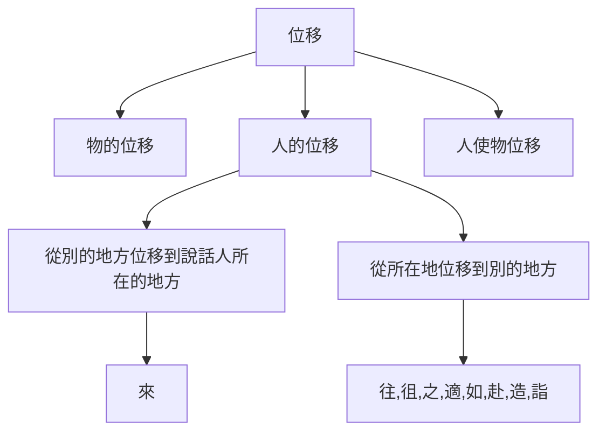
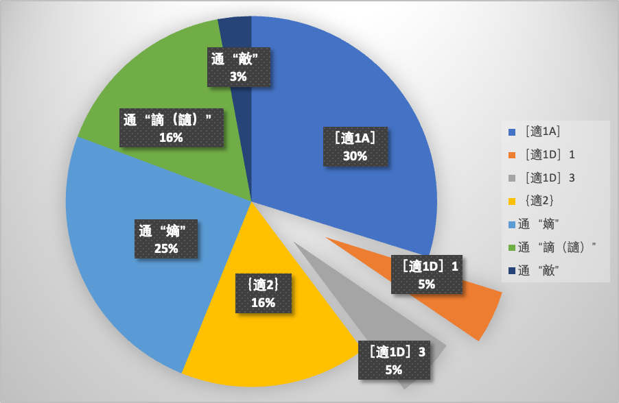

# “適” 實詞詞義引申發展脈絡梳理

—— 兼論《史記・貨殖列傳》“小人富以適其力” 中 “適” 的意義與用法

  

人們普遍認為，太史公司馬遷慧眼識珠，在封建王朝崇本逐末、重農抑商的主流政策下，認識到了工商業者的重要價值，以《貨殖列傳》篇開啟了 “為商賈立傳” 的書史先例。然而，當代人們重在分析其經濟思想價值，而往往忽視了其中蘊含的語言文字養料。筆者在細讀《貨殖列傳》的過程中，發現 “小人富，以適其力” 句中動詞 “適”，古人未解，今注存疑。筆者嘗試以此為錨，對 “適” 字實詞詞義引申發展脈絡進行梳理，並基於梳理結果，嘗試對該句 “適” 字的意義與用法作出回應。

## 筆者在閱讀時參考了韓兆琦《史記三全本》和張大可《史記新證》二書。韓氏和張氏對 “適” 字有迥異的解釋。

為便於閱讀，筆者將原文選段呈現如下：

> 故曰：「倉廩實而知禮節，衣食足而知榮辱。」禮生於有而廢於無。故君子富，好行其德；小人富，以適其力。淵深而魚生之，山深而獸往之，人富而仁義附焉。富者得勢益彰……

韓兆琦先生對該句的注解如下：

> ④小人富以適其力：適其力，謂肆意逞強，橫行於社會。適，放縱，逞慾。

張大可先生對該句的注解如下：

> ④適其力：樂用其力於公事。

可見，對於該句的理解分歧，正是在 “適” 字。

## 筆者嘗試採用 “概念要素分析法” 梳理詞義引申發展線索。鑒於概念要素分析法的局限性，下面的分析僅局限在實詞 “適” 的領域。我們接下來明確實詞 “適” 字諸多義位間的關聯。

### 首先，我們抓住 “適” 字的基本意義。

《說文》“適” 條：“之也。从辵，啻聲。適，宋魯語。”《漢語大詞典》：“適（shì），去，往”。

蔣紹愚（2007）先生認為打擊（Striking）、位移（Moving）、飲食（Eating and Drinking）和觀看（Looking）等是人類共同的概念場（域），“位移” 是位移概念場的核心要素。“適” 本義 “去，往”，顯然含有 “位移” 這一概念要素。由於概念場中下位詞包含上位詞的全部概念要素，因此，可以判斷 “適” 作 “去、往” 解時屬於位移概念場。

概念場是一個層級結構（hierarchical structure）（蔣紹愚，2006）。位移概念場的部分層級結構如下：

此外，我們看以下的語料：

> ～子之館。（《詩・鄭風・緇衣》）
>
> 今～南畝。（《甫田》）
>
> 赤之～齊也。（《論語・雍也》）
>
> 子～衛。（《論語・子路》）
>
> ～莽蒼者三湌而反，腹猶果然。（《莊子・逍遙遊》）

按《故訓匯纂》載，以上諸例古人皆訓 “往也”。位於本義義位的 “適” 後一般跟一個賓語，即 “適” 與兩個名詞性成分發生聯繫，按朱德熙（1978）先生的觀點，此時的 “適” 是二價動詞。筆者認為，與 “適” 這一動詞發生關係的兩個名詞性成分，從語義角色的角度看，作 “適” 主語的，是 “適” 這一動作的發出者；作 “適” 賓語的，是 “適” 這一動作的終點。此外，在 “人的位移” 概念場下，“適” 與 “來” 的區別，不僅在於 “終點” 概念要素不同，與 “起點” 概念要素也相關。基於對 “適” 的配價分析和對其所處概念場的層級分析，我們得到，與 “適” 處於同層級概念場的成員具有以下共同的概念要素：

| 核心要素 (K) | 動作發出者 (L) | 起點 (S) | 終點 (T) |
| -------- | --------- | ------ | ------ |
| 位移       | 人         | 所在地    | 別的地方   |

綜合上述概念要素，我們就得到對 “適” 本義的定義式解釋 —— 人從所在地位移到別的地方。

### 下面梳理實詞 “適” 的意義演變。

在 “適” 字詞義演變的過程中發生了詞性的變化。從詞性虛實的角度，我們把 “適” 分為兩個詞｛適 1｝｛適 2｝，以｛適 1｝代表實詞 “適”。每個詞下又分若干義位，用［適 1A］［適 1B］等表示。

顯然：｛適 1｝人（使自己）從所在地位移到別的地方及其直接引申義

#### ［適 1A］去，往。

| 核心要素 (K) | 動作發出者 (L) | 起點 (S) | 終點 (T) |
| -------- | --------- | ------ | ------ |
| 位移       | 人         | 所在地    | 別的地方   |

這是 “適” 的字本義，也是 “適 1” 的本義，是 “適 1” 被使用最多的義位。例如：

> 子適衛，冉有僕。子曰：「庶矣哉！」冉有曰：「既庶矣。又何加焉？」曰：「富之。」曰：「既富矣，又何加焉？」曰：「教之。」（《論語・子路》）
>
> 大師摯適齊，亞飯干適楚，三飯繚適蔡，四飯缺適秦。鼓方叔入於河，播鼗武入於漢，少師陽、擊磬襄，入於海。（《論語・微子》）
>
> 大夫七十而致事。若不得謝，則必賜之几杖，行役以婦人。適四方，乘安車。自稱曰老夫，於其國則稱名；越國而問焉，必告之以其制。（《禮記・曲禮上》）
>
> 孔子南適楚，厄於陳蔡之間，七日不火食，藜羹不糝，弟子皆有飢色。（《荀子・宥坐》）
>
> 太史公曰：吾適楚，觀春申君故城，宮室盛矣哉！（《史記・春申君列傳》）

#### ［適 1B］歸。

| 核心要素 (K) | 動作發出者 (L) | 起點 (S) | 終點 (T)                |
| -------- | --------- | ------ | --------------------- |
| 位移       | 人         | 所在地    | 結局，在傳統文化中有時也指 “原來的地方” |

［適 1B］相比於［適 1A］更強調了終點的 “終了、結局” 義。如：

> 好惡不愆，民知所適，事無不濟。（《左傳・昭公十五年》，杜預注：“適，歸也。” 孔穎達疏：“言皆知歸於善也。”）
>
> 圓景早已滿，佳人殊未適。（南朝宋謝靈運《南樓中望所遲客》）

兩處的 “適” 是比較明顯的 “歸” 的義位，分別對應變體 “歸向” 和 “回歸”。

#### ［適 1C］女子出嫁。

| 核心要素 (K) | 動作發出者 (L) | 起點 (S) | 終點 (T) |
| -------- | --------- | ------ | ------ |
| 位移       | 女子        | 所在地    | 夫家     |

基於［適 1B］義位，通過限定動作發出者為女性、終點 —— 結局為夫家，得到［適 1C］義位。《說文》載 “女子嫁曰適人”，可見確有其意。如：

> 女自房觀之，曰：“子皙信美矣，抑子南夫也。夫夫婦婦，所謂順也。” 適子南氏。（《左傳・昭公元年》）
>
> 奉光有女年十餘歲，每當適人，所當適輒死，故久不行。及宣帝即位，召入後宫，稍進爲婕妤。（《漢書・外戚傳》）
>
> 女子十五許嫁，有適人之道。（《孔子家語・本命》）
>
> 始適還家門。（《孔雀東南飛》）

#### 接下來，我們重點討論［適 1D］義位的形成與表現。

［適 1D］合，一致，和諧；符合，適合。

| 核心要素 (K) | 動作發出者 (L) | 起點 (S) | 終點 (T)                   |
| -------- | --------- | ------ | ------------------------ |
| 變化 / 狀態  | 某實體       | —      | 該實體的某要素 同 $x$ 一致的狀態 |

##### 引申路徑

《現代漢語詞典》：“符合，动词，（数量、形状、情节等）相合。” 因此我們得到了上述表格。然而，對比［適 1D］與上面三個義位，表格中的五個概念要素，看起來都發生了變化。它們之間是否存在關聯呢？

實際上，對於 “位移”、“人”、“別的地方” 這三個概念要素，還可以再進一步分析：

* 位移 = \[空間方面的] + \[變化]；
* “人” 的上位概念域是 “動物”，“動物” 的上位概念域是 “生命體”，“生命體” 的上位概念域是 “實體”，即：人 = \[a] + \[b] + ... + \[實體]；
* “狀態” 是 “處所” 的抽象化。

因此，［適 1A］［適 1B］與［適 1D］實際上在核心要素、受事對象和終點上都有部分相同。這形成了［適 1A］［適 1D］/［適 1B］［適 1D］義位之間的關聯，為這樣的引申提供了基礎。[^1]

[^1]: 實際上，在 “適” 字的整個引申發展系統中，這樣的一步引申是變化相對大的。我們可以為其單列一個詞。但蔣紹愚（2005）：“…… 在本章第一节中已经说过，相关而且相近的意义应该是一个词的不同义位，无关的或者是相距甚远的应该算两个词。但是在‘远’、‘近’之间有时也难以划出绝对的界线。汉语词汇史因为是研究词义的历史发展的，所以，我们不妨把 “词” 的界线放宽些，比如‘投’的‘到临’义，可以不看做另一个词，而看做和上六个义位一起，构成同一个词的第七个义位。” 因此本文也暫且將此看做義位而非詞。

**那麼，［適 1D］究竟是由［適 1A］還是［適 1B］引申而來的呢？**

段玉裁《說文解字注》：“適，之也…… 此不曰往而曰之，許意葢以 “之” 與 “往” 稍別。逝、徂、往，自發動言之；適，自所到言之。故變卦曰之卦，女子嫁曰適人。” 按照段玉裁的解讀，“適” 更強調 “所到”，即有位移結束的意味。

我们看下面的例子：

> （1）孔子時其亡也，而<u>往</u>拜之，遇諸塗。（《論語・陽貨》）
>
> （2）今燕虐其民，王<u>往</u>而征之，民以為將拯己於水火之中也，簞食壺漿，以迎王師。（《孟子・梁惠王下》）
>
> （3）戒之曰：“<u>往</u>之女家，必敬必戒，無違夫子！”（《孟子・滕文公下》）
>
> （4）逝將去汝，<u>適</u>彼樂土；樂土樂土，爰得我所。（《詩・國風・魏風》）
>
> （5）孔子<u>適</u>楚，楚狂接輿遊其門曰：「鳳兮鳳兮，何如德之衰也！來世不可待，往世不可追也。天下有道，聖人成焉；天下無道，聖人生焉。方今之時，僅免刑焉。福輕乎羽，莫之知載；禍重乎地，莫之知避。已乎已乎，臨人以德！殆乎殆乎，畫地而趨！迷陽迷陽，無傷吾行！吾行卻曲，無傷吾足！」（《莊子》）
>
> （6）十五年，使子服景伯、子貢為介，<u>適</u>齊，齊歸我侵地。田常初相，欲親諸侯。（《史記・魯周公世家》）
>
> （7）太史公曰：吾<u>適</u>楚，觀春申君故城，宮室盛矣哉！（《史記・春申君列傳》）

首先，儘管區別有時並不嚴格，但 “適” 後一般直接開始陳述位移結束以後發生的事情（如（4）～（7））；而 “往” 後不僅可以陳述位移過程中發生的事情（如（1）），其本身也可以尚未開始，用於一種 “對將來的假設” 的語境中（如（2）（3）），或前加 “不” 字表示不可能開始（不往），“適” 字幾乎沒有這樣的用法。拙見以為 “逝、徂、往” 與 “適、之” 之別，相當於英語 “go” 與 “get” 之別。在 “（1）I’ll go to the cinema at 5” 和 “（2）I’ll get to the cinema at 5” 中，（2）句更強調 “在 5 點鐘到達”；而（1）句不僅寬泛地看沒有到達義、嚴格地看可能還有 “出發” 義。“適” 與 “往” 在這方面的微殊，可以證明 “適” 更強調 “所到”，而不強調起點要素。

其次，筆者觀察到，“適” 基本不與強調起點要素的介賓結構（如 “自某適” 結構）相配。值得注意的是，在先秦兩漢古代漢語中，“去 S 適 T” 結構不鮮。如：

> 逝將<u>去汝，適彼樂土</u>；樂土樂土，爰得我所。（《詩・國風・魏風》）
>
> 彼其人苟壹，則其土地奚<u>去我而適它</u>？（《荀子・王霸》）
>
> 夫自中行衍皆嬴姓也，中衍人面鳥喙，降佐殷帝太戊及周天子，皆有明德，下及幽厲無道，而叔帶<u>去周適晉</u>，事先君文侯，至於成公，世有立功，未嘗有絕祀。（《說苑・復恩》）
>
> <u>去鄭，適衛</u>。（《史記・吳太伯世家》）
>
> 下及幽厲無道，而叔帶<u>去周適晉</u>，事先君文侯，至于成公，世有立功，未嘗絕祀。（《史記・趙世家》）
>
> 孔子<u>去曹適宋</u>，與弟子習禮大樹下。（《史記・孔子世家》）

這裡需要使用 “去 S” 這一動賓結構，構成與 “適 T” 相平等的語法地位，來強調動作行為的起點，這也是證明 “適” 強調終點要素的有力依據。

此外，考察 “適” 處於［適 1C］女子出嫁義位時的語用，按《古辭辨》觀點，“適” 作 “女子出嫁” 解時，一般以帶賓語（即終點要素）“人” 的短語形式出現，形成較為穩定的結構；同時也基本不與強調起點要素的介賓結構搭配。

如果我們認為，與［適 1A］相關的［適 1D］繼承了［適 1A］“自所到言之” 的異質性，那麼［適 1D］的起點要素就可能被弱化消失。由於［適 1B］相比於［適 1A］更強調終點要素，我們認為，［適 1B］位於從［適 1A］到［適 1D］的引申路線內，即［適 1A］［適 1B］和［適 1D］是共線的；相應地，從強調的強弱差異角度，我們自然可以認為［適 1D］是由［適 1B］直接引申而來的。

##### 表現

［適 1D］的起點要素被弱化乃至消失，進一步地，由於只剩下終點要素，［適 1D］的核心要素有可能從動態的 “變化” 演變成靜態的 “狀態”。然而，由於古漢語中常常把動作和動作的結果綜合在一起（蔣紹愚，2006），“變化” 與 “狀態” 的界限是模糊的。我們得到了［適 1D］義位的三個義位變體：

（1）以變化为核心要素，同时还強調終點的狀態。後跟 “適” 的目標 / 目的，進一步明確 “終點” 要素（特別是 $x$ 的內容）。可以譯作 “適合，滿足，順從，愉悅” 等。如：

> 太子日造門下，供太牢具，異物閒進，車騎美女恣荊軻所欲，以順適其意。（《史記・刺客列傳》）
>
> 殺子以適君，非人情，不可。（《史記・齊太公世家》）
>
> 快意當前，適觀而已矣。（《史記・李斯列傳》）

（2）核心要素為狀態，隱含變化到終點狀態的變化，可以譯作 “相合”，一般有多個名詞性成分作主語，$x$ 可理解為某實體以外的其他實體。如

> 能以一治天下者，寒暑適，風雨時，爲聖人。（《呂氏春秋・大樂》，高誘注）

（3）核心要素為狀態，不再隱含上述變化，而專一強調該狀態，可以譯作 “合，合適；和，和諧；恰當；齊等”。如：

> 陳嬰者，故東陽令史，居縣中，素信謹，稱為長者。東陽少年殺其令，相聚數千人，欲置長，無適用，乃請陳嬰。（《史記・項羽本紀》）
>
> 兵之勝，從於適。（《管子・白心》，尹知章注）
>
> 是以君臣朝廷尊卑貴賤之序，下及黎庶車輿衣服宮室飲食嫁娶喪祭之分，事有宜適，物有節文。（《史記・禮書》）

如果後跟的是 “適” 的受事對象（明確 “受事對象” 要素），筆者認為這是變體 3 的使動用法，來表示 “使賓語所代表的事物具有‘適（於 $x$）’這一性質” 的動作，可以譯作 “使…… 合適（於 $x$）”。如：

> 所謂氣者，當調飲食，擇晏日，車步廣志，以適筋骨肉血脈，以瀉氣。（《史記・扁鵲倉公列傳》）
>
> 吸新吐故以練藏，專意積精以適神。（《漢書・王吉傳》，顏師古注）
>
> 故聖人之制事也，能節宮室、適車輿以實藏，則國必富、位必尊。（《管子・禁藏》，尹知章注：“不費於宮室車輿，則庫藏自實也。”）
>
> 欲爲其地，必適其賜，不適其賜，亂人求益，彼求我予，假仇人斧。（《韓非子・揚權》，兪樾《諸子平議・韓非子》：“必適其賜者，必節其賜也。”）

現代漢語中已經使用 “調節”“調適” 等詞來表示這一動作，因此將其譯作前述雙音節動詞亦可。如果通過上下文能夠明確 “適” 的起點為 “某要素（相較於 $x$ ）處於過分的狀態”，則還可以譯作 “節制”。

然而需要注意的是，由於並不像變體 1、變體 2 這樣對 $x$ 有進一步的明確，因此，在翻譯的過程中，如果 $x$ 是偏離缺省值（①在一些情況下，語言使用者的價值觀可以定義 $x$ 的缺省值；②如果適後跟多個名詞性成分的組合作賓語，則 $x$ 的情況與變體 2 類似）的，或通過上下文較難明確的，筆者認為有必要使用 “使（賓語）符合於 $x$” 或在 “調適（賓語）” 後添加 “使之符合於 $x$” 的譯法，來對 $x$ 的內容進行明確，以更好地銜接上下文。

《故訓匯纂》載王先謙集解引郝懿行曰：“適者，善也。凡物調適謂之適，得意便安亦謂之適，皆善之意。故《廣韻》云：‘適，善也。’” 可見，古人亦認為 “調適”、“和諧”、“安適” 等義之間的關係比較緊密，字典單列義項雖可，但略顯冗餘。

至此，我們完成了對實詞 “適” 引申發展脈絡的梳理。

### 除此之外，虛詞｛適 2｝以（時間層面）合，巧為基本義，按《漢語大詞典》，設有四個義項：①巧合，正好；②剛才，方才；③偶然；④如果。由於概念分析法的局限，筆者不再贅述。此外，按《漢語大詞典》，“適” 還通 “啻”（只，僅僅）、通 “擿”（投擲）、用同 “釋”（參見 “適悶”）、通 “謫（讁）”、通 “嫡”、通 “敵”，分別為詞｛適 3｝～｛適 8｝。由於是假借關係，不屬於引申發展的序列；而對與其本字詞義的引申發展梳理，我們也暫不討論。

## 基於上述梳理結果，筆者認為，對於《貨殖列傳》中 “小人富，以適其力” 句，此處 “適” 字適用［適 1D］義位，且在當前上下文應表現為變體 3 的使動用法，解作：使自己的能力適合（禮節）；或，調適自己的能力，使之適合（禮節）。

### 有關韓注、張注，按照筆者上文的引申發展梳理結果，韓注、張注均以 “適” 為［適 1D］變體 3。然而，這樣的觀點難免會使得釋義與上下文脫節嚴重：（1）如果小人富裕之後，還 “肆意逞強，橫行於社會”，那哪是 “衣食足而知榮辱”？韓注必謬。（2）張注為了銜接上下文似乎補充太多，補了謂語 “用、盡”、目的狀語 “於公事”，有失妥當。

### 認為表現為變體 3 的使動用法有如下的合理性：

#### 語義理解上：把握住本段的中心論點 —— 倉廩實而知禮節，衣食足而知榮辱。因此，“小人富” 後，一致的對象應當是 “禮節” 一類，即 $x=$ 禮節。君子（有德者）和小人並舉，君子本身有德，富而行其德；小人本身寡德，富而能調適自己的能力（**使之符合禮節**）。這樣作者觀點是前後一致的，同時翻譯上也更客觀。

“小人” 往往是 “君子” 的對立面，而太史公此處是要論證無論是 “小人” 還是 “君子” 富都能知榮辱。對於 “小人”，這樣的觀點是顛覆常人價值觀的。而此處的 “適” 又未明確 $x$ 的內容，對於現代人而言，語義上的省略有些多了，倘若不瞻前顧後，則不能明確 $x$。此處韓、張之所以未能準確翻譯，大概原因如此吧。

#### 可行性上：對《史記》全書共 171 例 “適” 字，採用語料標注的辦法對其釋義進行標注，結果統計如下圖：

適用［適 1D］義位，且表現為變體 3 的情況，與［適 1D］變體 1 的出現頻率相當，仍有一定占比。典型的用例如下：

> 太子起坐。更適陰陽，但服湯二旬而復故。（《扁鵲倉公列傳》）
>
> 所謂氣者，當調飲食，擇晏日，車步廣志，以適筋骨肉血脈，以瀉氣。（《扁鵲倉公列傳》）
>
> 四時不和不能調，歲穀不孰不能適。（《日者列傳》）[^ 3]

[^ 3]: 二價動詞後不一定老帶著賓語（朱德熙，1978）。筆者認為該句兩個分句都省略了賓語“之”，這根據上下文是可以補出來的。

根據數據，筆者傾向於認為這個解釋是可行的、合法的。

## 小結

這篇文章中，我們嘗試運用概念要素分析法對 “適” 的引申發展路徑進行了簡要梳理，並根據梳理結果解決了《貨殖列傳》中 “小人富，以適其力” 句 “適” 字釋義問題。對於引申發展脈絡的梳理，《漢語大詞典》“適” 諸多義項的設置便於初學者使用，有其合理性，但不能真實反映引申發展的步驟和層次，有 “隨句釋義” 之嫌。對於《貨殖列傳》“小人富，以適其力” 句中 “適” 字，我們基於梳理結果，提出了新的看法。筆者認為，從概念要素分析法的角度入手，建構詞義引申發展系統，論證存疑詞義，簡潔明了，說服力強，有助於我們在今後的更好地理解古代漢語的詞彙與詞彙系統。

---

<strong>參考文獻</strong>

\[1] 朱德熙.“的” 字结构和判断句 (上)\[J]. 中国语文,1978,(第 1-4 期).

\[2] 蒋绍愚著. 古汉语词汇纲要 \[M]. 北京：商务印书馆, 2005.09.

\[3] 蒋绍愚. 汉语词义和词汇系统的历史演变初探 —— 以 “投” 为例 \[J]. 北京大学学报 (哲学社会科学版),2006,(第 4 期).

\[4] 蒋绍愚. 打击义动词的词义分析 \[J]. 中国语文,2007,(第 5 期).

---

_附：《漢語大詞典》“適①” 條_

［shì ㄕˋ］［《廣韻》施隻切，入昔，書。］［《廣韻》之石切，入昔，章。］［《廣韻》都歷切，入錫，端。］“啇” 的今字。“**適**” 的繁體字。
1\. 去，往。《楚辭・離騷》：“心猶豫而狐疑兮，欲自**適**而不可。” 王逸注：“**適**，往也。”《史記・吳太伯世家》：“<季劄> 去鄭，**適**衛。” 宋蘇軾《石鍾山記》：“元豊七年，六月丁丑，余自齊安舟行**適**臨汝。” 淸孔尙任《桃花扇・聽稗》：“那太師名摯，他第一個先**適**了齊。” 魯迅《書信集・致許壽裳》：“君今年奚**適**?”
2\. 歸向；歸從。《管子・弟子職》：“拚前而退，聚於戶內，坐板 < 扱> 排之，以葉**適**己。” 尹知章注：“**適**己，猶向己也。”《左傳・昭公十五年》：“好惡不愆，民知所**適**，事無不濟。” 杜預注：“**適**，歸也。” 孔穎達疏：“言皆知歸於善也。” 南朝宋謝靈運《南樓中望所遲客》詩：“圓景早已滿，佳人殊未**適**。”
3\. 女子出嫁。《左傳・昭公元年》：“女自房觀之，曰：‘子皙信美矣，抑子南夫也。夫夫婦婦，所謂順也。’**適**子南氏。”《玉台新詠・古詩〈爲焦仲卿妻作〉》：“貧賤有此女，始**適**還家門。” 余冠英注：“**適**，嫁。始**適**，言出嫁未久。” 宋蘇軾《劉夫人墓志銘》：“女二人，長**適**進士虞大蒙，次**適**承議郞郭逢原。” 淸徐士鑾《宋豔・奇異》：“淮娼嚴楚楚，**適**鹽商呂省幹。” 魯迅《墳・我之節烈觀》：“直到宋朝，那一班‘業儒’的才說出‘餓死事小失節事大’的話，看見曆史上‘重**適**’兩個字，便大驚小怪起來。”
4\. 順從。《韓非子・三守》：“使人臣之欲有言者，不敢不下**適**近習能人之心。” 洪誠等校注：“**適**，**適**從，順應。” 陳奇猷集釋：“**適**，謂順**適**其意。”《玉台新詠・古詩〈爲焦仲卿妻作〉》：“處分**適**兄意，那得自任專?” 余冠英注：“**適**，順從。”
5\. **適**合，符合。《商君書・畫策》：“由此觀之，神農非高於黃帝也，然其名尊者，以**適**於時也。” 三國魏劉劭《人物志・材理》：“質性機解，推情原意，能**適**其變，情理之家也。” 唐韓愈《與鄂州柳中丞書》：“愈誠怯弱，不**適**於用，聽於下風，竊自增氣。” 淸嚴有禧《漱華隨筆・夾帶懷挾》：“今之時文，徒空言而不**適**於實用。”
6\. 節制；調節。《管子・禁藏》：“故聖人之制事也，能節宮室、**適**車輿以實藏，則國必富、位必尊。” 尹知章注：“不費於宮室車輿，則庫藏自實也。”《韓非子・揚權》：“欲爲其地，必**適**其賜，不**適**其賜，亂人求益，彼求我予，假仇人斧。” 兪樾《諸子平議・韓非子》：“必**適**其賜者，必節其賜也。”《史記・日者列傳》：“四時不和不能調，歲穀不孰不能**適**。” 司馬貞索隱：“**適**，猶調也。” 晉葛洪《抱朴子・酒誡》：“然節而宣之，則以養生立功，用之失**適**，則焚溺而死。”
7\. 恰當，得當。銀雀山漢墓竹簡《孫臏兵法・兵情》：“弩張柄不正，偏強偏弱而不和，其兩洋 (廂) 之送矢也不壹，矢雖輕重得，前後**適**，猶不中 <招也>。”《漢書・武帝紀》：“古者，諸侯貢士，壹**適**謂之好德，再**適**謂之賢賢，三**適**謂之有功，乃加九錫。” 顏師古注引服虔曰：“**適**，得其人。”《尙書大傳》卷二：“一**適**謂之攸好德，再**適**謂之賢賢，三**適**謂之有功。” 鄭玄注：“**適**猶得也。”《後漢書・匈奴傳》：“報答之辭，令必有**適**。” 李賢注：“**適**猶所也，言報答之辭必令得所也。”《資治通鑑・漢光武帝建武二十八年》引此文，胡三省注曰：“余謂**適**，當也，言報答之辭必有當乎事情也。” 晉葛洪《抱朴子・審舉》：“古者諸侯貢士，**適**者謂之有功，有功者，增班進爵；貢士不**適**者，謂之有過，有過者，黜位削地。”
8\. 齊等。《呂氏春秋・處方》：“韓昭釐侯出弋，靷偏緩…… 至舍，昭釐侯射鳥，其右攝其一靷**適**之。” 高誘注：“**適**，猶等也。”《漢書・循吏傳・黃霸》：“<黃霸> 坐發民治馳道不先以聞，又發騎士詣北軍馬不**適**士，劾乏軍興，連貶秩。” 顏師古注引孟康曰：“關西人謂補滿爲**適**。馬少士多，不相補滿也。”
9\. 悅樂，滿足。《詩・衛風・伯兮》：“豈無膏沫? 誰**適**爲容!” 馬瑞辰通釋：“《一切經音義》卷六引《三蒼》：‘**適**，悅也。’此**適**字，正當訓悅。女爲悅己者容，夫不在，故曰‘誰**適**爲容’，即言誰悅爲容也。” 余冠英注：“**適**，悅也。誰**適**爲容，言修飾容貌爲了取悅誰呢?”《史記・張儀列傳》：“割楚而益梁，虧楚而**適**秦，嫁禍安國，此善事也。”《漢書・賈山傳》：“秦王貪狼暴虐，殘賊天下，窮困萬民，以**適**其欲也。” 顏師古注：“**適**，快也。”《資治通鑑・陳武帝永定二年》：“帝褻黷之遊，徧於宗戚，所往留連，唯至常山第，多無**適**而去。” 胡三省注：“**適**，歡極也。” 金張宇《云溪秋泛圖》詩：“胡爲厭山瞰芳渚，岸草汀花**適**幽趣。”
10\. 和順，順**適**。《文選・宋玉〈神女賦〉》：“性和**適**，官侍旁，順序卑，調心腸。” 呂延濟注：“言性靈和**適**，心腸調順，宜侍君旁。”《呂氏春秋・大樂》：“能以一治天下者，寒暑**適**，風雨時，爲聖人。” 高誘注：“**適**，和也。” 唐韓愈《息國夫人墓志銘》：“居尊卑間，無不順**適**。”
11\. 安逸，閑**適**。《楚辭・九辯》：“堯舜皆有所舉任兮，故高枕而自**適**。” 王逸注：“安臥垂拱，萬國治也。” 宋沈作喆《寓簡》卷六：“以此知能自**適**其**適**者，不管其他閑事也。” 淸魏源《天台紀遊》詩之六：“萬里水雲身，到此甫一**適**。”
12\. 舒**適**，和暢。《墨子・辭過》：“故聖人之爲衣服，**適**身體和肌膚而足矣。”《漢書・王吉傳》：“吸新吐故以練臧，專意積精以**適**神，於以養身，豈不長哉!” 顏師古注：“**適**，和也。” 唐韓愈《唐故河南令張君墓志銘》：“不得已就官，數月大不**適**，即以病辭免。” 宋范成大《問天醫賦》：“百骸九竅，無一得**適**。” 巴金《探索集・長崎的夢》：“聽說他身體不**適**，不能見客。”
13\. 善，美好。《荀子・法行》：“瑕**適**幷見，情也。” 楊倞注：“**適**，玉之美澤調**適**之處也。” 王先謙集解引郝懿行曰：“**適**者，善也。凡物調**適**謂之**適**，得意便安亦謂之**適**，皆善之意。故《廣韻》云：‘**適**，善也。’” 一說，指疵病。王念孫《讀書雜志・荀子八》：“**適**讀爲謫。謫亦瑕也。《老子》曰‘善言無瑕謫’是也。《管子・水地篇》：‘瑕**適**皆見，精也。’尹知章注：‘瑕**適**，玉病也。’”
14\. 辟領。古喪服之領。《儀禮・喪服》：“負廣出於**適**寸。**適**博四寸，出於衰。” 鄭玄注：“**適**，辟領也。” 李如圭集釋：“衣領當項處，左右各開四寸，向外辟厭之，是謂辟領。” 淸夏炘《學禮管釋・釋**適**上》“**適**之制，與衣殊，材前之衰，後之負版，皆繫於**適**。先著衣訖，乃始著**適**。**適**謂之辟領。辟者，偏也，謂領偏向旁開也。今世小兒衣領，猶有右旁開縫者，其古**適**之遺制與!” 一說，“**適**” 是橫接之旁幅，與辟領有別。淸毛奇齡《喪禮吾說篇・服制說》：“其開領處將領隙四寸外屈而厭於項之兩旁，謂之辟領…… 而於是又橫接二幅，謂之**適**。夫**適**者，豈非以旁幅之猶近身者乎? 舊注謂辟領爲**適**，則領在項間未能橫出於衰也。謂**適**爲辟領，則**適**當兩肩不能開領。”
15\. 遇。《文選・班彪〈王命論〉》：“世俗見高祖興於布衣，不達其故，以爲**適**遭暴亂，得奮其劍。” 李善注：“**適**，遇也。” 漢蔡邕《傷故栗賦》：“**適**禍賊之災人，嗟夭折以摧傷。”
16\. 是，則，即是。《荀子・王霸》：“孔子曰：審我所以**適**人，**適**人之所以來我也。” 王引之《經傳釋詞》卷九：“上**適**字訓爲往，下**適**字訓爲是。言我之所以往，即是人之所以來，不可不審也。” 漢劉歆《與揚雄求方言書》：“今聖朝留心典誥，發精於殊語，欲以驗考四方之事，不勞戎馬高車之使，坐知傜俗，**適**子雲攘意之秋也。” 王引之《經傳釋詞》卷九：“言是子雲攘意之秋也。” 唐韓愈《唐故河南令張君墓志銘》：“< 張 > 改河南令，而河南尹**適**君平生所不好者。”
17\. 正好，恰巧。《左傳・昭公十七年》：“我高祖少皞摯之立也，鳳鳥**適**至。”《後漢書・班超傳》：“會徐幹**適**至，超遂與幹擊番辰，大破之。”《魏書・傅永傳》：“**適**上南岸，賊軍亦至。” 淸兪樾《春在堂隨筆》卷一：“**適**徐誠庵大令本立來，與之審視。” 魯迅《書信集・致黃源》：“《譯文》稿剛寫好，因爲**適**有便人，即帶上。”
18\. 偶然。《韓非子・外儲說右下》：“吾釋勢與民相收，若是，吾**適**不愛，而民因不爲我用也，故遂絶愛道也。” 洪誠等校注：“**適**，偶然。” 唐李白《竄夜郞於烏江留別宗十六璟》詩：“**適**遭雲羅解，翻謫夜郞悲。” 宋范成大《時敘火後意不釋然作詩解之》：“浮生**適**來且**適**去，況此茅屋三間餘。” 傅尃《題自書精神一到何事不成橫卷》詩：“**適**生**適**死何足論，精神長在無時滅。”
19\. 剛才，方才。《漢書・賈誼傳》：“陛下之臣雖有悍如馮敬者，**適**啓其口，匕首已陷其匈矣。” 顏師古注：“始欲發言節制諸侯王，則爲刺客所殺。”《二刻拍案驚奇》卷九：“你**適**在那邊書房裏來，有何說話，笑嘻嘻的走來?”《紅樓夢》第一回：“**適**聞僊師所談因果，實是人世罕聞者。”
20\. 連詞。如果，假若。表示假設關系。《韓非子・內儲說下》：“王**適**有言，必亟聽從王言。” 洪誠等校注：“**適**，如果。”《後漢書・逸民傳序》：“故蒙恥之賓，屢黜不去其國；蹈海之節，千乘莫移其情。**適**使矯易去就，則不能相爲矣。” 唐王昌齡《淇上酬薛據兼寄郭微》詩：“吾謀**適**可用，天道豈遼廓!”
21\. 通 “擿”。投擲。《詩・邶風・北門》：“王事**適**我，政事一埤益我。” 馬瑞辰通釋：“**適**當爲擿之渻借。《說文》、《廣雅》幷曰：‘投，擿也。’《說文》‘擿’字注：‘一曰投也。’古書投擲字多作擿。擿我，猶投我也，正與二章箋訓敦爲投擲同義。” 高亨注：“**適**，借爲擿，投擲。”
22\. 通 “啻”。副詞。但，僅僅。《孟子・告子下》：“飲食之人無有失也，則口腹豈**適**爲尺寸之膚哉?” 趙岐注：“口腹豈但爲肥長尺寸之膚邪?” 王引之《經傳釋詞》卷九：“**適**與啻同，故趙注曰：‘口腹豈但爲肥長尺寸之膚邪?’但字正釋**適**字。”《戰國策・秦策二》：“疑臣者不**適**三人，臣恐王之爲臣投杼也。” 高誘注：“**適**音翅。” 鮑彪注：“**適**啻同。” 諸祖耿集注引黃式三曰：“**適**、啻，古聲同，止也。《史》作特。” 南朝宋鮑照《重與世子啟》：“僕以常人，所蒙隆厚，久應知退，非**適**今日。” 淸戴名世《春西狩獲麟解》：“必假此以爲聖人重而震而驚之，則欲大聖人而**適**以小聖人矣。”
23\. 用同 “釋”。參見 “**適**悶”。
