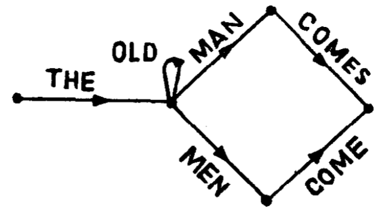
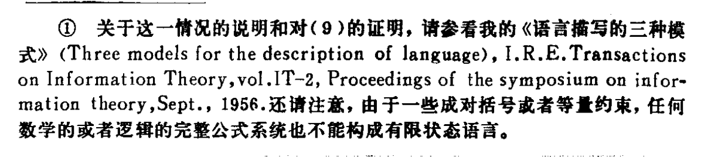
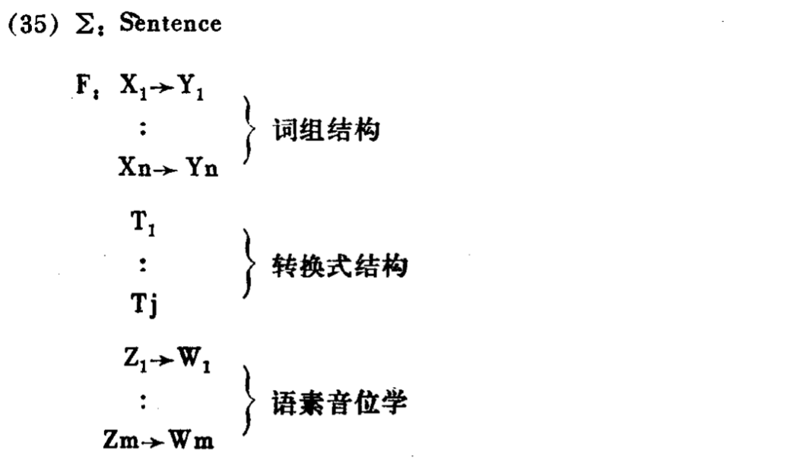

# Syntactic Structure / 句法结构

Noam Chomsky

诺姆·乔姆斯基◎著

## 乔姆斯基学术观点简介

乔姆斯基认为**生成能力是语言最重要的一个特点**。他研究语言的时候，主要从形式上、从结构上考虑问题，他认为语法应该是“一种装置(device),这种装置能产生所研究的对象语 言的许多句子”。他用类似数学那样的方法，演绎的方法, 把语法分析过程公式化。

乔姆斯基还认为句法结构包括深层结构和表层结构，深层结构通过语义规则说明意义，表层结构通过语音规则说明语音。

他认为传统语法不足以说明主动语态句和被动语态句之间的转换过程。他为了说明这个过程，除了确立转换语法外， 在深层结构和表层结构理论的基础上，又引进**逻辑主语和语法主语**的概念：逻辑主语属于深层结构，语法主语属于表层结构 。 

<!-- more -->

## Chapter II / 语法的独立性

1. （*语法分析的根本目的*）假定有个语言 $L$ ，对 $L$ 语所进行的语言分析的根本目的就在于<u>把能够构成这一语言的句子的、符合语法的序列(grammatical sequences)和不能构成这 一语言的向子的、不符合语法的序列 (ungrammatical sequences)**区别**开来，并且把那些符合语法的序列的结构加以**研究**。</u>
2. （*语法的定义*）照这样说，$L$ 语的语法就是生成符合 $L$ 语语法序列而不生成不符合它的语法序列的一种手段。
3. （*检验语法有效性的标准*）检验一部为 $L$ 语编写的语法是否完善、是否有效的一个方法就是看：按照这部语法生成的句子实际上是否符合语法——也就是说，说这种语言的本地人是否认为这样的句子可以接受等等。这样，我们才能采取一些步骤来规定一种判断“是否符合语法”的实践标准，据以检验一部语法是否完善。
4. （*在解决“符合语法”的确定标准时，认为语法具有独立性*）我们就面临着一个老问題，那就是要解释某种直觉的概念。 在这里，就是“符合英语语法”这一直觉概念，以及更一般化的 “符合语法”这 一直觉概念。根据什么来着手区分符合语法的序列和不符合语法的序列呢?——难以区分。因为：
     1. 一套语法句(即按照某一语言的语法所能说的一套语句)和语言学家在现场工作中搜集到的任何一套话语素材显然不完全一样（不需要出现在语料库中）。
     2. 不能把“符合语法” (grammatical) 这个概念跟任何语义上的“有意义” (meaningful) 或“有意味” (significant) 这类概念等同起来
     3. “符合英语语法”这个概念无论如何不能跟“接近英语的统计近似值的等级高”这个概念等同起来。
5. 我想，我们不得不做出这样的结论，语法学是自成一系的，是离开语义而独立的；概率论模式无助手人们彻底理解语法结构上的一些基本问题。

## Chapter III / 一个初级语言理论

尝试回应「语法的定义」：分析语言、建立语法

为了简化描写全套符合语法的音位序列的工作，我们建议建立（多层）语言平面。由此引入「**语素**」这种「较高平面」，并在这个语言平面上进行语法描写。

一部语法必须滿足的一个要求就是该语法必须是有限的。因此，语法不能只是罗列全部的语素(或“词”)序列。

*有限状态语法*——据此提出的一种解法，一种根据通讯理论提出的语言模式：设想我们有一台机器，里头包含着一系列有限数的状态，而机器可以表现出这些状态中的任何一个状态。同时我们还设想这台机器从一个状态过渡到另一个状态，这就产生一个信号(譬如说，一个英语词)。这些状态之一是开始态，另一个是结尾态。 我们还设想这台机器从开始态起头，经过 一系列状态(每一次过渡产生一个词)，而在结尾态终止。产生出来的这个词的序列，我们称为“句子”。从而每一台这样的机器就确定一种语言，也就是说，确定可以用这种方法生成的那整套句子。

> [!note|right] 机器示意图
>
> 

用这种机器产生出来的任何一种语言，我们都称它为“**有限状态语言**”，我们把这种机器称为“**有限状态语法”**。有限状态语法可以用“状态图”的形式来表示。我们还可以给这部语法增加若干封闭圈加以扩展，就可以生成无限数的句子。

用这种方式生成语言的机器在数学上就叫做 “**有限状态马尔科夫过程**”。为了完成这个根据初级通讯理论编制的语言模式，我们给每一次状态转换加上一个概率，这样我们就可以计算每一个状态所连带的“不定性”，再用这个不定性的平均数跟相连各状态的概率加权，就可以得到语言的“信息内容”。但是这种概括跟我们没有关系，因为我们这里要研究的是语言的语法结构，而不是语言的统计结构。

> [!note] (9) 的证明
>
> 

**由于可以证明：英语不是有限状态语言[书中引文编号(9)]**，因此，有限状态语法行不通。但这种语法观在某种程度上代表了那种值得严肃考虑的“**最小限度的语言理论**”。有限状态语法是一种最简单的语法，它只要具备有限数的“装置”，就可以生成无限数的句子。

要是一种语言可以用一个单纯平面(就是说，假定这是一个有限状态语言)，用一种初级的、从左到右的方法就可以描写的话，那么这种描写工作的确可以通过建立这种较高平面来加以简化。

但是要想生成象英语这样的非有限状态语言，我们就需要一些根本不同的方法和一种更有概括性的“语言平面”的概念。

## Chapter IV / 词组结构

*词组/短语结构语法 $[\sigma, F]$* ——一种同以成分分析法为基础的语言结构理论相联系的语法形式：有一套有限数的**起始符号链**  $\Sigma$，再加上**一套**<u>有限数</u>的“**指令公式**” $F$，“指令公式”的形式是 $X\to Y$，就是说“把 $X$ 改写为 $Y$ ”。$X$ 不一定只包含一个单一符号，但是只能把 $X$ 中的一个简单符号改写为 $Y$ （二分）。（不过我们满可以扩大 $\Sigma$，把 Declarative Sentence (陈述句)，Interrogative Sentence (疑问句) 等作为附加符号容纳进来。）

在该语法 $[\Sigma, F]$ 中，**推导式** 就是一个有限数的符号链序列，这个序列从 $\Sigma$ 的一个开始链起头，然后这个序列里的每一个符号链都是按照指令公式 $F$ 中的一个指令从前一个符号链推导出来。某些推导式是“**终止推导式**”，意思是这种推导式的最后一行符号链不能按照 $F$ 的規则再朝下改写。如果一条符号链是一个终止推导式的最末一行，我们就说它是一个“**终端链**”。如果一个 $[\Sigma, F]$ 语法能产生一套终端链，那么称这套符号链为 **终端语法**。

> [!INFO] 定理
>
> 每一种有限状态语言都是一种终端语言，但是有些终端语言却不是有限状态语言。

在词组平面上，语言的每个句子都是被组成一套的符号链代表着（$F$ 中不同的符号链可以解释/代表同一个句子），而不是像在音位平面上、语素或词的平面上那样，被仅有一条的符号链代表着。这样，从作为一个语言平面来说，**词组结构有一种根本不同而又不琐碎的性质。**这种性质，我们在第三章的末一段已经说过，是**某些语言平面**（不同于有限状态语言「单纯平面」的「更有概括性的」语言平面）所必须具备的。

> [!warning|right] 注意
> 
> 把词组结构这个高层平面跟一些低层平面(如音位结构)分割开来**不是武断的**

假设我们可以用 $[\Sigma, F]$ 语法生成一种语言的**语素**的<u>全部</u>符合语法的**序列**，那么为了完成这种语法，我们就必须说明这些**语素的音位结构**，好让这种**语法生成**这种語言的符合语法的**音位序列**。说明音位结构的方法(我们把它叫做“语素音位学”)也可以用一套“改写 $X$ 为 $Y$​​“这样的規則表达出来。这些规則的先后次序也必须规定下来。

【本章待配图】

## Chapter V / 词组结构描写限度

本章从词组结构的描写限度出发，引出了转换—生成模型的第三条规则——转换规则。

想证明一种语言理论的不确切并使这一论证强而有力，就在于①能指出它的确不能应用于一些自然语言。②还有一种证明方法，虽然力量弱一些，但也足以做这种证明，那就是——能指出这一理论<u>在实践上很不方便</u>；能指出根据这种理论建立起来的语法极为复杂、怪僻，而且对语言事实也解释不清；指出某些描写语法句的非常简便的方法不能用在这种语法里；指出它不能利用自然语言的某些基本形式特点来使语法简化。（在章节 8 中还有另外一种方法）

以下以「连接程序」为例，证明当我们观察的句子一超出（ $[\Sigma, F]$ 语法）最简单的形式, 特别是当我们想给那些产生句子的规则定出个次序时，就会遇到无数的困难问题和错综情况。

构成新句的最有生成能力的程序(方法)之一就是“连接程序”。假定我们有 Z+X+W 和 Z+Y+W 两个句子，再假定 X 和 Y 实际上是这个句子的成分，就一般情况说，我们能构成 Z-X + and + Y-W 这个新句子。

我们已经讨论了(26)(29)(34)三项规則，这三项规则为英语描写作出了重大的简化，但不能合并于(二，印语法。

然而，如果我们仔细查验这些增加的规则的深远意义,就可以看出它们导致了一种崭新的语言结构观念。我们把这样的每条规则叫做「语法上的转换」。

**语法转换规则** $T$​ 用一个指定的成分结构在**一条(或者一套(如26例))指定的符号链上发生作用**，从而用一个新的、推导出来的成分结构把这一条或者一套指定的符号链转换为一个新的符号链。要确切指出这种作用是怎样起的，就需要做深入的研究,那就远远超出这里所要说的范围。事实上，这能使我们发展出一种相当复杂但很合理、很自然的“**转换规则代数**”，这里头包含着语法描写上必须具备的一些特点。

我们从以上几个例子就可以查出“转换语法”的一些本质特点來。第一件事，我们必须给这些转换规則规定出一个应用次序。例如，被动转换规則(34)一定要用在(29)之前，特别是要应用在(29i)之前，这样才能使结果句中的动词单位跟被动句里新主语在“数”式上相同。

第二件事，请注意转换式有两类，一类是“无选的”，还有一类是“可选的”。例如:(29)必須应用于每一个推导式(也就是说，它是无选的——译者)否則,其结果绝对不成个句子。但是(34)这个被动转换式，在任何情况下都是可用可不用的，而其结果都成句子。因此，(29)是一个“无选转换式”，(34)是一个“可选转换式”。

通过以上种种考虑，会使我们产生一个按三分法排列的语法设想。这一语法，在**词组结构**平面上有一套X→Y形式的规则序列，在低层平面上有一套同一基础形式的**语素音位规則**序列，还有一套**转换规则序列**把以上两个序列联系起来。这一语法略如下图所示:

