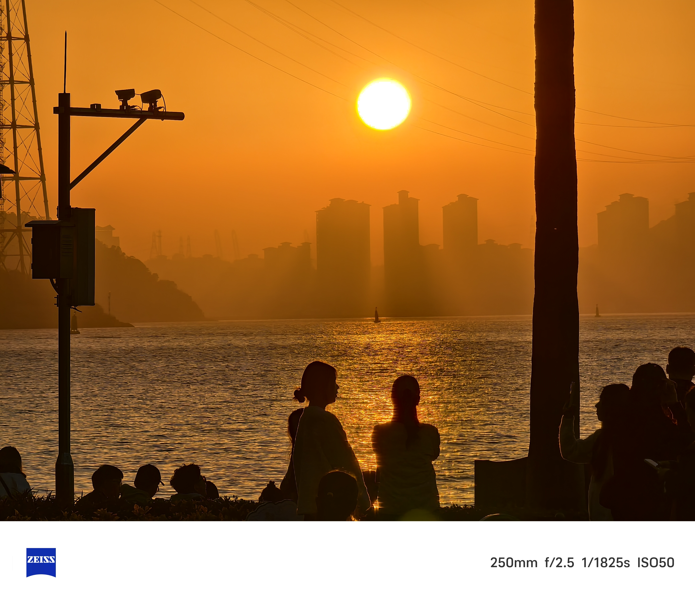

# Operator's Memo / 建站碎碎唸

這個網站可能什麼都會有。總體上，我還是希望把這個網站作為自己寫作記錄的一個平台，把它當作一本無窮大的筆記本。因此這個網站的版式是相對文藝的，網站的內容也採用了更有文化底蘊的正體字來呈現。從記錄的目的出發，我可能會在此處不定期更新一些生活隨筆 / 讀書筆記等文章，當然歡迎諸賢斧正。

<!-- more -->

除此之外，拜倒於一個 “Website” 的強大力量，我還十分願意把諸多學習資料上傳於此，也歡迎大家取用。

2024 年 1 月 6 日，其實還在期末考試期。但在整理期末考試筆記的過程中，抱著讓筆記更加賞心悅目的宗旨，我時常爆改 Typora 的 CSS 主題和輸出，並且在碼 Markdown 的過程中又頻繁地借 HTML 助力。作為一個排印愛好者，雖然 HTML 的中文排版有諸多問題，但我還是歎服於其功能之強大。網站不也是用 HTML 編寫的嘛！我逐漸按耐不住擁有一個網站的衝動。於是便乘興而發，白手起家，魔改手頭上現有的文字材料，讓腦子裡不多的 Thinking 與強大的搜索引擎與 AI 結合，從 1 月 6 日的晚上開始，到翌日夜分讓網站基本成了形。

我下一步的想法，一是多把寒假裡的感悟與收穫，放到網站上來；二是鑒於寒假回中學看望的行程，在此處盡力搜羅陳列應試資料、招考時訊，以裨益後學。倘若那日審美疲勞，又適得閒暇，將此站重新修葺一番，亦未可知。

