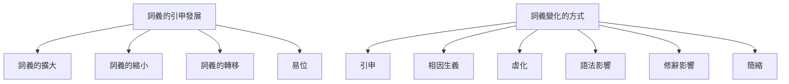
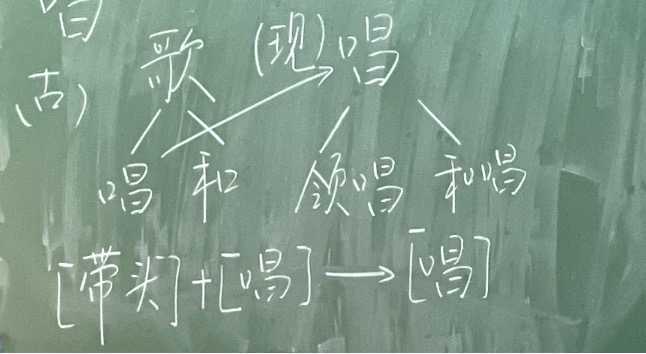
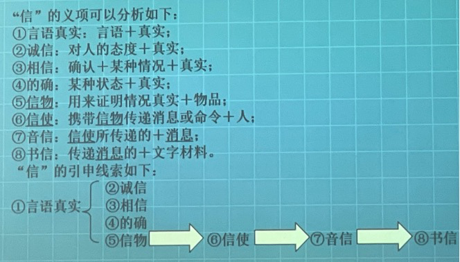
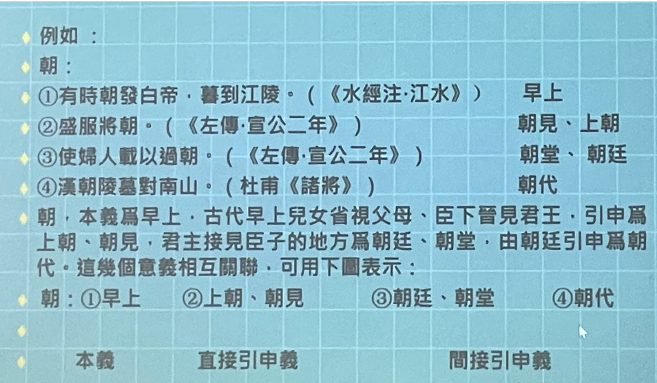
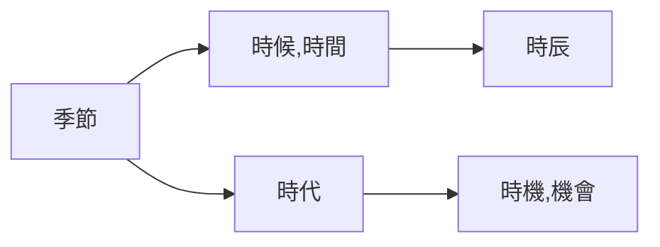

# 第二部分 詞義演變發展

詞義的擴大、縮小和轉移，是詞義演變的結果，而不是詞義演變的途徑。詞義演變的途徑是引申。

## 詞義演變的結果

### 從傳統詞彙學視角看詞義發展的結果

一、基本相同：主要表現在基本詞彙、常用詞、聯綿詞（雙音節單純詞）、專有名詞上（少見的）

二、完全不同：同音同形字（多查字典、多讀文選、適當記憶）

**搶** 古皆“碰、撞”之義《戰國策·秦策》：“布衣之怒·亦免冠徒跣·以頭搶地耳。”《莊子逍遙遊》：“我決起而飛·搶榆枋。

**行李** 古指外交使節，指人不指物。《左傳僖公三十年》：“若舍鄭以爲東道主·行李之往來·共其乏困。”今指出行時攜帶的東西，指物不指人。

**綢**

**該**

> 互文（招具該備）、屬文互見（不以物喜不以己悲， 把上下文結合起來看）、並提（合敘）

三、古今詞義之間既有聯係、又有發展

**勸** 古常用義爲鼓勵、勸勉。《國語·越語》“果行，國人皆勸。父勉其子，兄勉其弟，婦勉其夫。”《鞌之戰》“以勸事君者。”。今義爲勸說。

**訪** 古義爲詢問、諮詢。《左傳·僖公三十二年》：“穆公訪諸蹇叔。”今義爲探訪丶訪問。

#### 詞義的擴大

**菜** 至少宋代以前，專指蔬菜。葷，辛菜也。

**睡** 在古代專指坐著打瞌睡。《說文》：“睡，坐寐也。”《史記·商君列傳》：“孝公時時睡。”

**皮** 皮：帶毛的獸皮；革：脫毛的獸皮。“皮之不存，毛將焉附。”《詩經·衡風·硕人》：“領如蟲酉蠐，肤如凝脂。”现在不只是带了毛的才叫皮，所以是扩大了。

> 碩人：外形美妙，且德行又高尚的女子。
>
> 敦煌石窟和壁畫反映了中國人歷史審美的變化

#### 詞義的縮小

**宫** 古代泛指房屋。秦始皇稱帝以後，專指皇帝居住的地方（“未央宮”“阿房宮”）/寺廟。

**瓦** 古代泛指泥土燒製而成的陶器，今天“瓦罐”等還有“用陶土燒製而成”的詞素義。

**金** 上古通常指青銅，鐵出現後，也泛指金屬。今天只指黃金。《說文》：“銀，白金。”“銅，赤金。”“铁，黑金（惡金）。”《左傳僖18》：“鄭伯始朝于楚，楚子賜之金，既而悔之，與之盟曰：‘無以鑄兵！’故以鑄三鍾。” 

**親戚** 《大戴禮記·曾子疾病》：“親戚既殁，雖欲孝，誰孝？”孝：子對父母。《戰國策·齊策》：“富貴則親戚畏懼。”：此处亲戚指嫂子。當時親戚可以稱和自己家庭有婚姻關係的外親，也可以稱家庭成員。此处亲戚指父母。但是现在亲戚已不再指父母，嫂子也不叫亲戚。

#### 詞義的轉移

**暂** 突然、一下子（上古）；不久，短時地（中古）；暫時地，對將來而言（中古以後）。

**湯** 熱水也

**墳** (坟fén)《楚辭九章哀郢》：“登大墳以遠望兮。”《詩經·周南·汝》：“遵彼汝墳。”《禮記·檀弓上》：“古者墳而不境。”《說文》：“墳，墓也。”==（墓是平的；聚土為墳）==

**理** 治玉→治理（擴大）

**官** 官府→官員（轉移）

**替** 废棄、衰微→代替（轉移）

**玺** 印章→皇帝的印章（缩小）

**匠** 木工一各種工匠

**寡** 喪偶→女性喪偶  

### 義素分析法

20世紀70~80年代，蔣紹愚引進西方詞彙學，從義素分析法的角度認識古代漢語詞彙的變化。注意詞義與詞彙的區別：詞彙指的是一個系統，詞義指的是單個詞的意義。

討論詞義的發展變化，以詞爲單位不容易界定，現在更多地以義位爲單位。

#### 概念界定

**義位　義素** 義位是<u>最小的語義單位</u>，是<u>語義研究的基本單位</u>（略等於多義詞的每一個義項） ，其構成成分可分解爲義素。（詞→若干義位→若干義素）

義素是構成義位的<u>語義特徵</u>，可以略理解為，<u>以一個詞的一個義項為單位，再進行分解得到的語義特征</u>。

**義素分析法** 語義場內相互比較，提取相互聯係、相互區別的語義特征（區別性特征）的語義分析方法，叫做義素分析法。

**語義場**  核心語素基本一致的詞的總和。

同義聚合，反義聚合，場的範圍會發生變化；同個詞的不同義項所屬的語義場不同。

**語義場分布的等級序列** 語義場中的若干詞構成等級的序列。下位詞一定包含上位詞的全部義素，上位詞包含下位詞的部分義素。

#### 實例

一、五穀——稻黍（黃黏米）麥叔（菽，豆類）稷 （「止子路宿， 殺雞為黍而食之。」）

二、Man，Woman，Boy，Girl

| Public: HUMAN | male | -male |
| ------------- | ---- | ----- |
| adult         | man  | woman |
| -adult        | boy  | girl  |

Man = [male] + [adult] +[HUMAN] 

Woman = [-male] + [adult] + [HUMAN]

male/-male, adult/-adult 是構成這四個詞的“限定性義素”。HUMAN是共同的“中心義素”。

三、海，川，溪，湖，溝，池

核心義素是水面，前面是面積小的、非流动的

對池的池塘義進行義素分析：

| 共有的：水面 | 流動的 | 停聚的 |
| ------------ | ------ | ------ |
| 大           | 川     | 海     |
| 中           | 溪     | 湖     |
| 小           | 溝     | 池     |

池：-[流動的]+[面積大的] (限定義素)+[水面] (中心義素)

#### 義素分析法的不足

義素分析法有精密性和客觀性的優勢，但也有不足：

1. 對於語義特征的提取，具有主觀性
2. 只能用來分析實詞。名詞中抽象的詞、虛詞，均無法適用義素分析法。

義素分析法不能解決詞義係統裡的所有問題。

### 從義素分析法視角看詞義發展的結果

#### 詞義的擴大：限定性義素減少，義位由下位義變為上位義。

洗（洗腳）沐（洗頭）浴（洗身子）盥（洗手）浣（洗衣）

**疆（古作畺）、強（米中的小黑蟲，後假借彊）、彊（弓有力）【作業】**

嘴：［鳥的］［口］→［口］

#### 詞義的縮小：限定性義素減少，義位由下位義變為上位義。

臭（氣味xiu4）→臭的氣味

#### 詞義的轉移：限定性義素和中心義素都發生變化。

樹（種植）→樹（樹木），詞性的變化算作詞義的轉移，因為中心詞素發生了變化（動作→對象）

**易位** 中心義素不變，但是限定性義素發生了變化。易位並沒有改變語義場，而是同位義之間的變異。易位不屬於詞義的轉移。

>  例如：①涕→淚，泗（鼻涕）→涕；②走（跑）奔（快跑）趨（小步快走）行（走）
>
>  ③紅（粉紅）、赤、绛 [辨]赤,朱,丹,绛,红。“赤”是紅，“朱是大紅。“朱”比“赤”深。由於“朱”是大缸古代把它视爲正色。“丹”是丹砂的颜色，比"赤”更浅些。“绛”是深紅，比“朱”更深。“红”是赤白色,也就是淺紅。按照深淺的次序,這五種颜色的排列是：**绛,朱,赤,丹,红。**到了中古，“红”和“赤”已没有分别。

## 詞義變化的其他維度

### 詞義感情色彩的變化

### 詞義使用范圍的變化

◆從造句成分到構詞成分（獨立詞→詞素義）

**習**：**烏拍翅頻頻練習飛→練習；學習→習慣**

 

鷹乃學習。（ 《禮記·月令》 ）

學而時習之。（ 《論語·學而》 ）

民習以力攻難，故輕死。（ 《商君書》 ）

練習、自習、習字；習慣、習見、習焉不察

 

“济”

“董”：“隋人使少师董成”：董—主持和谈（董事长的“董”是主持的意思）

“釜”：高压锅与高压釜

  懼

飲

作為詞素義保留在雙音節、多音節詞中。

董成：主持和談

隨~使少師董成

奉—俸、捧，奉→詞素義。同受，（雙向的）

## 詞義演變的重要途徑——引申

詞義由甲范圍轉移到乙范圍，并不是憑空跳過去的，而是經歷了引申的過程。

**引申的基礎** 引申是基於聯想作用產生的詞義發展，因此，引申的**基礎**是本義和引申義間必然有某種聯係。

**區別引申和假借** 引申是<u>詞義</u>演變發展的途徑，假借是<u>用字</u>的方法。

引申有不同的種類：

### 连锁式引申

**要**《说文》 ： “要，身中也。”

①腰：昔楚灵王好细要。（《墨子经说》 ）

②中间：是王之地一经两海，要绝天下也。（《战国策·秦策》 ）

③拦截：吴人要而击之，获邓廖。（《左传·裏公三年》 ）

④要挟：日不要君，吾不信也。（《论语究问》 ）

⑤求得：非所以要誉于乡党朋友也。（《孟子·公孙丑》 ）

⑥需要：地不知寒人要暖，莫把人衣做地衣。（白居易《红线毯》 ）

“要”的意义可以用下表描述

> ①腰（人体的中间部分）——②中间（事物的中间部分）——③拦截（迫使他人中途停止前进）——④要挟（迫使他人改变意向，满足自己的欲望）——⑤需要（期待某种欲望得到满足）——⑥求得（请求他人满足自己的欲望）

### 辐射式引申

**节** 《说文》：“節，纏束也。”①竹节；

“节”的引申是根据“竹节”的特点而来的，可以表示为：

> 连接（引申为事物的连接处）：②木节、草节（用于草木）；③关节（用于动物）
>
> 分段（引申为事物的分段处） ：④季节、节气（用于时日）；⑤节奏、节拍（用于音乐）
>
> 制约（引申为约束等意思）：⑥气节、节操（用于道德）；⑦礼节（用于社会）；⑧节约（用于用度）；⑨旌节、节杖（用于外交，对于外交使者的约束）

### 综合式引申（连锁+辐射，汉语里词的引申方式大多都是）

## 詞的本義和引申義

### 什么是詞的本義和引申義

由本義推演派生發展出来的意義稱爲引申義。 

**直接引申義、間接引申義** 根據與本義關係的親疏遠近可將引申義分爲直接引申義和間接引申義。

直接引申義是直接由本義派生出來的意義。

間接引申義則由本義輾轉再引申（即由引申義再引申）而來的意義。

細節注意：①字本義基本等同於詞本義。②輾轉引申的意義，需要一環扣一環地引申、追本溯源。 ③本義只有一个，引申義可以有很多个。④单义词，不存在从本义到引申义的发展，但是这一类词很少。词本义和引申义，是就多义词而言的

**解**：①分割動物肢體（詞本义）。②把聚着的東西解開。③分解；融化。④和解，排解，調解。⑤消除。⑥解释。⑦理解，懂得。⑧鬆弛，懈怠。

**朝**：【單元練習！！！】

**向**：朝北的窗户→朝向；面向；趋向（病向愈；向晚）

**下风**：引申为“地位低下的”（“虫，雄鸣于上风，雌应于下风而风化”）

### 爲什么要分析詞的本義和引申義？

1. 使我們對每一个詞的詞義不仅知其然，而且知其所以然，從而加深對詞的理解。

向、上風與下風（狼煙：發令者、聽命者）

**绥**：車上使人不至於傾倒的繩帶

《三國志蜀書·諸葛亮傳》：“思靖百姓，懼未能绥。”（安抚）

《論語·鄉黨》：“升車必立正·執绥。”（车上的绳带）

**湊**：向心（繈至而輻湊）

**题**：《汉書·霍光傅》：“黃腸題凑。”（黄，黄心柏木；凑，聚合；题，从“页”，和头部有关系，额头，从而引申为事物的前端，从而延伸为文章的开头，即标题）（黄心的柏木的木材的前端都聚拢、聚合，是某種身份高贵的人使用的棺木）

神獸——文題白身

==**造字結構→本義→梳理詞義發展演變線索。每一個環節結合例證來掌握。**==

同源字、同源词：郭：城墙——廓：外物四围的轮廓——槨：棺槨

2. 可以幫助我們以簡驭繁地掌握詞義。
3. 可以幫助我們去瞭解詞義的發展變化，分辨古今詞義的本義。 

**時**：《論衡難歲》：“積分為日，累日為月，連月為時，紀時為歲。”

4. 分析本義和引申義有助于瞭解近义詞之間的異同。

**冕、冠、弁**

冕：最尊贵的帽子，皇帝才能戴。

冠：成年人戴的礼帽（跟国家的政治活动有关系，不做官叫“挂冠”，准备去做官叫“弹冠”）。在20岁行冠礼的时候，取字，加緇布帽，表示有治人权，还有其他礼仪，表示可以祭祀等，从此表示这个男子成年了。女子行笄礼，15岁行，表示可以出嫁了。

弁（biàn）：皮弁，鹿皮做的帽子，戴上了就要服兵役。武官戴的帽子，武官戴皮弁。武官可通稱武弁，也是一种礼帽。爵弁，參與祭祀，國之大事，在祀與戎，參與國家政治活動。目弁、馬弁：低級的小官吏、武官。弁言：序言

巾：黄巾起义~是贫贱者戴的。——诸葛亮羽扇纶巾~青丝带编成的头巾，裹頭布，窮人用來包裹髮髻的

總角之宴，言笑晏晏。加笄禮、簪禮。髮髻……

### 怎麼去掌握本義（二重印證法）、如何去分析引申義（教材91页） 

掌握本義是掌握詞義的基礎。

詞義分析舉例部分：詞的本義探求例、引申義分析例

段玉裁《說文解字注》

 

分析造字结构，从造字结构入手

“**斤**”像刀斧之形，本义是砍伐的工具

“**刃**”是指示词，古今意义没有变化

“**適**”是形声字

 

段玉裁《說文解字注》：

“温、良、恭、俭、让”：俭，约也。（行为约束）（约者，缠束也，行为不敢放侈）

本义是从字形方面分析出来的、有古代文献做参证的、最早的意义，是引申义的源头。

**如何探求词的本义？**

1、必须依据字形分析；例：

A象形字，**水**：甲文字形为，江水又东，这巫峡。古指河流。本义。

B指事字，**本**：甲文字形为，伐木不自其本，必复生。树根。本义。

C会意字，**戒**：篆文字形为，警也。防备，警戒。本义。

D声字，**诛**：从言，朱声，于予与何诛？责备。本义。在探求词的本义时必须依据古文字形，如莫、朝、射等字，只有依据古文形体，才能准确地把握本义，否则容易产生混淆。

2、从多个义项中归纳。

在探求词的本义时还必须依据古文献，脱离了文献，探求出的意义不一定是准确的。不能无中生有，不能前后倒置。如：

**访**，有两个常用义，一为询问，一为访问，文献中询问义在前，应为本义。

**愤**：有两个常用义，一为愤懑，一为愤怒，文献中愤懑义在前，应为本义。

  “精”：好米——精华

“朝”从最初的“早上”到“朝廷”、“朝代”有的不是不是直接引申，而是间接引申。

  《左传》：“百官承事，朝而不夕”——朝后来有持续的引申和发展

 

具體到抽象、個體到一般、由實到虛

由本义到引申义的发展有这样一个特性，往往本义是具体的，如“精”、“额”的本义分别是好米和额头，而引申义则表达抽象的概念，如“表”，从“衣”，古代是“皮袄有毛的穿在外面的那一面”，引申有“外貌”、“外表”。“莫”最初是“傍晚”，而后有“末尾”的意思，“暮年”

踵：腳後跟。→繼承（踩上別人走過的路）

暮：

《左传》：“日云暮矣，寡君须矣，吾子其入也。”——“暮矣”~显然不是傍晚的意思，而是时间已经不早了，我们的国君已经等候很久了，您还是赶紧进去吧（不要拘礼、不要讲究那么多了）

要把词的引申义和其他区别开来，如假借义（引申义是有联系的，可以找到本义和引申义的内在的联系，可以找到关联；假借是字的层面，词有假借，字有引申）

甲骨文、金文→小篆；形聲字的偏旁；

## 詞義演變的其他途徑

1. **相因生義**：甲字具有A義項、B義項，乙字具有A義項。因為甲乙在A義項上構成同義詞/反義詞，所以乙字產生B義項。

> 同義詞，如望洋興歎：望洋：仰視的樣子。看瞧，謂呼；反義詞，如？；1989，知識出版社《論詞的相因生義》
>

2. **虛化**：實詞的詞彙意義逐漸消失，變成表語法關係的虛詞。

> 以（用手提著東西，攜帶）→率領/工具介詞……
>
> 相（省察也（《說文》））→互相/偏指一方

3. **語法影響**：某些詞經常處於某種語法地位而獲得新的意義。

> 是：復指代詞→系動詞

某些詞經常用於某種特殊的用法而獲得新的意義。

> 聞：聞之於君（用於使動）→（報告）義

4. 修辭影響：如久借而不歸

> 披堅執銳：堅（堅固）—堅（堅固的鎧甲）
>
> 乘堅策良：堅（堅固）—堅（堅固的車子）
>
> 木：木若以美然（借代樹葉）（《孟子》）；行將就木（棺木）（《左傳·僖公二十三年》）

5. 簡縮

拓展閱讀：蔣紹愚《古漢語詞匯綱要》

## 詞義變化的歷史性與地區性

 古與今是相對而言的。

 **幣：先秦指一種絲织品，漢代産生“貨幣”義。**

《左傳襄公8年》 ＂敬共幣帛，以待來者。＂

《左傳傳公10年》 “幣重而甘言，誘我也。 禮物交換有價值→禮物

玉、皮、龜、馬→禮物，用幣統稱

古今詞義的變化在不同的方言里表現不一致。例如，《孟子·告子上） ： “冬日則飲湯，夏日則飲水。”

古代稱熱水爲湯，現代北京話不再把熱水稱湯但河北、河南等地方言中還有保留。

廾（gǒng）手捧，方言

錢：古代的一種大鍋。《吕氏春秋·察今》 ：嘗一1肉，而知一鏈之味，一鼎之調。”

廣州話稱“锅”爲“獲”。 

鼎： 《周禮·天官·享人》 ： ＂享人共掌鼎鏈，以給水火之齊。”

厦門話、福州話稱“锅”爲“鼎”。

## 辦析古今詞義異同應該注意的四個問題

1. 注意古今詞義差別不太明顯的情況；在細微的地方多下功夫。《史記項羽本紀》：“則幸分我一杯羹。”（肉~~肉湯~~）

2. 注意詞義異同的系列性，把相關的詞放在一起，從而更好地看出古今詞義的變化。例如，注意反義詞的對應：

   現代漢語——窮－富 高—下

   古代漢語——達－貧 低－昂

> 《論語·學而》 ： “未若**貧**（vs窮）而樂，富而好禮者也。”
>
> 《莊子·盗跖》 ： “（孔丘）色如死灰，據轼低頭不能出氣。”
>
> 《老子》 2章： “高下相傾。”
>
> 多—少——讚美/批評、瞧不起

3. 注意詞與概念的對應問題。某一概念可以用一個詞來表示，也可以用一個詞組來表示，古今存在著異同。 

> 腿、股（牌）、腔
>
> 領、頸（刎頸自盡）、項（望其項背）
>
> 洗、沐、浴、盥、浣（方言）
>
> 《公羊傳，莊公31年》何休注： “去垢日浣，齊人語也。”

4. 詞義的發展，受社會發展的影響是很大的。對於某些詞義的變化，需要結合一定的社會歷史去分析。

> 百姓（贵族——平民）
>
> 布（麻布—棉-黄道婆）
