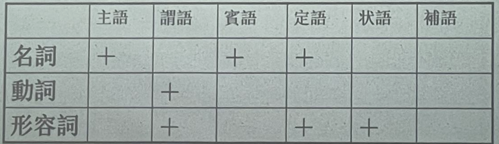

# 古代漢語語法

中國古代没有專門的語法研究，古代對語法問題的認識主要反映在對虚詞的研究上。

1898年馬建忠首次借用西方傳統的拉丁語法體系對古漢語語法作了全面的描寫分析（《馬氏文通》），之後有陳承澤的《國文法草創》、杨樹達的《高等國文法》等古漢語語法專著出現。

“古代漢語語法”是個泛時概念，即使從《詩經》、《論語》時代算起，到通常所說的上古漢語的下限東漢，也有近千年的歷史，其間漢語的語法系統有過許多重要的變化。

主要内容：着重就古漢語與現代漢語在語法方面的主要差别作概括的介紹，從而解决閱讀古書時遇到的一些難點。

介紹五個專題：（一）詞類的活用；（二）古代漢語的詞序；（三）古代漢語的判斷句； （四）古代漢語的被動表示法；（五）古代漢語虚詞。

# 詞類的活用

詞類的活用主要讨论七個問题：

1、古代漢語的詞類劃分；

2、什麼是古代漢語的詞類活用；

3、使動用法；

4、意動用法；

5、名詞用爲動詞；

6、名詞作状語；*

7、詞類活用的條件。

 拓展閱讀：《古漢語詞類活用淺談》（《湖北电大学刊》；《汉语史论集》郭錫良）

## 古代漢語的詞類劃分

### 古代漢語的詞類系統——實詞和虚詞

**實詞**包括名詞、動詞、形容詞、數詞和代詞五類；

**虚詞**包括副詞、介詞、連詞、語氣詞和嘆詞五類。

（缺乏量词、助詞）

### 劃分詞彙的依據、目的、範圍

1. 劃分詞類的**依據**是**詞的意义**和**語法功能**两個標准，相應地，所謂詞類，就是依據詞的意義和語法功能劃分出來的詞的類別。

> 黎錦熙：依句辨品，離句無品。（有人批評：詞無定類）

2. 劃分詞類的**目的**：是爲了說明古代漢語**句子的組织規則**，即句法結構。
3. 劃分詞類的**範圍**：詞類活用主要涉及實詞中的名詞、動詞和形容詞三類。下面我們分别說明這三類詞的語法功能。

語法功能指一個詞在句中主要擔任什麼句子成分。一般地說，某一詞類在句子中的語法功能應該是比較固定的。如名詞、動詞和形容詞三類詞的語法功能可以概括爲下表：

漢語的詞類與語法功能之間并不存在一一對應的關係。詞類活用實際上是爲了處理上述框架中的矛盾而提出的。

## 詞 類 活 用

**詞類活用**就是某個有固定屬類的詞在一定的語言環境中**==臨時==**改變其基本功能而充當别的詞類使用。

**注意與詞的兼類區別**：所謂兼類，是指一個詞同時兼屬两種以上的詞類。兼類是一個詞<u>詞義引申發展</u>的結果，因此在詞典中列爲不同的義項（現代漢語：鎖1，鎖2，把意義和語法功能都不同的詞看成兩個詞）；詞類活用與詞義的引申发展無關，在詞典中<u>一般不單獨列義項</u>。試比較：

|      | 詞的兼類現象                                                 |
| ---- | :----------------------------------------------------------- |
| 書   | (1)龐涓果夜至斫木下，見白書。→名詞，字。^今天的孫子兵法是孫武寫的。^ (2)乃斫大樹白而書之日。→動詞,寫。 |
| 素   | (1) 素柰朱李,枝條入檐。→形容詞白色。                         |
|      | (2) 彼三晉之兵素悍勇而輕齊。→副詞，一向（白色纯色，有引申关系）。 |
| 知   | (1)燕雀安知鴻鴿之志哉! (2)草木有生而無知。→名詞，知覺    |
| 益   | (1)灌水暴益,莉人弗知。（涨水→溢） (2)人或益之，人或損之，胡可得而法?（增加） (3)其家必日益。（富裕） (4)吾嘗終日不食，終夜不寝，以思，無益，不如學也。（好处） |

現代漢語里也有詞類活用的現象，如“豐富、巩固”等詞都有所謂的使動用法

在與漢語没有任何親緣關係的語言（如英語、拉丁語系）也經常有詞類活用的現象。

對所謂的詞類活用的問題，我們當然也可以不從語法的角度去處理，而是放到詞彙里去解决。比如前面提到的“目”“肘”等我們完全可以不看作名詞活用爲動詞，而是看作詞的兼類；或者更彻底一些，干脆看作意義和語法功能都不相同的同音詞。

李行健 語文出版社 查《規範字典》

### 使動用法

#### 不及物動詞的使動用法

分析用例:

> （1）莊公寤生,驚姜氏。(鄭伯克段於鄢）
>
> （2）百里而趣利者蹶上將。(孙膑)
>

 不及物動詞用作使動，後面的賓語可以省略：

> （3）願令得補黑衣之數，以衛王宫，没死以聞。（觸龍說趙太后）
>
> （4）則以法刑斷其两足而霖之，欲隱勿見。（孫膻）
>
> （5）養備而動時，則天不能病。（荀子《天論》 ）
>

#### 及物動詞的使動用法

實例分析:

> (1) 故民盡死力以從其上。(韓非子《五毒》）
>
> (2) 沛公旦日從百余騎來見項王。（瀉門宴）（使······跟从）
>

#### 形容詞的使動用法

形容詞作谓語，一般構成描寫句，描寫事物是什麼樣子。如：

> （1）位尊而無功，奉厚而無劳。（觸龍說趙太后）【这是形容词作谓语的一般用法】
>

形容詞帶賓語的情況：

> （2）親親而仁民，仁民而愛物。（孟子·盡心上）
>
> （3）今婦尊長安君之位。（觸龍說趙太后）
>
> （4）君子不以天下俭其貌。（孟子·公孫丑下）
>

#### 名詞的使動用法

> (1) 魏惠王起境内衆,将太子申而攻齊。(戰國策·魏策二)
>
> (2) 項羽爲西楚霸王,主命分天下王諸侯。(史記·秦始皇本紀)
>
> (3) 而自子之,乃變其名日楚。(戰國策·秦策五）
>

### 意動用法

首先，意動用法只限於名詞和形容詞，動詞不存在意動用法的問題。

使動用法是使實語怎麽樣，是客觀的結果，而意動用法則表示認爲實語怎麼樣或把賓語看作什麽，是一種主觀看法，即主体对客体的主观认识。

> 於是乘其車，揭其劍，過其友曰：“孟嘗君客我。” （《戰國策·馮諼^雞鳴狗盜的典故；給孟嘗君打廣告，有治政才能^客孟嘗君》）（以我為客。南宋鲍彪注：“待我以客。”）
>
> 斫而小之 （客观，使······小）
>
> 孔子登东山而小鲁，登太山而小天下 （主观，孔子的主观看法，认为······小）

#### 形容詞的意動用法

> (1) 齊將田忌善而客待之。(孫廣) 【主客观相符合。田忌确实善；多数情况主客观不一致：“上老之”（认为······老，只是表达主体的看法，不在意主客观是否一致）；但也存在主客观符合的少数情况。】
>
> (2) 人不難以死免其君，我戮之不祥。(《殽之战》)
>
> 《戰國策·楚策三》 :“夫進賢之難者,賢者用且使已废,貴且使已賤,故人難之。”
>
> (3) 今棄是州也,農夫渔父過而陋之。(《鈷鉧^熨斗^潭西小丘記》) （以······为陋）

#### 名詞的意動用法

(1) 今君有區區之薛,不抚愛子其民,因而質利之。(馮證客孟當君)

(2) 夫人之,我可以不夫人之乎? (穀梁傳·售公8年)

名詞性成分出現於“而”的前後項，則必然活用；副詞亦然

而：聯結兩個謂詞性成分；與：聯結兩個名詞性成分。

### 名詞作状語（詳見課本）

名詞作状語的現象在現代漢語的許多成語里也很常見。例如“虎距龍盘” （龍腾虎躍、龍吟虎啸、龍争虎斗、龍躍鳳鳴）、“火耕水癖”、“刀耕火種”、“鬼哭狼嚎”、“束奔西跑”、“水運”、“手寫”、“夜行”、“目送”，等等。

上古漢語普通名詞作狀語本不是詞類活用，是名詞的本用。

名詞作状語所表達的語法意義是多種多樣的。

1. 方位名詞、地點名詞、時間名詞用作状語，表示行爲動作的方位、處所或時間等。
2. 表示工具或依據
3. 表示對人的態度
4. 表示比喻

## 詞類活用的主要條件

1. 名詞連用，不構成并列結構或偏正結構，其中一個名詞可能活用爲動詞。

> 魏桓子肘韓康子，康子履魏桓子。（《戰國策·秦策四》）
>
> 遂王天下/面山而居/陳勝王/子房前

2. 形容詞+名詞，若非修飾關係，則為支配關係。（*素善留侯張良*）
3. 名詞、形容詞放在“所”字後面，活用為動詞。（*乃丹書帛曰：“陳勝王”，置人所罾魚腹中*，網→用網撈）
4. 名詞、形容詞放在“能”“可”“足”“欲”等能願動詞（助動詞）後面，活用為動詞。（*反古者不可非，而循禮者不足多。*）
5. 名詞放在副詞後面活用為動詞。（*秦師遂東*）
6. 名詞、形容詞放在“之”“我”等代詞前面，活用為動詞。（*非能耕而食之，織而衣之也。*）
7. 名詞後面用介賓結構作補語，這個名詞活用為動詞。（*請句踐女女於王*）
8. 名詞用“而”聯結時，活用為動詞。（*保民而王，莫之能御也*）

## 如何看待詞的活用？兼類與活用的界限？

==注意：動詞、形容詞放在主賓語位置，是否應當算作詞類活用，應當具體分析下列情況：==

> 樂民之樂者，民亦樂其樂；憂民之憂者，民亦憂其憂。（孟子·梁惠王下）
>
> 【有人认为后面的忧和乐是动词活用作名词，不应该同意】
>
> 異於白馬之白也，無以異於白人之白也！（孟子·告子下）

形容詞表性質狀態、動詞表動作行為，在上面兩句話中，形容詞、動詞仍然分別表性質狀態、行為，因此不算做詞類活用。動詞、形容詞不能做主賓語，這是印歐語法的限制，漢語無此限制。不應照搬印歐語法的框架，避免擴大詞類活用的範圍。

> 勞苦不撫循，憂悲不哀憐。（韓非子·用人）
>
> 事死如事生，禮也。（左傳·哀公15年）
>
> 然則小固不可以敵大，寡固不可以敵眾，弱固不可以敵強。（孟子·梁惠王上）
>
> 死者、生者、小者、大者：形容词作名词，转指，是词类活用

此處動詞、形容詞已經名物化了，形容詞表性質狀態/動詞表行為，均變成表人或事物，這個算作詞類活用。

英語形態變化→漢語動態助詞/副詞（都是動詞以外的成分），漢語是缺乏形態變化的語言，不能靠詞形本身的變化來表達。

此外，不能用現代的詞義詞類系統去替代上古漢語的詞義詞類系統。一定要用歷時的觀點看。

樹藝五谷。友：以手相助之義；同志為友，同門為朋（就已經是東漢後起義了）