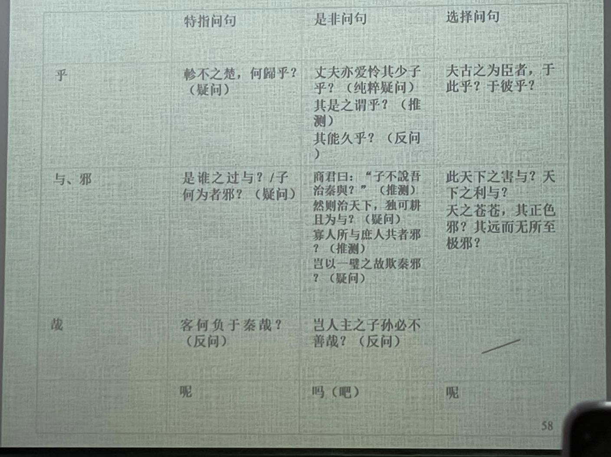

# 古代漢語虛詞

詞序和虚詞是漢語两種重要的語法手段，漢語的許多語法意義是通過虚詞來表現的。

> 例如，**時態**在西方語言里通過動詞的形態變化而體現出來。
>
> 漢語使用副詞、動態助词（後期）等來表達。

**==實詞==**——有實在的詞彙意義，在句子中能夠獨立充當句法成分的。

**==虛詞==**——沒有實在的詞彙意義，不能在句子中獨立充當句法成分的。

古代漢語實詞包括名詞、動詞、形容詞；虚詞大致包括**副詞、代詞、介詞、連詞、語氣詞和詞頭詞尾**等六類。副詞和代詞又稱爲半實半虚詞。

> 注意：虛詞有語法意義

## 副詞

主要歸納两個方面的内容：什麼是副詞？古代漢語幾個有特點的副詞。

### 什麽是副詞

**一、副詞是一種半實半虛的詞。**（1）①從功能上說，副詞用來修飾動詞和形容詞，在句子中充當状語。能獨立作句中的次要成分；②從意義上說，副詞不僅具有語法意義，同時具有一定的詞彙意義。（2）但是，副詞不能單獨表示一種實物、實情或實事，同時又不能用做句子的主要成分（主/謂/賓/定）。因此，副詞是一類半虚半實的詞。

**二、副詞的分類**。*為了教學的方便*，根據意義，把副詞分為：**程度**、**範圍**、**時間**、**情態**、**否定**和**表敬**六類。

為什麼這麼做？——一般而言，我們根據根據詞類的語法功能（語法分佈的總和）來劃分詞類；然而，副詞在句子中只能充當狀語。顯然，副詞詞類的劃分不能以此為依據。因此，我們按照語義來對副詞進行分類。

**三、在理解對副詞的定義時，需要注意两個問題。**

1. 在判斷句中，修飾判斷謂語的副詞，如“非、亦、即、乃、必”等，從形式上看是修飾名詞，這一點與現代漢語不同。
2. 并非能作状語的都是副詞。形容詞、名詞都經常用來作状語。只不過副詞**只能**作状語，在這一點上與形容詞和名詞不同。

### 程度副詞

在先秦漢語中，表示程度低一般用“少”，漢代以後開始用“略、微、頗”等；而“稍”表示程度低的意思是唐宋以後的事情了，

古代漢語程度副詞“少”是“稍微，略微”的意思，相當於現代的“稍”（古代的“稍”是時間副詞，有“逐漸”的意思）。

古代漢語程度副詞“頗”有兩個意思。一般說來，“頗”在古代多作“稍、略”解。《廣雅·釋誌三》：“頗，少也。”王念孫《疏證》：“颇者，略之少也。”兩個意思：①程度偏高，“很，甚”；②稍、略。——“頗”的本義是頭偏，《說文》：“頗，頭偏也。”先秦漢語中“頗”一般表示“偏斜”意思，如《尚書·洪范》：“無偏無頗，遵王之義。”

古代漢語程度副詞“甚”在六朝以前既作状語,也作謂語和定語。

> * 項羽乃疑范增與漢有私，**稍**奪其權。（史記.項羽本紀）
> * （徐）裹，其天姿善爲容，不能通《禮經》，（徐）延**頗**能，未善也。（《史記·儒林列傳》）
> * 太后曰:“丈夫亦愛憐其少子乎?”對曰:“**甚**於婦人。”(觸龍說趙太后)
> * 涉於魚齒之下，**甚**雨及之，楚師多凍。（左傳襄18)

  ### 範圍副詞

範圍副詞如“纔（才）、皆、盡”等古今變化不大。

古代漢語“但、徒、特、第/弟、直、顧”等，是表示範圍的副詞，和現代的“衹”意思相當。現代漢語的“但”是表轉折的連詞。

“獨”原是“獨自”的意思，也可以引申為“只”。但是在反問句中，“獨”字主要是表達反問語氣，屬於情態副詞，不能按此義理解。

古代漢語“僅”表示“只”“纔”“剛夠”的意思，言其少，是古今一致的。但在唐代詩文中“僅”還可以言其多，有“幾乎”“將近”“差不多達到”的意思。這類“僅”一般只用在數目字前，讀作jìn。

### 時間副詞

時間副詞如“將、正、已、常”等古今變化不大。

> **已然**|既、已、向、鄉、雅、素、嘗
>
> **進行**|方、適、會
>
> **將來**|行、將、久
>
> **暫止**|俄、暫、姑

古代“嘗”更經常用來表示“曾經”。“曾”在古代漢語中一般作情態副詞，用來加強否定語氣，表示“居然”。有時也可以表示時間，此時古今用法一致。

古代漢語“復”指的是“又一次”，這個意義與現代漢語副詞“再”相同。古代漢語的“再”是數量詞，一般專指兩次。到了唐代，也可以專指“第二次”。

古代表示頻繁、不斷重復出現的副詞還有“仍”，不能理解為現代漢語“仍舊”的意思。

### 情態副詞

情態副詞放在動詞或形容詞之前表示一定的情態或語氣。

“且”作情態副詞時，有“姑且”“尚且”義。此外，作時間副詞時，有“將要”義；作連詞時，相當於現代漢語“而且”。

“固”作情態副詞時，是“本來，當然”的意思，表示語氣之肯定、態度之堅決、情形之當然，與現代漢語“固然”的意思完全不同。凝固形式“固也”意思大致相當於“本來/當然如此”，常為對話式的應答。

“蓋”是表示語氣的情態副詞。①常放在句首表示提示和推測性判斷的語氣，起引出下文的作用。②有時只表示不肯定的論斷語氣，不一定放在句首，有“大概”的意思。③除了表示語氣的作用，在句中同時還有連接前後文句的作用——同時“蓋”後句子又表示前面句子原因的，就仍然起著推測性論斷語氣的作用。

> 君子不患寡而患不均，不患貧而患不安，**蓋**①③均無貧，和無寡，安無傾。（《論語·季氏將伐顓臾》）
>
> **蓋**①天下萬物之萌生，靡不有死。（《史記·孝文本紀》）
>
> **蓋**②有之矣，我未之見也。（《論語·裡仁》）
>
> 余登箕山，其上**蓋**②有許由塚雲。（《史記·伯夷列傳》）

### 否定副詞

古代漢語常用的否定副詞有“不、弗、毋、勿、未、非、否”。它們意義比較單純，用法比較復雜。

“不”“弗”表示一般的否定。（1）“不”的用法基本和現代相同：既可以否定副詞，又可以否定形容詞；既可以否定及物動詞，又可以否定不及物動詞。（2）在秦漢以前，“弗”的使用范圍非常狹窄，其後只能是不帶賓語的及物動詞，“弗”的存在使其得補出賓語。

“毋”“勿”相當於“不要”“別”，常用於祈使句，表示禁止或勸阻。“毋”還常寫成“無”。①先秦時，這兩個字的情況很像“不”“弗”，但“勿”後動詞不帶賓語的規則在先秦時期就不是很嚴格了。②漢魏以後，“勿”的使用範圍逐漸擴大，上述分別消失，“勿”還代替了“毋”。③勸阻義：“毋（無）”“勿”有時並不完全表示禁止，而是帶勸勉、約束義。④用於陳述句：此時“毋（無）”“勿”和“不”差不多，不再表示禁止，但漢代以後這種用法逐漸被“不”取代而消失。

> ①**勿**殺急擊**勿**失
>
> ③王請**勿**疑（勸勉）子**無**敢食我也（約束）
>
> ④欲無獲民，將焉避之（《左傳·晏嬰論季世》）
>
> 文公非不欲得原也，以不信得原不若勿得也。（《呂氏春秋·為慾》）

“未”①表示事情還沒有實現，等於現代漢語“沒有”，是對現在情況的否定。②凝固形式“未嘗”表示“不曾、沒有過”，是對從過去到現在的情況的否定。③有時候“未”只是一種委婉的否定，和“不”的意義相近。

**用法比較特殊的否定副詞：**

“非”（在上古也可以寫成“匪”）否定的不只是後面的動詞，而是後面整個謂語——①否定判斷句中謂語和主語的**關係**；②否定敘述句中的謂語，表示對某一事實的否認，往往具有撇開的作用——③由撇開進一步引申有假設的意思，等於“若無”“若非”。

> ①
>
> ②
>
> ③

“否”①和表肯定的應答之辭“然”對立，經常用於單詞句，相當於“不”“不是的”；②有時還用於對假設的否定，相當於“如果不這樣”（*否則*）。③還經常用於肯定否定迭用的句子，表示否定的一面

> ③吾得見與否，在此歲也。（《左傳·襄公三十年》）

除以上否定副詞外，古代漢語還常用“微”字表示否定。①凝固結構“微獨”相當於“不但、非但”；②此外多用於事後的假設，相當於“如果不是”。

### 表敬副詞

這類副詞原來一般有具體的意義，用坐表敬副詞後，原來的具體意義就變得很不明顯甚至消失。

> 尊人的表敬副詞|幸謹敬惠辱
>
> 自謙的表敬副詞|竊忝猥伏（臣對皇帝尚書表示敬意）

## 代詞

代詞是虛詞。代詞的功能是稱代作用，具有“指代義”的語法意義。古代漢語代詞主要分為以下三類：**人稱代詞**、**指示代詞**和**疑問代詞**。還有兩類比較特殊的代詞：**無定代詞“或”“莫”**、**輔助性代詞“者”“所”**。

> 不完備——沒有第三人稱代詞——作指示代詞還是第三人稱代詞
>
> 哪裡——指示代詞、指示代詞兼任第三人稱代詞、活譯不能代替語法

### 人稱代詞

古代漢語的人稱代詞系統比現代漢語更加復雜，許多人稱代詞之所以能夠並存，是因為它們的**句法功能有別**。

| 第一人稱代詞 | 主   | 謂   | 賓   | 定   | 狀   | 補   | 第二人稱代詞     | 主      | 謂   | 賓   | 定   | 狀   | 補   |
| ------------ | ---- | ---- | ---- | ---- | ---- | ---- | ---------------- | ------- | ---- | ---- | ---- | ---- | ---- |
| 吾           | ○    |      | ×\*  | ○    |      |      | 女（汝）、爾、若 | ○       |      | ○    | ○    |      |      |
| 我           | ○    |      | ○    | ○    |      |      | 而、乃           | ○^偶爾^ |      | ×    | ○    |      |      |
| 予/余        | ○    |      | ○    |      |      |      |                  |         |      |      |      |      |      |

嚴格說來，先秦沒有真正的第三人稱代詞，本來是指示代詞的“其”“之”可以起第三人稱代詞的作用。“其”只作定語，“之”只作賓語。注意，“他”在上古的意義是“其他，別的”（*“他山之石，可以攻玉”*），從唐代開始才發展成為第三人稱代詞，且古文中也少用。現代漢語第三人稱做主語的地方，古代漢語要麼直接重複前面出現的名詞，要麼省略主語。

古代漢語的人稱代詞是**單復數同形**的。不過，也可後加“儕、屬、曹”等字，表示不止一個人。

此外，部分謙稱可替代作第一、第二人稱代詞（見課本321頁），由於它們都是名詞，不是代詞，不適用“否定句中代詞作賓語前置”等與代詞相關的倒裝規律的約束。如：

> 第一人稱｜臣、妾、寡人、愚
>
> 第二人稱｜先生、足下（以腳下土地代稱，不直呼其名）、大王
>
> 自稱其名、稱人之字，均是尊稱。

### 指示代詞

現代漢語中的指示代詞是近指（“這”）、遠指（“那”）二分的。古代漢語的指示代詞系統比較複雜。

| 指代意味 | 強   |                           |                                                       |      | 弱                  |
| -------- | ---- | ------------------------- | ----------------------------------------------------- | ---- | ------------------- |
| 近指     | 此   | 斯 （後有連詞“就”義） | 是 （中指/承指代詞，有強調意味） （後成係詞） | 茲   | 之 （泛指代詞） |
| 遠指     | 彼   | 夫 （後成發語詞）     |                                                       |      | 其 （特指代詞） |

茲、之都可作定語或賓語。“之”是最早的指示代詞。非近非遠，是一種泛指代詞。之、其、茲，古之部字，體現了語法功能與語音的對應關係。

此外還有兼詞“焉”（“於是”）“諸”（“之於”），是比較特殊的代詞。注意，“焉”作兼詞與作語氣詞的界限不十分清楚，不要輕易把其看做語氣詞。

### 疑問代詞

**指人**的疑問代詞有“誰”“孰”，可作主語、賓語、定語、謂語。“誰”與現代漢語用法一致。①“孰”主要用於選擇問句，但不能出現在賓語位置，②也有不表示選擇的，和“誰”用法一致。③“孰”也能指事物，仍是表示選擇。④凝固結構“孰與”同“何如”的意思相近，用來比較人物的高下或事情的得失。

> ①吾與城北徐公孰美？父與夫孰親？√吾誰欺\*吾孰欺
>
> ②孰可以代之？孰為夫子？
>
> ③天下之害孰為大？膾（形容很細的肉）炙與羊棗孰美？
>
> ④從天而頌之，孰與製（掌握,控制）天命而用之？（《荀子·天論》）——新儒學的代表荀子是樸素唯物論的集大成者
>
> ④公之視廉將軍孰與秦王？

**指事物**的疑問代詞有“何、胡、曷、奚”，相當於“什麼”。“何”可作謂語（*“是何也？”*）、賓語、定語、狀語（*“夫子何哂由也？”“何至於此？”*），“胡、曷、奚”一般作狀語、賓語（常見“胡為”“何為”表示“為什麼”，*“曷為久居此圍城之中而不去”*）。

**指處所**的疑問代詞有“安、惡、焉”，相當於“哪裡”，一般做狀語表示反問，用於賓語的情況相對少（莊子“彼且惡呼待哉”，孟子“天下之父歸之，其子焉往”）。

### 無定代詞“或”“莫”

這是古代漢語特有的一類代詞，現代漢語沒有。

“或”是肯定性無定代詞，一般指人，相當於現代漢語的“有的人”，只作主語。①有時候“或”字前面出現先行詞，“或”指代其中的某些人或某一個人。②“或”還常常前後呼應，表示列舉不同的情況，仍然是無定代詞，既可以指人，也可以指物。注意：這些用法的“或”不是表選擇的連詞“或者”

> ①或百步而後止，或五十步而後止。（《孟子·梁惠王上》）
>
> ②夫物之不齊，物之情也。或相倍蓯，或相什伯，或相千萬。（《孟子·許行》）

“莫”是否定性無定代詞，相當於現代漢語“沒有誰”“沒有什麼東西”。“莫”字所否定的①可以有范圍，②也可以沒有范圍或不指出範圍，是最廣泛的否定。

> ①群臣莫封（《戰國策·楚策一》）·殺臣，宋莫能守，乃可攻也（《墨子·公輸》）
>
> ②虎負隅，莫之敢攖（《孟子·盡心下》）·吾盾之堅，物莫能陷也（《韓非子·歷山之農者侵畔》）

“莫”在先秦作品中，都可以解釋為無定代詞，漢以後逐漸產生否定副詞的新用法，常用於祈使句中表示禁止，相當於“勿”（不要）；有時也用於陳述句中，相當於“不”。

### 輔助性代詞“者”“所”

郭錫良認為是“輔助性代詞”，朱德熙認為是名物化標記。參見朱德熙《自指和轉指》（1983）、陳平有關“指稱”與“陳述”的論述。

“者”①放在謂詞性（動詞、形容詞）詞（組）後構成“者”字結構，使整個結構具有名詞性（*大者、先破秦入咸陽者*）。②放在數詞或時間詞之後表示一定的范圍和種類（*二者、古者*）。③還可以用來復指主語、引出謂語，常見於判斷句式。

> 思考：
>
> （1）智者樂(yào)水，仁者樂山。（轉指）
>
> （2）仁者人也。（自指）

“所”①代指某種動作的對象，位於動詞或動詞性詞組之前（且往往及物，如果是形容詞或不及物動詞，也都變得具有及物動詞的性質）構成“所”字結構（“所……者”結構與“所”字結構作用相同），使整個結構具有名詞性。②“所”字結構前面還可以用行為主動者作定語來修飾它，一般在定語之後要用“之”字。③“所”字結構雖然指代行為的對象，但不能具體表示是什麼人或什麼事物，因此，還可以在“所”字結構後加上名詞，舉出人或事物的名稱，“所”字結構放在前面作為它的定語。④“所”如果不再作為代詞替代動作的對象（如解釋為“所由”“所以”），後面的動詞就不一定是及物動詞；如果是及物動詞，可以另帶賓語；在“所謂”後也可以另帶賓語。

“所”字常見用法：從“所食”到“所食者”“民之所食”“（民）所食之粟”，“所”的指代義越來越弱。“所”常見“所謂”“所以”“所由”“所為”等凝固格式，和被動句式中虛化成表被動的動詞詞頭“所”。

“所以”①用來……的辦法，憑它來……，說明“怎樣”。②表示原因，大致和現代漢語的“導致……的原因”相當，說明“為什麼”。

## 介詞

### 介詞綜述

**介詞的特徵**（1）补宾则介词，不补则连词。介词都有宾语，宾语通常由其他成分（代、形、动词、主谓结构等）充当。“介宾”一般是不可分的短语，虽然古汉语有些介词可以省略宾语，但省略不等于无宾语。

（2）介宾短语的位置：位于谓语的前或后面，在前时，介词宾语有时可以承上省略，在后时宾语不能省略。

（3）介词一般不作谓语的中心，不能出现在谓词的位置上。介宾短语一般不能脱离谓词而独立成句，这是介词与动词的主要区别。

**介詞的功能**

（1）语义上，介词功能主要在于**引进**与动作（或状态）相关的<u>时间</u>、<u>处所</u>、<u>对象</u>、<u>工具</u>、<u>方式</u>、<u>条件</u>、<u>原因</u>或<u>目的</u>等。

（2）语法上，介宾短语的增添是句子结构扩展的重要手段，可<u>作状语</u>、<u>作补语</u>、作定语（少，“沿江一带、自此之后”）、作谓语（少，“国家之败，由官邪也”（左传·桓2））

**介詞的分類**何乐士《古汉语语法及其发展》分7类：

1、引进与动作（状态）相关的时间

2、引进与动作（状态）相关的对象

3、引进与动作（状态）相关的处所

4、引进动作行为的工具

5、引进动作行为的原因或目的

6、引进训告或言谈的内容

7、引进动作行为处置的对象（认为仅限于“复以弟子一人投河中”）（大部分还是引介动作行为的工具，但后来与上古的工具介词也有一定距离（史记时代））

### 介詞舉例分析

**（一）于（於、乎）**

最早動詞義“往、去”（*“之子於歸，宜其室家”*《詩·周南·桃夭》）、“取”（*“晝爾於茅，宵爾索綯”*《詩·豳風·七月》），但早在甲骨文時代就已經虛化為介詞了（郭錫良）。

**字形問題**“于”“於”上古不同音，“乎”的上古音與“于”相近，也常和“于”一樣作介詞用。甲骨文中只用“于”，先秦一些古籍如《左傳》《荀子》二字並用，戰國後多寫作“於”，漢字簡化後又為“于”。

**用法**（1）表示處所和時間；（2）介紹涉及的對象；（3）表示比較；（4）用在表被動的句子中。

**（二）以**

最早動詞義“用”（“夏后氏以松，殷人以柏，周人以栗，曰：使民战栗。”《論語·八佾》）。

**用法**（1）表示動作行為以某物為工具或憑藉，相當於現代漢語的“用”或“拿”。“以”的賓語所表示的事物，可以是具體的，也可以是比較抽象的。

> 蛇出於其下，以肱擊之。(《左傅·鞌之戰》)
>
> 以羽爲巢，而編之以髮。(《荀子·勸學》)
>
> 儒以文亂法，俠以武犯禁。(《韓非子·五蠹》)

（2）表憑藉。①表示憑着某種資格、身份或地位，②有時是表示率領或依照的意思（帶有動詞意味的介詞）。

> ①騫以郎應募使月氏。（《漢書·張騫傳》）
>
> ②項梁乃以八千人渡江而西。(《史記·項羽本紀》)
>
> ②餘船以次俱進。(《資治通鑑·漢紀五十七》)

（3）表原因，相當於“因”“因為”。

> 大韓魏滅亡，而安陵以五十里之地存者，徒以有先生也。(《戰國策·魏策四》）
>
> 扶蘇以數諫故，上使外將兵。(《史記·陳涉起義》)

（4）是表示時間，相當于“于”“在”。但“于”只作補語（所謂“後置”），“以”只作狀語。

 >文(指田文，即孟嘗君)以五月五日生。(《史記·孟嘗君列傳》)
 >
 >韓說(yue)以太初二年爲游擊將軍。(《史記·衛將軍驃騎列傅》)
 >
 >子厚以元和十四年十一月八日卒。(韓愈《柳子厚墓志銘》)

以上四種用法關係非常密切，實際上後三種用法都是從第一種用法表示“憑藉”的意義引申出來的。

（5）“無以(亡以)”是一個凝固結構，“以”字後面也不帶賓語。“無以"是没有什麽可以拿來的意思。

（6）“以”字選可以用作連詞，①作用略同于“而”，下舉示例；②目的連詞，相當於“來”（*焉用亡鄭以倍鄰*）。

> 齊因乘勝盡破其軍，虜魏太子申以歸。（《史記·孫臏》）

> 酌貪泉而覺爽，處涸轍以猶歡。(王勃《滕王闆序》)

> 大夷以近，則遊者衆；險以遠，則至者少。(王安石《遊褒禪山記》）
>
> 狐晏其舅也，而惠亦有謀。（<u>在“而”後連詞用“以”</u>）

例一“以”字連接兩種行爲動作(“虜太子申”和“歸”)，表示它們在時間上一先一後的聯繫。例二“以”和“而”並用;都是連接兩種在意義上相對的行為，更能說明“以”的作用和“而”相似。例三“以”字連接兩個形容詞，表示兩種性質的聯繫(“夷”和“近”，“險”和“遠”)。

**用法注意**“以”字的用法還有兩點值得注意。

一是它在句中的位置。（1）“以”可以用在謂語動詞之前，也可以用在謂語動詞之後，上邊舉的《荀子·勸學》“以羽為巢，而编之以髮”一例，兩個“以”字的位置就不同。（2）但在表示時間時，就只能放在謂語動詞之前。

二是它的賓語的位置。（1）為了强調“以”的賓語，可以把這個賓語放到“以”的前面。例如：

> 楚國方城以為城，漢水以為池。(《左傅·齊桓公伐楚》)
>
> 一以當十。(《史記·項羽本紀》)

（2）如果“以”的賓語在上文已經出現過，這個寶語有時還可以省略。例如:

> 小人有母，皆嘗小人之食矣，未嘗君之羹。請以遺之。(《左傅·鄭伯克段於鄢》，“以”後省略“君之羹”)

**关于介词“以”表处置的问题**处置式是汉语的一种重要的句法结构。最早提出这一概念的是王力（1943）：“凡用助动词把目的位提到叙述词的前面以表示一种处置者，叫做处置式”。现代汉语里，联动式发展为处置式，处置式常用“把”字来引出被处置的对象，所以又称作“把”字句。

处置式的作用：提前宾语，强调对宾语的处置。处置式里的介词宾语角色重要，是被强调的对象。“把”提前的宾语是有定的，听话者是知道的（把栏杆拍遍、但愿春官**把**卷**看**），因此这个宾语是不能省略的。

<u>“以”字结构不是处置式，</u>“以”字结构与“将／把”处置式(从联动式发展而来)不是一种结构，无论是语法意义还是句法结构，二者都有相当大的差异。

（1）语法意义上的差异是：

以《孟子》为例，《孟子》里表“处置（给）”、“处置（到）”的“以”字结构中，“以”的宾语<u>均为无生的事物，并且都是泛义宾语，是不定指的</u>（*尧以不得舜为己忧*）。

（2）结构上的差异是：

A、“以”字结构在动词前后的位置灵活，既可放在动词前，也可放在动词后，如：

> 陈子以时子之言告子。（孟子103）／子路，人告之以有过，则喜。（孟子82）

B、“以”的宾语常常省略，如：

> 小人有母，皆尝小人之食矣，未尝君之羹，请以遗之。（左传15）

处置介词×，工具介词√

C、“以”的宾语可以前置，如：

> 君若以力，楚国方城以为城，汉水以为池，虽众，无所用之。（左传292）

D、“以”字结构中不仅可以省略直接宾语，还能省略间接宾语，如：

> 明日，子路行，以告。（论语203）

E、有时连动词都可以省略，如：

> 书曰“崔氏”，非其罪也；且以告族，不以名。（左传706）

F、就是汉代产生的“处置（到）”，也有与之相应的“以”字结构置于动词之后的例子。如：

> 树吾墓上以梓，令可为器。（史记1472）／必树吾墓上以梓，令可以为器。（同上2180）

> （坟，高土丘。尔墓之木拱矣（以树标木风俗——老不死的））

六朝（“以”逐渐退出介词系统历史舞台）时，“以”的宾语仍然可以省略，同时，宾语的位置也可以居前，如：

> 臣曰：“斯杀不酷，唯以投大海中。”（六度28）
>
> 其城纵广四百八十里，皆以七宝作城，其城七重，其间皆有七宝琦树，城上皆有七宝，**罗毅缇缦以**覆城上。（道行471）

**（三）為**

（wèi）經常和它後面的賓語一起放在謂語動詞前面作狀語，表示對象、目的、原因等關係。例如:

> 為長安君約車百乘。(《戰國策•觸龍說趙太后》)

> 苦爲河伯娶婦。(《史記•西門豹治鄴》)

> 天行有常，不為堯存，不爲桀亡。(《荀子•天論》)

> 漢卒十餘萬人皆入睢水，睢水為之不流。(《史記•項羽本紀》)

例一和例二表示對象或目的，“為”字略等于現代的“替”、“給”；例三和例四表示原因，“為”字可譯属“因為”“因”。

介詞“為”後面的賓語，有時也可以省略。例如:

> 禹之時，十年九澇，而水弗為加益;湯之時，八年七旱，而崖不為加損。(《莊子•秋水》)
>
> 居輜車中，坐為計謀。(《史記•孫臏》)
>
> 煩大巫嫗為入報河伯。(《史記•西門豹治鄴》）

這種省略了的賓語，從上下文看，常常是“之”、“我”、“此”之類的代詗。

介詞“為”還可以表示被動，讚wéi，這在《古代漢語的被動表示法》一節裹已經介紹過，不再重複。

## 連詞

連詞是連接詞、詞組或句子的虚詞。古代漢語常用的連詞有“與、及、而、則、且、況、但、抑、雖、然、故、苟、倘、令、第令、藉使、之”等等，其中有不少在現代漢語書面語言裹還常常使用。幾個比較重要的連詞：

**（一）與**

“與”字和現代漠語的“和(跟、同)”一樣，分屬兩種詞類：①連詞，②介詞。

> 我跟你講vs我跟他去看電影
>
> 如何區別？看能否前後調換順序。

1、連詞“與”一般用來連接並列的名詞、代詞或名詞性詞組。（*蜩與學鳩笑之。*《莊子•逍遙遊》｜*畦留夷與揭車兮，雜杜衡與芳芷。*屈原《離騷》）

“與”字可以用兩次，連接二個名詞性詞組。“有爵者”、“七十者(上了七十歲的老人)”和“未齔者(還没有换牙的兒童)”，“與”用了兩次。現代漢語建詞“和”如果連接三個以上的並列成分，一般只在末一項前面用一次。

2、介詞“與“前後的成份不是並列的，而是和它後面的賓語組成介詞結構，在句中作狀語。例如：

> 公與之乘，戰于長勺。（《左傅•莊公十年》）
>
> 夸父與日逐走。（《山海經•夸父逐日》）
>
> 君安與項伯有故?（《史記·鸿門宴》）

上面例句中，“公”“夸父”“君”在句中作主語，“與”和它後邊的名詞組成介詞結構，在句中作狀語。例三“與”字前邊還有“安”作狀語，更表明它只能是介詞，因為這樣“君”和“項伯”不能再是並列關係。

介調“與”的賓語可以省略。**<u>介詞可省略賓語，連詞不可以省略賓語。</u>**

**（二）而**

從上下文看，有兩個大的類型。

1. 順接——語義順承

   1. 用於聯合結構（時間順承：*賣油翁釋擔而立*｜性質狀態並列：*美而艷*｜遞進：*敏於事而慎於言*｜因果：*令尹誅而楚姦不上聞，仲尼賞而魯民易降北；臣死而秦治*。等）

   2. 用於偏正結構（語義順承，前項修飾後項）

      > 一鼓作氣，再而衰，三而竭。（《左傳•莊公十年》）
      >
      > 吾嘗終日而思矣，不如須臾之所學也。（《荀子·勸學》）
      >
      > 太后盛氣而揖之。（《戰國策•觸龍說趙太后》）

2. 逆接——語義轉折

   1. 用於聯合結構

      >不戰而屈人之兵，善之善者也。（《孫子兵法·謀攻》）
      >水淺而舟大也。（《莊子•逍遥遊》）

   2. 用於主謂結構。

      1. 在意思上是一種逆接。有時候表示似乎不應有而有的事。

         >先生獨未見夫僕乎？十人而從一人者，寧力不勝，智不若耶？畏之也。（《戰國策·趙策三》）
         >
         >【是說本來十個人不應該服從一個人，而現在却服從一個人，“而”含轉折意味。】

      2. “而”字放在主語謂語之間，有時含有假設的意思。例如：

         > 意而安之，願假冠以見；意如不安，願無變國俗。(《說苑。奉使》）
         >
         > 【這種“而”字相當于“如果”、“假如”。】

在古代漢語裹，“而”字一般不連接<u>名詞或名詞性詞組</u>。《荀子•勸學》“蟹六跪而二螯”中“而”字之所以能連接“六跪”和“二鳌”，是因爲它們在這裹用作謂語而帶有描寫的性質。

**（三）則、然則**

1、表示兩事在時間上相承，有“就”或“便”的意思。（*戰則請從*）

2、表示因果或情理上的聯繫。有“那麼”或“那麼就”的意思。這種“則”宇，如果用於平行的两個分句，那就形成對比。

> 風 之 積 也 不 厚 ， 則 其 負 大 翼 也 無 力。（《莊子·逍遙遊》）
>
> 內則百姓疾（恨）之，外則諸侯叛之。（《荀子》）【這裡的“則”幾乎沒有任何意義了】

3、表示假設，有“如果”“假如”的意思。（*時則不至，而控於地而已矣。*《莊子• 逍遙遊》）

4、表示發現，有“原來已經”的意思。這種“則”字多用在有兩個以上分句的複句中（兩例都是三個分句），前面的分句表示的事情發生在後，後面的分句表示的事情發生在前。“則”字用在後面的分句裏表示發現了早已發生的事情。

> 公使陽感父追之，及諸河，則在舟中矣。(《左傅•僖33》) 
>
> 使子路反見之，至則行矣。(《論語•子路從而後》 )

此外，“則"選可以表示讓步，有“雖然”、“倒是的意思（*善則善矣，未可以戰也。*《國語 •吳語》）。這種“則”字，有人認為是副詞，其實它用來表示讓步時，仍然起連接作用，跟一般副詞的作用是不同的。

“然則”，①本來是指示代詞“然”和連詞“則”的連用，意思是“這樣就”或“既然如此，那麽”，多用於對話。用“然則”的句子往往是順着上文的語意，申說應有的後果。②後來“然則”變為凝固的形式，可以認為是一個詞，相當于“那麽”。

**（四）雖、雖然**

1、連詞“雖”一般表示讓步，相當于現代漢語的“雖然”。

2、有時還可以兼有“假使”的意思，是<u>假設的讓步</u>，作用和“縱”“縱然”、“即使”相同。

古代也有“雖然”，但那是連詞“雖”和指示代詞“然”的連用，是“雖然如此”的意思。

**（五）然、然而**

“然”字作爲連詞，表示轉折，相當于現代漢語的“可是”“但是”或“然而”。

**（六）之**

“之”字分屬兩個詞類：一是代詞，一是連詞。代詞“之”已在“代詞”一節裏介紹過了，這裹只談連詞“之"。

助詞（*“的地得着了過”*）到近代漢語時期才出現。“之”，王力認為是介詞，郭錫良認為是連詞。<u>**不立助詞的原因：**</u>①從語法的結構係統角度關照（否則代價太大）；②從詞類的語法功能角度（其實也有差別）。

連詞“之”的作用主要有兩種。

第一，連接定語和中心語，表示領屬關係或修飾關係。

這種“之“字一般都可以譯成現代漢語的“的”字，但是二者==**詞類不同**==。“的”字在現代漢語是結構助詞，<u>它和前邊的詞或詞組結合成**名詞性詞組**</u>(例如“我的”、“紅的”、“寫的”、“人民的”“羣衆擁護的”)，可以作句中的各種成份用，并不限于定語。<u>古代漢語“之”則只能和它前面的詞或詞組一起作定語用，“之”的後面必須有中心語，“之”所起的是連接定語和中心語的作用，因此是連詞</u>。

第二，插在主謂結構中間，使這個主謂結構變爲名詞性的偏正結構，用來充當句子的主語、賓語或狀語。

## 語氣詞和詞頭詞尾

> 1. 什麽是語氣詞？古代漢語的語氣詞有什麽特點？
> 2. 古代漢語常見的几個語氣詞；
> 3. 關於詞頭詞尾的問題。
>
> 切韻增廣切韻集韻

語調也可以表達語氣，但聲調、平調、降調只能通過上下文判斷，不一定符合邏輯。語氣詞的存在為書面語中語氣的判斷提供了方便。語調在書面語中表現的可能性極小。重要手段。

### 句尾語氣詞

古代漢語常見的句尾語氣詞有“也、矣、乎、哉”等，

**（一）也**

唯一的功能是：在複句中，常用于最後一個分句的句尾，表示對前面論斷的肯定和確認，**加彊全句的語氣**。

> 如必自為而後用之，是率天下而路也。（《孟子·許行》）
>
> 雖殺臣，不能絕也。（《墨子·公輸》）
>
> 禹以治，桀以亂，治亂非天也。（《荀子·天論》）

例一“如必自為而後用之”是先假設，“是率天下而路也”是對這種假設所產生的結果的肯定論斷。例二“雖殺臣”是先讓步，“不能絕也”是在這種讓步條件下對事情結果的肯定判斷。例三的前兩分句是陳述客觀事實，“治亂非天也”是對事實的結果做出論斷。

在因果複句中，“也”字的作用最值得注意。試比較下列兩例：

> 賞罰不信，故士民不死也。（《韓非子·初見秦》）
>
> 蚓無爪牙之利，筋骨之強，上食埃土，下飲黃泉，用心一也。（《荀子·勸學》）

上例是肯定結果，下例是肯定原因。結果和原因看來相反，但都帶有肯定和確認的語氣，因此最後都能用“也”字煞句（參看《古代漢語的判斷句》一節）。

由以上各例可以看出，用于複句句尾的"也"字都帶有肯定。確認或深信不疑的語氣，和牠表示判斷語氣的基本用法密切相關，是從牠的基本用法引申發展來的。

古代漢語表示命令或疑問的句子也往往用“也”字煞尾。

表示命令的如：

> 不及黃泉，無相見也！（《左傅·鄭伯克段於鄢》）
>
> 欲呼張良與俱去，曰：“毋從俱死也！”（《史記·鴻門宴》）

表示命令的句子加上“也”字就有了確定的語氣，不再是單純地表示命令。“也”字的這種用法，和前面的用法仍然是相通的。

表示疑問的如:

> 南冠而縶（被拘禁）者，誰也？（《左傅·成公九年》）
>
> 不識臣之力也，君之力也?（《韓非子·難二》）

例一是特指問，例二是選擇問。這兩種疑問句本身疑問性都很強：特指問句有疑問代詞；選擇問句是列舉出可能的回笞，要求回答問題的人作出抉擇。“也”字用於疑問句句尾時，主要就只出現在這兩種疑問句中，牠所錶示的主要仍是肯定、判斷語氣，和純粹表示疑問語氣的“邪”所起的作用顯然很不一樣。以上兩例，如果把“也”換成“邪”，疑問語氣就顯然加強，而不再帶有一點肯定、判斷的語氣了。

**（二）矣**

“矣”字也是古代漢語常用的一個語氣詞，牠和“也”的區別是：“也”字表靜態，“矣”字表動態。

“也”字的基本作用是把對事物進行的判斷告訴別人，現代漢語沒有和牠相當的語氣詞；“矣”字的基本作用則是把事物發展的現階段作為新情況告訴別人，現代漢語語氣詞“了”的作用大致和牠相當。

例如:

> 雞既鳴矣。（《詩經·齊風·雞鳴》）
>
> （原來沒有鳴，現在鳴了。）
>
> 余病（受重傷）矣。（《左傳·鞌之戰》）
>
> （原來沒病，現在病了。）
>
> 此迫矣！臣請入，與之同命。（《史記·鴻門宴》）
>
> （原來不緊迫，現在緊迫了。）

以上三例都表示已然，即事情已經發生。

“矣”有時候還**可以表示將然**，即預料將要發生某些情況，把牠當作新情況告訴別人。例如:

> 有吳則無越，有越則無吳矣（《國語·句踐滅吳》）
>
> 吾屬今為之虜矣。（《史記·鴻門宴》）

上舉兩例都是還沒有發生的事情，只是說話人把牠作為必將出現的新情況提示出來。

用“矣”表示將然，在表示假設和條件的複句中看得最清楚。例如：

> 君能補過，袞不廢矣。（《左傳·宣公二年》）
>
> 天下必以王為能市馬，馬今至矣。（《戰國策·燕昭王求士》）
>
> 嚮吾不為斯役，則久已病矣。（柳宗元《捕蛇者說》）

上舉三例情況相同，前面的分句表示假設或條件，後面的分句表示在這種假設或條件下一定要發生某種情況，用“矣”煞尾，就強調了牠的將然性質。

以形容詞為謂語的描寫句同樣可以用“矣”字，因為描寫句同樣可以報導新的情況。例如：

> 吾君已老矣，已昏矣。（《穀梁傳·僖公十年》）
>
> 王之蔽甚矣。（《戰國策·齊策一》）
>
> 天下苦秦久矣。（《史記·陳涉起義》）

“矣”字用於描寫句時，往往使全句語氣略帶感嘆意味。有時把這種帶“矣”的謂語提前，這種感嘆語氣就更為明顯。例如:

> 甚矣，汝之不惠。（《列子·湯問》）
>
> 遠矣，全德之君子。（《莊子·田子方》）

祈使句也可以用“矣”字。例如：

> 善哉，吾請無攻宋矣！（《墨子·公輸》）
>
> 諾。先生休矣！（《戰國策·齊策四》）
>
> 若皆罷去歸矣。（《史記·西門豹治鄴》）

這一般是說話人希望實現某種行為或完成某種事情，和“矣”表示將然的作用仍是息息相通的。

“矣”字還可以用于疑問句，這種疑問句中必然還另有專門表示疑問的詞。例如：

> 危而不持，顛而不扶，則將焉用彼相矣?（《論語·季氏將伐顓臾》）
>
> 年几何矣？（《戰國策·觸龍說趙太后》）

在這種疑問句中，**起疑問作用**的主要仍然是**專門表示疑問的詞**，“矣”雖然也幫助表示疑問語氣，但主要作用仍是表示某一情況將要如此或已經如此。

和“矣”作用相似的語氣詞還有“已”字。例如：

> 吾生也有涯，而知也無涯。以有涯隨無涯，殆已。（《莊子·養生主》）
>
> 夫神農以前，吾不知已。（《史記·貨殖列傅》）

“已”字放在句尾時，雖然同“矣”都是表示陳述語氣，但“已”**不是報導新情況**，而是**偏重限制的語氣**。

### 语氣词及其特點

語氣詞是表示說話時各種不同的語氣的一類詞。句子各種不同的語氣包括陳述、祈使、疑問、感嘆、提顿、擬测等等。

有没有語氣詞，有什麽樣的語氣詞，對句子的意義影響很大。

### 古代漢語語氣詞系統的特點：

甲、首先，從語氣詞在句中所處的位置，可以將語氣詞分爲**句首語氣詞、句中語氣詞和句尾語氣詞（最為重要）**。（現代漢語沒有句首、句中語氣詞了。）

乙、教材有一段表述：~~“語氣詞的數目是有限的，句子所能表達的語氣是多種多樣的，一個語氣詞所表達的語氣往往是複雜多變化的。一個語氣詞除了它的基本用法之外，在不同類型的句子中所表達的語氣也往往有所不同。”~~怎麼認識？一個語氣詞的基本功能是一致的，不是多功能。（vs楊樹達）

結論：

第一、我們不能根據句子的性質去判断一個句尾語氣詞所表示的語氣；换句話說，句子的性質不能作爲判定一個句尾語氣詞的語法作用的標准。

第二、古代漢語每一個句尾語氣詞都只表達一種特定的語氣。

語氣詞的連用：

幾個語氣詞連用，在次序上有一定之規，一般是：也／矣／乎／哉；

幾個語氣詞連用，整個句子的語氣的重點一般是落在最後一個語氣詞上。

是非問：句子結構中無疑問代詞，答復為是/否

特指問：往往有疑問代詞，針對這個疑問代詞的提問做出回答

選擇問：兩種選擇。

### 詞頭和詞尾

真正的發展在近代漢語時期

詞頭和詞尾都屬於構詞成分，屬於構詞法方面的問題。

詞頭又叫前缀，比如“老虎”的“老”；詞尾又叫後綴，比如“刀子”的“子”。詞頭和詞尾都是附加在其他詞的前面或後面，表示這個詞的詞性，或增加一定的詞彙意義。

公認的詞頭詞尾極少。詞頭只有一個“有（詩經）”字（有夏一代），詞尾只有形容詞詞尾“爾、若、然、如”。（*空空**如**也、突**如**其來*）

