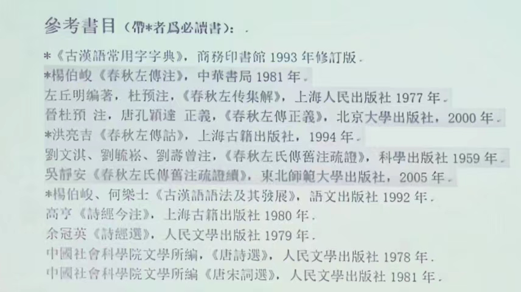
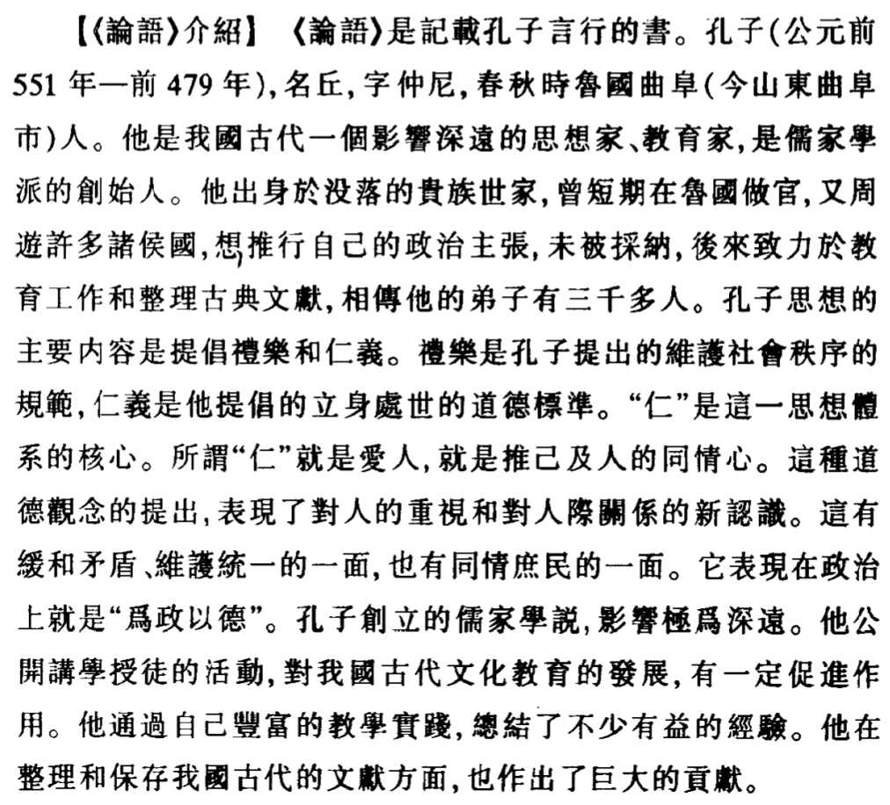

# 古代漢語（下）緒論+文選

???+ "課程內容"

    * 文選部分：散文聚焦諸子（論、孟、莊、韓+諸子各家）+韻文。
    * 《報任安書》將作為討論課呈現，時間位於期中。
    * 通論課程涉及閱讀古書的方法（藉助舊注）、古書的標點、文白翻譯的原則方法、古代漢語的修辭方法、同源詞同義詞的辨析（詞義分析舉例關注這部分！）、古今語音的異同、詩律（上）（下）。

???+ "課程要求：有所提高"

    古代漢語（上）主要是講述閱讀古文必備的背景知識，從字（古文字）、詞（詞彙訓詁─引申發展、古漢語虛詞）、句（上古漢語常見的、有特點的語法現象）入手。此外，處理文選堅持**逐字逐句落實**的閱讀原則。
    
    **古代漢語（下）要求**
    
    * 養成良好的閱讀古書的習慣。要有計劃性，一學期至少精讀一本古書。（《史記》《左傳》《戰國策》《詩經》《楚辭》、諸子百家其他著作……）
    * 學習古文中思考貫徹：「**深入**」「**系統**」「**貫通**」三詞
        1. **深入**：進一步掌握古代漢語常用詞，擴大詞匯量。注意變化異同，尤其注意微殊。語法方面，**熟讀《古漢語語法及其發展》**。
        2. **系統**：（1）擴大閱讀范圍，讀經典的古籍專書要求字詞句落實，培養閱讀古文的語感。（2)藉助古人舊注來讀古書，特別注意傳統訓詁學「隨句釋義」的問題（是否成義項）。（3）有意識地對**文字、音韻、訓詁**的**知識框架**，在古書閱讀實踐中鞏固擴大。
        3. **貫通**：語音、詞彙、語法貫通；文字、音韻、訓詁和語法貫通。這幾者密切相關！
    
    教學安排將分享到公共郵箱。

???+ "從古人的舊注來讀《左傳》"

    
    
    楊伯峻《春秋左轉注》——善作裁斷、裨益後學；但出於「讀本」性質，可能只是一家之言，未能在種種問題上加以深入討論；字詞句梳理可能也存在障礙。此時就要利用古人舊注（甚至是今人今注）。
    
    洪亮吉的本子是公認的好。劉氏家族（劉文淇、劉師培）等的本子是四世傳習《左傳》，但不完整，由吳靜安先生悉數補足。可以比較劉氏疏和吳氏的疏證序（搜集了杜預以前的舊注，（漢）鄭玄、賈逵、服虔的注釋，疏注兼證，以漢詁為宗，參以己見）、以及杜預的看法（主觀強，缺乏語言學常識，是根據自己的需要，主觀地對漢注進行取捨）。今人注推薦：郭丹、王玉武（東北師大）。

???+ note

    現代漢語研究
    : 現代漢語語言面貌的形成，與漢語史密切相關。
    : 漢語史研究最終目的是了解漢語語言係統從古到今的源流演變與形成過程。
    
    留侯論
    : 後人摹寫先秦兩漢時期的文言文，與上古漢語書面語發生了變化。
    
    注解
    : 體例、方法；字詞的源流演變，歷代各家的說法辨析，擇善而從，培養獨立思考、獨立從事學術研究的能力。
    
    如字讀、破讀
    
    : 如何認識「破讀」？
    : 如：君子好逑、食（si4）之（使動用法）。變調構詞（四聲別義、變韻母、變聲母）與語音、詞彙、語法（文字、音韻、訓詁、語法）均密切聯繫、相互關聯。

## 論貴粟疏 / 晁錯

???+ 背景資料

    關注**音變構詞**
    
    本文選自《漢書·食貨志》，是晁錯在西元前168年上給文帝的一封奏疏，題目是<u>後人據文章内容加的</u>。
    
    文章的基本內容就是闡述重農貴粟、強本抑末的主張，作為一篇上疏，中心明確，說理切直，語言不重雕飾，很通暢，反映了**漢代樸厚扎實的語言的面貌**。
    
    疏
    
    : 疏是“陳述”之意，“疏”作爲一種文體是大臣向君王陳述意見的文字。
    
    晁錯
    
    : 晁錯（前200-前154），穎川郡（今河南禹縣）人，漢初著名的政治家。因“七國之亂（吳、楚、趙、膠西、膠東、濟南、淄川王，以『清君側，誅晁錯』為口號）被誅。晁錯接受申不害、商鞅等早期法家思想，對其後來的思想演變有很大影響。晁錯曾做太子令，太子令是太子的屬官；後來任御史大夫，提出削藩的政策，惹來殺身之禍。   
    
    粟
    : 穀子，這裡泛指糧食。

聖王在上，而民不凍飢者，非能耕而食之，織而衣之也，為開其資財之道也。故堯、禹有九年之水，湯有七年之旱，而國亡~（*亡：通“無”。*）~捐瘠者~（*捐：棄。瘠：瘦。與“肥”相對，引申指土地貧瘠不肥沃。捐瘠：連用作名詞，指被遺棄的和瘦得不成樣子的人。者：指代原因。*）~，以畜積多而備先具也~（*以：介詞，表示原因。畜：蓄，古今字。積蓄，指糧食儲備。具：準備。《左傳·隱1》：“大叔完聚，繕甲兵，具卒乘，將襲鄭，夫人将啓之。”備：防措施。*）~。今海內為一，土地人民之衆不避~（*不讓，不亞於。*）~禹湯，加以亡天災數年之水旱，而畜積未及~（*趕上*）~者~（*代原因*）~，何也？地有遺利，民有餘力，生穀之土未盡墾，山澤之利未盡出也，游食之民~（*古以農為本，凡非農者皆為游食之民，主要指以商賈、技藝、游說等為業謀生的人*）~未盡歸農也。

???+ abstract annotate

    追憶歷史，與賢君比較，說明蓄積不及的原因：聖王之道在於開發資財之道，而時弊卻是不重農，從而提出務農的重要性。
    
    1. *非能耕而食之，織而衣之也*：破讀
    
        食：sì；衣：yì。都是动词，食之：供给他们吃的；衣之：供給他們穿的。
        
        這是**“破讀”**：改變一字的讀音來區分意義、別詞類，是「**音變構詞**」的重要組成部分：
        
        **音變構詞**，一字有兩音以區別兩義，讀音改變的原因可能是詞義引申、詞類活用等。
        
        既有「**變調構詞**(1)」（「四聲別義」），又有「**變聲構詞**(2)」（通過基礎詞音節中聲母的變化構造意義有聯繫的新詞。配對詞的韻母和聲調都相同，只是聲母有別），還有「**變韻構詞**(3)」（通過基礎詞音節中韻母的變化構造意義有聯繫的新詞）。
        
        還有通過改變字形構詞的。
    
        ???+ warning inline end
        
            注意：音變構詞一般在**字形是不變**的，但**也有例外**，如“道（dǎo）”音變爲“導”（dào），字形已發生變化。
    
    2. *聖王在上，而民不凍飢者*——“饑”與“飢”
           * 饑：饑荒。《爾雅》謂“穀不熟曰饑，菜不熟曰饉”。
           * 飢：肚子餓。
           * 餓：嚴重的飢，受到死亡威脅。
        “飢”“餓”二字意義有程度差別，“飢”“饑”現在都簡化爲“饥”。
    3. *為開其資財之道也*——“資” | **資**——從貝、次聲，貝是古代貨幣，故資的本義是錢財。《戰國策·秦策一》：“資用乏絕，去秦而歸。”
        引申爲積蓄。《國語·越語》：“賈人夏則資皮，冬則資絺。”「絺」是細麻布。
        引申爲依靠、憑藉。
        引申資歷、資格；條件。
        引申爲資助。
        引申爲資質、天資。
1.  變調構詞

    **冠（guàn）冠（guān），衣（yī）衣（yì）。**

2.  變聲構詞

    **臭**——①尺救切（上古昌母幽部長入），指氣味；②許救切（上古曉母幽部長入），用鼻子嗅氣味。

3.  變韻構詞

    **獲、穫**——本字是“隻”，“獲”、“穫”是後起字（其中“獲”字先，“穫”字後，因爲人類活動先游牧後農耕）。“獲”獵獲，寫作“隻”；“穫”收穫、收割，不見於甲骨金文，先秦典籍中常用。

    > 己未卜，亙貞：逐豕（shi3），隻（獲）？（合10228）
    >
    > 八月剝（pu1）棗，十月穫稻。（詩經·豳風·七月）

    《詩經》音系中，“獲”匣母鐸部合口二等，“穫”匣母鐸部合口一等，介音的細微差別。捕取獵物是“獲”，割取榖物是“穫”，義亦相近。（*“一等”“二等”是舌位的高低。*）

    “穫”是周代通過音變方式創造的新詞。
    
    郭錫良《漢語史論集》《上古漢語的構詞法》

民貧，則姦邪生。貧生於不足，不足生於不農，不農則不地著~（*在一定的地方定居。著：附著，固定*）~，不地著則離鄉輕家，民如鳥獸，雖有高城深池，嚴法重刑，猶不能禁也。夫寒之於衣，不待輕煖；飢之於食，不待甘旨；飢寒至身，不顧廉恥~（*寒不擇衣，飢不擇食。煖，字亦作“暖”。甘旨:美味。*）~。人情一日不再食則飢，終歲不製衣則寒。夫腹飢不得食，膚寒不得衣，雖慈母不能保其子，君安能以~（*連詞，連接狀語和中心語，「而」。一說介詞，表示憑藉的條件。因此，這是一個處於介詞和連詞之間的詞，尚未完全語法化。“君安能以（之）有其民哉”，“之”指百姓無衣無食的情况。國君又怎麽能在這種情況下保有自己的百姓呢？*）~有其民哉！明主知其然也，故務民於農桑，薄賦斂，廣畜積，以實倉廩，備水旱，故民可得而有也~（*得：得到；有：擁有而不失去。前者側重於得人，後者側重於得心。*）~。

???+ abstract
    
    從不務農造成的惡果（姦邪產生的原因）來進一步說明發展農業，貴粟重農的重要性。
    
    1. **姦、奸**——<u>姦：jiān，邪惡；奸：gān，干擾、干涉</u>。《左傳·襄14》：“君制其國，臣敢奸之？”後代“奸”可以通“姦”字，故“姦”可以寫作“奸”，今沿用。
    
    2. **貧、窮**：古代意義有别。反义词关系：<u>貧↔富、窮↔逹</u>
    
        * 贫：基本意義是“**寡少**”，一般指日常生活中衣食錢財的缺乏。《報任安書》：“家貧，貨賂不足以自贖。”
    
        * 窮：基本意義是“**困迫**”，一般指處境困顿惡劣，走投無路，常用來指仕途中的不得志。《孟子·盡心上》：“窮則獨善其身；逹則兼善天下。”
    
    3. **城、郭、池**
    
        * 城：城牆。《左傳·隱公元年》：“都城過百雉，國之害也。”引申爲城市、城鎮。
    
        * “城”是內城，“郭”是外城（從「邑」）。《孟子·公孫丑下》：“三里之城，七里之郭。”
    
        * 郭的區別字——郭、廓（事物的外觀輪廓）、槨（棺槨）三字同。
    
        * 池：護城河。又水池，池塘。《孟子》：“數罟不入洿池。”
        
        * 同源關係的判斷：（1）讀音上相同相近；（2）意義上有關聯；（3）有共同的語源。（王力）
    
    4. **府、庫**——《韓非子·十過》：“倉無積粟，府無儲錢，庫無甲兵。”
    
        * 府：藏文書、財物、絹帛的地方。
    
        * 庫：存放兵甲戰車的地方。
    
        後來府庫變成同義詞，泛指藏財物之地。

民者，在上所以牧~（*養→統治。牧，從牛從攴，攴是手拿pu3，會意字*）~之，趨利如水走~（*舊讀zou4，奔向、趨向*）~下，四方亡擇也。夫珠玉金銀，飢不可食，寒不可衣，然而衆貴~（*介詞，表原因*）~之者，以上用之故也。其為物輕微易臧，在於把握，可以周~（*走遍。師古曰：“周謂周遍而行。”*）~海內而亡飢寒之患。此令臣輕背其主，而民易去其鄉，盜賊有所勸~（*鼓勵，這裏有誘惑之義*）~，亡逃者得輕資也。粟米布~（*麻布*）~帛生於地，長於時，聚於力，非可一日成也；數石~（*古讀shí，今讀dàn。古代量器，一石十斗，重一百二十斤*）~之重，中人~（*平常人*）~弗勝，不為姦邪所利，一日弗得而飢寒至。是故明君貴五穀而賤金玉。

???+ abstract

    以珠玉、金銀、粟米、布帛與對國家的利害關係進行對比，進一步論證貴五穀的重要性。
    
    **盜、竊、偷、賊、寇**
    
    盜
    
    : 本義是偷竊財货。《左傳·晉公子重耳出亡》：“竊人之財謂之盗。”引申指偷東西的人、小偷。由偷竊還引申有搶劫、掠奪。《後漢書·班超傳》：“往者匈奴獨擅西域，寇盗河西。”又引申爲搶劫的人，強盜。
    
    竊
    
    : 偷竊，引申偷偷地、私下做某事，再引申表謙副詞。
    
    偷
    
    : 先秦漢語中一般不作小偷、偷竊意義，主要表示苟且，生活態度不嚴。《楚辭·卜居》：“與波上下，偷以全吾軀乎？”後引申指有偷竊行爲的人。
    
    賊
    
    : 《荀子·修身》：“傷良曰讒，害良曰賊。……竊货曰盗，……”賊一般指傷害、殘害，作名詞指搶劫者，行兇作惡的人，引申法亂紀，犯上作亂的佞臣也曰賊。
    
    寇
    
    : 一個意義是特指入室搶劫，泛指盗寇，如《王子坊》：“何爲棄墳井，在山谷爲寇者也？”
    
    : 另一意義“外來入侵者”。《漢書·張騫傳》：“既臣大夏而君之，地肥，少寇，志安樂，又自以遠遠漢，殊無報胡之心。”《左傳·文7》：“兵作於内爲亂，於外爲寇。”

今農夫五口之家，其服役者不下二人，其能耕者不過百畮~（*“畝”的古字*）~，百畮之收不過百石。春耕夏耘~（*除草*）~，秋穫冬臧，伐薪樵，治官府，給繇役；春不得避風塵，夏不得避暑熱，秋不得避陰雨，冬不得避寒凍，四時之間亡日休息；又私自送往~（*離去的客人*）~迎來~（*來的客人*）~，弔~（*本義慰問。《左傳·莊11》：“秋，宋大水。公使吊焉。”引申指悼念憑吊死者*）~死問疾，養孤長~（*抚养*）~幼在其中。勤苦如此，尚復被~（*遭受*）~水旱之災，急政~（*通“征”。征税。*）~暴賦，賦斂~（*賦本指徵收田賦，斂本指徵集税款。二字同義連用，泛指徵收各種賦*）~不時~（*沒有一定的時候*）~，朝令而暮改。當其有者半賈~（*該義後來寫作“價”*）~而賣，亡者取倍稱~（*向人借貸，任人收取加倍的利息。倍：加一倍，成倍，利息是本錢的一倍。稱：相等，相當，利息與本錢相等。*）~之息，於是有賣田宅鬻子孫以償責~（*zhai4，債錢。這個意義後來寫作“債”。*）~者矣。而商賈~（*師古曰：“行曰商，坐販曰賈。”*）~大者積貯倍息~（*囤積貨物，獲取加倍的利息*）~，小者坐列販賣~（*擺攤設市，販賣貨物*）~，操其奇贏~（*奇：餘物。奇赢：富餘的物資*）~，日游都市~（*以瞭解市場行情*）~，乘上之急，所賣必倍。故其男不耕耘，女不蠶織，衣~（*yi4*）~必文采~（*後來寫作“紋”。本義指在人體上刺繡花紋，即文身，引申指花紋，紋理。《山海經·北山經》：“有獸焉，其状如豹，而文題白身。”這個意義造了新字“紋”。由花紋引申爲字（獨體字），《說文·敘》：“蓋依類象形，故謂之文。”又引申有文章、文獻、典籍等意義。*）~，食必粱~（*上等米*）~肉；亡農夫之苦，有仟伯~（*顏師古認為是千百，一說阡陌。阡陌來源於井田製，南北為阡東西為陌*）~之得。因其富厚，交通王侯，力過吏勢，以利相傾~（*傾軋*）~；千里游敖~（*通“邀”*）~，冠蓋相望，乘堅策肥，履絲~（*窮人衣褐*）~曳~（*拖著*）~縞。此商人所以兼幷農人，農人所以流亡者也。今法律賤商人，商人已富貴矣；尊農夫，農夫已貧賤矣。故俗之所貴，王之所賤也；吏之所卑，法之所尊也。上下相反，好惡乖迕，而欲國富法立，不可得也。

???+ abstract

    將農民之辛苦，生活之艱辛與商人富足奢侈生活相對比，指出當時社會中存在著這個嚴重的社會問題，因此提出要抑商重農。

方今之務，莫若使民務農而已矣。欲民務農，在於貴粟；貴粟之道，在於使民以粟為賞罰。今募~（*招募*）~天下入~（*交納*）~粟縣官~（*本義天子、皇帝，此處指朝廷、官府。「縣」最初設在遠離國都的遠郊，如同「懸」於國境之外，故「縣」後來有行政單位之義。*）~，得以拜爵，得以除罪。如此，富人有爵，農民有錢，粟有所渫~（*疏散，流通*）~。夫能入粟以受爵，皆有餘者也；取於~（*引出動作行為的對象*）~有餘，以~（*介詞向連詞*）~供上用，則貧民之賦可損，所謂損有餘補不足，令出而~（*連接謂詞性的成分，此處主謂+主謂*）~民利者也。順於民心，所補者三：一曰主用足，二曰民賦少，三曰勸農功~（*事*）~。今令民有車騎馬~（*拉戰車的馬*）~一匹者，復~（*免除徭役赋税*）~卒三人。車騎者，天下武備也，故為復卒。神農之敎曰：「有石城十仞，湯池~（*貯沸水的護城河等*）~百步，帶甲百萬，而亡粟，弗能守也。」以是觀之，粟者，王者大用，政之本務。令民入粟受爵至五大夫以上，迺~（通「乃」）~復一人耳，此其與騎馬之功相去遠矣。爵者，上之所擅，出於口而亡窮；粟者，民之所種，生於地而不乏。夫得高爵與免罪，人之所甚欲也。使天下人入粟於邊，以受爵免罪，不過三歲，塞下之粟必多矣。

> [!abstract]+ 
>
> 貴粟重農的具體措施，是這篇文章的閃光點。
>
> **縣**——「坎坎伐檀兮、寘之河之干兮、河水清且漣猗。不稼不穡、胡取禾三百廛兮。不狩不獵、胡瞻爾庭有縣貆兮。彼君子兮、不素餐兮。」（《詩經·伐檀》）
>
> >  砍伐檀树声坎坎啊，棵棵放倒堆河边啊，河水清清微波转哟。不播种来不收割，为何三百捆禾往家搬啊？不冬狩来不夜猎，为何见你庭院猪獾悬啊？那些老爷君子啊，不会白吃闲饭啊！
>
> **復卒**——師古曰：「當為卒者，免其三人；不為卒者，免其錢耳。」西漢男子每年要在本郡、本縣服徭役一個月，是為**更卒**；輪流到京師服役，是為**正卒**；到邊疆服役，是為**戍卒**。

## 補充：論積貯疏 / 賈誼

管子曰：“倉廩實而知禮節。”民不足而可治者，自古及今，未之嘗聞。古之人曰：“一夫不耕，或受之饑；一女不織，或受之寒。” 生之有時，而用之亡度，則物力必屈。古之治天下，至孅至悉也，，故其畜積足恃。今背本而趨末，食者甚眾，是天下之大殘也；淫侈之俗，日日以長，是天下之大賊也。殘賊公行，莫之或止；大命將泛，莫之振救。生之者甚少，而靡之者甚多，天下財產何得不蹶！

漢之為漢，幾四十年矣，公私之積，猶可哀痛！失時不雨，民且狼顧；歲惡不入，請賣爵子，既聞耳矣。安有為天下阽危者若是而上不驚者？世之有饑穰，天之行也，禹、湯被之矣。即不幸有方二三千里之旱，國胡以相恤？卒然邊境有急，數千百萬之眾，國胡以饋之？兵旱相乘，天下大屈，有勇力者聚徒而衡擊；罷夫羸老易子而咬其骨。政治未畢通也，遠方之能疑者，并舉而爭起矣。乃駭而圖之，豈將有及乎？

夫積貯者，天下之大命也。茍粟多而財有余，何為而不成？以攻則取，以守則固，以戰則勝。懷敵附遠，何招而不至！今毆民而歸之農，皆著于本；使天下各食其力，末技游食之民，轉而緣南畝，則畜積足而人樂其所矣。可以為富安天下，而直為此廩廩也，竊為陛下惜之。

## 殽之戰 / 《左傳》

冬，晉文公卒。庚辰，將殯于曲沃，出絳柩，有聲如牛，卜偃使大夫拜曰，君命大事，將有西師過軼我，擊之必大捷焉，杞子自鄭使告于秦曰，鄭人使我掌其北門之管，若潛師以來，國可得也，穆公訪諸蹇叔。蹇叔曰，勞師以襲遠，非所聞也。師勞力竭，遠主備之，無乃不可乎，師之所為，鄭必知之，勤而無所，必有悖心，且行千里，其誰不知，公辭焉，召孟明，西乞，白乙，使出師於東門之外，蹇叔哭之曰，孟子，吾見師之出，而不見其入也，公使謂之曰，爾何知，中壽，爾墓之木拱矣。蹇叔之子與師。哭而送之曰，晉人禦師必於殽，殽有二陵焉，其南陵，夏后皋之墓也，其北陵，文王之所辟風雨也，必死是間，余收爾骨焉，秦師遂東。

## 留侯論 / 蘇軾

> [!note]+ 背景資料
>
> 蘇載的文章寫得縱横奔放，詩飘逸不群，詞開豪放一派，書畫亦有很高成就，具有多方面藝術才能，是中國古代少有的全才大作家。有詩二千七百多首，一部分揭露社會現實，反映人民疾苦，更多的是抒發個人感慨，描繪山川風物，想像豐富，比喻新穎，富有浪漫主義特色。他創作了三百五十多首詞，擴大了題材和内容，在體制、表現方法和語言運用上都有創新，是豪放派的創立者。他的散文各體兼備，有政論、史論、遊記、碑傳、書刎、題跋和筆記等，其中敘事紀遊的作品成就最高，格局變化多端，文筆酣暢，氣勢充沛，形成了“行雲流水”的獨特風格，在唐宋八大家中向來是韓、柳、歐、蘇並列。他是歐陽修之後的北宋文壇領袖，他的豐富多彩的創作實践和巨大成就對後世産生了深遠影響。有《東坡七集》、《蘇軾詩集》、《蘇献文集》、《東坡樂府》等傳世。宋史有傳。
>
> 蘇門四學士，是**黃庭堅、秦觀、晁補之、張耒**。蘇東坡文集。
>
> 留侯張良，漢韓人，字子房，家五世相韓，秦滅韓，張良接納刺客，在博浪沙刺殺秦始皇，沒有成功，逃隱到下邳。秦末，陳勝吳廣起義，劉邦乘機起兵，張良作爲劉邦的謀士，輔佐漢（劉邦）滅了秦楚（張楚，陳勝政權），因功被封爲“留侯”。《史記·留侯世家》及《漢書》中有他的傳記。
>
> 這篇文章是蘇軾應製科考試所作的文章。蘇軾從「忍」的角度來談論這個故事。整篇文章都是圍繞這個中心來進行論述的。不過，從歷史角度看，把劉邦、項羽之爭的成敗僅僅歸結爲一個“忍”字（劉邦能忍，故成功；項羽不能忍，所以失敗），也有失偏頗。

古之所謂豪傑之士者，必有過人之節~（*節操，品德。*）~。人情有所不能忍者，匹~（*單獨*）~夫見辱，拔劍而起，挺身而鬭，<u>此不足為勇也</u>。天下有大勇者，卒然臨之~（*降臨，侮辱加到他頭上，「之」指大勇者。一說臨，面臨，遇到，「之」指意外的事*）~而不驚，無故加之而不怒。此其所挾持者甚大，而其志甚遠也。

> [!abstract]+
>
> 1. 「節」的引申發展關係——輻射性引申複習——見手機相冊
> 2. 鬥、鬭區別：鬥是本字，乃兩手相交之形；鬭是形聲字，從鬥，斲（斫）聲。

夫子房之受書於圯~（*《說文》：東楚謂橋為「圯」*）~上之老人~（*圯上黃石公*）~也~（*這個小句是<u>話題主語</u>*）~，其事甚怪；然亦安知其非秦之世/有隱君子者出而試之？觀其所以微見其意者，皆聖賢相與警戒之義；而世不察，以為鬼物，亦以~（*通「已」*）~過矣。且其意不在書。

當韓之亡~（*認為此句是介賓結構作狀語*）~，秦之方盛也，以刀鋸鼎鑊~（*「鼎鑊」，都是古代用來盛食物的鍋；「鼎」後作祭祀用*）~待天下之士。其平居無罪夷滅者，不可勝數。雖有賁、育，無所獲施。夫持法太急者，其鋒不可犯，而其勢未可乘。子房不忍忿忿之心，以匹夫之力而逞~（*快心趁意*）~於一擊之間；當此之時，子房之不死者，其間不能容發，蓋亦已危矣。

> [!abstract]+
>
> 1. 閒、間、閑、间、闲——字際關係，見手機相冊

千金之子，不死於盜賊，何者？其身~（*生命*）~之可愛~（*值得愛惜*）~，而盜賊之不足以死~（*爲動？*）~也。子房以蓋世之才，不為伊尹、太公之謀，而特~（*只*）~出於荊軻、聶政之計，以~（*順連連詞*）~僥倖於~（*「於」多了*）~不死，此圯上老人所為深惜者也。是故倨傲鮮腆~（*少善，言語粗惡*）~而深折~（*使之受折？使動？*）~之。<u>彼其能有所忍也，然後可以就大事</u>，故曰：“孺子可教也。”

楚莊王伐鄭，鄭伯~（*鄭襄公，伯爵*）~肉袒牽羊以迎~（*古人服罪的方式*）~；莊王曰：“其主能下人，必能信~（*取信*）~用~（*用命，效命*）~其民矣。”遂舍之。勾踐之困於會稽，而歸臣妾~（*歸於吳，臣妾於吳，充當奴僕，是「共用」的表達方式*）~於吳者，三年而不倦。且夫有報~（*報仇*）~人之志，而不能下人者，是匹夫之剛也。夫老人者，以為子房才有餘，而憂其度量之不足，故深折其少年剛銳之氣，使之忍小忿而就大謀。何則？非有生平之素，卒然相遇於草野之間，而命以仆妾之役，~（*張良*）~油然而不怪者，此固秦皇之所不能驚，而項籍之所不能怒也。

> [!abstract]+
>
> 韓信：暗度陳倉、背水之戰、垓下之圍，漢大半江山，但功名利祿之心太重，最後被降為淮陰侯，死在呂后的手裡。垓下之圍時，韓信以封齊王要挾拯救劉邦，劉邦
>
> 韓信、蕭何、張良並成為漢興三傑。

觀夫高祖之所以勝，而項籍之所以敗者，在能忍與不能忍之間而已矣。項籍唯不能忍，是以百戰百勝而輕用其鋒；高祖忍之，養其全鋒而待其敝~（*衰落*）~，此子房教之也。當淮陰破齊而欲自王，高祖發怒，見於詞色。由此觀之，猶有剛強不忍之氣，非子房其~（*加強反詰語氣*）~誰全~（*使動*）~之？

太史公疑~（*想象*）~子房以為魁梧奇偉，而其狀貌乃如婦人女子，不稱其志氣。嗚呼！此其~（*表推測語氣*）~所以為子房歟！

> [!abstract]+
>
> 「主之謂」結構總結
>
> 郭在教材中看做是轉化為名詞性的定之中偏正結構。
>
> 注意：
>
> 1. 「此天之亡我」中，「主之謂」是名詞性結構作謂語。
> 2. 「此固秦皇之所不能驚，而項籍之所不能怒也」是名詞性結構作謂語，但不是「主之謂」結構，而是「定之中」結構。
> 3. 此外，「主之謂」還可以作句中的小句，有時是謂詞性結構。

## 子路、曾晳、冉有、公西華侍坐 / 《論語》

> [!note]+ 背景資料
>
> 孔子
>
> : 孔子贡献：删诗书定礼乐赞周易修春秋
>
> : 如何看待孔子思想的核心「仁」（子瑜老师观点）？一方面，是差序之爱，强调「克己复礼」以宗法等级为基本标准，君君臣臣父父子子；另一方面，又提倡「泛爱」，作为君子要「推己及人」，是原始的人道主义和泛爱论的思想。
>
> : 「敏于事而慎于言」重视实践，小心说话；「刚毅木讷近仁」刚强果决淳朴寡言。
>
> > [!note|inline end]+
> >
> > 
>
> 論語
>
> : **共 20 篇，從每章的首句中取出兩個字，作為全篇的篇名**。
>
> : 最後成書約在戰國初年。有<u>魯論、齊論、古論</u>三種本子，前二者為今文經，後為古文經。**今古文之分**——老師口耳相傳、用隸書記載的經為<u>今文經</u>；漢代以前所用的篆文為<u>古文經</u>。
>
> : **章**，是根據文章的內容劃分的自成章節的段落。《侍坐章》是比較長的章，比較短的如「子曰：『君子不器。』（君子不能像器皿一樣，只有一定的用途，要博學貫通。）」
>
> : **論語注本推薦**：古人何晏《論語集解》，劉寶楠《論語正義》；今人錢穆《論語新解》，楊伯峻《論語譯註》
>
> 讀經
>
> : 經之至者，道也。所以明道者其詞（辭），所以成詞者字也，由字以通其詞，由詞以通其道，必有漸。（[清]戴震所述讀經的方法）
>
> : 通經求道：體悟諸子大道，體悟主觀感悟。
>
> : 崔述《洙泗考信錄》，洙泗為春秋路過的泗水和其支流洙水的合稱。
>
> 子路、曾晳、冉有、公西華
>
> : **子路**：姓仲名由，字子路，一字季路。司馬遷評曰：“子路性鄙，好勇力，志伉直。”曾為孔悝之邑宰。
>
> : **曾點**，字皙。曾參（shēn）之父。
>
> : **冉求**，字子有。
>
> : **公西赤**，字子華。
>
> : 稱人字先名後，如「孔仲尼丘」。
>
> 坐、跪、跽
>
> : 坐，席地而坐，最放鬆；跪，上身挺直；跽，又稱長跪，不僅上身挺直，屁股還必須脫離腳後跟，是警戒或者行大禮的姿勢。
>
> 注意古人釋的是詞義，還是句意，還是言外之意。

子路、曾皙、冉有、公西華侍~（*本指侍立於尊者之旁*）~坐。

子曰：「以吾一日長乎~（*介詞，表比較*）~爾，毋吾以也。居則曰：『不吾知也！』如或知爾，則何以哉？」子路率爾~（*形容詞詞尾，相當於「然」*）~而對~（下對上）~曰：「千乘之國，攝~（*夾*）~乎大國之間，加之以師旅~（*「以N/NP」述補結構比述賓結構更常見*）~，因~（*本義人居於墊上，是席墊的意思，這裡是繼，連續*）~之以饑饉~（見前）~；由也為之，比及三年，可使有勇，且知方~（*「義方」，儒家所謂忠孝慈愛之做人正道*）~也。」夫子哂~（*顧野王《玉篇》：“哂，笑也。”玄應《一切經音義》：“哂，小笑。”*）~之。「求！爾何如？」對曰：「方六七十，如五六十，求也為之，比及三年，可使足民。如其禮樂，以~（*已經虛化為連接詞*）~俟君子。」「赤！爾何如？」對曰：「非曰能之，願學焉。宗廟之事，如會~（未按規定時間朝見）~同~（與眾諸侯一起朝見）~，端章甫~（玄端，禮服，緇布衣（黑麻布）；章甫，黑色禮帽）~，願為小相焉。」「點！爾何如？」鼓瑟希，鏗爾~（*投琴的聲音。《玉篇》引作「銵」*）~，舍瑟而作~（*站立。整句說明曾點作為年長者卻最後一個回答的原因*）~。對曰：「異乎三子者之撰~（*具也，才具，才幹。一說當作「僎」，善也；又說當作「巽」，「饌」的本字，本義為準備酒食，引申為具備，再引申為才具*）~。」子曰：「何傷乎？亦各言其志也。」曰：「莫春者，春服既成。冠者五六人，童子六七人，浴乎沂，風乎舞雩，詠而歸。」夫子喟然歎曰：「吾與~（*讚同*）~點也！」

> [!abstract]+ 述志
>
> 1. *以吾一日長乎爾，毋吾以也*——「以」的詞類
>
>        - 「以吾一日」的「以」做介词，表原因
>         
>        - 「毋吾以也」的「以」▲說法一：**因為**我（受拘束而不敢回答問題）（孔安國）。▲說法二：「以」是動詞，任用的意思，「毋吾以也」意爲「不任用我」。**原則：近引申能解決的，不採納遠引申。說法二是近引申，更直接。**
>
> 2. *…可使足民。如其禮樂，以俟君子。*
>
>        - “可足民”已經有使動義，爲什麽要加上使役動詞“使”，用“可使足民”？可以加强使役義，同時湊成四字句（補足音節）。
>        - 古人的君子兼指有位者齊有德者，後代則偏重有德者。
>
> 3. 「*莫春者，春服既成。冠者五六人，童子六七人，浴乎沂，風乎舞雩，詠而歸*」
>
>        * 瑟：絃樂器。瑟身是長方形木質音箱，一般有二十五絃。
>    
>        * 夏曆（農曆、陰曆）、殷曆，周曆（見手機）
>        
>          ---
>        
>        * 舊注大致說法有二。說法一：大同社會的景觀。說法法二：無爲而治。老師認爲這兩種說法皆不可從。
>        
>        * 子瑜老師認爲**曾點在此是設想自己爲魯國主持雩禮**。所謂“國之大事在祀與戎”。這是說自己爲國以禮的政治主張，有目的的社會政治活動，表明自己的政治懷抱和理想。但是說得委婉，所以能得到老師的讚賞。（卽使考慮古今氣候差異、曆法不同，三月也不適於“浴乎沂”。）但在當時周室衰落、禮崩樂壞，這樣的政治理想已經不可能實現，故孔子“喟然嘆”。
>        
>        * 魏何晏注：包曰：莫春者，季春三月也。春服既成，衣單袷之時。我欲得冠者五六人，童子六七人，浴乎沂水之上，風涼於舞雩之下，歌詠先王之道，而歸夫子之門。
>        
>        * 邦有道則仕，邦無道則卷而懷之。
>
> 4. 冠（guàn）者：古代貴族男性青年，有二十歲行冠禮的制度。所謂“冠者”，即指二十歲以上的成年人。童子：尚未成年的孩子，十九歲以下的小青年。
>
>        * 冠禮：三個儀式——（2）皮弁（bian4）鹿皮帽，參加軍隊；（3）爵弁，有權參加祭祀。
>        * 冠（guàn）者：古代貴族男性青年，有二十歲行冠禮的制度。所謂“冠者”，即指二十歲以上的成年人。童子：尚未成年的孩子，十九歲以下的小青年。

三子者出，曾皙後。曾皙曰：「夫三子者之言何如？」子曰：「亦各言其志也已矣。」曰：「夫子何哂由也？」曰：「為國以禮，其言不讓~（*本義責讓，假借為「攘」，有「謙讓」之義*）~，是故哂之。」「唯~（*句首語氣詞*）~求則非邦也與？」「安見方六七十如五六十而非邦也者？」「唯赤則非邦也與？」「宗廟會同，非諸侯而何？赤也為~（擔任）~之~（諸侯）~小~（小相）~，孰能為之大？」

> [!abstract]+ 評志
>
> 一說，曾皙問“夫子何哂由也”，後面都是孔子自問自答。
>
> 爲之小，爲之大
>
> : 都是雙賓語。爲：治理。之：指諸侯國。 小、大：指小相、大相。赤只能給諸侯擔任小相，誰能給諸侯擔任大相呢？

## 季氏將伐顓臾

==**近期規劃！！！！**==、國家詞義演變。

> [!quote]+ 時代背景
>
> 孔子曰：「天下有道，則禮樂征伐自天子出~（*西周時期*）~；天下無道，則禮樂征伐自諸侯出~（*春秋五霸時期*）~。自諸侯出，蓋十世希不失矣；自大夫出~（*季氏執魯國命時期*）~，五世希不失矣；陪臣執國命~（*陽貨專權時期*）~，三世希不失矣。天下有道，則政不在大夫。天下有道，則庶人不議。」（《論語·季氏十六》）
>
> 三月，公會晉侯、宋公、衛侯、鄭伯、曹伯、莒子、邾婁子、薛伯、杞伯、小邾婁子于湨梁；戊寅，大夫盟。諸侯皆在是，其言大夫盟何？信在大夫也。何言乎信在大夫？遍剌天下之大夫也。曷為遍剌天下之大夫？君若贅旒~（*旌旗的飄帶*）~然。（《春秋·襄16》）

> [!info]+
>
> 季氏
>
> : 這裡指的是季康子。季本是魯公子友的字，他的後代以「季」為氏。
>
> : 三桓，是春秋鲁国卿大夫孟氏（亦称仲氏）、叔孙氏、季氏三家的合称。因为三家出自鲁桓公，故史称“三桓”。
>
> : 臣子的臣子為陪臣。陪臣執國命，陽貨（虎），大夫的家臣
>
> 顓臾
>
> : 是魯國的國中之國。孔子借此事，抒發以仁義禮教治天下的政治理想。
>
> 姓
>
> : 《說文》：“姓，人所生也。从女、生，生亦聲。”從女，可見是母系氏族社會的產物（都跟「女」字有關係，如「媯」（gui1，齊人姓），「姒」（yue4），「姬」，「嬴」），類似族號。姓用来别**血緣、婚姻、世系、種族部落**，故<u>同姓不婚</u>。
>
> 氏
>
> : 原有的**大部落**不斷分化，<u>新分化的（子）部落</u>就用“氏”來區别，这發生在父系氏族社會。**可以說“氏”是“姓”的分支**。
>
> : 氏來源多樣，如來自<u>**官職、出生居住地、方位、祖先族號**</u>等。
>
> 姓、氏、名的區别
>
> : “姓”“氏”是公共的，“名”是個人的。
>
> : 姓不變，氏可變。
>
> : “姓”别婚姻。戰國以後出現「氏」，貴族以“氏”别貴賤。姓以別族考，氏以別子孙。賤者有名無氏。賤者一般可稱職業，如「庖丁解牛」。
>
> : 漢以後姓氏逐漸混同。

季氏將伐顓臾。冉有、季路見~（*xian4/jian4？不及物動詞，拜見*）~於孔子曰：「季氏將有事於顓臾。」孔子曰：「求！無乃~（*無乃……與，凝固結構，表推測，恐怕*）~爾是過~（*賓語前置，「過爾」*）~與？夫顓臾，昔者先王以為東蒙主~（*主，主管祭祀的人*）~，且在邦域之中矣，是社稷之臣也。何以伐為？」冉有曰：「夫子~（*季氏*）~欲之，吾二臣者皆不欲也。」孔子曰：「求！周任有言曰：『陳~（*陳列，施展*）~力就~（*走向，這裡是擔任*）~列~（*職位*）~，不能者止。』危而不持，顛~（*跌倒*）~而不扶，則將焉用彼相矣？且爾言過~（*錯*）~矣。虎兕~（*兕（sì），獨角犀牛*）~出於柙~（*關猛獸的木籠子*）~，龜玉毀於櫝~（*匣子*）~中~（*管理野獸的人叫囿人，管理珠玉的人叫玉人/典瑞*）~，是誰之過與？」

冉有曰：「今夫顓臾，固而近於費~（*自己的采邑*）~。今不取，後世必為子孫憂。」孔子曰：「求！君子疾~（*討厭*）~夫~（*那種態度*）~舍曰欲之，而必為之辭。丘也聞有國有家~（諸侯/請卿大夫的采邑）~者，不患寡而患不均，不患貧而患不安~（*這兩句文字互誤*）~。蓋均無貧，和無寡，安無傾。夫如是，故遠人不服，則修文德以來~（*舊讀）~之。既來之，則安之。今由與求也，相夫子，遠人不服而不能來也；邦分崩離析而不能守也。而謀動干戈於邦內。吾恐季孫之憂，不在顓臾，而在蕭牆之內也。」

> [!abstract]+ 不患寡而患不均，不患貧而患不安
>
> > 俞樾《古書疑義舉例》卷六：“按：寡、貧二字，傳寫互易，此本作‘不患貧而患不均，不患寡而患不安’。‘貧’以財言，‘不均’亦以財言？不均則不如無財矣，故‘不患貧而患不均’也。‘寡’以人言，‘不安’亦以人言？不安則不如無人矣，故‘不患寡而患不安’也。《春秋繁露·度制篇》引孔子曰：不患貧而患不均，可據以訂正。”

## 子路從而後

子路從而後，遇丈人，以杖荷~（*《詩經》時代無草字頭的，是負荷的本字；荷只有荷花的意思，同時存在。後來荷也可以表示負荷義，何假借作疑問代詞。何，儋也。*）~蓧（莜）。子路問曰：「子見夫子乎？」丈人曰：「四體不勤，五穀不分。孰為夫子？」植其杖而芸。子路拱~（*拱手*）~而立。止子路宿，殺雞為黍而食之，見~（*讓二子拜見子路*）~其二子焉~（*兼詞，在這個時候*）~。

明日，子路行以告。子曰：「隱者也。」使子路反見之。至則~（*已经，「则在舟中矣」「穆公访诸蹇叔」篇*）~行矣。子路曰：「不仕無義。長幼之節，不可廢也；君臣之義，如之何其廢之？欲潔其身，而亂大倫。君子之仕也，行其義也。道之不行，已知之矣。」

（入世思想。入世思想才能不亂大倫。）

> [!note]+ 「荷蓧（he4diao4）長者」疑點
>
> （1）“杖”既是“拐杖”，丈人為何不扶持卻用以荷蓧？（2）蓧是一種甚麽樣的除草器，可以用杖荷呢？
>
> （一）**一種專用於稻田除草的工具說**：有人說，除草還要拄着根杖，顯然是在水裏田裹。又有人指出，“今南昌人耘田用一具，形如提梁，旁加索，納於足下，手持一杖，以足踏草入泥中，名曰‘脚歰’”作為證明。
>
> 此一說也只可供參考。那个時代種稻，並不全與後世相同，這一點也不容忽視。看來这一問題還有待研究。
>
> > 《玉篇》：蓧，草器名。
> >
> > 《史記·孔子世家》裴駰集解引包咸曰：蓧，草器名也。
> >
> > 《漢書·蕭望之傳》：“畜雞種黍。”顏師古注：蓧，草器也。
> >
> > 《十三經注疏·論語注疏》：“遇丈人，以杖荷蓧。”魏何晏注：“包曰：丈人，老人也。蓧，竹器。”宋邢昺疏：“逢老人以杖擔荷竹器。”
> >
> > ［宋］朱熹《論語集注》：莜，徒吊反。植，音值。丈人，亦隱者。莜，竹器。
> >
> > ——黃金貴《古代文化詞語考論》
>
> （二）**盛器說**：無論文獻記載和出土文物，從未見有竹制的耘鋤。毫無疑問，《說文》原本應是“草田器也”。此“器”者，盛器之謂。所謂“草田器”，乃指草編的用於田事的容器，**即農者到田裏隨帶的草筐**，與耘田無涉。
>
> 再從《說文》所列有關的字看。同部“蕢，草器也"謂盛土的草編容器。二者文例相同，實也是同類物，惟蕢多用於盛土，而蓧多用於田事。徐光啟《農政全書》卷二十四《田器》就將蓧、蕢二物列在一起。
>
> 《說文·匚部》又有“匱”字，釋為“田器也”“匚”是“受物之器”，“匱”當然也是一種盛器。” 凡此都可證明《說文》“蓧” 字說解必當為“草田器”， 此必是盛器而不是鋤器。
>
> 段注：舊作艸田器，今依《韻會》、《論語》疏作“芸田器”。《毛傳》曰：“芸，除艸也。孔安國曰：“除艸日芸。”故其字從艸。見《微子》篇，謂子路見丈人，手用杖莜加於肩，行來至田，則置杖於地，用莜芸田。植杖者，置杖也。

> [!abstract]+ 「侖」
>
> **侖**：「[侖](https://humanum.arts.cuhk.edu.hk//Lexis/lexi-mf/search.php?word=侖)」字的構形可以有兩種解釋。首先可把侖視為從「[𠓛](https://humanum.arts.cuhk.edu.hk//Lexis/lexi-mf/search.php?word=𠓛)」(三合)從「[冊](https://humanum.arts.cuhk.edu.hk//Lexis/lexi-mf/search.php?word=冊)」。即解作「集合及整理卷冊」的意思。另一種解釋是把 「[侖](https://humanum.arts.cuhk.edu.hk//Lexis/lexi-mf/search.php?word=侖)」視作從「[亼](https://humanum.arts.cuhk.edu.hk//Lexis/lexi-mf/search.php?word=亼)」(倒口)從「[冊](https://humanum.arts.cuhk.edu.hk//Lexis/lexi-mf/search.php?word=冊)」。《說文》的解釋是：「侖，思也。從亼從冊。」此中，「[亼](https://humanum.arts.cuhk.edu.hk//Lexis/lexi-mf/search.php?word=亼)」可解向下張口，而「[冊](https://humanum.arts.cuhk.edu.hk//Lexis/lexi-mf/search.php?word=冊)」則解以繩索編列得整齊有序的竹簡，這兩個部件合起來，似意會一套條理井然的說話或思想， 一如人之能「出口成冊」。由於「[侖](https://humanum.arts.cuhk.edu.hk//Lexis/lexi-mf/search.php?word=侖)」本已由口(亼)所出，因此可視為「[論](https://humanum.arts.cuhk.edu.hk//Lexis/lexi-mf/search.php?word=論)」的初文。章太炎《國故論衡‧文學總略》即直稱：「論者， 古但作侖」。
>
> 就古文字的字形看，上面所引的兩個甲骨文和青銅器「七年侖氏戈」中的侖字看似從𠓛(三合)，而青銅器中「中山王鼎」的該字則看似從亼(倒口)。 而且該器的銘文「侖(論)其德，省其行」中的「[侖](https://humanum.arts.cuhk.edu.hk//Lexis/lexi-mf/search.php?word=侖)」用為「[論](https://humanum.arts.cuhk.edu.hk//Lexis/lexi-mf/search.php?word=論)」，故對後一種說法也有一定支持。 
>
> 更重要的是，無論採上面那一個解釋，「[侖](https://humanum.arts.cuhk.edu.hk//Lexis/lexi-mf/search.php?word=侖)」字都具有條理井然這一個基本意涵，後來根據轉注原則（有關理論詳見「[考](https://humanum.arts.cuhk.edu.hk//Lexis/lexi-mf/search.php?word=考)」字條）乃衍生了一整系列帶有「條理」意味的同源字。如注之以「[言](https://humanum.arts.cuhk.edu.hk//Lexis/lexi-mf/search.php?word=言)」而成「[論](https://humanum.arts.cuhk.edu.hk//Lexis/lexi-mf/search.php?word=論)」 （語之有條不紊者）； 注之以「[人](https://humanum.arts.cuhk.edu.hk//Lexis/lexi-mf/search.php?word=人)」而成「[倫](https://humanum.arts.cuhk.edu.hk//Lexis/lexi-mf/search.php?word=倫)」（人事之有條理者）；注之以「[木](https://humanum.arts.cuhk.edu.hk//Lexis/lexi-mf/search.php?word=木)」而成「[棆](https://humanum.arts.cuhk.edu.hk//Lexis/lexi-mf/search.php?word=棆)」（木之理順無疵者）；注之以「[水](https://humanum.arts.cuhk.edu.hk//Lexis/lexi-mf/search.php?word=水)」而成「[淪](https://humanum.arts.cuhk.edu.hk//Lexis/lexi-mf/search.php?word=淪)」（水之成紋有理者）；注之以「[手](https://humanum.arts.cuhk.edu.hk//Lexis/lexi-mf/search.php?word=手)」而「[掄](https://humanum.arts.cuhk.edu.hk//Lexis/lexi-mf/search.php?word=掄)」（擇之條貫有序者）；注之以「[車](https://humanum.arts.cuhk.edu.hk//Lexis/lexi-mf/search.php?word=車)」而得「[輪](https://humanum.arts.cuhk.edu.hk//Lexis/lexi-mf/search.php?word=輪)」（車之有輻而見紋理者）等（胡樸安、關子尹）。
>
> **大倫**：指君臣之間的倫常關係。
>
> **天倫**：指亲緣關係，這是人天生就有的，故謂“天倫”。
>
> 王毓瑚《略論中國古來農具的演變》，《王毓瑚論文集》農業出版社2005

## 逍遙遊（節錄）

北冥有魚，其名為鯤。鯤之大，不知其幾千里也。化而為鳥，其名為鵬。鵬之背，不知其幾千里也；怒而飛，其翼若垂天之雲。是鳥也，海運則將徙於南冥。南冥者，天池也。齊諧者，志怪者也。諧之言曰：「鵬之徙於南冥也，水擊三千里，摶扶搖而上者九萬里，去以六月息者也。」野馬也，塵埃也，生物之以息相吹也。天之蒼蒼，其正色邪？其遠而無所至極邪？其視下也亦若是，則已矣。且夫水之積也不厚，則負大舟也無力。覆杯水於坳堂之上，則芥為之舟，置杯焉則膠，水淺而舟大也。風之積也不厚，則其負大翼也無力。故九萬里則風斯在下矣，而後乃今培風；背負青天而莫之夭閼者，而後乃今將圖南。

蜩與學鳩笑之曰：「我決起而飛，搶榆枋而上，時則不至而控於地而已矣，奚以之九萬里而南為？」適莽蒼者三湌而反，腹猶果然；適百里者宿舂糧；適千里者三月聚糧。之二蟲又何知！

小知不及大知，小年不及大年。奚以知其然也？朝菌不知晦朔，蟪蛄不知春秋，此小年也。楚之南有冥靈者，以五百歲為春，五百歲為秋；上古有大椿者，以八千歲為春，八千歲為秋。而彭祖乃今以久特聞，眾人匹之，不亦悲乎！

湯之問棘也是已。窮髮之北，有冥海者，天池也。有魚焉，其廣數千里，未有知其脩者，其名為鯤。有鳥焉，其名為鵬，背若泰山，翼若垂天之雲，摶扶搖羊角而上者九萬里，絕雲氣，負青天，然後圖南，且適南冥也。斥鴳笑之曰：「彼且奚適也？我騰躍而上，不過數仞而下，翱翔蓬蒿之間，此亦飛之至也。而彼且奚適也？」此小大之辯也。

故夫知效一官，行比一鄉，德合一君而徵一國者，其自視也亦若此矣。而宋榮子猶然笑之。且舉世而譽之而不加勸，舉世而非之而不加沮，定乎內外之分，辯乎榮辱之竟，斯已矣。彼其於世，未數數然也。雖然，猶有未樹也。夫列子御風而行，泠然善也，旬有五日而後反。彼於致福者，未數數然也。此雖免乎行，猶有所待者也。若夫乘天地之正，而御六氣之辯，以遊無窮者，彼且惡乎待哉！故曰：至人無己，神人無功，聖人無名。

## 秋水（節錄）

秋水時至，百川灌河，涇流之大，兩涘渚崖之間，不辯牛馬。於是焉河伯欣然自喜，以天下之美為盡在己。順流而東行，至於北海，東面而視，不見水端，於是焉河伯始旋其面目，望洋向若而歎，曰：「野語有之曰『聞道百，以為莫己若』者，我之謂也。且夫我嘗聞少仲尼之聞而輕伯夷之義者，始吾弗信，今我睹子之難窮也，吾非至於子之門則殆矣，吾長見笑於大方之家。」

北海若曰：「井鼃（蛙，黽mian4）不可以語於海者，拘於虛也；夏蟲不可以語於冰者，篤於時也；曲士不可以語於道者，束於教也。今爾出於崖涘，觀於大海，乃知爾醜，爾將可與語大理矣。天下之水，莫大於海，萬川歸之，不知何時止而不盈；尾閭泄之，不知何時已而不虛；春秋不變，水旱不知。此其過江河之流，不可為量數。而吾未嘗以此自多者，自以比形於天地而受氣於陰陽，吾在天地之間，猶小石小木之在大山也，方存乎見少，又奚以自多！計四海之在天地之間也，不似礨空之在大澤乎？計中國之在海內，不似稊米之在大倉乎？號物之數謂之萬，人處一焉；人卒九州，穀食之所生，舟車之所通，人處一焉。此其比萬物也，不似豪末之在於馬體乎？五帝之所連，三王之所爭，仁人之所憂，任士之所勞，盡此矣。伯夷辭之以為名，仲尼語之以為博，此其自多也，不似爾向之自多於水乎？」

## 許行

## 天論

## 五蠹

