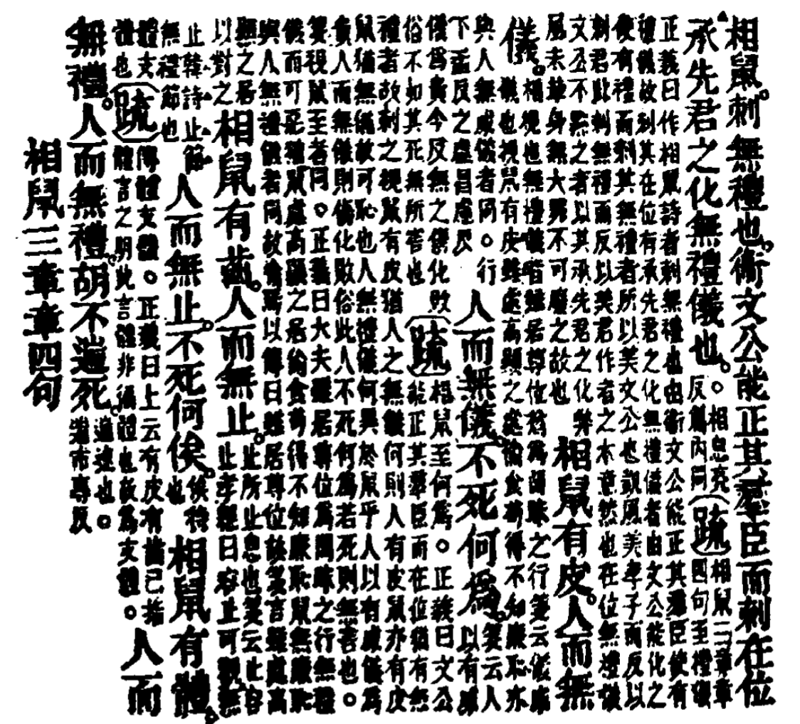

# 古書的注解

???+ info

    教學目的：瞭解古書注解的類型；掌握古書注解的常用術語；學會利用古注閱讀古書。第四部分很重要

???+ info "訓詁學參考資料書"

    陸宗達《訓詰簡論》郭在贻《訓詰學》趙振鋒《訓詰學史略》周大璞《訓詰學要略》洪誠《訓詰學》《詩經注疏》《諸子集成》

## 古書的注解與訓詁、訓詁學

古注

: 古注，古代叫訓詁，它同音韻、文字構成古代文獻語言學的一個整體。

???+ quote

    《說文言部》 ：“**訓**， 說教也，從言，川聲。”段注：“說教者，說釋而教之，必順其理，引申之凡順皆曰訓。”
    
    《說文》：“**詁**，訓故言也。從言，古聲。”段注：“故言者， 舊言也，十口所識前言也。訓者，說教也。訓故言者，說釋故言以教人，是之謂詁……。訓故者，順釋其故言也。”

訓詁
: 對古代文獻所作的一切解釋、說明工作都可稱之為訓詁。類似今天的詞彙學。

訓詁學
: 以古代書面語言訓詁為研究對象，以語義為主要研究內容；（任務） 掃清古代書面語言的疑難障礙，總結前人的注疏經驗，闡明訓詁的體制和義例、方式和方法、原則和運用，以便更好地指導訓詁以及與此相關的<u>古文教學、古籍整理、詞典編纂</u>等工作，是一門具有系統性、實習性、綜合性特徵的應用科學。

## 古注出現的原因、作用及意義

???+ quote inline end "古注出現的原因"

    “訓詁起於語言之變”（洪誠）
    
    戴震《爾雅文字考序》：「昔之婦孺聞而輒曉者，更經學大師轉相講授仍留疑義，則時為之也。」闡明了時間造成語言系統改變的原理。

### 古注出現的原因

#### A、歷史與語言隔閡。

??? example "例子"

    《孟子·梁惠王上》：「為長者**折枝**，語人日：‘我不能。’是不為也，非不能也。」
    
    趙歧注：“折枝，案摩。折手節，解罷枝也。少者恥見役，故不為。”
    
    “罷”通“疲”，“解罷枝”意爲解除肢體的疲勞。
    
    劉熙注：“折枝， 若今之案摩也。”
    
    朱熹注：“ 為長者折枝，以長者之命折草木之枝。”
    
    又：彎腰行禮。
    
    總之，「折枝」是一件常人不難辦到的事。

古注存在不同解释时，要擇善而從，從語言學的角度論證是否合理；如果均合理，最後遵循語感的時代就近原則。

《孟子·離婁上》：「《詩》曰：『天之方蹶，無然**泄泄**。』泄泄猶沓沓也。事君無義，進退無禮，言則非先王之道者，猶沓沓也。」這是舊注的萌芽。

#### B、表達的需要

???+ quote

    《公羊傳》：“京師者何？天子之居也，京者何？大也。師者何？眾也。天子之居，必以眾大之辭言之。”

### 古注作用與意義

1. **古注可靠**。如《詩經》，古注有毛傳、鄭笺、朱熹《詩集傳》、（元）馬瑞辰《毛詩傳箋通解》。清代小學達到高峰，清人著作有全面的總結、反省、回顧與匡正工作，是重點參考。清人焦循注《孟子》。
2. **今注之源**。《左傳·隱元年》：“都城過**百雉**，國之害也。”杜預注：“方丈曰堵， 三堵曰雉，一雉之牆，長三丈高一丈，侯伯之城，方五里，徑三百雉，故其大都不得過百雉。”

### 古書舊注的重要性

* 舊注是我們讀懂古書的重要途徑

??? example "例子"

    寤言不寐，願言則**嚏**。（《詩經·邶風·終風》）
    
    漢鄭玄《毛詩箋》：“言，我；願，思也。嚏當讀為不敢嚏咳之嚏。我其憂悼而不能寐，汝思我心如是，我則嚏也。今俗，人嚏云人道我，此古之遺語也。”

* 舊注是重新注釋古書和檢驗新注是否正確的重要依據

??? example "例子"

    叔武將沐，聞君至，喜。捉爱走出，前驅射而殺之。公知其無罪也，**枕之股**而哭之。( 《左傳·僖公二十八年》)
    
    **說法一：僖公的頭枕在叔武屍體的大腿上**
    
    楊伯峻曰：「『之』字作『其』用，以武叔屍之股為枕也。」（《春秋左傳注》）
    
    王叔岷曰：「之字猶其也，《注》 釋為『枕其股』，是。」（《左傳考校》第69頁。）
    
    《左傳全譯》（貴州人民出版社1990年版）譯文：「把頭枕在屍體的大腿上而哭他。」
    
    **說法二：叔武屍體的頭枕在僖公的大腿上**
    
    杜預《春秋左氏傳集解》：“公以叔武屍枕其股。”
    
    按：“枕之股”謂**以己之股為武叔之枕**，杜《注》大意是也。
    
    《左傳》的用例
    
    > 襄公二十五年《傳》:“枕屍股而哭。興，三踴而出。”
    >
    > 襄公二十七年《傳》:“衣其屍，枕之股而哭之。”
    >
    > 襄公三十年《傳》：“伯有死于羊肆， 子產裢之，枕之股而哭之。”
    
    **皆謂枕屍於股也。**
    
    邵永海老師有論證。

* 舊注中包含著許多語言學和其他學科的理論

??? example "例子"

    既見君子，不我遐棄。（《詩經·周南·汝墳》）
    
    孔穎達《毛詩正義》：“‘不我遐棄’者，猶云‘不遐棄我’也。**古人之語多倒，《詩》之此類眾矣。**”

## 古注的源流及歷代名家注

### 古注的源流

* 古注是層加式的

《春秋》→三傳→杜預《集解》→孔穎達《正義》

: 劉知幾《史通》：“《左傳》家者，其先出於左丘明，孔子既著《春秋》（修訂），而丘明受經作傳。**蓋傳者，轉也；轉受經旨，以授後人。**或曰：傳者，傳也；所以傳示來世。案孔安國注《尚書》，亦謂之傳；斯則傳者亦訓釋之義乎。”

### 古注的發展

#### 先秦：萌芽時期

* 注釋多在古籍正文中

> 《孟子·梁惠王》：“老而無妻曰鰥，老而無夫曰寡，老而無子曰獨，幼而無父曰孤。”

* 他注多補充事實史料、闡發微言大義（春秋筆法）

> 《春秋·隱公元年》：“夏五月，鄭伯克段于鄢。”
>
> : 《公羊傳·隱公元年》：“克之者何？殺之也。殺之則曷為謂之克？大鄭伯之惡也。”

#### 兩漢：注釋的興盛（要特別重視漢注）

兩漢注釋的特點：①以注釋 ==儒家== 經書為主（董仲舒「尊崇儒術」）；②重視 ==字、詞、句== 的解釋

因為語感貼近，往往正確率高；但也存在主觀性強的問題。

!!! info "重要學者"

    - 毛亨《毛詩故訓傳》
    
    - 孔安國《古文尚書注》
    
    - 馬融《周易》、《尚書》《毛詩》、《論語》、《周禮》《儀禮》 、《禮記》等
    
    - 鄭玄《毛詩箋》、《周禮注》 、《儀禮注》 、《禮記注》（鄭玄、馬融有師承關係）
    
    - 何休《春秋公羊解詁》
    
    - 高誘《戰國策注》、《呂氏春秋注》、《淮南子注》
    
    - 王逸《楚辭章句》

#### 魏晉至隋唐：注釋的發展

魏晉至隋唐注釋的特點：①注釋範圍進一步擴大；②出現 ==“經注兼注”的“疏”== 。

!!! info "重要學者"

    王弼《老子注》；
    郭象《莊子注》；
    韋昭《春秋外傳國語注》；
    孔穎達《五經正義》（《易》《書》《詩》《禮》《左》）；
    賈公彥《周禮疏》、《儀禮疏》 ；
    徐彥《春秋公羊傅疏》；
    楊士勳《春秋谷梁傳疏》；
    邢昺《論語疏》、《孝經疏》 、《爾雅疏》；
    孫奭《孟子疏》；陸德明《經典釋文》；楊倞《荀子注》；尹知章《管子注》；
    張守節《史記正義》；司馬貞《史記索隱》；裴駟《史記集解》；顏師古《漢書集注》；李善《文選注》

#### 宋元明：注釋的中落

本期注釋的特點：注釋家 ==受理學的影響== ，常常是借注釋來發揮自己的政治、哲學主張，後人稱其為**“六經注我”**。

!!! info "重要學者"

    朱熹《四書集注》（《大學章句》《中庸章句》《論語集注》《孟子集注》）、《周易本義》 、《詩集傳》、《楚辭集注》

#### 清：注釋的復興

復興的原因：①清政府文化政策的推動；②文字、音韻、訓詁研究的深入。

范圍廣、質量高、方法系統（形、音、義互證法）。

!!! info "重要學者"

    王氏父子（王念孫、王引之——《觸龍說趙太後》龍與讋、太後盛氣而「揖」之）、《說文》四大家（段玉裁、朱骏声、王筠、桂馥）、新十三經注疏。

### 古注的類型

- #### 1. 傳

    “傳”最早用於對經書的注解。秦漢之際，人們把儒家的詩、書、禮、易、春秋、樂等著作（六經）稱為“經”， ==把解釋經的叫“傳”== 。例如“毛傳”就是毛亨對《詩經》的注釋，“孔傳”是孔安國對《尚書》的注釋。

    另外，《左傳》、《公羊傳》、《谷梁傳》也被認為是對《春秋經》的解說，所以都也稱“傳”，但是這和我們一般所說的用於注釋的“傳”性質不同。它們補充了大量的歷史資料，本身已可以構成價值極高的歷史典籍。

- #### 2. 箋

    東漢時鄭玄在“毛傳”的基礎上，對《詩經》又作了進一步的解釋，他的注解稱為“箋”。“箋”本來有 ==補充和訂正== 毛傳的意思。但後來所謂的“箋注”、“箋證”都只是“注解”的意思，不一定限於對别人的注的闡發與補充。

- #### 3. 注

    大約從東漢開始，對古書的注解一般不稱“傳”而稱“注”。注，流注、著明，用在注釋古書時，是指使文意如水之流注，暢通明曉。

    “注”泛化後還可以是古書注解的 ==通稱== ，如《十三經注疏》的“注”，包括“毛傳”和“鄭箋”。

- #### 4. 疏

    “疏”是唐代產生的一種新的注解方法。相對於“注”而言，是 ==在“注”的基礎上進一步作注，不僅解釋正文，而且還給古人的注解作注解。==

    “疏”是疏通、疏解之義，因此“注疏”通常都是先注後疏。例如《周禮注疏》漢鄭玄作注，唐賈公彥疏；《爾雅注疏》晉郭璞作注，宋邢昺疏。

- #### 5. 正義

    “正義”， ==解釋經傳而得義之正者。== “疏”也可以叫“正義”，如孔穎達《五經正義》，就是為五經分別作的疏。因為這是孔穎達奉皇帝之命作的疏，是科舉考試的標準材料，所以稱“正義”。但 ==“正義”有時不一定是疏== ，如張守節《史記正義》，是注而不是疏。

- #### 6. 章句

    “章句”，**離章辨（析）句、委曲支派（脈）**。

    分析章節句讀，把一件事情的始末經過講清楚，叫做 ==“委曲詳盡”== 。

    在訓釋名物的基礎上發展起來的一種注釋方式。除解釋字詞外，還 ==串講句意== ，分析其中的含義。章句于每章之末還有 ==章旨，總括該章主旨，即文章大意== 。

    如漢趙岐《孟子章句》、王逸《楚辭章句》。

    《孟子章句》在每一段後面有 ==“章旨”== ，就是概括一段大意。

    例如《孟子·滕文公上》“有為神農之言者許行”章後注：<u>“章指：言神農務本，教於凡民。 ==許行蔽道，同之君臣。== 陳相倍師，降于幽谷；不理萬情，謂之敦樸。是以孟子博陳堯舜上下之敘以匡之也。”</u>

    這種方法並非只在以“章句”為名的注釋中才用，如“毛傳” ，雖不以章句為名，但注釋時也串講文章。
    
    !!! info inline end "作業"

        探究「旨、指、恉」的源流演變

- #### 7. 集解、集注、集釋

    此三者都是 ==彙集眾家之說== （有時也加上自己的注解）的一種注释方式。這是一種集大成的工作，它彙集眾家之說（一定是後代，更多是宋元明清時代，尤其是清代），省去了人們的翻檢之劳。如三國魏何晏的《論語集解》、宋朱熹的《楚辭集注》、清郭慶藩的《莊子集釋》等。

    在這一類注釋中都兼有解釋字詞，說明人名地名典章制度（例如張守節《史記集解》）等方面。到六朝以後，文章講究用典，注家也就擔負起 ==注明典故出處的任務（例如李善《文選注》）== 。當然，在這幾方面，可以 ==有所侧重== 。

- 古代注書另一種類型

    不是對古書的字句加以解釋，而是為古書補充材料：如四大名注—— ==酈道元《水經注》、裴松之《三國志注》、李善《文選注》、（？）==

    闡發古書哲學思想的，王弼《老子注》。

    這類注解也有很高價值，但我們今天要討論不是這一種。

## 古注的體例、術語及內容

### 注解體例的重要性

利用古人的注解来讀古書，首先要掌握它的基本注解體例。

古人對古書的注解首先是從**訓释經書**開始的。起初，可能由於各释者學有承，眾家並出，不敢自專，各種注本與經別行，**自成一書**。約從東漢開始，為了閱讀方便，方有經注合一的經注本。**經注合一的注本**，**一般採用正文單行大字排列，注释雙行小字列于正文單行大字之後的醴例**。參見教材《詩經·相鼠》影印（P675）。

古注分兩類：隨文注疏；釋詞專著。

### 古注的體例

毛傳：毛亨對《詩經》的注釋。“傳”指闡明經義。《毛詩序》有階級立場，存在美化在位者的嫌疑。

鄭箋：鄭玄對《詩經》的注釋。“箋”有補充訂正毛傳的意思。

孔疏：孔穎達對《詩經》原文以及毛傳、鄭笺等的注釋。“疏”不僅解釋古籍正文，連前人的注釋也一起加以注程也叫做“正義”。

請通讀教材所引《十三經注疏》中《詩經·相鼠》的正疏（毛傳、鄭箋、孔疏）。P675影印。

毛傳分「大緒（《毛詩序》，對整個《詩經》概括的文字）」、「小緒（每一首詩歌前邊概括詩歌主題的文字）」。圓圈「〇」是分隔號/間隔號，「唐人陸德明《經典釋文》注音時引入」。

### 古注的內容

以《詩毛傳》為例

- 解釋詞義（古方言知識）
- 串講文意（《章句》更側重）
- 分析句讀（古人的句讀沒有表達句子與句子間的關係，今人的「標點」工作還要在古人的基礎上，把句子和句子之間的關係搞清楚）
  
    ???+ example "例子"

        及曹曹共公聞其駢脅欲觀其裸浴薄而觀之
          
        : 陸德明《音義》：“聞其駢脅”，絕句。又云：“欲觀”，如字，絕句。一讀至“裸”字絕句。
          
        : 1、及曹，曹共公聞其駢脅，欲觀。其裸浴，薄而觀之。==（**誰洗澡穿衣服呢？**）==
          
        : 2、**及曹，曹共公聞其駢脅，欲觀其裸。浴，薄（設簾而觀之，一說義同「迫」，靠近）而觀之。**（這一句是對的）

- 提示語法

    ??? example "例子"

        《詩·周南·汝墳》：“既見君子，不我遐棄。”
        
        : ［孔疏］：不我遐棄，猶云不遐棄我。古之人語多倒，詩之此類眾矣。
        
        : 按，這是說明賓語前置的語序問題。其他如「詞類活用」的例子也不少。

- 說明修辭表達方式

    ??? example "例子"

        《詩·小雅·鶴鳴》：“鶴鳴於九皋，聲聞於野。”
        
        : 毛傳：興也。皋，澤也。言身隱而名著也。
        
        毛傳中凡言“興也”的地方都是對修辭表達方式的說明。
        
        興，借他物以引起所詠之事的一種手法，往往與比喻結合在一起，因其表現手法比較深婉，所以毛傳常常特地注明。

- 詮釋典故成語（見李善文選注）
  

- 校勘工作

### 古注的常用術語

自漢人注釋古書開始，師徒相傳，還形成了一套專門的注解術語。這些術語各有自己的一定用法，若缺乏瞭解，會妨礙我們對古注的參閱。但由於這些術語不是一時一書一人之所用，含義並不完全統一，後人理解也不盡相同，因此，我們只列舉一些比較常用的術語介紹給大家。

此部分結合教材通讀理解。詳見教材P676-679。

#### 釋義術語

**曰、為、謂之**

: ==被釋詞在後== ，用來直陳詞義、分別同義詞之間細微差別。相當於 ==「叫做」== 。

: 同義詞=近義詞+等義詞（少之又少），泛義的同義詞是近義詞

: 古人云：「渾言之無別，析言之有別」（暑熱、嫉妒；到後代幾乎可以無視造字之初的差別了。古人的分別有時是強為之的，帶有階段性或主觀色彩。）

??? example "例子"

    ①《國語·越語下》：“田野開闢，府倉實。”韋昭注：“貨財**曰**府，米粟**曰**倉。”
    
    ②《國語·周語下》：“其察色也，不過墨丈尋常之間。”韋昭注：“五尺**為**墨，倍墨**為**丈；八尺**為**尋，倍尋**為**常。
    
    ③《爾雅·釋器》：“金**謂之**鏤，木**謂之**刻，骨**謂之**切，象**謂之**磋，玉**謂之**琢，石**謂之**磨。”

**謂**

: ==被解釋的詞放在前面== ，主要用於以狹義釋廣義，以具體釋抽象，以分體名釋總體名等。“謂”後面的話往往是說明前面詞語所指的範圍或 ==比喻、影射== 的事物。

??? example "例子"

    ①《左傳·隱公元年》：“子封曰：“可矣，厚將得眾。””杜預注：“厚**謂**土地廣大。”
    
    ②《左傳·成公二年》：“大國朝夕釋憾於敝邑之地。”杜預注：“大國**謂**齊。"
    
    ③《孟子·滕文公上》：“後稷教民稼穡，樹藝五榖。”趙岐注：“五穀**謂**稻、黍、稷、麥、菽也。”
    
    ④《詩經·邶風·穀風》：“何有何亡，黽勉求之。”毛傳：“有謂富也，亡謂貧也。”

**貌、之貌**

: 古注中這兩個術語主要用於注釋形容詞，一般放在形容詞或動詞之後，說明 ==事物的性質或状態== ，相當於“……的樣子”。

??? example "例子"

    ①《詩經·大雅·瞻卬》：“藐藐昊天。”毛傳：“藐藐，大**貌**。”
    
    ②《楚辭·離騷》：“紛總總其離合兮，斑陸離其上下。”朱熹注：“紛，盛多**貌**；總總，聚**貌**；斑，亂**貌**。”

**猶**

: 一般是被解釋的詞放在“猶”前。

: ①用同義詞作注。

: > 《左傳·隱西元年》：“潁考叔，純孝也。”杜預注：“純，**猶**篤也。”

: ②義隔而通（即用遠引申義來解釋）。

: > 《左傳·莊10》：“肉食者謀之，又何間焉？”杜預注：“間，**猶**與也。”（按，“參與”義是“間”的遠引申義）

: > 《詩·豳風·七月》：“同我婦子，饁彼南亩。”鄭箋云：同**猶**俱也……耕者之婦子，俱以餉，來至於南亩之中。”

: > 《孟子》：“老吾老以及人之老，幼吾幼以及人之幼。”趙岐注：“老**猶**敬也，幼**猶**愛也。”焦循正義：“老無敬訓，幼無愛訓，故云‘猶敬’‘猶愛’。

: ③以今語釋古語。

: > 《文選·報任少卿書》：“諺曰：‘誰為為之？’李善注：“誰為**猶**為誰也。”

**之言，之爲言**

: 古注中使用這兩個術語時，一般是 ==“聲訓”== ，即用聲音相同或相近的詞來作注解，兩者音義相通，一般是同源字的關係。被釋詞要放在“之言”、“之為言”的前面。

但古人聲訓往往带有主觀隨意性，牽强附會的地方很多，這是我們應該特别注意的。

??? example "例子"

    ①《詩經·大雅·泮水》：“思樂泮水。”鄭玄笺：“泮**之言**半也。半水者，蓋東西以南通水，北無也。”
    
    ②《論語·為政》：“為政以德，譬如北辰，居其所而眾星拱之。”朱熹注：“政**之為言**正也，所以正人之不正也；德**之為言**得也，得於心而不失也。”
    
    ③吾恐季孫之憂，不在顓臾，而在蕭墻之內也。禍起蕭墻。

???+ warning "注意"

    用“之言”注釋的詞，釋詞和被釋詞之間，有時兩者只是通其音，而不通其義。通其音而不通其義的字，不是同源字的關係，而是本字和通假字的關係。
    
    ①《詩經·鄘風·載馳》：“載馳載驅。”鄭玄箋：“載**之言**則也。”
    
    ②《詩經·小雅·十月之交》：“抑此皇父，豈曰不時。”鄭玄笺：“抑**之言**噫。噫是皇父，疾而呼之。”

#### 釋音術語

**讀若、讀如**

: 古注中“讀若”、“讀如”這兩個術語主要用於注音，被釋詞放在術語之前，釋詞放在術語之後。

??? example "例子"

    ①《說文》：“沖，湧搖也。從水中。讀如動。”
    
    ②《周禮·大宰》：“以利得民。”鄭玄注：“利，讀若“上思利民”之“利”，謂以政教利之。
    
    注意：“讀如”也用來解釋通假字。
    
    ③《禮記·儒行》：“雖危，起居竟信其志。鄭玄注：“信讀如屈伸之“伸”，假借字也。

**讀為、讀曰**

: 古注中這兩個術語主要用來明通假，即表明被釋詞與解釋詞之間是通假關係。被釋詞放在術語之前，釋詞放在術語之後。

??? example "例子"

    ①《莊子·逍遙遊》：“而禦六氣之辯。”郭慶藩注：“辯**讀為**變。”
    
    ②《周禮·春官·司幾筵》：“祀先王昨席，亦如之。”鄭玄注：“玄謂昨讀曰酢，謂祭祀及王受酢之席。”

???+ warning "注意"

    古注中偶爾也有用“讀為”來注音的。
    
    例如③《禮記·檀弓上》：“何居？我未之前聞也。鄭玄注：“居，**讀為**姬姓之姬，齊魯之間語助也。”

**如字**

: 這是古注中標明多音字讀音的術語。一個字若有兩個以上的不同讀音，其中 ==表示常用義的讀音叫“**本音**”，其餘的讀音都算是**變讀**== 。“如字”表示這個字在當前語言環境中應讀它的本音。

??? example "例子"

    ①《禮記·大學》：“所謂誠其意者，毋自欺也，如惡（wù）惡（è）臭，如好（hào）好（hǎo）色。”《經典釋文》：“惡惡，上烏路反，下**如字**。好好，上呼報反，下**如字**。”
    
    ②《論語·為政》：“七十而從心所欲，不逾矩。”朱熹注：“從，**如字**。從，隨也。”。（《鴻門宴》「從白餘騎」，讀為zong4，使跟從）

#### 校勘術語

**當為、當作**

: 古注中這兩個術語主要用來 ==改正古書中的錯字==。

    ①《禮記·喪大記》：“君之喪，大胥是斂。”鄭玄注：“胥，樂官也，不掌喪事。胥當為祝，字之誤也。
    
    ②《周禮·考工記》：“作舟以行水。”鄭玄注：“古書舟作周。鄭司農云：‘周**當作**舟。’”

???+ warning "注意"

    有時古注中“當為”、“當作”並非用来正誤，而是用來表明通假。
    
    ??? example "例子"
    
        例如:《禮記·文王世子》：“《兌命》曰：‘念終始典於學。’”
    
        鄭玄注：“‘兌’**當為**‘說’。《說命》，《書》篇名，殷高宗之臣傅說之所作。
    
        按：《尚書·說命上》：“高宗夢得說。”陸德明《音義》：“‘說’，**本又作**‘兌’。”
    
        《禮記·緇衣》：“尹吉曰：惟尹躬及湯，咸有壹德。”鄭玄注：“吉**當爲**告，古文浩，字之誤也。 告，伊区之誥也。”

**本亦作、本又作、本或作**

: 注明 ==異文== ，多爲古今字問題。

??? example "例子"

    《詩經·小雅·采薇》：曰歸曰歸，歲亦莫止。
    
    陸德明《音義》：“莫”音“暮”，本或作“莫”。

**衍、脫（奪）**

: “衍”即“衍文”，又叫“衍字”，古注中用此注明因傳抄、刻印而誤 ==添== 的字。“脫”即“脫文”，又稱“奪”或“奪字”，古注中用此注明因傳抄、刻印而 ==脫漏== 的字句。例子略。

## 閱讀古注應注意的問題

1.剔除糟粕。古注在思想觀點方面有時會存在一些問題。

??? example "例子"

    《相鼠》孔疏：文公能正其群臣，而在位猶有無禮者，故刺之。
    
    《相鼠》刺的是在位者，而非無禮者。
    
    《論語·薇子》：四體不勤，五穀不分。
    
    宋呂本中：丈人自謂。
    
    清俞樾：兩不字，並語詞。不勤，勤也。不分，分也。
    
    此兩種說法都是爲子路開脫。

??? example "例子"

    《七月》：“女心傷悲，殆及公子同歸。”
    
    傷悲：感事苦也，春女悲，秋士悲，感其物化也。殆，始。及，與也。豳公子躬率其民，同時出同時歸也。
    
    箋：春女感陽氣而思男；秋士感陰氣而思女。是其物化所以悲也。悲則始有與公子同歸之志，欲嫁焉。女感事苦而生此志，是謂豳風。
    
    按：“殆”應當是害怕的意思。「殆」解釋爲「始」有誤。
    
    「春日載陽」

2.古人作注有自己的注釋條例

??? example "例子"

    《詩·騶虞》：“彼茁者葭。”毛傳：“茁，出也。”
    
    「葭」，初生的蘆葦。毛傳在此是聲訓，上古“茁”“出”二字都是入聲字。「茁」，草出地面而豐茂。
    
    《左傳·文三》：“晉人……封殽屍而還。”
    
    賈逵注：“封，識之。”
    
    杜預注：“封，埋葬之。”
    
    從造字結構來看，“封”是以手聚土。賈逵注“封，識之”不是說封字有此意，而是聚土埋葬**有標志的功能**，即“識之”。

??? info "補充"

    《殽之戰》蹇叔哭師，秦穆公。穆公訪諸蹇叔。中壽，爾墓之木拱矣。

3.古人作注用的是文言，在讀古注時，不能用現代漢語的詞義去理解注文。

??? example "例子"

    《左傳·隱5》：臧僖伯卒。公曰：“叔父有憾于寡人，寡人弗敢忘。”
    
    杜注：有恨，恨諫觀魚（游賞活動）不聽。
    
    「恨」是遺憾、不滿意的意思，不是憎恨的意思。
