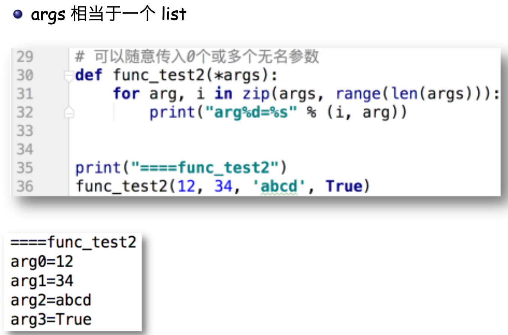

# Python 入门

1. 通过 `sys.path` 找到 包 `sys` 的位置
2. 浮点数精度比较：受到 17 位有效数字的限制。如何解决？


我们还需要良好的编程规范：变量、函数、类命名、注释和文档、一些编程设计上的良好风格。

## 语法补充

### 字符串操作

1. `\+ 连接、* 复制、len 长度`

2. `[start : end : step]` 用来提取一部分:同 list， 最 “风骚” 的操作。

### 集合的运算


### 迭代循环 for

可迭代对象有很多类型，像字符串、列表、元组、字典、集合等，也可以有后面提到的生成器、迭代器等。常见的连续序列**生成器**——range 函数。**==什么是生成器？==**

### 格式化字符串：format 方法

### 推导式

推导式（列表推导式/字典推导式/集合推导式， comprehensions，又称解析式），可以用来生成列表、字典和集合的语句。可以使用多个 for 结构，并通过 if 结构进行过滤

```python
[ < 表达式 > for < 变量 > in < 可迭代对象 > if < 逻辑条件 >]
{ < 键值表达式 >:< 元素表达式 > for < 变量 > in < 可迭代对象 > if < 逻辑条件 >}
{ < 元素表达式 > for < 变量 > in < 可迭代对象 > if < 逻辑条件 >}


###
[x*y for x in range(10) for y in range(x)]
[x for x in list if x >= 0]
```

**生成器推导式**：与推导式一样的语法，返回一个生成器对象，也是可迭代对象，但并不立即产生全部元素，仅在要用到元素的时候才生成，**==可以极大节省内存==**。

```python
(< 元素表达式 > for < 变量 > in < 可迭代对象 > if < 逻辑条件 >)
```

### 括号的用法


### 定义函数的参数:固定参数/可变参数

定义函数时，参数可以有两种。

* 一种是在参数表中写明参数名 key 的参数，固定了顺序和数量 调用函数时可以根据位置/key，来提供参数。

  ```python
  def func(key1, key2, key3⋯): 
  def func(key1, key2=value2⋯):
  ```

* 一种是定义时还不知道会有多少参数传入的可变参数

  ```python
  def func(*args): # 不带 key 的多个参数
  def func(**kwargs): #key=val 形式的多个参数
  ```




### 调用函数的参数:位置参数/关键字参数（不太理解）

调用函数的时候，可以传进两种参数。

* 一种是没有名字的位置参数。
	* func(arg1, arg2, arg3⋯) 会按照前后顺序对应到函数参数传入
* 一种是带 key 的关键字参数 
	* func(key1=arg1, key2=arg2⋯) 由于指定了 key，可以不按照顺序对应。
* 如果混用，所有位置参数必须在前，关键字参数必须在后

### Python 面向对象：类的定义与调用

类用来实现抽象数据类型 ADT，封装实体的属性和行为。

为什么要有“抽象数据类型”？——为了控制问题和问题解决过程的复杂度，我们需要利用抽象来保持问题的“整体感”，而不会陷入到过多的细节中去。这要求对现实问题进行建模的时候，对算法所要处理的数据，也要保持与问题本身的一致性，不要有太多与问题无关的细节。

前面谈到的“过程抽象”启发我们进行“数据抽象”——相对于基本数据类型的“抽象数据类型 ADT:Abstract Data Type”，ADT 是对数据进行处理的一种逻辑描述，并不涉及实现细节。ADT 建立了一种对数据的“封装 encapsulation”，封装技术将可能的处理实现细节隐蔽起来，能有效控制算法的复杂度。用户通过 ADT 提供的操作来与接口交互。

* 定义类：使用 class 语句;
  ```python
  class < 类名 >:
    def __init__(self, < 参数表 >): # 前后连着两个’_’ def < 方法名 >(self, < 参数表 >):
  ```
* 调用类:< 类名 >(< 参数 >)
  * 注意括号!
  * `obj = < 类名 > (< 参数表 >)`，返回一个对象实例，类方法中的 self 指这个对象实例!


