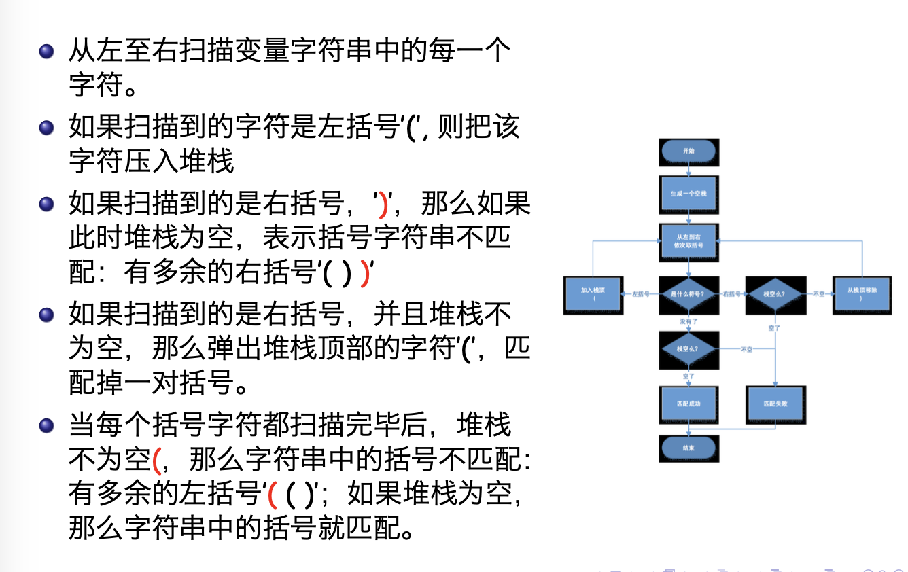
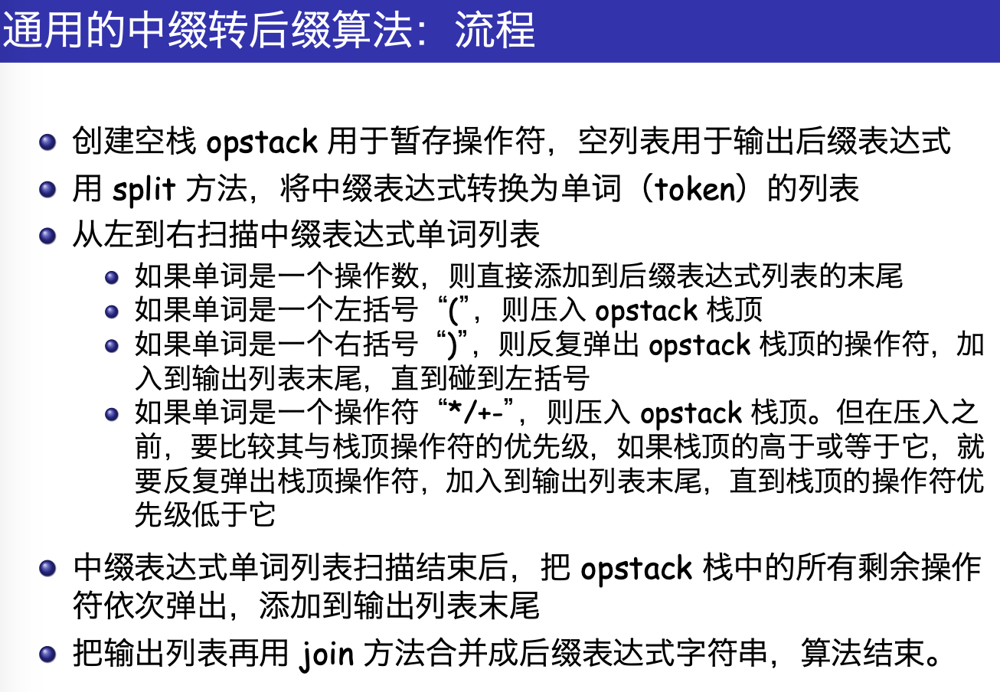

# 基本结构（线性表）

!!! 本章基本目标

    * 了解**抽象数据类型**：栈 stack、队列 queue、双端队列 deque 和列表 list；
    
    * 能够采用 Python **列表**数据类型来**实现** stack/queue/deque 等抽象数据类型；
    
    * 了解基本线性数据结构各种**具体实现算法的性能**；
    
    * 了解**前缀、中缀和后缀表达式**；
    
        * 采用 stack 对后缀表达式进行求值；
        * 采用 stack 将中缀表达式转换为后缀表达式；
    
    * 采用 queue 进行基本的点名报数模拟；
    
    * 能够识别问题属性，选用 stack、queue 或者 deque 中**更为合适**的数据结构；
    
    * 能够通过**节点和节点引用**的模式，采用**链表**来实现**抽象数据类型 list**；
    
    * 能够比较**链表实现**与 <u>**Python 的 list 实现**</u>之间的算法性能。

!!! 小结

    * **线性数据结构 Linear DS **将数据项以某种**线性**的次序组织起来
    * 栈 Stack 维持了数据项**后进先出 LIFO **的次序
        * stack 的基本操作包括 push, pop, isEmpty
    * 队列 Queue 维持了数据项**先进先出 FIFO **的次序
        * queue 的基本操作包括 enqueue, dequeue, isEmpty
    * 书写表达式的方法有前缀 prefix、中缀 infix 和后缀 postfix 三种
        * 由于栈结构具有次序反转的特性，所以 ==**栈结构适合用于开发表达式求值和转换**== 的算法
    * “模拟系统”可以通过一个对现实世界问题进行抽象建模，并加入随机数动态运行，为复杂问题的决策提供各种情况的参考
        * 队列 queue 可以用来进行模拟系统的开发

## 本章学习中的几个重点概念

### 数据相关概念

1. **数据结构**：是相互之间存在一种或多种特定**关系**的**数据元素**的**集合**，包括**逻辑结构**和物理结构（**存储结构**）。
2. **数据类型**：是一个**值的集合**和定义在这个值集上的一组**操作**的总称。==（值的集合+操作）==
3. **抽象数据类型**:是指一个**数学模型**以及定义在该模型上的一组**操作**。它的定义仅取决于它的一组逻辑特性，而与其在计算机内部如何表示和实现无关。==（数学模型+操作）==

不同的概念经常使用相同的名字，注意区分

### 线性结构的数学定义

线性表是 $n$ 个数据元素的有限序列，可以记为 $L=(a_0,a_1,...,a_{n-1})$.

| 关键词     | 数据元素之间的关系                                           |
| ---------- | ------------------------------------------------------------ |
| 领先       | $a_{i-1}$ **领先**于 $a_i$                                   |
| 前驱与后继 | $a_{i-1}$ 是 $a_i$ 的**直接前驱元素**，$a_i$ 是 $a_{i-1}$ 的**直接后继元素** |
|            | 除 $a_0$ 外，每个元素有且只有一个直接前驱元素；<br />除 $a_{i-1}$ 外，每个元素有且只有一个直接后继元素； |
| 线性表长度 | $n$ 称为**线性表长度**，$n=0$ 为**空表**                     |

### 链表

??? question "辨析顺序表与链表" 

    顺序表和链表是两种常见的线性数据结构，它们有以下区别：
    
    1. 存储方式：
         - 顺序表：使用一段**连续**的内存空间来存储数据元素，可以通过下标直接访问元素。（紧凑结构，**存储密度为 1**）
         - 链表：使用节点来存储数据元素，每个节点包含**元素（存储数据的存储单元）**和**指向下一个节点的指针（连接每个结点的地址数据）**，不需要连续的内存空间。
    
    2. 插入和删除操作：
         - 顺序表：插入和删除操作可能需要移动大量元素，时间复杂度为 $O(n)$。
         - 链表：插入和删除操作只需要修改指针，时间复杂度为 $O(1)$。
    
    3. 内存空间：
         - 顺序表：需要预先分配一定大小的内存空间，大小固定。
         - 链表：可以动态分配内存空间，大小可以动态调整。
    
    4. 访问效率：
         - 顺序表：可以通过下标直接访问元素，访问效率高。
         - 链表：需要从头节点开始逐个遍历，访问效率较低。
         - 链表从当前一个元素很容易找到下一个元素，**反之很麻烦**。而顺序表正、反都很容易。

链表由头指针唯一确定。设置头指针（head）指向头节点。**带头节点的单链表**用额外的空间开销，交换代码的简洁性。

??? question "单链表设置头结点的作用是什么？"

    设置单链表的头结点主要有以下作用：
    
    1. 防止单链表为空：当链表为空时，头指针指向的是头结点，而不是NULL，这样便于对链表进行操作。
    
    2. 统一操作：由于头结点的存在，无论链表是否为空，头指针始终指向头结点。这样，对于插入、删除等操作，无论是在首元结点之前还是之后，都不需要对头指针进行额外的判断，保持了操作的统一性。
    
    3. 简化操作：带头结点的链表在进行插入、删除操作时，不需要改变头指针的值，而没有头结点的链表则可能需要改变头指针的值（处理非头结点的第一个结点时）。这使得对初学者来说更容易接受，同时也减少了程序的复杂性和出现bug的机会。
    
    4. 便于首元结点的处理：增加了头结点后，首元结点的地址保存在头结点的指针域中，使得对链表的第一个数据元素的操作与其他数据元素相同，无需进行特殊处理。
    
    5. 统一空表和非空表的处理：当链表不设头结点时，假设L为单链表的头指针，它应该指向首元结点。当单链表为长度n为0的空表时，L指针为空。而有了头结点后，无论链表是否为空，都可以通过头指针的值来判断链表的当前状态。


## 本章学习中的几个重点算法问题

### Stack 实现简单括号匹配

??? inline end "用 Python 实现 ADT Stack"

    ```python
    class Stack:
        def __init__(self):
            self.items = []
    
        def isEmpty(self):
            return self.items == []
    
        def push(self, item):
            self.items.append(item)
    
        def pop(self):
            return self.items.pop()
    
        def peek(self):
            return self.items[len(self.items)-1]
    
        def size(self):
            return len(self.items)
    ```




更多种括号的匹配——（1）碰到各种左括号仍然入栈；（2）碰到各种右括号的时候需要判断栈顶的左括号是否跟右括号==属于同一种类==

### Stack 实现进制转换

十进制转换为二进制，采用的是“除以 2”的算法。将整数不断除以 2，每次得到的余数就是**由低到高（由右到左）**的二进制位。“除以 2”的过程，得到的余数是从低到高的次序，而输出则是从高到低，所以**==需要一个栈来反转次序==**。

### Stack 实现“三缀”表达式转换


<div class="grid cards" markdown>

-   #### 中缀表达式转换为前缀/后缀形式

    * 将中缀表达式转换为**全括号形式**
    * 将所有的操作符移动到子表达式所在的**左括号(前缀)**或者**右括号(后缀)**处，替代之
    * **删除所有的括号**

    **具体实现**：

    - 操作数的顺序是不变的，直接输出

    - 操作符一定是出现在对应的操作数后面

    - 操作符出现的顺序取决于执行的先后顺序，也就取决于优先级

    - “(”括号改变后面操作符的优先 级，直到出现“)”；“)”出现时，与对应的“(”之间 的操作符都应该输出了

    - 在从左到右扫描逐个字符扫描中缀表达式的过程中，采用一个**栈**来**暂存未处理的操作符**，这样，栈顶的操作符就是最近暂存进去的，当遇到一个新的操作符，就需要跟栈顶的操作符比较下优先级，再行处理。

      

-   #### 前缀/后缀转中缀表达式

-   

    </div>

### Queue 实现约瑟夫问题

传说犹太人反叛罗马人，落到困境，约瑟夫和 39 人决定自杀，坐成一圈儿，报数 1 ~ 7，报到 7 的人出列自杀，结果约瑟夫给自己安排了个位置，最后活下来。

使用 deque 数据结构：按照传递土豆的方向，从队尾排到队首。每传递 1 次，将队尾的人出队，马上到队首入队。每传递 7 次，将队首的人移除。如此反复，直到队列中剩余 1 人。

### 链表的实现