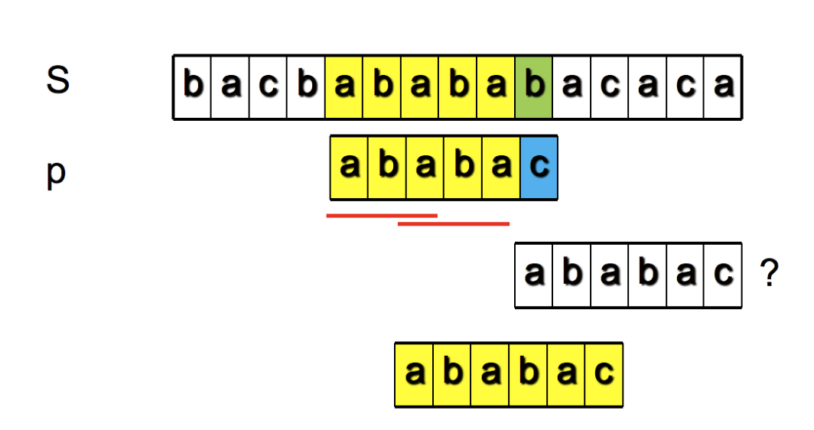

# KMP Algorithm

数据结构的定义和核心问题——可能考填空

## 字符串查找问题

从一个较长的字符串 $S$(string，长度 $n$) 中, 查找一个较短的字符串 $P$(pattern，长度 $m$) 有没有出现，如果有的话，返回 $P$ 在 $S$ 中出现的位置。

这是计算机上使用最频繁的操作之一

首先想到一个 $O(mn)$ 的查找算法：

1. 把 S 和 P 左对齐，逐字比较 S 和 P 
2. 如果发现有不匹配的地方，把 P **向右移动一格再重新开始**
3. 直到发现 P 在 S 中出现了一处完全匹配

### KMP 算法

改进上面的 $O(mn)$ 算法，Knuth, Morris 和 Pratt 设计了一个线性时间算法。

新算法获得了 $O(n+m)$ 的复杂度：当一次不匹配出现 P[i] 与 S[j] 之间时，P[:i] 与 S[j-i:j] 应该是匹配的。想法是，通过事先对 P 进行计算， 来实现 P 的右移(不再是一格)，来保证 S[:j] 中的字符不会再次被比较到。

**==每次比较失败以后，应该往前挪多少? 这取决于 P 长成什么样子.==**

关键是**==黄色的部分 P[:i]==** 有多少位“前缀”和“后缀”是相同的。P 右移后的比较位置刚好等于该数值。**==【只考虑黄色的部分！】==**

#### 《部分匹配表》的产生

「**部分匹配值**」定义为「前缀」和「后缀」最长共有元素的长度

> * "ABCDAB"的前缀为[A, AB, ABC, ABCD, ABCDA]，后缀为[BCDAB, CDAB, DAB, AB, B]，共有元素为"AB"，长度为2
>
> | 0    | 1    | 2    | 3    | ...  | i-1  | i    |
> | ---- | ---- | ---- | ---- | ---- | ---- | ---- |
> | 0    | 0    | 1    | 2    | ...  | 0    | 1    |
>
> * ABABA 部分匹配值为 3

在一个 $P$ 中，考察由「前 $i(i\le m)$ 位」构成的子串，得到的「部分匹配值」，以 $\{i,val\}$ 的形式一一对应，记录为「**部分匹配表**」。【$\forall i$ 都要考察】

把右边的值取个名字，叫做字符串的最长公共前后缀(长度)，表示为 
$$
\max_{ps}(P[: i]),1 ≤ i ≤ 6
$$

#### 求《部分匹配表》步骤（$\forall i\in[1,\text{len} (P)]$，求 $\max_{ps}(P[:i])$ 的步骤）——双指针+动规

1. 
2. 

#### 主程序：移动位数的计算

我们的得到

移动位数 = 已匹配的字符数 - 对应的部分匹配值
