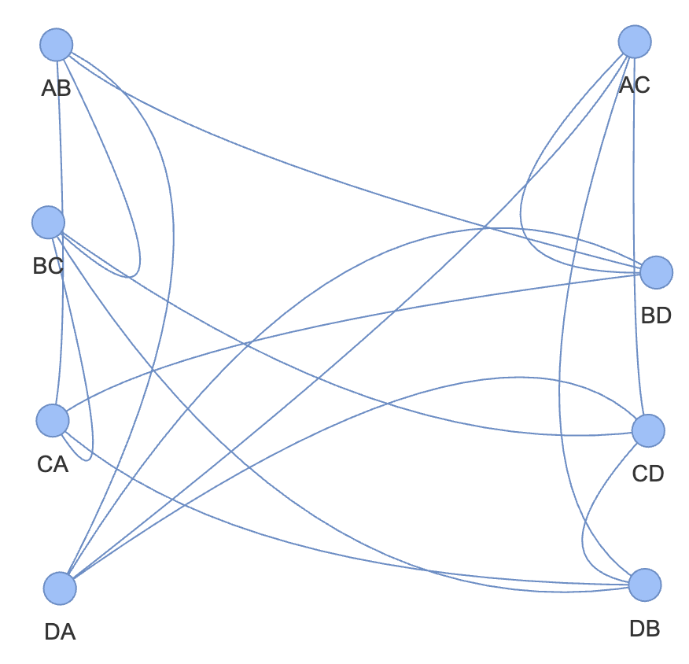
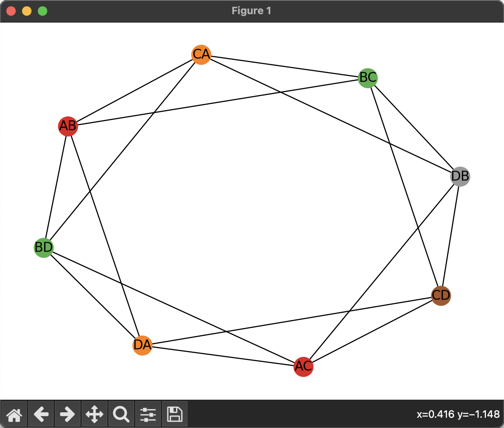

# 数据结构与算法(python)作业一: 课程引言与概论

梁钟 中国语言文学系 2300014101

## Q1: 十字路口的信号灯问题 (2pts)

* 有 A,B,C,D 四条道路相交的十字路口是最常见的路口，并且满足下面的条件:
  * A,B,C,D 分别通往东、南、西、北四个方向
  * 所有道路都是双向通行，没有单行道
  * 车辆靠道路右侧通行

请仿照课件中的五叉路口例子，画出十字路口行驶冲突的模型，并给出满足安全性的信号灯分组最优解。

## Q1 的解答

### 结论

最优解是 4 分组，每组分别为：

* AB, AC, AD
* BA, BC, BD
* CA, CB, CD
* DA, DB, DC

### 分析

根据路口的实际情况，所有道路都是双向通行，每个「来」方向都有三个可能的去向，即直走、左转、右转。因此，可能的通行路线有：

* AB, AC, AD
* BA, BC, BD
* CA, CB, CD
* DA, DB, DC

每个路线看成一个结点，在不能同时行驶的路线间画一条连线 (表示它们互相冲突)，可以得到**如图**：

```
AB---BD
AB---BC
AB---CA
AB---DA
AC---BD
AC---CD
AC---DA
AC---DB
AD

BC---CA
BC---CD
BC---DB
BD---CA
BD---DA
BA

CD---DB
CD---DA
CA---DB
CB
DC
```

> [!Note|right]
>
> 

把图中的结点(路线)分组，同一个组里的路线同时放行，“安全性” 要保证有连线的结点不在同一个组里。

如何分最少的组，获得最高的效率？问题变为经典的图着色问题。

### attempt#1: 采用 Networkx 的贪心算法计算

1. 在车辆靠道路右侧通行的情况下，右转与任意通行路线均不冲突，因此各右转路线节点自成一连通分量。由上图可知，其他路线形成一连通分量，由于右转路线节点着任意颜色均可，为力求着色最少，因此**统一着大连通分量中已出现的一种颜色即可，不着新颜色。**
2. 对于该大连通分量的图着色问题，采取贪心算法，得到下图，从中可见满足安全性的信号灯分组**最优解为 5 组，图中各同色节点为一组**。



源代码：

```python
import networkx as nx
import matplotlib.pyplot as plt

G = nx.Graph()

edges = [('AB', 'BD'),('AB', 'BC'),('AB', 'CA'),('AB', 'DA'),('AC', 'BD'), \
    ('AC', 'CD'),('AC', 'DA'),('AC', 'DB'),('BC', 'CA'),('BC', 'CD'),\
    ('BC', 'DB'),('BD', 'CA'),('BD', 'DA'),('CD', 'DB'),('CD', 'DA'),('CA', 'DB')]
for edge in edges:
    G.add_edge(edge[0], edge[1])
pos = nx.spring_layout(G)
nx.draw(G, pos, with_labels=True)
plt.show()

colors = nx.greedy_color(G)
print(colors)

color_list = [colors[n] for n in G.nodes()]
nx.draw(G, pos, with_labels=True, node_color=color_list, cmap=plt.cm.Set1)

plt.show()
```

### attempt#2: 现实生活？

事实上，在现实生活中，只需要按照「东南西北」四向来车，分为 4 组即可。这比刚才的结果更小。

究其原因：与背包问题一样，图着色问题也是 NP 完全问题，因此无法找出多项式时间的最优解法。不过通过贪心法可以快速找到高质量的次优解，并可以以此为基础通过整数规划找到最优解。

因此，正确的解法应该是**动态规划**解法。最优解是 4 分组，每组分别为：

* AB, AC, AD
* BA, BC, BD
* CA, CB, CD
* DA, DB, DC

## Q2:零知识证明“成功证明了哥德巴赫猜想”(3pts)

激发人们的兴趣并自己去寻找问题答案，比单纯的知识传授更难得。

李永乐老师的《神奇的零知识证明》涉及很多经典问题，推理过程神奇而巧妙，激起了起了我的兴趣。但很多“关节”有点含糊，让人意犹未尽。

请同学们对照课堂上讲的内容，研究他的论述思路。

* 如果认为没有问题，则加以补充，找出关键论据的出处。
* 如果发现了问题，请把问题指出来。

## Q2 的解答

### 梳理论证思路

1. 介绍了零知识证明的三个条件：完备性、合理性、零知识
2. 以阿里巴巴与四十大盗的故事为例，通过四个关卡，说明了零知识证明问题的具体实现。说明了三染色问题具有可以零知识证明的可实现的方案
3. 从数学命题可以转化为 NP 完全问题的前提出发，说明可以将哥德巴赫猜想转化为 NP 完全问题，通过对该 NP 完全问题的概率证明，使人相信其证明了哥德巴赫猜想。

### 结论

论证思路基本成立，但在**数学命题与 NP 完全问题之间的关系上有瑕疵。**

### 论证中的问题与补充

#### 预备知识

- **P 问题**：就是能够在多项式的时间复杂度内解决的问题，这里的 P 指的是**多项式时间**(**polynomial time**)
- **NP 问题**：可能需要在指数或阶乘的时间复杂度内解决，但是能够在多项式的时间复杂度内**验证**一个答案是否正确，其中 NP 表示**不确定的多项式时间(non-deterministic polynomial time)**
- **NP-hard 问题**：所有 NP 问题可以通过多项式规约(polynomially reducible)得到它。这里的多项式规约指的是**问题 A 的所有实例都能够在多项式的时间复杂度内转化为问题 B 的所有实例。**这个问题可以是NP问题，也可以不是。
- **NP-complete 问题**：所有 NP 问题可以通过多项式规约(polynomially reducible)得到它。不同的是，规约后，问题依然是一个 NP 问题。

#### 数学命题与 NP 完全问题的关系

李永乐老师从数学命题可以转化为 NP 完全问题的前提出发，说明可以将哥德巴赫猜想转化为 NP 完全问题「三染色问题」，通过对该 NP 完全问题的概率证明，使人相信其证明了哥德巴赫猜想。

**然而：**

1. <u>首先，数学命题不是问题，更不是合格问题，无法转化为其他问题。</u>在讨论可计算性问题时，只有明确表示为函数形式的问题才是合格的问题。因此，「可计算性」语境下的问题需要具有函数性质的。

2. 其次，「判定一个数学问题」就是希尔伯特基本问题，已经被证明不可计算，不可能转化为一个 NPC。

3. 「证明一个数学命题」比基本问题「判定一个数学问题」更难，基本问题可以转化为它，而它不可能转化为一个 NPC。

   

## 视频文本

2024年2月24日 下午 2:16|17分钟 33秒

关键词:颜色、大道、证明者、地图、数独、验证者、数学、技能、关卡、命题、老师、知识、阿里巴巴、零知识证明、完全问题、染色问题

文字记录:

各位同学，大家好，我是李永乐老师，最近有个小朋友跟我说，他已经成功地证明了哥德巴赫猜想，但是投稿到专业的数学期刊，没有人理他，他又不敢随便的把证明过程发给别人，他害怕别人窃取他的成果。他想问我有没有这样一种方法，既不把证明过程展示给大家，也能让别人相信他已经成功证明了这个猜想呢。

其实这种需求在生活中还是挺常见的，比如说有一个人，他融了一大笔钱，说要造汽车，结果过了两年这车也没有造出来，于是有人说他就是个骗子，这个时候他如果把自己的技术细节公开的话，就会被对手窃取自己的成果。但是他如果不公开自己的技术细节，又没有办法平息这场质疑，他该怎么办呢？其实这种问题在数学上是有解答的，他的名字叫做零知识证明，零知识证明，所谓零知识证明的意思就是我不告诉你证明过程本身，但是我却能让你相信我已经得到这个证明了。我不告诉你技术细节，但是我却让你相信我掌握这个技术细节了。这就叫 0 知识证明。他是 1985 年的时候 MIT 的两位科学家，还有多伦多大学的一位科学家一起提出来的。

我们来具体说一说 0 知识证明中有两个人，一个人叫做证明者，我们用 p 来表示证明者，还有一个叫做验证者，证明者希望验证者相信自己掌握的某种技能，那怎么办呢？就是让验证者提问，验证者提出一些问题，然后证明者根据自己掌握的知识来回答这些问题。在提问和回答的过程中，证明者怎么样？证明者p，它不能提供任何有意义的信息，比如说我证明了哥德巴赫猜想，你不能问我是怎么证的，那这个不能提供有意义的信息，但是通过这些个问答，这个 v 却能够相信这个 p 的确是已经掌握了这种信息。<u>这个事就非常神奇，就是我没有提供任何有意义的信息，但是你却相信我的确掌握了某种你不知道的东西，是不是啊？</u>这就叫**零知识证明**。

一般来讲，零知识证明有三个条件，第一个条件我们称之为**完备性**。所谓完备性的意思就是真的假不了，就是假如说证明者掌握了某种技能或者能力的话，那么验证者提出的这些问题，证明者是很容易回答的。比如说你掌握了哥德巴赫猜想的证明过程，那我问你的这些问题，你肯定很轻松就回答出来了。你回答出来之后，我这个验证者也很容易验证，你回答都是正确的，对吧？很容易验证。**真的假不了，叫完备性。**

第二个叫做**合理性**，合理性的意思就是假的真不了。意思是假如你不掌握这种这个能力或者是技能的话，那我提的问题你是没法回答的，你可以瞎蒙，但你瞎蒙的话，咱们几轮之后我就很容易发现你的问题，对吧？因为你答案都是错的，那就说明你不掌握这种知识或者技能，这要假的，真不了合理性。

第三个叫做零知识，虽然我们一个提问一个回答，而且重复了很多次，但是最后的结果是验证者除了知道证明者已经掌握了这个信息这件事以外，别的一无所知。我知道你已经证明了哥德巴赫猜想，但是我却不知道你怎么证明了，对吧啊？这个过程就叫做零知识证明。

那么具体是如何实现的呢？咱们来举个例子，我们把它带入到一个童话之中，叫做阿里巴巴与四十大盗，这个故事很多人都听过，是吧？就是阿拉伯的一个童话，我们把这个故事改编一下，说这个四十大盗有一天拿到了一张藏宝图，这个藏宝图只是有一大批宝藏在一个地方，但是中间会有一些关卡，这些个关卡只有特殊技能的人才能够把它找到，于是 40 大盗就把阿里巴巴给抓住了，说阿里巴巴你在帮我打开这些关卡，然后找到这个宝藏。

阿里巴巴就想了，如果我要是帮 40 大盗打开这些关卡的话，那 40 大盗就会觉得我没用，把我杀了，如果我不告诉 40 大盗怎么打开这些关卡的话， 40 大盗会觉得我不知道没有意义，也把我杀了，对吧？我怎么样才能让 40 大盗相信我确实掌握这个能力，但是我就是不帮你开，是吧？怎么才能做到这一点呢？这就需要用到零知识证明了。那具体怎么做到，我们来看第一关啊。

第一关是什么呢？第一关叫做分球，就是说在这里有很多的球，有的球是红色的，有的球是绿色的，你把它们分开，这一关就过了。有人说这不是很简单的吗啊？你对于正常人来讲是很简单的，说这个阿里巴巴它是一个正常的青年啊，它是一个色觉正常的青年，但是这 40 大盗都是一个色盲的妈妈生出来的，对吧？他们都是色盲，是大盗，他是什么呢？他们都是色盲，他没有办法区分红色和绿色，所以这一关大道做不了，只能阿里巴巴做，但是阿里巴巴又不愿意帮四十道正式的分开这些球，他只要让 40 道相信他具有这个能力就行了。

怎么做到其实不难，可以这么做，他们两个首先找两个颜色不同的球，比如阿里巴巴挑出来的一个是绿色的球，还有一个球是红色的球，然后让四日大道拿着 40 道拿着两个球，说阿里巴巴，你看你看好了哪个球红的，哪个球绿的，虽然我自己分不出来，但是你看好了之后，这 40 大道就把这个球放在身后，然后随机的交换，可能不交换，然后拿到前面再问说，你看这两个球是交换的位置还是没有交换位置？你告诉我，如果阿里巴巴是一个正常的一个青年的话，他就可以很容易的分辨出来这两个球交换了或者没交换，因为颜色不一样，对不对？如果阿里巴巴也是一个色盲，他只能瞎蒙的话，只有 50% 的可能性可以蒙对，然后 40 大盗还可以再把这两球放到后面去，再随机交换或者不交换，拿到前面问你，你告诉我交换了还是没交换？如果这个时候阿里巴巴再次蒙对了，概率只有 1/ 4， 3 次蒙对概率 1/ 8， 4 次蒙对概率 1/ 16。如果我们做了十几二十次这样的实验，你都一直能说对的话，那我估计阿里巴巴你不是蒙的，你真的是能够分辨红球和绿球，对不对？这就是一个零知识证明的过程啊。

在以前我讲过一个同话，叫做皇帝的新装，说有两个骗子造了一件根本不存在的衣服，跟皇帝说只有聪明人才能看得见，那皇帝要想区分这两个人是不是骗子，其实很容易把这两个骗子分开啊。然后皇帝找两个侍卫，让这个骗子随机的把某一个把衣服穿到某一个侍卫的身上。比如说皇帝说了，你穿到第一个侍卫身上，然后皇帝把第二片子找过来说，你告诉我衣服穿在谁身上？如果你答对了的话，咱们再来第二轮，再找两个侍卫，让第一个骗子把这个衣服穿到某一个人身上，然后再找第二个骗子问说，你告诉我衣服在谁身上？来这么几轮之后就能区分到底这件衣服是存在的还是不存在的？那不存在就把这俩骗子拉出去砍了啊。

好，这是第一关。那么假如说这一关验证通过了这个 40 大道，相信阿里巴巴是一个色觉正常的青年了，他们就来到第二关。这个第二关是什么呢？第二关是阿里巴巴的山洞啊。山洞说是山洞里边有一扇门，只有你遮到咒语才能让这个山洞里边的门打开啊。当然我们都知道咒语就是芝麻开门，但是假如说 40 大道是不知道的，是吧？阿里巴巴知道，但是也不想告诉他们，那怎么办呢？有一种方法，大家看这个山洞长得比较奇怪，是这个样子，唉，长得是这个样子的，然后里面有两条路，中间还有一道门，这道门是关闭的，是吧？好，有两条路，一个是a，一个是b。

现在首先阿里巴巴先过来，这阿里巴巴它先随机的进到某一个地方藏起来，比如说阿里巴巴就进到 a 这个地方藏起来了。藏起来了之后 40 大道就过来了， 40 大道没有看到阿里巴巴刚才进了哪个山洞，然后 40 大就喊一声说阿里巴巴，你给我从 a 出来，那阿里巴巴本来藏到a，它当然可以从 a 出来了，对不对？如果阿里巴巴刚才藏到 b 怎么办？如果刚才阿里巴巴藏到 B40 大道，让它从 a 出来，它就必须打开这道门，然后才能从 a 出来，对不对？假如说阿里巴巴不知道打开门的这个密码的话，那么它就有 1/ 2 的可能能够从正确的地方出来，是吧？如果两次都能够正确的出来的话，那么蒙对的可能只有 1/ 4，三次都能正确出来的话，蒙对的可能就是 1/ 8，对不对？那么重复个几十次之后，那 40 大道就会相信阿里巴巴的确知道这个门的咒语，虽然阿里巴巴没有当他的面打开这扇门。

有人说你搞这么复杂干什么，你干脆这么办，你让阿里巴巴就直接进到 a 里边去，然后你就跟 40 大道说你让他从 b 出来，他只要能从 b 出来，那肯定就说明他打开这个门了，你这么干不行吗？这么干不行，为什么呢？因为我们要求的是**零知识证明**，就是除了 40 大道，你知道我能打开这扇门以外，其他人都是不知道的，对吧？如果说你，我先进了a，然后你让我从 b 出来，我又从 b 出来了。

这你可以把这个东西录下来，然后给别人看，那别人也就知道了，我阿里巴巴具有这个能力了，对不对？但是假如说我开始先随机进你，你看不见，然后等你过来的时候随机喊我又从这地方出来，就算咱们每一次都说对了，你把这个东西录下来给别人看，那别人可能会说阿里巴巴你和 40 大道串通好的，对不对？所以别人不会相信阿里巴巴知道这个门的咒语，因此就连阿里巴巴知道门咒语这件事儿，也只有 40 大道知道，别人都不知道，因此我们称之为零指示证明，是吧？这就是特别神奇的一个地方。==【？】==

行，这第二关也过了，下面是第三关就更加数学化了。什么呢？叫做数独，只有解开一个数独的人才能通过这一关。什么叫数独呢？我们来画一下。好，数独画完了，那这是一个 9* 9 的格子，中间有一些数字，还有一些空白，你要把这些空白都填上 1- 9 这九个整数，使得每一行都是 1- 9，这 9 个数字每一列也都是 1- 99 个数字，而且这 9 个方块，这 9 个 3* 3 的方块，一个、两个、 3 个、 4 个、 5 个、 6 个、 7 个、 8 个、 9 个，这 9 个 3* 3 的方块也必须是 1- 9，这 9 个数字，是吧？行列和块每一个区域里都是 1- 9，你把它填完了，就说明这个数独完成了。数独是一个世界上很流行的一个数学游戏啊。好，那么现在阿里巴巴就过来了，他说我这数独我能填得上 40 大道，不信说你给我添上。

阿里巴巴说，但是我不能让你知道那阿里巴巴怎么做，它可以首先把这个数字 1 到 9 写到一些牌上，然后把这个牌凑着放到这些个格子里，就每个格子都放牌，是吧？每个格子都放好了，把这个格子填满了之后，注意我这些牌都是扣过去的，我只有翻过来你才能知道是什么。然后我让 40 大盗说说，你现在选你是选行还是选列还是选格？比如说 40 大盗说我选行，那么于是阿里巴巴就会把每一行的这些个牌都收集到一个袋子里，是吧？每一行的牌都收集到一个袋子里，一共收集到 9 个袋子里，然后把每一个袋子里边抖了，让里边的牌重新洗牌，然后把这些牌拿出来，让你看每一个袋子里的牌都是 1- 9，这就证明了每一行都没问题，对不对？这 40 大道说，爸爸你是瞎蒙的是吧？我不信，除非你重排，让我重新来一次。于是阿里巴巴还可以把这些牌再重新摆回去，还是扣着的啊。

让 40 大盗选，说你选行还是选列吧？这回 40 大盗说我选列，于是他就会把每一列的这些个牌都收到一个袋子里，收完了之后把这个牌子，把这个袋子晃荡，洗一下，牌拿出来让你看还是 1- 9，对不对啊？ 40 大又说了，你这次又是蒙的，阿里巴巴就会说，那我怎么知道你这次要选的是列而不是行呢？是吧？如果我凑列是对的，那你行有可能会不对。如果行是对的，那你有每一个格可能不对，只要你每一次在行列还有格中，是吧？你要不然选行，你要不然选列，你要不然选格。如果每一次我都能够向你展示我这个行，这个列或者这个格都是 1- 9 级主张数字的话，就说明我有极大的可能是真的知道答案对不对，所以只要你多验证几次这个阿里巴巴，就可以证明他确实知道这个答案了。但问题是他没有向 40 大道透露这个数独游戏怎么添加任何的信息，他每一次都把牌收起来之后晃荡，所以你根本不知道这些个牌都是数字级，是吧？你没有办法知道任何的这个天法啊。

好，第三关也通过了，那么第四关就是什么呢？就是染色问题啊。染色问题，大家知道一个四色地图问题吗？说任何一张世界地图都可以用四种颜色把它涂满，并且相邻的国家颜色不一样，这个是已经被数学家证明的，但是地图不一定能用三种颜色涂满，使得相邻的国家颜色不一样，这是不一定的。有的图可有的图不行，比如我给你画一个图，说这是一张世界地图，这个地图中有很多个，比如说国家，是吧？你说用三种颜色，红、黄、蓝给我把它涂满了，其实也不难，比如这涂第一种颜色，这涂第二种颜色，这涂第三种颜色，这涂第一种颜色，这涂第二种颜色，这涂第三种颜色，这不就是相邻的国家颜色不一样了吗？所以这个就是可以做到的。

但也有一些图是不能做到的，比如说我给你画一张世界地图，这个世界地图里面国家是这么分布的，是这样分布的，这一共是四个国家，你告诉我怎么涂吧？你看假如这涂第一种颜色，这涂第二种颜色，这涂第三种颜色，那你外边这涂什么颜色？你外边只能涂第四种颜色了，所以说这个就是三种颜色无法涂满的一个染色问题啊。

所以有的地图可以用三种颜色图，有的地图不能用 3 种颜色图，这就是所谓的染色问题。好，假如说到了这一关，是要求你用三种颜色把这张图给涂满，而且相邻的区域颜色不能一样。阿里巴巴说，我知道怎么涂， 40 大道说，我不信阿里巴巴怎么做呢？阿里巴巴可以这么干，把这个三种不同颜色的序号，比如说123，是吧？装到一个信封里，这装一个信封，这些个信封都是扣着的，所以你根本不知道里边的代号是几，是吧？我都放好了，阿里巴巴已经放好了，然后我告诉自治大道说现在你可以验证了，你可以随机挑选两个区域，我把这两个信封打开，让你看它里边的数字是不一样的，就代表这两个区域颜色确实不同。

比如说大道说的，你给我挑这两个吧，打开一看一个是3，说明我这种方法这两个区域颜色的确是不一样的，当然你只验证这两个是不够的，你说我还想验证这两个，你注意你不能连续的打开信封，否则的话 40 大盗就会知道这个图上怎么添的这些信息了。那么于是你验证完第一遍之后，阿里巴巴必须把这些牌拿回来，让 123 这三个数字轮换一下。什么叫轮换呢？你可以让一变成22，变成33，变成一啊。你也可以让一变成33，变成12，不变，你随机轮换，轮换完了之后重新填上去，这个时候当 40 大道再问说你打开这两个，打开的时候他看到的这两个是 2 和3，也没有任何意义，因为第一次这两个是一和 3 和，第二次这两个 2 和 3 所代表的颜色不一定是相同的，大家明白这个问题了吗？所以说就算你重复了很多很多次，每一次验证我都通过了，你也只能是知道我应该知道这个地图怎么填，但是你却不知道具体的签法，这就是所谓的零指示证明是不是？而且有一位美国数学家名字叫做威格森，他是今年的阿贝尔奖获得者，他就讲述了这个例子。

而且威格森还说了这样的一个问题，他说任何一个数学的命题，比如说哥德巴赫猜想，或者是这个什么费马大定理或者黎曼猜想这些问题，任何一个数学命题你都可以怎么样？你都可以转化成一个 **NP 完全问题**。这个 NP 完全问题咱们以后再去解释，这概念还挺复杂的，而且所有的 NP 完全问题，它的复杂度是等价的。换句话说，你解决了一个 NP 完全问题，其他的 NP 完全问题也可以在比较短的时间内把它解决。那么哪一个问题是 NP 完全问题呢？这里边的这个 3 染色问题，它就是一个 NP 完全问题，就是哪一个地图可以 3 染色，如何 3 染色，这就是一个 NP 完全问题，大家听明白这个逻辑了吗？就是任何一个数学命题，你都可以转换成一个地图的形式，你只要能够把这个地图进行成功的 3 染色，你就可以证明这个命题是真的啊。

如果这个命题是假的，就说明你这个地图是无法散染色的，是吧？于是这位同学说，我证明了哥德巴赫猜想，但是我却不想被人知道我怎么做。第一步，把你这个数学命题哥德巴赫猜想转化成一个地图的三染色问题，转化成一张图，这个图可能非常庞大，可能有几十亿个区域。第二步，把这个地图进行 3 染色，你只要能够染色成功，你就证明了你的结论，对吧？当然说你不需要告诉我你怎么染色的，你只需要把你那个颜色代号添放在信封里，然后铺满这个地图，让我去检验。每一次我检验之后你就轮换调换一下，然后你再让我检验足够多次之后，我就可以相信你的确已经证明了哥德巴赫猜想，但是我却不知道你是怎么证明的，从而实现了什么？实现了零指示证明，大家听明白这过程了吗？

最后给大家留一个思考题，假如说阿里巴巴凭借自己的机制杀死了 40 大盗，并且拿到了很多的财富。在童话中，阿里巴巴的哥哥也非常有钱，因为他娶了一个有钱的老婆，结果阿里巴巴和他哥哥就想比较一下自己的财富和对方的财富谁多，但是谁也不想把自己真实的财富说出来，那么他们有没有这样一种办法，可以比较自己和对方的财富，却不说出自己到底有多少财富呢？这个问题其实是图灵奖获得者、清华大学教授姚奇志提出的一个问题，叫做百万富翁问题。大家如果知道这个问题答案，可以在评论区里留言，我也会在后面的节目中为大家做解答。大家如果喜欢我的视频，可以在 YouTube 账号李老师订阅我，点击下铃铛，可以第一时间获得更新信息。
