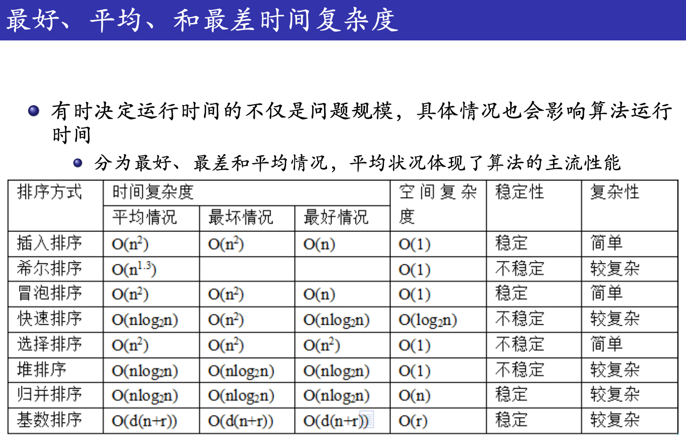

# 算法分析

注意：循环语句会多运行一次，以检查是否退出循环！心里有数，一定要是 $n+1$.

## 大 O 表示法

语句频度

: 语句可能重复的最大次数。语句频度是针对每条语句的。

时间复杂度

: * 设算法所有语句的语句频度的和是 $T(n)$ 

: * 引入函数 $f(n)$​，满足当 $n$ 趋向无穷大时，$f(n)$ 与 $T(n)$ 为**同阶无穷大（注意：数学定义是同阶或高阶无穷大）**，则算法的时间复杂度 $T(n)=O(f(n))$​​.

### Big-O 的数学含义–函数渐近的界

1. 最坏复杂度 $O(f(n))$ ，最好复杂度 $\Omega(f(n))$，更坏复杂度 $o(f(n))$，更好复杂度 $\omega(g(n))$.
2. $\Theta(f(n))\Leftrightarrow O(g(n))$ 且 $\Omega(g(n))$，即复杂度稳定。



 ### 统计语句频度的有力工具

Hit 表示执行了几次

```python
from line_profiler import LineProfiler
```


```bash
mmv '*.html' '#1.md'
```

为特定页面在 YAML 头中添加自定义 CSS 样式表：

```
---
custom_css: custom.css
---
```

