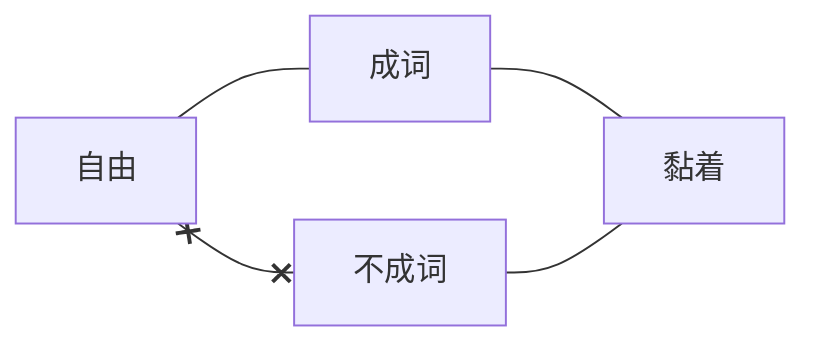

# 语法

## 1\.4 语法单位

### 1\.4.1 语流切分和语法单位的类别

语法单位：为研究语法而从语流中切分出的大小不同的语言片段。

语法分析的三个基本手续：**==切分，归并，归类==**。

* **切分**：把语流中相邻的语言成分的边界划分开，即把说出来的一串串话整体切成较小的片段，以观察较小的片段是如何组成较大片段的。
* **归并**：根据语音和意义的同一性把切分出的片段分成不同的单位或归并成同一个单位。
* **分类**：在归并的基础上根据语言成分的语法性质对语言成分进行类的划分。

> (1)那/一/把/大/锁/把/这/一/扇/大/门/紧紧/锁/住/。
>
> 归并：14个**个体词（type）归并为12个概括词（token）**，标准为**同一性**（语音形式相同，词义相同）：
>
> * 那 (1)，—(2、8)，把(3)，大(4、10)，锁(5)，把(6)， # ==连读变调引起的语音不同应忽略==
> * 这(7)，扇(9)，门(11)，紧紧 (12)，锁(13)，住(14)
>
> 这12个概括词分属8个词类：
>
> * **指示词**：那、这；
> * **数词**：— (2)、—(8)；
> * **形容词**：大(4)、大(10)；副词：紧紧；
> * **介词**：把(6)；
> * **副词**：紧紧；
> * **量词**：把 (3)、扇；
> * **名词**：锁(5)、门；
> * **动词**：锁(13)、住；

语法单位的层级性（传统体系）——语素、词、词组、句子

### 1\.4.2 语法单位系统及其层级

#### 语素(morpheme)

从性质上说，语素是最小的音义结合体；从功能上说，语素是最小的构词单位。

所谓“最小”，是切分出的片段内部不再包含更小的音义结合体。

火车：2个语素

人、有、来、大、的、了（成词语素）

民、苹、机、惑、食（不成词语素）

通常一个汉字就代表了一个语素，但语素和汉字并不完全对应，比如外来词、联绵词、叠音词；合音词（俩、仨、甭）。

**语素的判定方法**：对比替换法。某个片段如果在其他环境也能找到在**语音形式**和**意义**上与之**相同**的片段，那么这个片段是**有意义的**。

> 人民：人口、人权、人情、敌人、古人
>
> 民主、民生、草民、选民
>
> 学习：学问、学生、学术、留学、数学；练习、复习、习作
>
> 桌子：桌椅、圆桌、凳子、刀子

注意替换的同一性问题：马虎——老虎、马匹（马、虎不具备同一性）、杜鹃——杜绝、婆娑——老婆

语素的辨认不容易，尤其是在探讨语素的同一性时。异体字、多义字、多音字、多音多义、同义字、同音字。

| 经济（经世济用） | 逻辑（外来词） |
|----------|---------|
| 书信 | 信用（意义来源相同，但在现代汉语意义有一定差别） |
| 白纸 | 白吃白喝（意义有相通之处，但词性已经不同了） |
| 雕刻 | 时刻（意义来源相同） |
| 菠菜 | 菠萝 |

#### 语素的不同概念

##### 自由语素 vs 粘着语素

自由即单说，单说的判断标准是 ==能否单独回答问题== 。黏着即不能单说。

> 你学不学？学
>
> ×你习不习？×习
>
> 这是什么？鸡
>
> 这是什么？鸭子

遭遇困境：有些词不具备某种提问的方式，或者某种提问方式表示的语法意义与词本身有差别。

> ×我让你姓周，你姓不姓？（考虑「我姓周」）
>
> 这是什么？军棋、象棋、×棋（考虑「下棋、赢棋、杀棋」）

**各种特殊情况**：方言因素（鞋vs鞋子，面vs面条）、语体音素（左手一只鸡，右手一只鸭）、群体因素（金-元素vs金子，虎-物种vs老虎）

##### 成词语素 Vs 不成词语素

成词，主要指“单用”，单用指的是可以单独 ==充当句子成分== （主谓宾定状补）。

> 马：马跑得快。 看见一匹马。
>
> 学：学知识。 没学
>
> 很：很高、很愚蠢
>
> 副：副县长、副校长

虚词的成词身份，靠“剩余法”。剩余法——在一个语言片段里，把成为词的部分提开，剩下的东西既不能看作它前面的或后面的词的一个部分，就不得不承认它们本身是词。

> 漂亮**的**花朵→的
>
> 学习**了**→了
>
> 北京**和**上海→和

不成词语素一定是黏着语素，自由语素一定是成词语素。

##### 定位语素 vs 不定位语素

**定位语素**：-子 -儿 -头 阿- 初-

**不定位语素**：人——人口、人权、人情、敌人、古人

民——民主、民生、草民、选民

**定位语素一般是词缀。词缀位置固定，一般没有词汇意义，只保留语法意义。**

**类词缀**：类词缀在现代汉语中构词能力很强，**词汇意义还比较实在**，一般也不定位，类词缀构成的新词以三音节为主。

| 总书记 总顾问 总导演 零首付 零距离 零增长 追星族 工薪族 月光族 研修生 实习生 后进生 综合型 敏感型 清爽型 珠宝商 赞助商 开发商 饲养员 特派员 观察员 QQ秀 美女秀 真人秀 限价房 二手房 廉租房 | 反常规 反潮流 反收购 伪科学 伪政府 伪球迷 足球热 国学热 钢琴热 咆哮体 梨花体 羊羔体 IT业 通讯业 投资业 偏执狂 自恋狂 工作狂 公开赛 测试赛 辩论赛 团购风 退房风 返券风 数据论 阴谋论 集合论 |
|-----------------------------------------------------------------------------------------------------|-----------------------------------------------------------------------------------------------------|

##### 活性语素 vs 惰性语素

**构词能产性强的语素称为活性语素。**

> 人：主人、动人、高人、迷人、女人、人才、亲人、家人、行人、爱人、小人、友人、男人、才人、人们、人间、雪人、本人、、成人、为人、古人、老人、吓人、诗人、生人、送人、别人、新人、怕人、商人、军人、人气、法人、来人、做人、铁人......
>
> 秸：秸秆 麦秸 豆秸
>
> 嗽：咳嗽 痰嗽 清嗽
>
> 璃：玻璃 琉璃 璃灯

##### 剩余语素

> 苹果、鲫鱼、鲳鱼、卡车、冰淇淋、cranberry（蔓越莓）、strawberry、blueberry（布隆菲尔德）、?蝴蝶
>
> 苹果≠果，说明「苹」具有区分意义，如果承认「果」是语素，那么「苹」就是剩余语素。
>
> 蝴蝶的「蝴」、骆驼的「骆」均不是一个语素。

##### 并合语素

两个语素并合成一个语素：俩=两+个，甭=不+用

##### 简称语素

> 骆驼：驼毛、驼峰 羊驼（驼是骆驼的简称，驼是简称语素）
>
> 马拉松：全马、半马、迷你马
>
> 蝴蝶：彩蝶、粉蝶

#### 另一种认识：每一个汉字都有意义!

汉语母语者倾向于每一个汉字都有意义，将每一个单字都赋予意义。

每一个汉字都有意义，都是一个语素或一个潜在的语素，单音节现象的压倒优势使得人们把没有意义的音节也看成有意义。例如把“葡萄”写做“蒲桃”。上海人管末班电车叫“赖四卡”(last car)，因而把倒数第二班车叫“赖三卡”。又如“拖拉机”。

赵元任《汉语口语语法》吕叔湘译本第79页

在中国语言里单音节十分重要，在多数情形中，每一个音节都是有意义的，不但文言如此，白话也是的。……有好些字在白话中是不独用的，可是你会发现他在合用时仍是有意义的，不像好些外国语例如mon, o, syl, lab, ic那些单音节是没有意义的了。（赵元任《中文里音节跟体裁的关系》）

> 啤酒：生啤、扎啤
>
> 垃圾：圾飞狗跳  手无缚圾之力
>
> 尴尬：尬聊、尬唱 embarrassment，?Barrass talking—— # ==考试时说，「尬」是「尴尬」的简称语素。==
>
> 蝙蝠：青翼蝠王 食鱼蝠
>
> 马拉松：半马、全马、牛拉松、狗拉松
>
> 玻璃：琉璃 玻罩
>
> 蘑菇：鲜蘑、口蘑、平菇、香菇、菌菇
>
> 蜻蜓：北京玉蜓桥
>
> 粉丝：霉粉；钢丝、黑丝
>
> 的士：打的；巴士、的士、蹬士
>
> 为什么“沙发”不是“馊乏”、“杀伐”、“傻罚”? 「沙」→柔软义。「渣打银行」大概率是英国人翻译的。

### 词

从功能上说，词是最小的造句单位；从性质上说，词是最小的独立运用的语言单位。“独立运用”是指与别的成分临时组合在一起或单独成句。就是我们前面说的“单用”。

> 桌子上有水/他很有趣（√最小）
>
> 一块白布/一棵白菜（√最小）

所谓“最小”，指词的内部不再包含更小的独立运用单位。

一个成分是否是词，不是看这个成分的能否独立运用，而是看这个成分是否处在独立运用的实际状态中。

> a.他骑着**马**。vs 他是**马**术教练。（词vs语素）
>
> b.小明充当了一个**打**手。vs 小明没有**打**别人。（语素vs词）

### 词组(word group或phrase)

词组又叫短语，指词与词的组合体。

实词与实词的组合：新书、马上走、速度快、看电视、洗干净、充实提高、去公园玩

实词与虚词的组合：新的、走了、被他（拿走了）、正确与否

词组与词的功能相同，都是用来造句。

### 如何区分词和词组

#### 词组与复合词的若干判断标准

**第一条　扩展性标准**：词内部的组成成分之间一般不可扩展，而词组内部组成成分之间一般可以扩展。【注意：扩展后不能**改变意义**。】

> 白菜——×白的菜
>
> 白纸——白的纸
>
> 肉麻——×肉很麻
>
> 脚麻——脚很麻
>
> 红苹果——红的苹果：认为「红苹果」的扩展性是有限的。「红的苹果」√「红那个苹果」×。认为「红苹果」处于词和词组的边缘，在我们的系统中认为是词组。
>
> 汉语专业——汉语的专业×，汉语师范专业

**第二条　意义透明性标准**：词组的意义是透明的，即整体的意义可以由组成成分的意义推知，而词的意义可能是不透明的。

* 词组意义=词义+词义+结构的语法意义
* 词义≠语素义+语素义+结构的语法意义

> 白菜≠白+菜+修饰义 （萝卜是白的菜，但不是白菜）
>
> 白布=白+布+修饰义
>
> 买水果=买+水果+动作支配义

* 我们认为，**名词和名词构成的偏正结构**，一定有 **==“谓词隐含”==** 现象的发生，无法达到意义的透明性。**世界知识的参与，刨去世界知识感知不透明性。**

> 飞机厂——制造飞机的工厂 塑料鞋
>
> 玩具店——售卖玩具的商店 舞蹈鞋
>
> 铁栏杆——用铁做的栏杆 老人鞋
>
> 物理老师——教物理的老师 户外鞋
>
> 黄金市场——买卖黄金的市场 高跟鞋
>
> 白银首饰——用白银制作的首饰
>
> 梅雨季节——下梅雨的季节

**第三条　结合面的宽窄**（在意义允准的情况下）：结合面窄，就说明是凝固的，受到选择限制，是词。结合面宽，就是组合不受限制，是词组。绝大多数的形容词结合面都非常窄。

> 吃了：死了、糟了、完蛋了、杯具了
>
> 吃饭、吃面、吃大餐、吃蛋糕
>
> 高山——×高树
>
> 重物——×重包
>
> 冷饭——×冷手
>
> 薄纸——×薄灰 ==(?)==
>
> 注意：红纸——×红草，不能证明“红”的结合面窄（因为“草”一般没有 “红”的）。

**第四条　韵律标准**：双音节是词的标准韵律形式，倾向为词，四音节倾向于词组。三音节成分\*\*==1+2趋向为词组，2+1趋向为词。==\*\*

**第五条　词不可以做“并列删减” (coordination reduction) 操作，短语可以做“并列删减”操作**。

> 火车+汽车 → ×火和汽车
>
> 吸烟+吸毒 → ×吸烟和毒
>
> 买米+买菜 → 买米和菜

考虑到「中小学」「牛羊肉」这些情况，我们认为这条标准在执行的时候一定需要添加连词（「和」「与」等）来判断。

> 中学+小学→×中和小学
>
> 牛肉+羊肉→×牛和羊肉

\

吃面—吃饭1、吃饭2—吃亏。**==符合3条标准就可以判定为是词。==**

\*\*第六条　组成成分是否成词。\*\*内部有不成词语素的，一般为词。

> 鸭蛋 驼毛
>
> 兔肉 修理工

但要注意，这一条只是一条辅助标准。因为内部都是成词成分，并不意味着整个结构都是词组，例如：

> 开关 左右
>
> 买卖 学问

#### 如何区分词和词组

讨论：

> 驼毛 羊毛 鸡蛋 鸭蛋 马蛋（马粪） 金蛋
>
> 大树 理发
>
> 买房 买米
>
> 吃饭 喝酒 吃亏
>
> 小朋友 小房间 苹果树  苹果公司
>
> 北京大学 中文系 汉语专业
>
> 亚洲冠军 蹉跎岁月