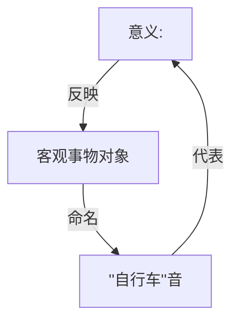
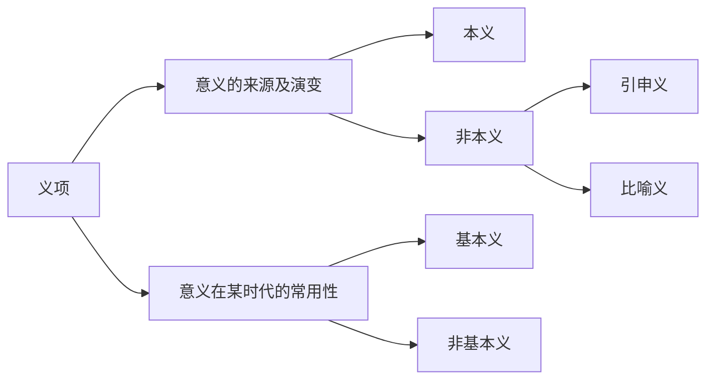

# 词汇

## 词和词汇

### 什么是“词汇”

**词汇**是语言中词语（词和固定语，个体概念）的**总和**（集合概念）。

> 【注意】词汇不仅包括“词”，还包括“语”。

**“语”**指长度大于一般的词（即由词和词，或词和语素构成；3个音节以上）、性质作用相当于词（凝固的固定的）的固定语，如**熟语**、**专门用语**、**习用词组等**。

熟语——成语、歇后语、惯用语；专门用语——专门的学科、部门使用的固定用语；习用词组——总而言之、言而总之（不好归类的）

讲授重点在**词**。

### 什么是“词”

**词**是语言中 <u>最小的</u> <u>能独立运用的</u> <u>音义结合体</u>，是 <u>造句的基本单位</u>。

**词的性质与功能**：①词都有一定的意义。②词都能独立运用（实词的“单独使用”，指可以单说/充当句子成分，虚词的“单独使用”，指可以单独地表示一定的语法意义作用）③词是<u>最小</u>的造句单位。④词有<u>*固定的*语音形式</u>。

> 【注意】实词和虚词的意义是不一样的。虚词——语法意义也是意义。

---

> 【实例】
>
> 1. 每个字只表音节，无意义：徘/徊，咖/啡，垃/圾，不是词。
>2. 不能单独使用：友，丽，视。
> 3. 不是最小的造词单位：大苹果，不新鲜。
>
> 的，和，吗，虽然，但是——可以单独地表示一定的语法意义，是词。

### 确定词的一般方法

1. 能单说，能单独回答问题的是词；（仅适用于单音节语言单位。对于多个成分组成的语言单位，这个方法不是充分条件。比较：你买什么？纸/白纸。这种纸好不好？好/不好。你买不买？买/不买）

2. 有的词不能单说，但能充当词组/句子成分的是词；

   1. 现代汉语口语中不单说，但在一般书面语中用作句子成分的语言单位；
   2. 现代汉语中单音节的区别词（非谓形容词，不能做谓语的形容词）；
   3. 现代汉语中的一些量词和方位词。

3. 扩展法

   在多个语言成分组成的语言单位中插入**别的语言成分**，如果得到新的语言单位可以接受，则原来的语言单位是词组；如果得到的新的语言单位不可以接受，或者意义有很大改变，则原来的语言单位是词。

   扩展法在应用时，要使插入别的语言成分后产生的语言单位的结构，同原来语言单位的结构一致。

   扩展法有局限。

| 条目         | 实例                                                         |
| ------------ | :----------------------------------------------------------- |
| 2(a)         | 楼（盖楼）、春（一年之计在于春）、房（买房）                 |
| 2(b)         | 金（金戒指，\*买金）、男（男的，\*这个人是男）               |
| 2(c)         | 两，金，内，外                                               |
| 3            | 白字→\*白的字（错别字）；白纸→白的纸 海带→\*海的带（水产品）；海浪→海的浪 改善→\*改得善；吃饱→吃得饱 大家→\*大的家；小河→小的河 黑板→\*黑的板；好书→好的书 山峰→\*山的峰；山高→山很高 |
| 扩展法的局限 | 快走，刚来 鸡蛋，鸭蛋 羊毛，驼毛                     |

> 【补充】
>
> 特殊的词——离合词（动词性成分+名词性成分），如结了婚，成了家，是可以扩展的。吃醋有点像离合词（意思也不完全对应）。
>
> 词组——透明的，“字面意思”，词——不透明的，“言外之意”
>
> 最终看区分词和词组的目的是什么。如，面向计算。

4. 剩余法

   把句子中所有可以单说、可以用作句子的主要成分的语言单位除开，剩下不能单说，也不是一个词的一部分的，是词。（是组词造句的一个单位）

   虚词就是用剩余法判定的。

> 【实例】<u>为</u>美好<u>的</u>明天努力<u>吧</u>！

### 词和语素

**语素**是语言中 最小的 音义结合体（允许不能独立运用，不一定能），是构词的基本单位。

> 【实例】
>
> 黑板，手机，司机，辅导，
>
> 哥哥/妈妈^认为是两个相同语素^
>
> 明^公开的^信片，驾驶员，
>
> 胖子^两个语素。词缀“子”是虚词，有语法意义，使形容词“胖”变成名词，也算是意义^，拍子
>
> 老·子^原指父亲，后转指自己。“子”轻声，为词缀，使形容词“老”变成名词^
>
> 沙发/巧克力/扑通/麦克风vs沙尘/灵巧/通过/风雨
>
> 【补充】
>
> 词的读音是固定的。如果词的发音发生改变，一般都形成新词。
>
> 同样的汉字在不同的词中的含义是不一样的。有意思，在此处没关系—只表音节

#### 单音节语素　多音节语素　汉字与语素的对应关系

* **单音节语素**：人，黑，跳，民，丽，视，吗（绝大多数）
* **多音节语素**：
  * 徘徊，伶俐——联绵词
  * 咖啡，沙发，巧克力，麦克风，奥林匹克——音译词
  * 淅淅沥沥——拟声词

通常一个汉字对应一个语素（语素性文字），但也有其他情况：

* **多个汉字对应一个语素**：上面多音节语素的例子。
* **一个汉字对应多个语素**：俩，仨，廿，卅，兛（千克），瓩（千瓦），浬（海里）

#### 成词语素和不成词语素

根据语素能不能成词进行分类：

* **成词语素**——直接成词+跟其他语素结合成词
* **不成词语素**——不能直接成词，只能跟其他语素结合成词

#### 词和语素的异同点

* 相同点：语言单位（功能上）、音义结合体（性质上；都是有意义的）

* 不同点：性质不同（能独立运用/不一定能独立运用）、功能不同（构词的/造句的）

### 词和字

词是语言单位，字是**记录**语言单位的**书写单位**。字本身的音和义来自于词。

词、语素和字的关系比较复杂。

1. 一个字表示一个词：山，水，挖，深；

2. 两个以上的字表示一个词：

   人民/人民币（人民→语素组），研究/研究生（研究→语素组），明信片（明信→语素组）

   咖啡，巧克力，歇斯底里；

3. 一个字表示不同的词：

   发音一样——米1，米2，打1，打2（打3，量词，读阳平）

   发音不一样——还1，还2，传1，传2

4. 不同的字表示同一个词：繁简字、异体字。

> 【案例分析】
>
> 他 喜欢 踢 足球。【4词，6字，6语素】（喜欢→2语素，足球→2语素）
>
> 爱因斯坦 是 世界 著名 的 科学家。【6词，13字，10语素】
>
> 很 多 人 爱 花 钱 买 花。【8词，7字，8语素】（汉字按不同的汉字算）

## 词的构造

### 单纯词

单纯词是由一个语素构成的词。

因此，单纯词不能从语素的角度来分析。我们从音节的角度来分析。

> 【实例】
>
> 单音节单纯词【绝大多数】：人、美、做、你、那、吗
>
> 多音节单纯词：
>
> * 联绵词（两个音节连在一起表示一个意义，不能分开解释各个音节意义的词，都来自于古代汉语）：
>
>   * 双声词——伶俐，忐忑，吩咐，参差
>   * 叠韵词——哆嗦，混沌，徘徊，逍遥
>   * 非双声叠韵——蝴蝶，芙蓉，垃圾，鸳鸯
>
> * 叠音词
>
>   * 太太，姥姥，猩猩，蝈蝈，依依（《诗经》：树轻柔样，后发展出恋恋不舍义，但都需要重叠为条件）
>
>     **注意**：奶奶是单纯词，妈妈是合成词
>
> * 译音词：咖啡，沙发，巧克力，麦克风，奥林匹克
>
> * 拟声词：扑通，咕咚，轰隆隆

### 合成词

由两个或两个以上语素构成的词。

#### 语素的分类

词根——有**实在**==**意义**==，能自由出现在合成词不同==**位置**==的语素。

词缀——没有**实在意义**，且不能自由出现在合成词各个**位置**的语素。

> 【注意】实在意义与意义
>
> 【举例】
>
> 马戏，马夫，骏马，野马，露马脚，千里马
>
> 
>
> 序数词的“老”
>
> “老”→构成名词。老师的老不是老头的老，有实在意义

#### 合成词的构造类型（16类）

复合构词：词根+词根

附加构词：词根+词缀

传统6大类，当前扩大为16类。参考了郭锐老师的研究成果

与**词组**的构造有直接的关系，因为合成词很多是由**词组**演变而来的，与句法紧密相关。

而且，我们对合成词构造类型的分类，是从意义角度的，而非从所谓“语法”角度。

**注意分析语素**

**主谓式（陈述式）**：在意义上，前一个语素是被说明的对象或动作行为的主体，后一个语素表示说明的情况或某种行为动作（0.77%）

> > 实例
>
> 年轻，地震，心疼，眼花，肉麻，政变
>
> > 注意
>
> 注意“雪白”：状（像雪一样白，比喻）中，不要判断成主谓结构。火热，冰凉，鼠窜，蛇行，鲸吞，蚕食，龟缩，鼎立。

**联合式（并列式）**：在意义上前一个语素和后一个语素的地位平等（25.27%）

> > 实例
>
> 两个同义语素组合：道路教授，离别
>
> 反义：开关，买卖，是非
>
> 相关：手足，江山，国家
>
> > 注意
>
> 注意仔细分辨：头绪（绪→丝头），粉（粉刷）饰，针灸（两种中医的方法），应该
>
> 组合形成的词，词性与原语素所对应词的词性可能不对等。如果是词组，这里是对等的。述宾式、状中式亦同。

**述宾式（支配式，动宾式）**：前一个语素表示某种动作行为，后一个语素表示动作行为支配的对象。（11.89%）

> > 实例
>
> 刺眼，失踪，伤心，悦耳，雪耻，司机（转指人），司仪，司（管理，发布）令

**述补式（补充式）：**在意义上，前一个语素表示某种动作行为，后一个语素表示动作行为的结果或趋向，后一个语素是对前一个语素的补充说明。（3.79%）

> > 实例
>
> 改善，提高，减少，增加，打倒，看见（“见”有结果义），割断，推翻

**定中式**：在意义上后一个语素表示一个对象，前一个语素是对这个对象的修饰或限制（39.1%）。

> > 实例
>
> 火车，电灯，热情，高级

**状中式**：在意义上，后一个语素表示一个行为动作或性质状态，前一个语素是对这个行为动作或性质状态的修饰或限制（9.89%）。

传统观点，偏正（主+修饰性）

> > 实例
>
> 热爱，公审
>
> 速写，外交
>
> 痛快，痛恨（痛——尽情地）==语素也可能是多义的！==
>
> +冰凉

**名量式**：前一语素为名词性语素，后一语素是能与之搭配的量词性语素。这种构词方式在词组中未见，显示出词的构造与词组构造的不同之处（0.12%）。**与述补的区别：体词性vs谓词性**

> 车辆　纸张　船只　人口　花朵

**数量式**：数词性+量词性（0.14%）（勉强叫定中也行）

> 一点儿　一些　一生　两边

**方位式**：实词性+方位词性，形成“参照-方位”关系（0.44%）

> 空中　地上　野外

**连谓式**：两个谓词性语素的连用，表示连续发生的行为动作（2.26%）（和联合容易混，***==有时间先后==*）**

> 报考，进攻，攻占，入侵，选购，签发，查处

**复量式**：多个量词性语素连用（0.01%）

> 人次，架次，吨公里，千米小时

==以上都是实词性语素，下面出现虚词性语素==

**介宾式**：两个语素构成介词和介词宾语的关系，通常是前一语素为介词性语素，后一语素为介词宾语。（0.24%）

**虚构式**：虚词性语素与其他语素相结合的构词方式。（0.72%）

> 有的　所以　除了　虽然

**截取式**：两个语素本不构成直接成分（不在一个层面），但在词汇化的过程中发生重新分析，凝固为一个词（1.36%）

> 动辄　而立　极其

**重叠式**：指相同语素的重叠的构词方式（0.59%）

> 白白　刚刚　偏偏
>
> 妈妈　哥哥　姐姐　娃娃（与**==单纯词中的叠音词——奶奶，姥姥==**区分！）

**附加式**：词缀语素和词根语素相组合的构词方式（3.43%）

> | 位置 | 举例                                                         |
> | ---- | :----------------------------------------------------------- |
> | 前缀 | 阿姨　阿Q　老师　老公　老鼠 第一　第二　第三　(大年)**==初（也是词缀）==**二 |
> | 后缀 | 鼻子　瞎子　拍子　夹子 石头　来头　念头　甜头 鸟儿　盖儿　短儿 胖乎乎　圆乎乎　脏兮兮 灰溜溜　稀溜溜　热腾腾【双音节词缀】 |
>
> 姑娘家，老人家“家”→词缀
>
> 突然，偶然。
>
> 词缀一般都是轻声，然例外。

首先要知道词义→分析语素→得到结构

定中+状中≈48%

联合≈25%

述宾≈11%

述补≈3.79%（）

### 合成词的构造层次

一般用二分法
$$
\underbrace{\underbrace{\text{图　书}}_{\text{联 合}}　馆}_{定 中}
$$

### 容易混淆的合成词的构造

胖子、拍子——独子，鱼子

信儿，画儿——孤儿，健儿

酸**性**、中**性**、会**员**、队**员**、农**夫**、渔**夫**——我们认为只能算“**类词缀**”，把其当成词根分析。

## 词的意义

### 词义是什么？

词义是词的内容，是对客观事物现象的反映

“自行车”的词义反映着自行车的几个特点——①陆上交通工具②有两个轮子③人骑在上面④用脚蹬着前进

### 词义的内容

#### 词的概念义

词的概念义是词义的核心部分，是对客观事物本质特征的反映。

- 词义可以反映各种具体的和抽象的物。
- 词义可以反映各种动作行为变化。
- 词义可以反映各种性质状态。
- 词义可以反映客观中并不存在的事物现象。

#### 词的附属义

人在表达概念义时所附着的主观态度、语体色彩等特征。

1. **感情色彩**：词义所附带的人们对客观对象的态度或感受。分成褒义、中性和贬义。【试比较：鼎力—极力—大肆；老人—老骨头；雄心—野心】

   注意，感情色彩的分析**要以义项为单位**。 

2. **语体色彩**：一些词由于经常在特定的语体中使用，带上了某种语体特有的色彩。【试比较：书面语——通用——口语；恐吓—吓—吓唬；头颅—头—脑袋；洗涤—洗】

   **【插图】**

   一般来说，包含词缀的词/后一个语素是轻声的，常是口语词。

   如果一个双音节词中包含一个在现代汉语中不能单独使用的语素，这个词一般是书面语词。

### 概念义的分析——词义成分模式分析法（词义内部的分析）

#### 表名物的词意义分析

表名物的词意义一般分解为两个方面：特征和类别。

|      | 特征                     | 类别 |
| ---- | ------------------------ | ---- |
| 渔具 | 捕鱼或钓鱼的             | 器具 |
| 胖子 | 肥胖的                   | 人   |
| 车库 | 专门用来停放车辆的       | 库房 |
| 家产 | 家庭所有的               | 财产 |
| 大路 |                          |      |
| 国仇 | 因外国的侵略而产生的     | 仇恨 |
| 冻灾 | 因低温、冻害、冻雨导致的 | 灾害 |
| 小惠 | 微小的                   | 恩惠 |
|      |                          |      |

什么特征？具体

#### 表动作行为的词意义分析

表动作行为的词词义内容复杂，它除了表示一定的动作行为外，往往还包含特定的行为主体、特定的关系对象，包含有对动作行为、对动作行为的主体、对动作行为关系对象的种种限制。

1. 包含动作主体（鸣叫、怒放）

2. 词义中也可能包含特定的关系对象（服（药）、捐（款））

3. 词义包含有对动作行为的各种限制，如：

   > 捣 用棍子等的一端 撞击 工具限制
   >
   > 扇 用手掌 打 工具限制
   >
   > 上升 由低处向高处 移动 方向限制
   >
   > 喝令 大声 命令 方式限制
   >
   > 冬贮 冬季 贮存 时间限制
   >
   > 抠 用手指或细小的东西 从里面往外 挖 工具、方向限制
   >
   > 春游 春天 到郊外 游玩 时间、空间限制

4. 词义包含多个动作行为。（勒 用绳子困住或套住 并用力拉紧）

5. 词义中包含动作行为产生的条件原因（养伤 因受伤而修养）

6. 词义中包含动作行为的目的（鼓掌 拍手，多表示高兴、赞成或欢迎；挂彩 悬挂彩绸，表示庆贺）

#### 表性质状态的词意义分析

表性状的词的意义一般可以分为两个方面：**<u>适用对象</u>**和**<u>性状特征</u>**，如

肥沃 （土地）含有较多的适合植物生长的养分、水分

繁茂 （草木）繁密茂盛

从适用对象看，表性状词的意义特征主要有三种情况：

1. 适用对象是一种或一类事物（危重、清净）
1. 适用对象是多个或多种事物（繁华、浓重）
1. 适用对象广泛，则不出现，如（细微--很小，结实--坚固耐用）

从性状特征看，表性状词的意义特征主要有三种情况：

1. 性状特征为一项（高强--武艺高超，优异--特别好）
1. 性状特征为多项（高亢--声音高而洪亮 繁杂）
1. 用主谓结构说明性状特征（清通--（文章）层次清楚、文句通顺；干瘪--（文辞等）内容贫乏、枯燥无味）

### 词义和语素义的关系（词义和构成它的语素的意义的关系）（词义外部的分析）

对于单纯词，构成它的语素的意义，**就是词义**。对于合成词：认错、父母；黑板；口齿；红娘；——耳目；壁画、东西。

有哪些关系？

1. 语素义直接完全表示词义

   1. 语素义按照词的语法结构（构词方式）直接组合就是词义

      > 观赏 观看欣赏 受训 接受训练 珍品 珍贵的物品（\*珍惜物品）
      >
      > 定价 确定价格

   2. 语素义同词义相同或相近

      > 洗涤 蹊径 归拢

2. 用语素义的借代比喻用法表示词义

   1. 用语素义的借代用法表示词义【都是联合结构】
   
      > 须眉 巾帼 眉目 山水 嘴笨 卖嘴
   
   2. 用语素义的比喻用法表示词义
   
      > 梭鱼 像梭子一样身体细长的鱼
      >
      > 鼠窜 城府 虎穴 鬼胎 死胡同
   
3. 语素义仅表示词义的某些（部分）内容

   > 化学 研究物质的组成、结构、性质和<u>变化</u>规律的科学
   >
   > 红灯 <u>红</u>色信号灯，红灯亮时表示禁止通行

4. 合成词中部分语素失落原义

   1. 复词偏义

      > 窗户 人物 舟楫 忘记

   2. 语素义模糊

      > 奚落 用尖刻的话数落别人的短处，使人难堪
      >
      > 斯文 文雅
      >
      > 麻利 敏捷

4. 语素义不显示词义

   > 大方 冬烘 
   >
   > （隐语，黑话）二百五 丘八
   >
   > （在语言的发展过程中，语音或书写形式发生变化，找不到关系了）

## 多义词和同音词

### 词义的单位——义项、多义词和单义词

义项是词或语素在词典中的意义单位。一个词有多少义项，根据这个词在运用中意义的共同点来确定。

**义项的性质**　义项的划分有一定的相对性；

同一义项在运用中由于上下文、语境的不同会显示出差异，但我们并不给它新的义项。什么样的界限给义项？什么样的界限不给？

**单义词**　只有一个意义的词，在词典中也表现为只有一个义项。

**多义词**　有多个意义的词，在词典中也表现为多个义项。

### ==多义词的类型==

#### 词义义项和语素义义项

**词义义项**　能作为词来运用的义项

**语素义义项**　只存在于合成词、固定结构中的义项。（单音节多义词才可能会有）

区分词义义项和语素义义项，可以避免把一个词的语素义义项当做词义义项来使用的毛病。

**注意**：<u>给语素义义项标词性是不科学的</u>。

#### 多义词的类型

1. 全部义项都是词义义向的多义词（多音节词的义项全是词义意向）

   > 迷——球迷

### 本义、基本义、引申义、比喻义

本义：文献记载的词的最初的意义。

基本义：词在现代最常用最主要的意义。

* 基本义同本义不一致
* 基本义同本义一致

引申义：引申发展出来的意义

* 有的引申义是从本义/基本义发展出来的（秒杀、锯v）

* 有的引申义是从引申义在发展出来的（冰→寒冷→）

比喻义：

### 同音词及其类型

1. 同音同形
2. 同音异形
   1. 形全异
   2. 形一同一异

### 多义词和同音词的区别

区别：看现时词义有无联系

四种情况：

1. 词源上有联系，现时感觉有联系——多义词
2. 词源上无联系，现时感觉无联系——同音词
3. 词源上有联系，现时感觉无联系：刻1v，刻2（时刻，n）——强调来源多义，重视现实角度同音
4. 词源上无联系，现时感觉有联系：站1v，（站2，n，站点，来自蒙古语），来源无关，现时感觉有关——还是认为是同音词

## 同义词、反义词、上下位词

同一个层次的词：同义反义

注意区别——上下位vs整体与部分

### 同义词

#### 同义词的类型

等义词。等义词意义完全相同，在任何语境中都能替换，也叫绝对同义词。

近义词。意义基本相同，但是有细微差别的一组词，也叫相对同义词。

> **同素逆序词**——式样 样式 拦阻 阻拦；前后名称变；音译词与本土词；方言。

#### 同义词的辨析框架

* ==**概念义**==

  * ==**语义特征**==

    * 表名物的同义词：所属类别、事物特征。

      > 流言、谣言；设备、装备

    * 表动作行为的同义词：动作特点、动作行为的主体、动作行为的关系对象**等**。

      > 融化、熔化、溶化；退还、退赔；声援支援

    * 表性状的同义词：适用对象、性状特征。

      > 丰富、丰盛；粗鲁、粗暴；茂盛、旺盛（长势良好；植物vs植物/动物/人；多vs生命力强；还可指人的精力旺盛）

  * 语义轻重

    > 优良——优秀——优异

  * 个体与集体

    > 纸——纸张，词——词汇，树——树木，车——车辆，信——信件，人——人口

* 附属义

  * 感情色彩

    > 教师——教书匠，玉照——相片

  * 语体色彩

    > 哆嗦——颤抖，吝啬——小气

* 功能用法

  * 结合的词语

    > 侵犯——侵占，繁荣——繁华，商量——商榷；帮忙——帮助——帮

  * 充当的句法成分

    > 充分——充足，突然（可作形容词作谓语作定语，也可作副词）——忽然（副词）

有的词概念义略有差异，同时感情色彩和语体色彩也有差别，如：

> 责备——数落，行为——行径

### 反义词

#### 反义词的类型

绝对反义词：肯定一方必否定另一方，否定一方必肯定另一方的反义词（矛盾关系）

相对反义词：肯定一方必否定另一方，否定一方不必肯定另一方的反义词（反对关系）

> 黑白 大小 凉热

#### 语言反义词与言语反义词

语言反义词这个不讨论

**语言反义词**——脱离上下文皆可成立的反义词，表示的是普遍对立的意义范畴。

**言语反义词**——在一定的上下文中，一定的条件下，表示了现实生活中非此即彼的对立或两极性的对照，成了反义词。

> 不做风前的杨柳，要做岩上的青松。
>
> 我惭愧，我终于还不知道分别铜和银，还不知道分别布和绸，还不知道分别官和民。

## 词的释义

### 释义常用的方法

1. 用同义近义词语——常用词解释非常用词，现代汉语解释古代汉语。

没有指出本质特征；还会造成互训

2. 用反义或相关词语的否定式——性状词 半：不完全
3. 分别解释构词语素的意义——合成词 真诚 真实诚恳
4. 定义式释义：种差+类词语——名词
5. 描写说明式：对象+状态（动作特点）
6. 用“形容……，……的样子”等词语说明描写（强调性状而已，本质还是描写说明）——性状词
7. 指明比喻义

### 释义基本要求

1. 准确，恰当
2. 通俗明了
3. 避免循环
4. 词性要一致
5. 简明扼要，别太啰嗦
