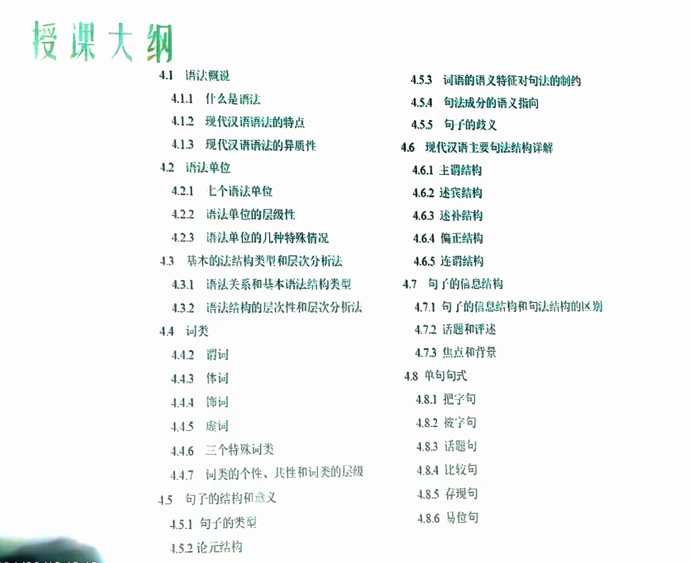
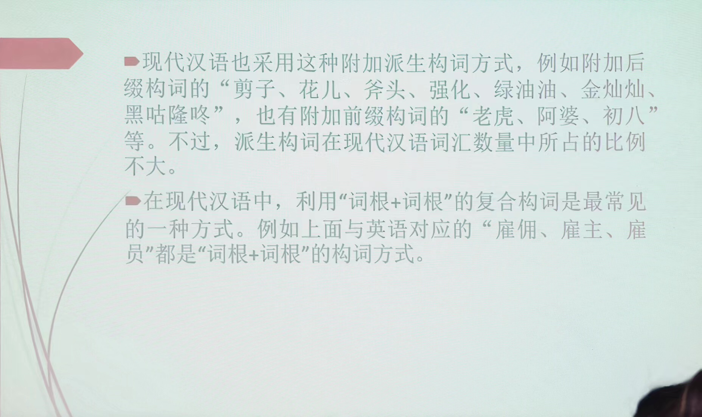
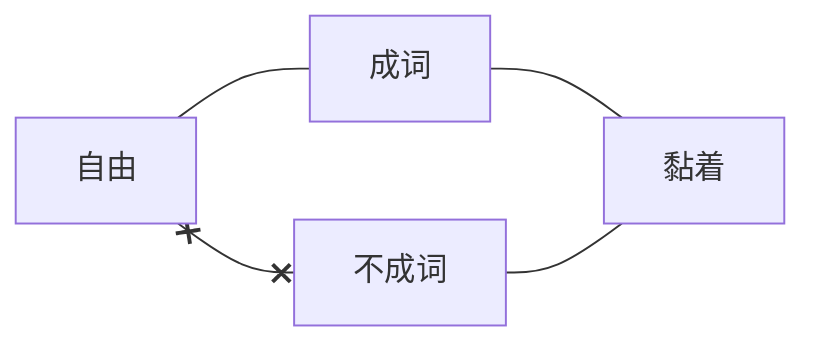
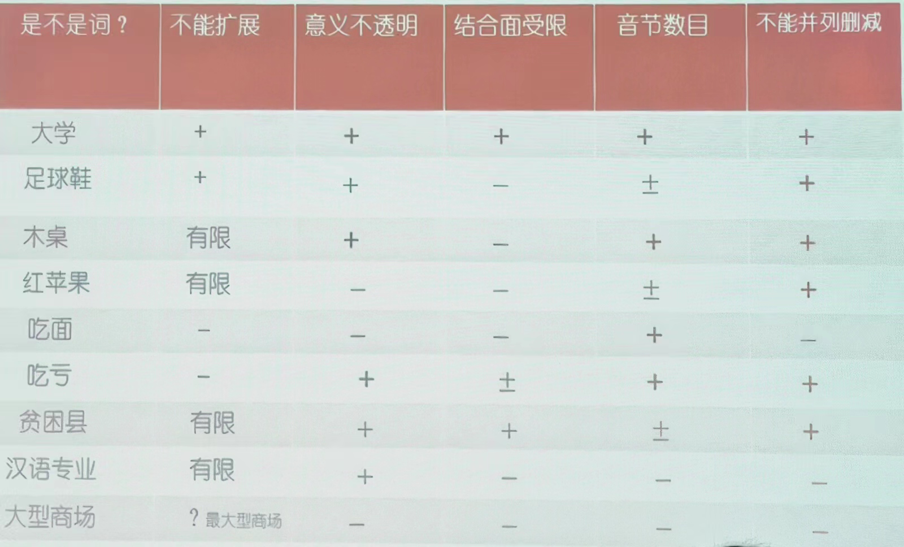
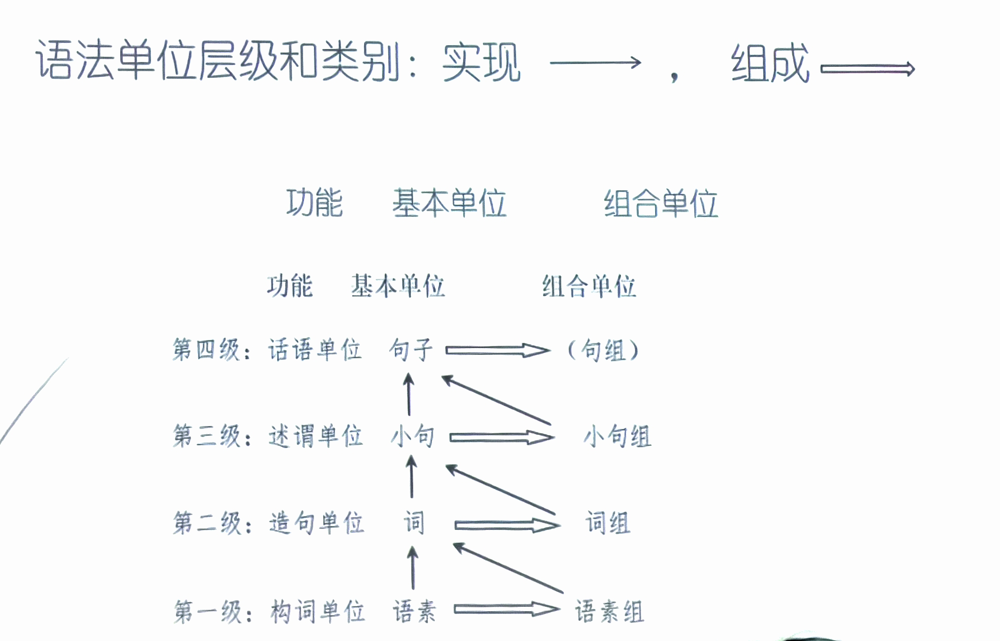
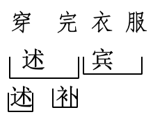

# 现代汉语（下）绪论：语法概说

???+ "课堂要求"

    周韧 zhouren@126.com
    
    期中考试 20240422 10:10-12:00 （五一长假之前的最后一次课）
    
    期末考试 20240616 08:30-10:30
    
    双周周五上午 1~2 节可能补课

    教材：自编教材
    
    参考书：红皮两本（商务印书馆的简单一些）、朱德熙《语法讲义》《语法答问》、吕叔湘《汉语语法分析问题》、马真《简明现代汉语语法教程》。朱德熙、吕叔湘合作

    成绩计算：30%平时（作业+考勤+课堂表现）+20%期中考试（课堂闭卷笔试，20分卷）+50%期末（闭卷笔试，100分卷）
    
    作业质量：平时作业不看对错、主要看态度。独立完成、认真思考。

授课大纲

最快讲到存现句。一般讲不完。

提问与讨论：课堂提问时间、微信群。考试前一周不接受提问。

## 语法概说

### 什么是语法

语法是词、词组、句子等语言单位的结构规律。语素怎样组合成各种结构的词，词怎样组合成各种词组，词组或词怎样形成各种句子，小单位用什么手段、方式组成大单位，存在一定的规律、规则，就是**语法**。

母语者对语法有着敏锐的语感。语感确实证明了语法的存在。

??? inline end "符号规则"

    ? 语感不太好 ＊不合语法

从小单位到大单位：

* 构词法：字→词
* 造句法：词→句
* 成章法：句→文

### 构词法举例

（1）词缀、类词缀

构词以双音节为主→构词以三音节为主（近30年来）

| 三音节 | 双音节 |
| -- | -- |
| 啤酒商、赞助商、开发商 | ＊酒商 |
| 水门、上课门 | ＊课门 |
| 咆哮体、梨花体、羊羔体 | ＊吼体 |
|程序员、上班族、小黑工、打工人……||

（2）缩写

文物管理局→文物局

自行车停放处→＊自行车处

啤酒经销商→啤酒商

文化传承者→＊文化者

（3）AB→AABB 的转化

注意语言共时、历史、社会的差异。

### 造句法

* 不同词类的词在组合中受到的限制是不同的

  > [!example]-
  >
  > （1）以前他在广州工作 | 三年以前他在广州工作（以前更像方位词）
  >
  > 过去他在广州工作 | ＊三年过去他在广州工作（过去更像时间名词）
  >
  > （2）不打仗 | ＊不战争（动词与名词）
  >
  > 这边比那边凉 | ＊这边比那边冰凉（表示程度更深；冰凉是状态词、凉是形容词，典型的差异是能否受到“很”的修饰）
  >
  > （3）大量豪华客轮 | 大量豪华的客轮
  >
  > 大型豪华客轮 | ＊大型豪华的客轮
  >
  > 「大量」可以放在的字定语前，「大型」不行。「大量」是数量词，「大型」是区别词。
  >
  > 

* 同一词类特征的词，词义特征不同，可以影响词的组合限制。【对立→语法问题】

  > [!example]-
  >
  > （1）别理睬他 | 甭理睬他
  >
  > 别感冒了 | ＊甭感冒了
  >
  > （2）祈使句不能用「连忙」。
  >
  > 小明赶紧起床上学去了 | 小明连忙起床上学去了
  >
  > 赶紧起床上学吧！
  >
  > （3）「字」与「黑板」有附着，「脸盆」与「手」没有附着。
  >
  > 在黑板上写字 | 字写在黑板上
  >
  > 在脸盆里洗手 | ＊手洗在脸盆里
  >
  > 在燕南美食吃香锅 |  ＊香锅吃在燕南美食
  >
  > （4）「多少」修饰积极意义
  >
  > 哥哥比弟弟多少高一点 | 哥哥比弟弟稍微高一点
  >
  > ＊哥哥比弟弟多少矮一点 | 哥哥比弟弟稍微矮一点
  >
  > （5）严肃一点 大方一点
  >
  > ＊着急一点 ＊伟大一点
  >
  > 什么样的形容词可以进入 X+. 的祈使句？
  >
  > （6）对动作行为承受者的受影响性：打、吃影响大，想影响小
  >
  > 打了他 | 把他打了　想了他 | ＊把他想了　吃了饭 | 把饭吃了
  >
  > （7）双及物结构：句式也有自己的语法意义
  >
  > 张三送了一本书给李四 | 送给李四一本书
  >
  > 张三偷了一本书给李四 | ＊偷给李四一本书
  >

### 篇章法

老李买了一件羊皮大衣。那可是一件上好的大衣啊！＊那可是一张上好的羊皮啊！

羊皮是宾语里的定语，不是说话人的焦点、听话人听取的要点，是背景性的信息。

将一个宣窑磁盒揭开 | 揭开一个宣窑磁盒 宾语 焦点 回到宝玉

朱自清《荷塘月色》隐性的我。主语所形成的话题链（无主小句）何时出现显性的我？何时不能？何时两可？

研究现状：造句法、构词法研究充分，篇章法研究不够

---

* 歧义结构也说明了语法规则的存在

* 语法的个性与共性——英语语法与汉语语法（反身代词的指代、状语、动词、宾语的位置）——两条语法研究的目的与思路。互相补充。

索绪尔：自然语言的两个特点

* 语言「能指与所指结合」的任意性
* 语言的线性性：人类语言最大共性——线性序列

自然语言是一套音义结合的符号系统，但是，并不遵循严谨的数理逻辑。从自然语言所呈现的符号形式到表达的意义，中间有太多鸿沟、障碍需要补齐、克服。情感导向。

* 自然语言的隐含与冗余

??? example "1+1>2"

    1. 赶：加快行动，不误时间
    赶论文、赶公交、赶绿灯、肝论文?
    2. 偷后场 偷发后场 （羽毛球术语）

??? example "1+1<2"

    1. 老李差点被车撞到 | 老李差点没被车撞到※
    
    朱德熙：汉语母语者的企望原则：希望好事发生、不希望坏事发生
    
    2. 差点考上北大 | 差点没考上北大
    
    小心着凉 小心上当
    
    小心别着凉 小心别上当
    
    ＊注意着凉 ＊注意上当
    
    注意别着凉 注意别上当

* 自然语言的波动（1+1结果不稳定）

??? example "1+1<2"

    老张怀疑他是警察
    老张怀疑他的警察身份
    
    从车上跌了下来 假装

* 自然语言的“隐喻转喻机制”（1不是1）

??? example "1 != 1"

    老司机翻车：经典隐喻-「人生就是一场旅行」场景的对应
    
    壶开了-水开了（壶更外在）
    
    新面孔-新人 *新背 （面孔更易被观察）
    
    新手-新人

* 自然语言与人的认知属性关联

??? example "不交换"

    自行车在图书馆的旁边 | ＊图书馆在自行车的旁边

* 自然语言的言内意外（1+1=X）

??? example "1+1=X"

    我保证不打死你、答非所问
    体检结果：未见异常 vs 身体健康

## 现代汉语语法的特点

1. 形态贫乏
2. 语序、虚词、音节数目是表达语法意义的重要手段
3. 成分之间的联系多样、松散
4. 汉语语法更多体现了分析性的特点

缺乏形态派生出以下特点

### 形态贫乏

印欧语常用词缀+词根的派生构词方式。

形态就是词形和词形变化，主要体现在词缀的变化，代表了不同的语法范畴。经常出现的，用形态表现的语法范畴有：性、数、格、时、体、态、人称、级。有的语言词形本身有不同的范畴（阴性阳性，意大利语）。

系统的词形变化——形式标记/标示某种语法成分的标记（日语）。

??? info inline end "施受同辞"

    施受同辞：汉语常常施事受事都可以放在主语位置上。

在现代汉语中，表示复数的“们”和动态助词“了、着、过”还算不上是词形变化的表现。首先它们在形式上就是一个独立的词。同时，它们缺乏使用的强制性和普遍性。例如：

> [!example]-
>
> （1）学生和老师——学生和老师们——学生们和老师们（且：高生命度）
>
> 你吃（了）饭没有? | 学校已经停课（了）。
>
> （2）缺乏系统性，以汉语的重叠为例——有的有，有的无
>
> a. 山水——山山水水　恩怨——恩恩怨怨
>
> 风云——＊风风云云　爱憎——爱爱憎憎
>
> b. 大方——大大方方　老实——老老实实
>
> 爽快—— ＊爽爽快快 诚实—— ＊诚诚实实
>
> c. 条条框框—＊条框　堂堂正正——＊堂正
>
> 瓶瓶罐罐——＊瓶罐　密密麻麻——＊密麻

### 语序、虚词和音节数目是表达语法意义的重要手段

* 词序的变化也较为丰富。不同语序可以表达不同的语法意义。

???+ example

    腿断了（主谓结构）断腿了（述宾结构）
    
    人咬狗（施事—动作—受事）狗咬人（施事—动作—受事）
    
    然而，在形态丰富的语言当中，这不是自然的。*「保罗看见了玛丽」*在拉丁语里可以有六中说法（朱德熙《语法答问》（1985:3））。为什么——形态丰富的语言中，形态就可以标识主格和宾格。

* 语序不同，语法意义就不同

???+ example

    客人来了（知道客人是谁，定指）——来客人了（不知道客人是谁，不定指）
    
    吃了饭（不定指）——把饭吃了（定指）
    
    我急了一头汗——急了我一头汗（致使义）
    
    在黑板上写字——字写在黑板上（隐性的附着意义）
    
    在桌子上跳——跳在桌子上（汉语时间顺序原则，时间上先发生，语言上先讲）

* 虚词也是汉语表达语法意义的重要手段

???+ example

    （1）「的」的自指功能，名词性后缀功能。「的」表达**不同的短语结构**。
    
    （2）定中结构中何时要「的」，何时不要？我爸爸、＊我苹果。不可让渡（关系紧密）的可以省略，可让渡（关系不紧密）的不能省略，这是语义距离的表现。
    
    （3）「的」是排他性的标记，隐含的意味就是做某事而不做其他事。例如：
    
    老张吃了米饭，也吃了面条；＊老张吃的米饭，也吃的面条。

### 韵律（音节数目的搭配）对结构的合理性有较大影响。

???+ example

    * 单音节的使用受到较强的限制
        * 人名
            * ＊姚，姚明，大姚，小明
            * 上官，＊小上官，＊老上官（不是自然的，是区别词）
        * *荷——荷花，牡丹——牡丹花
        * 一，十五——＊一，?初十五
        * 通县——＊通，昌平县——昌平
    
    | 1+1 | 2+2 | 1+2 | 2+1 |
    | --- | --- | --- | --- |
    | 买米 | 购买大米 | 买大米 | ＊购买米 |
    | 煤店 | 煤炭商店 | ＊煤商店 | 煤炭店 |
    | 已关 | 已经关闭 | 已关闭 | ＊已经关 |
    | 老兵 | 老迈士兵 | 老士兵 | ＊老迈兵 |
    
    * 音节数目表达语法意义
        * 出租汽车（有歧义），租汽车（动词性），出租车（定中，名词性）
        * 审判官员（有歧义），审官员（动词性），审判官（定中，名词性）
    活性新冠病毒——新冠活性病毒。越表示中心语本质属性的定语越靠近中心语。
    *活新冠病毒——新冠活病毒
    大型汉语词典，汉语大词典
    五个音节为何2+3好？
    以电话号码为例 55‘555
    前定语修饰对象造成误读
    屯溪老街 老屯溪街
    中关新园 新中关园
    老中街 中老街
    
    （24）纸张粉碎机 粉碎纸张机X
          碎纸机√

### 成分之间的联系多样、松散

印欧语言中，通过形态绑定的谓词和名词之间要有“一致”关系，名词性成分在动词论元结构的框架内，充当施事、受事等语义角色。汉语句子中句子成分之间缺乏形态的束缚，因此论元结构在显性层面上多样且多变，句子主语和谓语之间联系松散。

* 先说多样。汉语中同一种语法结构可以容纳多样的语义关系。

???+ example

    * 主谓结构
        * 我去上海。 （施事-动作）
        * 酒喝光了。（受事-动作）
        * 这把刀砍钝了。（工具-动作）
        * 今天去北京。（时间-动作）
        * 自来水浇花。（材料-动作）
        * 房子盖好了。（结果-动作）
        * 这片地儿放沙发。（处所-动作）
        * 鱼不吃了。（有歧义）
    * 述宾结构
        * 吃烤鸭（动作-受事）
        * 吃大碗（动作-工具）
        * 吃馆子（动作一处所）
        * 吃劳保（动作-方式）
        * 吃枪子（动作-动力）
        * 吃冤枉（动作-内容）
        * （一桌饭）吃十个人（动作-施事）

* 再说松散：汉语主谓结构的松散程度尤其受到语法学家的关注。有一些句子中主语名词经历转喻的过程后，它们和句子动词之间的语义关系，很难用语义角色进行说明。

???+ example
    你是什么垃圾？ | 水果自由。

???+ quote "赵元任《汉语口语语法》，吕叔湘译本P45页"

    有时候，词语的省略使主语和谓语关系松散到了如果放在别的语言里将成为不合语法的程度。
    
    * 他是个日本女人。（意思是：他的佣人是个日本女人。)
    * 他是一个美国丈夫。
    * 你（的鞋）也破了。我（的铅笔）比你（的）尖。你（的小松树）要死了找我。
    
    有时候，说不出省路了的是哪几个确定的字。
    
    * 人家是丰年。
    
    有时候，名词和动词完全是靠生活情景的关联而放在一个句子内部，例如赵元任先生举出的经典例句：
    
    * 那回大火，幸亏消防队到的早!
    
    甚至在很多时候，句子中缺少显性的动词性成分，例如：
    * 今天星期三。(名词谓语句)
    * 林教头风雪山神庙。

* 在篇章中，不仅一个句子内部的句子成分之间关系松散，句子与句子之间的关系也比较松散，汉语语法研究中常讲的意合性的“流水句”就是如此。请看下面这个语段和相应的英语翻译：

???+ example

    鸿渐愤然走出咖啡馆，不去听他。回到家里，刚气鼓鼓地坐着，电话来了，是斜川的声音……（钱钟书《围城》）
    
    In a rage Hung-chien stalked out of the coffee shop without listening to his friend. He returned home and was just sitting down in a huff when the telephone rang.It was Hsieh-chüan, who said..... （珍妮·凯利，茅国权译）
    
    （汉语不存在主从句的关系；英语要标识主从句关系、主语与谓语动词分明、关系严格、必须补主语/虚指主语——形态的主谓一致性）

### 汉语语法体现了更多的“分析性” 特点
语言有分析型(analytic) 和综合型(synthetic)之分。分析型语言的主要特征是<u>语序较固定，形态贫乏</u>，例如<u>汉语、泰语</u>，等等。而综合型语言的主要特征是<u>语序灵活，形态丰富</u>。例如<u>俄语、西班牙语</u>，等等。

与印欧语语言相比，现代汉语构词成分中的每个语素表义单一，如果要表达复杂语义，则应尽量使用多个语素。

???+ example

    看见、减少、改正、证明、说服、提高、变成（动作和动作的结果综合起来）
    
    see、 reduce、correct、prove、 persuade、raise、become
    
    唱歌、跳舞、搬家、许诺、打猎、下雨、下雪、致敬、做秀
    
    sing、dance、 move、 promise、hunt、rain、snow、salute、 show
    
    十一、第二、百万
    
    eleven、second、million

而从更大的格局来看，汉语的词类体系中的几个类别也体现了汉语的分析性特点。这表现在汉语的词类中有方位词、量词、语气词等类别。

＊在桌子—— 在桌子上——on the desk

＊一书——一本书——a book

还有语气词，英语中的语气一般由语调和语法手段（如疑问词移位）来承担，而汉语中表达语气不仅有语调，还用语气词来表达语气。句子的末尾使用不同的语气词，表达的语气就不一样。例如“他走了。”“他走吗?”“他走啦!”等等。

需要注意的是，中古汉语之前的古代汉语还体现了比较多的综合性语言特点。例如，“看见、改正”只说“见、正”，“唱歌、打猎”也只说“歌、猎”。而方位词、量词的大量出现，是中古汉语以后的事了。现代汉语分析性语言的特点，不仅是词汇上的特点。也是语法上的特点。

## 现代汉语语法的不同方面/现代汉语语法内部的不同层面（内部异质性）

### 现代汉语语法和古代汉语语法

现代汉语语法与古代汉语语法有同有异。

???+ example

    * 现代汉语有量词，古代汉语没有量词
    > a. 二桃 五马
    > 
    > b.三个桃 五匹马
    
    * 方位词的使用
    > a.交交黄鸟，止于桑
    > 
    > b.和声入于耳而藏于心
    > 
    > 现：嘎嘎叫的黄鸟停在桑树上
    > 
    > 和谐的声音从耳朵进来，藏在心里
    
    * 动量词的使用与语序
    > a.吾日三省吾身
    >   三过其门而不入
    > 
    > b.我一天反省自己三次/我一天三次反身自己
    > 
    > 路过家门三次而不进去/三次路过家门而不进去
    
    讨论现代汉语语法时要把两者区分开。

现代汉语本身是不同质的，内部是不同历史层次的混合体， 其中主要可以分出两个层次：现代白话层次和文言层次。

在漫长的历史时期内，文人写作以先秦两汉的口语为准，文言文占据正统地位，中国各个封建朝代的文学、历史、哲学、科技等方面的文献资料。一般都使用文言文，而在政府办公和科举考试等场合，也都使用文言文。

而与文言文不同。汉语还有另外一种接近口语的书面语形式——“白话”。（为了区别于与现代汉语特点更接近的白话，一般将明清时代之前的白话称为“古白话”） 从目前掌握的材料看，古白话从汉魏发端，正式形成于唐宋时期。古白话形式一般出现在以群众为对象的戏曲说唱、佛经故事、野史传说、笔记语录等通俗读物中。

不同历史层次内的成分在语法上有三方面可能的不同：

第一，成词与否。如“国、校、鸭、置、于、之”在现代白话层次不成词，但在文言层次成词。

???+ example

    * 在处理国与国关系时
    
    * 该校共培养了2.7万名干部
    
    * 左手一只鸡，右手一只鸭。（歌词）前怕狼，后怕虎。
    
    * 置贫困村于不顾

第二，语法功能不同。

???+ example 

    * 两车运动速度一致。
    
    * 五队已获出线权。决战中原。
    
    * 做客艺术人生。

第三，词类不同。如“杯 盘 拳 口”，在现代白话层次属于量词，文言层次属于名词。“依然”现代白话层次属于副词，文言层次处于状态词。

???+ example
    
    一杯酒，＊一个杯
    
    形势依然不稳定，风采依然

### 普通话语法和方言语法

区别普通话语法现象和方言语法现象。

???+ example
    1. 双宾结构形式：
    普通话：动词+接受者+物品”（送我一本书）
    方言：动词+物品+接受者”（送一本书他）
    > 畀本书我。（粤语，意为“给我一本书”）把点钱他。（邵阳，意为“给他一点钱”）
    2. 正反问句形式：
    > 好不好?去不去? (普通话)
    > 个好?个去?（昆明）
    > 阿好?阿去? （苏州）

方言语法影响着普通话语法。

???+ example

    * 正反问格式:
        * 普通话：AB不AB，知道不知道、干净不干净
        * 南方方言：A不AB，知不知道、干不干净
        * 吃饭不吃、吃饭不吃饭（朱德熙时代北京话），吃不吃饭（南方方言）
    * 有+动词
        * 普通话 吃了饭 看见了
        * 南方方言：有吃饭 有看见

### 口语语法和书面语语法

区别口语语法现象和书面语语法现象。由于口语和书面语语法存在差异，所以要注意区分是口语语法现象还是书面语语法现象。**==语体不同，语法也会不同。==**

???+ example
    
    前面来了一老太太
    
    他们回家了都
    
    他们都回家了

此外，不同的书面语语体也有不同的语法

???+ example
    
    * 把不能是光杆形式
    
        > ＊把饭吃。
        > 
        > 夫妻双双把家还。
     
    * 无定名词（不定指名词）不能作主语
      
        > ＊一个老头来了。
        > 
        > ?一个娃娃在睡觉。

汉语谓语部分一般是对主语部分进行陈述和说明，从旧信息到新信息。如果主语部分是不定指的，就更无法做出描述与说明。然而汉语有的语体是允许的，如谜语（功能就是听话人需要猜出主语），此时就会大量出现无定名词主语句：

???+ example
    一个老头高又高，身上挂着干把刀。
    样子像刀不能砍，洗衣赛过好肥皂。
    一个娃娃小不点，一件红袄身上穿，
    香火把它的辩子点，大叫一声飞上天。

此外，还有标题语法与普通语法的区别

???+ example

    亮相新疆，在新疆亮相
    
    逐梦未来，在未来逐梦

### 常规语法现象和非常规语法现象

区别常规语法现象和非常规语法现象。

**常规的表达**：无标记的表达，没有特殊的语用、修辞、感情色彩，适用范围较广。

**非常规的表达**：有标记表达、特异性表达，往往有特殊的语用、修辞、感情色彩或特殊的上下文语境限制，适用的范围较窄。

???+ example
    例如，book（无标记）和books（有复数标记），把字句

    (1)a.这本书我看过。
    
    b.我这本书看过。（那本书没看过，对举）
    
    (2)a.那件干净的衣服
    
    b.干净的那件衣服
    
    (3) a.王冕父亲死了。（自然性）
    
    b.王冕死了父亲。（构成重大损失的失去性事件）
    
    (4) a.我的苹果
    
    b.我苹果（把我苹果吃了）

由于存在常规语法现象和非常规语法现象的区别。所以在研究语法时要注意区分常规和非常规，并找出非常规用法的特殊色彩和限制条件。

### 普通话语法现象和北京话语法现象

???+ quote inline end "朱德熙，1987，现代汉语语法研究的对象是什么?《中国语文》第5期。"

    以上的分析说明，进行语法研究的时候，必须区别语料中的不同层次以保证研究对象内部的均匀和一致。这就像化学家研究水的性质时，必须先把混在水里的杂质分离出来一样。作为化学家，不能把溶波跟纯水混为一谈；作为语法学家,也不能无视口语、书面语、方言、文言和新兴句式的区别。

找到纯水：注重北京话语法研究

1. 北京话是现代标准汉语的基础方言；
2. 北京话是几百万人口里说的活生生的“具体”的语言，不像普道话那样只是理论上存在的抽象的东西。它基本上是稳定的、均匀的。一个语法格式北京话说还是不说，大都可以找到确定的答案，因此比较容易总结出规律来。
3. 研究北京口语语法，有利于我们去发现现代汉语里最根本的语法事实。例如基本句型的确认，最重要的语法成分（某些虚词和后级）的功能，语音节律（轻重音、语调、变调）跟语法的关系等等。这些都是语法研究中最根本最重要的方面。即使研究书面语，也不能不以这些基本事实作为基础或起点。

??? example "几个电视剧《我爱我家》中“这”的用例"

    和平：那你就在喝羊奶之前吃的那只羊!
    孟朝辉：不是羊都给吃了上哪儿喝奶去啊?
    和平：那你就是先挤了羊奶之后再烤的羊，或者，你是边烤羊边挤羊奶----要不说这人
    残忍呐!还有什么来着·····
    
    这近指，那远指
    
    这泛指（类指），那远指（这酒真是个好东西）
    
    话题性标记「这」，引出人物
    
    回指实际的人物 有指的狗 还没养 无指的狗 虚指的狗 实指

    （志国马上开门）
    傅老：和平，怎么，都歇着了。
    志国：没事，您坐您坐。
    傅老：这个和平啊，你看你妈到咱们家这些天，也不算短了，我们有没有什么接待不周之处啊?
    和平：没有没有，挺好，我妈就是觉得心里有点过意不去。
    
    志国：瞧我多这句嘴!——都怪你圆圆，没事儿好好的养什么狗!
    圆圆：唉怎么能怪我呢?我这狗还没养哪就咬着我妈了?
    态新：您怎么到妇联那儿工作?这可真够新鲜的!
    傅老：倒没有正式明确，就说让我先借那儿办公··…我刚进去就见个女工，跟办公室几个人在一起嘀嘀咕，嘀嘀咕，我让她有话摆到桌面上说，她说这话不让我听，只能说给妇联同志她们娘家人听·……什么娘家人婆家人，全国一盘棋嘛!后来说是她丈夫打了她，把这个胸口抓得青一块紫一块，
    
    北京话「这」的用法与普通话有很大的不一样。

### 普通话语法现象和欧化语法现象

值得讨论。

1. N的V结构（有的学者认为是直接翻译外国作品而来的）

    > 弗兰克和思嘉都没有提到过托尼的短暂来访。(Tony's brief visit)
    > 
    > 劳动量的减少，就不只抵偿劳动价格的增加。(The increase of its price is more than compensated by the diminution of its quantity.)
    
2. V1+V2+0（多动共宾）

    > 他的政府制定和修改了法国法律。
    > 
    > His government codified and revised the laws of France

研究讨论现代汉语语法现象时，要注意上面所提到的这六个层次。

## 语法单位

### 语流切分和语法单位的类别

语法单位：为研究语法而从语流中切分出的大小不同的语言片段。

语法分析的三个基本手续：**==切分，归并，归类==**。

* **切分**：把语流中相邻的语言成分的边界划分开，即把说出来的一串串话整体切成较小的片段，以观察较小的片段是如何组成较大片段的。
* **归并**：根据语音和意义的同一性把切分出的片段分成不同的单位或归并成同一个单位。
* **分类**：在归并的基础上根据语言成分的语法性质对语言成分进行类的划分。

> [!EXAMPLE]+
>
> (1)那/一/把/大/锁/把/这/一/扇/大/门/紧紧/锁/住/。
>
> 归并：14个**个体词（type）**归并为12个**概括词（token）**，标准为**同一性**（语音形式相同，词义相同）：
>
> * 那 (1)，—(2、8)，把(3)，大(4、10)，锁(5)，把(6)， # ==连读变调引起的语音不同应忽略==
> * 这(7)，扇(9)，门(11)，紧紧 (12)，锁(13)，住(14)
>
> 这12个概括词分属8个词类：
>
> * **指示词**：那、这；
> * **数词**：— (2)、—(8)；
> * **形容词**：大(4)、大(10)；副词：紧紧；
> * **介词**：把(6)；
> * **副词**：紧紧；
> * **量词**：把 (3)、扇；
> * **名词**：锁(5)、门；
> * **动词**：锁(13)、住；

语法单位的层级性（传统体系）——语素、词、词组、句子

### 语法单位系统及其层级

#### 语素(morpheme)

1. 从性质上说，语素是最小的音义结合体；
2. 从功能上说，语素是最小的构词单位。
3. 所谓“最小”，是切分出的片段内部不再包含更小的音义结合体。

> [!EXAMPLE|right]+
>
> 火车：2个语素
>
> 人、有、来、大、的、了（成词语素）
>
> 民、苹、机、惑、食（不成词语素）

通常一个汉字就代表了一个语素，但语素和汉字并不完全对应，比如外来词、联绵词、叠音词；合音词（俩、仨、甭）。

**语素的判定方法**：对比替换法。某个片段如果在其他环境也能找到在**语音形式**和**意义**上与之**相同**的片段，那么这个片段是**有意义的**。

> [!EXAMPLE]+
>
> 人民：人口、人权、人情、敌人、古人
>
> 民主、民生、草民、选民
>
> 学习：学问、学生、学术、留学、数学；练习、复习、习作
>
> 桌子：桌椅、圆桌、凳子、刀子

注意替换的同一性问题：马虎——老虎、马匹（马、虎不具备同一性）、杜鹃——杜绝、婆娑——老婆

语素的辨认不容易，尤其是在探讨语素的同一性时。异体字、多义字、多音字、多音多义、同义字、同音字。

| 经济（经世济用） | 逻辑（外来词）                                   |
| ---------------- | ------------------------------------------------ |
| 书信             | 信用（意义来源相同，但在现代汉语意义有一定差别） |
| 白纸             | 白吃白喝（意义有相通之处，但词性已经不同了）     |
| 雕刻             | 时刻（意义来源相同）                             |
| 菠菜             | 菠萝                                             |

#### 语素的不同概念

##### 自由语素 vs 粘着语素

自由即单说，单说的判断标准是 ==能否单独回答问题== 。黏着即不能单说。

> [!EXAMPLE]-
>
> 你学不学？学
>
> ×你习不习？×习
>
> 这是什么？鸡
>
> 这是什么？鸭子

遭遇困境：有些词不具备某种提问的方式，或者某种提问方式表示的语法意义与词本身有差别。

> [!EXAMPLE]-
>
> ×我让你姓周，你姓不姓？（考虑「我姓周」）
>
> 这是什么？军棋、象棋、×棋（考虑「下棋、赢棋、杀棋」）

**各种特殊情况**：方言因素（鞋vs鞋子，面vs面条）、语体音素（左手一只鸡，右手一只鸭）、群体因素（金-元素vs金子，虎-物种vs老虎）

##### 成词语素 Vs 不成词语素

成词，主要指“单用”，单用指的是可以单独 ==充当句子成分== （主谓宾定状补）。

> [!EXAMPLE]-
>
> 马：马跑得快。 看见一匹马。
>
> 学：学知识。 没学
>
> 很：很高、很愚蠢
>
> 副：副县长、副校长

虚词的成词身份，靠“剩余法”。剩余法——在一个语言片段里，把成为词的部分提开，剩下的东西既不能看作它前面的或后面的词的一个部分，就不得不承认它们本身是词。

> [!EXAMPLE]-
>
> 漂亮**的**花朵→的
>
> 学习**了**→了
>
> 北京**和**上海→和

不成词语素一定是黏着语素，自由语素一定是成词语素。

##### 定位语素 vs 不定位语素

**定位语素**：-子 -儿 -头 阿- 初-

**不定位语素**：人——人口、人权、人情、敌人、古人

民——民主、民生、草民、选民

**定位语素一般是词缀。词缀位置固定，一般没有词汇意义，只保留语法意义。**

**类词缀**：类词缀在现代汉语中构词能力很强，**词汇意义还比较实在**，一般也不定位，类词缀构成的新词以三音节为主。

| 总书记 总顾问 总导演 零首付 零距离 零增长 追星族 工薪族 月光族 研修生 实习生 后进生 综合型 敏感型 清爽型 珠宝商 赞助商 开发商 饲养员 特派员 观察员 QQ秀 美女秀 真人秀 限价房 二手房 廉租房 | 反常规 反潮流 反收购 伪科学 伪政府 伪球迷 足球热 国学热 钢琴热 咆哮体 梨花体 羊羔体 IT业 通讯业 投资业 偏执狂 自恋狂 工作狂 公开赛 测试赛 辩论赛 团购风 退房风 返券风 数据论 阴谋论 集合论 |
| ------------------------------------------------------------ | ------------------------------------------------------------ |

##### 活性语素 vs 惰性语素

**构词能产性强的语素称为活性语素。**

> 人：主人、动人、高人、迷人、女人、人才、亲人、家人、行人、爱人、小人、友人、男人、才人、人们、人间、雪人、本人、、成人、为人、古人、老人、吓人、诗人、生人、送人、别人、新人、怕人、商人、军人、人气、法人、来人、做人、铁人......
>
> 秸：秸秆 麦秸 豆秸
>
> 嗽：咳嗽 痰嗽 清嗽
>
> 璃：玻璃 琉璃 璃灯

##### 剩余语素

> 苹果、鲫鱼、鲳鱼、卡车、冰淇淋、cranberry（蔓越莓）、strawberry、blueberry（布隆菲尔德）、?蝴蝶
>
> 苹果≠果，说明「苹」具有区分意义，如果承认「果」是语素，那么「苹」就是剩余语素。
>
> 蝴蝶的「蝴」、骆驼的「骆」均不是一个语素。

##### 并合语素

两个语素并合成一个语素：俩=两+个，甭=不+用

##### 简称语素

> 骆驼：驼毛、驼峰 羊驼（驼是骆驼的简称，驼是简称语素） 
>
> 马拉松：全马、半马、迷你马
>
> 蝴蝶：彩蝶、粉蝶

#### 另一种认识：每一个汉字都有意义!

汉语母语者倾向于每一个汉字都有意义，将每一个单字都赋予意义。

每一个汉字都有意义，都是一个语素或一个潜在的语素，单音节现象的压倒优势使得人们把没有意义的音节也看成有意义。例如把“葡萄”写做“蒲桃”。上海人管末班电车叫“赖四卡”(last car)，因而把倒数第二班车叫“赖三卡”。又如“拖拉机”。

赵元任《汉语口语语法》吕叔湘译本第79页

在中国语言里单音节十分重要，在多数情形中，每一个音节都是有意义的，不但文言如此，白话也是的。……有好些字在白话中是不独用的，可是你会发现他在合用时仍是有意义的，不像好些外国语例如mon, o, syl, lab, ic那些单音节是没有意义的了。（赵元任《中文里音节跟体裁的关系》）

> 啤酒：生啤、扎啤
>
> 垃圾：圾飞狗跳  手无缚圾之力
>
> 尴尬：尬聊、尬唱 embarrassment，?Barrass talking—— # ==考试时说，「尬」是「尴尬」的简称语素。==
>
> 蝙蝠：青翼蝠王 食鱼蝠
>
> 马拉松：半马、全马、牛拉松、狗拉松
>
> 玻璃：琉璃 玻罩
>
> 蘑菇：鲜蘑、口蘑、平菇、香菇、菌菇
>
> 蜻蜓：北京玉蜓桥
>
> 粉丝：霉粉；钢丝、黑丝
>
> 的士：打的；巴士、的士、蹬士
>
> 为什么“沙发”不是“馊乏”、“杀伐”、“傻罚”? 「沙」→柔软义。「渣打银行」大概率是英国人翻译的。

### 词

从功能上说，词是最小的造句单位；从性质上说，词是最小的独立运用的语言单位。“独立运用”是指与别的成分临时组合在一起或单独成句。就是我们前面说的“单用”。

> 桌子上有水/他很有趣（√最小）
>
> 一块白布/一棵白菜（√最小）

所谓“最小”，指词的内部不再包含更小的独立运用单位。

一个成分是否是词，不是看这个成分的能否独立运用，而是看这个成分是否处在独立运用的实际状态中。

> a.他骑着**马**。vs 他是**马**术教练。（词vs语素）
>
> b.小明充当了一个**打**手。vs 小明没有**打**别人。（语素vs词）

### 词组(word group或phrase)

词组又叫短语，指词与词的组合体。

实词与实词的组合：新书、马上走、速度快、看电视、洗干净、充实提高、去公园玩

实词与虚词的组合：新的、走了、被他（拿走了）、正确与否

词组与词的功能相同，都是用来造句。

### 如何区分词和词组

#### 词组与复合词的若干判断标准

**第一条　扩展性标准**：词内部的组成成分之间一般不可扩展，而词组内部组成成分之间一般可以扩展。【注意：扩展后不能**改变意义**。】

> [!EXAMPLE]-
>
> 白菜——×白的菜【这个比较像意义透明性标准，不太像扩展性标准】
>
> 白纸——白的纸
>
> 肉麻——×肉很麻
>
> 脚麻——脚很麻
>
> 红苹果——红的苹果：认为「红苹果」的扩展性是有限的。「红的苹果」√「红那个苹果」×。认为「红苹果」处于词和词组的边缘，在我们的系统中认为是词组。
>
> 汉语专业——汉语的专业×，汉语师范专业

> [!warning]
>
> 扩展法常用，但是不好掌握。
>
> 第一，“白的”应该不是“白”的扩展，而应是“的”扩展。
>
> X→XY,应该考虑“XY”的整体性质更接近X，还是更接近Y?如果接近X，则XY是X的扩展，如果接近Y,则XY是Y的扩展。（这算是“严格扩展”）
>
> 第二，如何保证扩展的时候不改变意义。
>
> 松软→ 又松又软 松和软？鸡蛋→鸡的蛋?

**第二条　意义透明性标准**：词组的意义是透明的，即整体的意义可以由组成成分的意义推知，而词的意义可能是不透明的。

* 词组意义=词义+词义+结构的语法意义
* 词义≠语素义+语素义+结构的语法意义

> [!EXAMPLE]-
>
> 白菜≠白+菜+修饰义 （萝卜是白的菜，但不是白菜）
>
> 白布=白+布+修饰义
>
> 买水果=买+水果+动作支配义
>
> ×你去理什么？理发。

* 我们认为，**名词和名词构成的偏正结构**，一定有 **==“谓词隐含”==** 现象的发生，无法达到意义的透明性。**世界知识的参与，刨去世界知识感知不透明性。**

> [!EXAMPLE]-
>
> 飞机厂——制造飞机的工厂 塑料鞋
>
> 玩具店——售卖玩具的商店 舞蹈鞋
>
> 铁栏杆——用铁做的栏杆 老人鞋
>
> 物理老师——教物理的老师 户外鞋
>
> 黄金市场——买卖黄金的市场 高跟鞋
>
> 白银首饰——用白银制作的首饰
>
> 梅雨季节——下梅雨的季节

**第三条　结合面的宽窄**（在意义允准的情况下）：结合面窄，就说明是凝固的，受到选择限制，是词。结合面宽，就是组合不受限制，是词组。绝大多数的形容词结合面都非常窄。

> [!EXAMPLE]-
>
> 吃了：死了、糟了、完蛋了、杯具了
>
> 吃饭、吃面、吃大餐、吃蛋糕
>
> 高山——×高树
>
> 重物——×重包
>
> 冷饭——×冷手
>
> 薄纸——×薄灰 ==(?)==
>
> 注意：红纸——×红草，不能证明“红”的结合面窄（因为“草”一般没有 “红”的）。

**第四条　韵律标准**：双音节是词的标准韵律形式，倾向为词，四音节倾向于词组。三音节成分 **==1+2趋向为词组，2+1趋向为词。==**

**第五条　词不可以做“并列删减” (coordination reduction) 操作，短语可以做“并列删减”操作**。

> [!EXAMPLE]-
>
> 火车+汽车 → ×火和汽车
>
> 吸烟+吸毒 → ×吸烟和毒
>
> 买米+买菜 → 买米和菜

考虑到「中小学」「牛羊肉」这些情况，我们认为这条标准在执行的时候一定需要添加连词（「和」「与」等）来判断。

> [!EXAMPLE]-
>
> 中学+小学→×中和小学
>
> 牛肉+羊肉→×牛和羊肉

吃面—吃饭1、吃饭2—吃亏。**==符合3条标准就可以判定为是词，2.5项勉强算为词组。==**

**第六条　组成成分是否成词。**内部有不成词语素的，一般为词。

> [!EXAMPLE]-
>
> 鸭蛋 驼毛
>
> 兔肉 修理工

但要注意，这一条只是一条辅助标准。因为内部都是成词成分，并不意味着整个结构都是词组，例如：

> [!EXAMPLE]-
>
> 开关 左右
>
> 买卖 学问

#### 如何区分词和词组

> [!question]- 讨论
>
> 驼毛 羊毛 鸡蛋 鸭蛋 马蛋（马粪） 金蛋
>
> 大树 理发
>
> 买房 买米
>
> 吃饭 喝酒 吃亏
>
> 小朋友 小房间 苹果树  苹果公司
>
> 北京大学 中文系 汉语专业
>
> 亚洲冠军 蹉跎岁月

|          | 无扩展                       | 不透明                                              | 结合面窄 | 双音节 | 无并列删减 | 结论 |
| -------- | ---------------------------- | --------------------------------------------------- | -------- | ------ | ---------- | ---- |
| 理发     | 理了一次发，发都没理。+      | +                                                   | +        | +      | +          | 词   |
| 大树     | ×很大树，大松树。受限，记为± | -                                                   | -        | ?      | +          | 词组 |
| 中文系   | +（中文一系）                | +（省略传授，名词和名词构成的偏正结构「谓词隐含」） | -        | ?(2+1) | ?          | 词   |
| 汉语专业 |                              |                                                     |          |        |            | 词组 |
| 苹果公司 | Apple Inc 词                 | 批发苹果的公司，就是词组                            |          |        |            |      |

判断技巧

1. 不加“的”字的**“名词+名词”**组合，无论是1+1, 1+2, 2+1看成词较好（**谓词隐含**）。2+1的“形容词+名词”也是词（绝大多数 2+1 的形容词+名词意义都是不透明的）。

      > [!EXAMPLE]-
      >
      > 贫困县 不等于  贫困的县　规范字 不等于 规范的字
      >
      > 荒诞剧 不等于 荒诞的剧　自由人 不等于 自由的人

2. 非常用形容词+名词，考虑到结合面的问题，处于中间地带。按教材观点算作词组，但也有与词类似的地方。

      > [!EXAMPLE]-
      >
      > 脏衣服 —×脏蔬菜　蓝天空 ——×蓝墙壁
      > 鲜草— ? 鲜瓜　苦咖啡 —×苦菜
      >
      > 勇敢的战士—×勇敢战士

3. “常用形容词+名词”不加「的」（「白布、大树、大房间」）意义透明，可以有限扩展，结合面较宽，看成词组是较为妥当的。教材一般都做这种处理，大部分研究也一般做这种处理。

     注意：例如「大狗」「木头桌子」有限的扩展，不能说大和小狗，只能说大的和小的狗；这种词组也有像词的一面，例如。强调扩展能力限制和并列删除操作的学者，会将它们看成“句法复合词”

4. 2+2的“形容词+名词、名词+名词”：风流才子、肿瘤医院（不考虑有特殊含义意义的不透明的政治概念“和谐社会”地名“北京大学”） 

     1. 2+2的形名结构应是词组。
     2. 2+2的名名结构处于中间地带，教材中着重于长度，一般看成词组。

5. 2+2，1+2的“区别词+名词”，看成词组。

      > [!EXAMPLE]-
      >
      > 军用设施 野生动物 大型商场 男大夫→男外科大夫

#### 离合词和不完整词

离合词：帮忙、理发、洗澡，等等。帮了个忙；ד你洗了什么？澡”。离合词扩展开来就是词组

不完整词：<u>喜</u>不喜欢、<u>动</u>植物 <u>大</u>到暴雨

简称（缩略）：党委、语文、支书

### 句子

词组和句子之间，是**静态和动态**的差别，词组加上语气成为句子，体现了一种**实现关系**。

单个词加上语气后，也可以是句子，可以被称为“独词句”。

> [!note] 语法单位之间的关系
>
> 语法单位之间的关系有两种：
>
> 组成关系：两个或多个下级单位构成一个上级单位，如词与词组的关系。（下级单位量变，质不变）
>
> 实现关系：一个下级单位身份改变为上级单位。如一个语素构成一个词的关系。（下级单位质变，量不变）

> [!quote] 朱德熙， 《语法答问》，75页。
>
> 这种语法体系把词组看成是抽象的、一般的东西，把句子（包括句子的整体和它的部分）看成是具体的、特殊的东西。在描写词组的内部结构和语法功能的时候，不考虑它是不是句子或句子的组成部分，只把它当作抽象的句法结构看待。可是词组随时都可以独立成句或者成为句子的一个组成部分。这个过程就是从抽象的词组“实现”为具体的句子或句子的组成部分的过程。按照这种看法，词组和句子的关系就不是部分和整体的关系，而是抽象的语法结构和具体的“话”之间的关系。

老的语法单位体系「语素、词、词组、句子」存在以下的问题：

问题1：无法覆盖所有语言片段。例如：明信、后遗

问题2：无法说明单句、复句、分句、句子这些概念间的关系：他病了，没有来上课，也没有去医院。

因此，我们引入新的语法单位。

#### 语素组(morpheme group)

语素组是语素的组合体。比如“明信片”这个词中，构词成分“明信”就是一个语素组。

语素组的功能：构词。分为**成词**语素组与**不成词**语素组。

> [!example]
>
> 明信、交响、向日、后遗（不成词语素组）
>
> 计算、研究、多数、前提（成词语素组）“明信片”“计算机”也可以是语素组。

#### 小句(clause)

**从功能上说，小句是最小的表达述谓的片段；从性质上说，小句是最小的结构上独立的片段。**

所谓“结构上独立”，指不与其他成分发生结构的组合关系。

> [!example]-
>
> (1) 他病了。
>
> (2) 他病了，没来上课。
>
> (3) 他病了的事情我知道。

从功能上说，小句是最小的述谓单位，即最小的表达独立事件的片段。“事件”指一个行为动作、性质状态及其参与者，

**“独立”指事件不从属于其他事件。**如“他病了”是一个独立事件，“他没有来上课”是一个独立事件，“他做完了作业”、 “他低着头想问题”也分别是一个独立事件（动作有重点，动作有主次关系）。但“他病了，没有来上课”则表达了两个独立事件（动作地位相同）。

#### 小句组(clause group)

小句组是小句与小句的组合体。

> [!example|right]-
>
> （他病了，没有来上课），也没有去医院。
>
> （由于第一次上讲堂，心情难免紧张），(因此讲话有点结巴，有时竟急得满头大汗）。

小句组与小句功能相同，都是用来表达述谓，或多个述谓。

新体系提出“小句”和“小句组”概念，用实现关系来说明小句与单句、小句组与复句的关系，而分句无非是复句中的一个小句。

#### 句子(sentence)

句子是最小的话语表达单位。

句子都是由小句或小句组直接构成的。

#### 本教材所使用的语法单位层级和类别

#### 语法单位新体系的问题

「复句形式」问题

> [!example]
>
> 他藏在一个<u>我看得见，你看不见</u>的地方。
>
> 我知道<u>你上一年级，他上二年级</u>。

这两个句子中带下划线片段叫复句形式，即形式上是复句，充任某个更大结构的句法成分（定语、宾语等）。由于处于结构上被包含的状态，不能看作小句组或句子，<u>目前无法找到其在语法单位体系中的合适的位置。</u>

然而也许不是问题：上位层次和下位层次的观念。「甲级词高于乙级词组，位于不同的语法平面」。

> [!example]-
>
> 「造纸厂」中的“造纸”是乙级词组。
>
> 「XXX为其父大办丧事、大肆敛财案」中的「大办丧事、大肆敛财」是乙级小句组。
>
> 「他病了的事情我知道」中的“他病了”是乙级小句。
>
> 「他藏在一个我看得见，你看不见的地方」中的“我看得见，你看不见”是乙级小句组。
>
> 「他们你不让我，我不让你地争抢起来」中的“你不让我，我不让你”是乙级小句组。

判断下列语言片段属于哪一种语法单位：

> [!question]+
>
> a.葫芦（词） b.优雅（词） c.耳朵（朵是语素） d. 后遗（不成词语素组）
>
> e.非典（词，两个语素） f.冠状病毒（词组） g.喇叭花（词） h.游泳（词）
>
> i.男足（词） j. 幽默（词） k. 汪洋（两个语素，一个词） l. 咖啡
>
> m. 原始社会（词） n. 写字楼（词）

## 语法结构的基本类型

### 基本的语法结构类型和层次分析法

#### 基本的语法结构类型

词按照不同的方式相互组合后形成各种类型的结构，从而表达出不同的意义。语法研究的核心问题就是弄清各种结构的表义方式、内部构造和外部功能。

<u>由两个或两个以上的词构成的片段叫作**语法结构**</u>。语法结构可以是词组，也可以形成句子，或者说各种语法结构在最终实现为句子之前都是词组。

不同的语法结构的组成成分之间可以形成不同的结构关系。

> (1) a.新衣服（修饰关系） b.洗衣服（支配关系）
>
> c.衣服干净（陈述关系） d.洗干净（补充关系）

有时一个语法结构可以有不同的结构关系 （即语法关系），从而产生歧义。

> (2) a.阅读课文（支配/修饰）b.解释清楚（陈述/补充）
> 根据不同的结构关系，可以把语法结构分为不同的类型

基本的语法结构类型：

**偏正结构、述宾结构、述补结构、**

**主谓结构、联合结构、复谓结构。**

##### 偏正结构

<u>组成成分为修饰关系的结构是**偏正结构**。</u>

* 分为两类：(1)定中偏正结构：新书 干净衣服；(2)状中偏正结构：刚来 慢慢走

* 区别：主要在形式特点和表义方式上，后者是根本区别：
    * 定中结构：指称性的偏正结构
    * 状中结构：陈述性的偏正结构

<u>指称性成分的作用是**指出一个实体**</u>，如“石头、天空、人、狗、树、花朵”。<u>陈述的作用在于说明某实体**具有什么样的属性**</u>，即对实体进行说明或对实体加以支配，如“红、大、干净、跑、看、洗、笑、断、休息”。可见，语言用实体来指称，用属性来陈述。

###### 定中结构

定语与中心语在意义上的联系是多种多样的。

> (3)新/衣服 红/布 伟大的/祖国（属性）
>
> 木头/房子 塑料/椅子 布的/衣服（质料）
>
> 我们/学校 小王/哥哥 他的/书（领属）
>
> 雪白的/墙 厚厚的/被子 千干净净的/衣服（状态）
>
> 我买的/书 买书的/人 迟到的/学生（关系化）**关系化有点不懂!!!**
>
> 一支/笔 两斤/菜 一碗/水（数量）
>
> 桌子/上 医院/里 学校的/旁边（方位参照）
>
> 北大校长/蔡元培 班长/小李 首都/北京（同位，所指相同成为同位语。教材里看做是偏正结构的一种，而不是并列为同位结构）

定中结构的特点是：

①从组成成分看，由两个组成成分构成。

②从结构关系看，组成成分之间是修饰关系，前一成分修饰后一成分，前一成分是修饰语（定语），后一成分是中心语。

③从形式特征看，两个组成成分之间一般带助词“的”或可加上“的”

④从结构核心看，中心语基本决定了整个结构的语法性质和语义，是结构的核心成分。

⑤从表义方式看，结构整体表示指称。

**注意**：带「的」字不一定就是定中关系。有的是名词化标志。红的【名词化标志！「红的」是名词，汉语中最能作定语的不是形容词，而是名词】vs红红的【状中？】，白的vs雪白的。不过「得地」都比较简单。

###### 状中结构

状语与中心语在意义上的联系也是多种多样的。下面分类举例：

> (4) 热烈/欢迎 慢慢地/走 全速/前进（方式）
>
> 马上/出发 刚/来 已经/到达（时间）
>
> 非常/伟大 很/干净 最/珍贵（程度）
>
> 不/同意 没/看见 别/着急（否定）
>
> 都/知道 只/吃苹果 另外/找人（范围）
>
> 也许/知道 大概/没人 准/来（情态、认识）
>
> 实在/不行 到底/来了 简直/不像话（语气）

状中结构有以下特点：

①从组成成分看，由两个组成成分构成。

②从结构关系看，组成成分之间是修饰关系，前一成分修饰后一成分，前一成分是修饰语（状语），后一成分是中心语。

③从形式特征看，两个组成成分之间有时带助词“地”或可加上“地”。（状语成分一般不能够单说）

④从结构核心看，中心语是整个结构的核心。

⑤从表义方式看，结构整体表示陈述。

##### 述宾结构

<u>组成成分有支配关系的结构是**述宾结构**。</u>

述语与宾语的语义关系是多种多样的。分类举例：

> (5) 洗/衣服 看/电视 吃/苹果（受事）
>
> 盖/房子 写/小说 做/饭（结果）
>
> 来/客人 住/人 飞/着一只鸟（施事）
>
> 给/他 送/同学 借给/他（与事）
>
> 写/毛笔 照/镜子 坐/沙发（工具）
>
> 浇/水 烧/煤 擦/油（材料）
>
> 去/学校 坐/地上进/房间（处所）
>
> 考/大学 挤/汽车跑/买卖（目的）
>
> 吃/食堂 走/钢丝 踢/后卫（方式）
>
> 是/小王 当/代表 像/大人（系事）
>
> 同意/去 喜欢/下棋 认为/不错（内容）
>
> 要求参加  应该参加  进行调查

述宾结构有以下特点：

①从组成成分看，由两个组成成分构成。

②从结构关系看，组成成分之间是支配关系，前一成分支配后一成分。前一成分是述语，后一成分是宾语。

③从形式特征看，组成成分之间一般带有或可加上助词“了、着、过”；一般可形成正反问格式“V不/没VO”(V代表述语，O代表宾语）

④从结构核心看，述语是整个结构的核心。

⑤从表义方式看，结构整体表示陈述。

##### 述补结构

<u>组成成分之间为补充关系的结构是**述补结构**。</u>

从语义上看，补语都是述语表达的行为、状态的结果，但表达结果的方式有不同。

> (6) 洗/干净 擦/干净 洗/破 （一般结果）
>
> 走/来 放/下去 递/上来（趋向性结果）
>
> 洗得/干净 洗/不干净 吃得/完（结果的情态、情状）
>
> 洗得/干干净净 洗得/手都酸了 （描写性结果）
>
> 好/极（了） 热/死（了） 坏得/很（程度性结果）

述补结构的特点是：

①组成成分：由两个组成成分构成。

②结构关系：组成成分之间是补充关系，前一成分是表示行为动作或性质状态的成分，后一成分补充说明这一行为动作、性质状态所达到的结果。前一成分是述语，后一成分是补语。

③形式特征：两个组成成分之间已有或一般能插入“得”。

④结构核心：述语是核心成分。

⑤表义方式：结构整体表示陈述

##### 主谓结构

组成成分是说明关系的结构是主谓结构。主语与谓语之间的语义关系是多种多样的。如：

> （10）我/去学校     小王/休息（施事）
>
> 衣服/干净     脸/圆圆的（当事）
>
> 明天/都休息      今天/阴天（时间）
>
> 教室里/有人      外面/很冷（处所）
>
> 自行车/修好了   衣服/洗了（受事）
>
> 这把刀/切菜      风/把门吹开了（工具/动力）
>
> 走/不合适     虚心/使人进步（动作/属性）

 主谓结构有以下特点：

①从组成成分看，由两个组成成分构成。

②从结构关系看，组成成分之间是陈述关系，前一成分是话题，后一成分是对话题的陈述，前一成分是主语，后一成分是谓语。

③从形式特征看，两个组成成分之间可插入表示疑问的“是不是”。

④从结构核心看，谓语是整个结构的核心。

⑤从表义方式看，结构整体表示陈述。

##### 联合结构

组成成分为并列或选择关系的结构是联合结构。

> （11）老师/和/学生     黄河、/长江、/珠江
>
> 朴素/而大方      勤劳、/勇敢
>
> 讨论/并通过      巩固、/充实、/提高　　贯彻（并）执行
>
> 又多/又快       既节省/又干净
>
> 小刘/或小王      好/不好

 联合结构有以下特点：

①从组成成分看，由两个或两个以上的组成成分构成。

②从结构关系看，组成成分之间是并列或选择关系，组成成分的顺序从语法上说可任意变化。

③从形式特征看，组成成分之间可插入“和、与、及、或”等连词。

④从结构核心看，组成成分没有主次之分。

⑤从表义方式看，结构整体有的表示指称，有的表示表示陈述，取决于组成成分本身是指称性的还是陈述性的。

##### 复谓结构

谓词性成分连用可以构成上面 5 种结构。

> 认真学习、喜欢打球、吃完、学习重要、勤劳勇敢

有时动词、形容词、状态词等谓词性成分连续出现而结构关系不明显，组成成分间也没有关联词连接，语法上不构成上述五种结构（偏正、述宾、述补、主谓、联合），这样的结构叫复谓结构。如：

> （12）笑着/说（方式）     出去/买菜（目的）
>
> 闻着/挺香（条件）    打球/扭了腰（因果）
>
> 抓住/不放（正反同义）  下了课/开会（先后）
>
> 劝他/离开（递系）   让我/生气（递系）

复谓结构的特点是：

①从组成成分的数量看，复谓结构只有两个组成成分。

②从结构关系看，复谓结构是一种**谓词性成分连用**的结构，但又**不形成明显的结构关系**。

③从形式特征看，复谓结构内部分歧较大，没有统一的形式特征，通常也不具备其他结构的特征。只有个别的可带“是不是”“着”，如“闻着是不是挺香”、“笑着说”。

④从结构核心看，复谓结构的两个组成成分**有主次之分**，多数**核心在后**（笑着说、出去买菜、打球扭了腰），有的核心在前（劝他离开、借书看）。

⑤从表义方式看，复谓结构表示陈述。

总的看，复谓结构内部形式和语义的特点分歧较大。

一般来说，一个谓词表达一个事件。**复谓结构包含两个谓词性成分，但表达的仍是一个独立事件**，因为这两个谓词性成分的**地位都是不平等的**，其中一个谓词性成分是<u>从属于</u>主要的谓词性成分的，如“笑着说”中，“说”是主要的，“笑着”只是“说”的背景或方式，因此，整个结构表达其实是一个独立事件“说”，而“笑”不是一个独立事件。有些复谓结构的两个谓词中，只有一个谓词与主语构成语义关系，如“我劝他离开”，<u>与主语“我”构成语义关系的才是结构核心</u>，不构成语义关系的谓词是<u>从属成分，依附于核心成分</u>，不表达独立事件。因此整个结构也只表达一个独立事件。

*“站起来/走过去/打开门”* 这类多个谓词性成分连用结构，组成成分可以不止两个，语义上表示连续发生的多个事件，其中的多个谓词性成分地位是平等的，没有主次之分，因此表达了多个独立事件。这种结构不属于复谓结构，而是一种特殊的复句——紧缩复句，即小句之间没有停顿，书面上不加逗号。

*“越说/越高兴” “一说/就笑”* 一类谓词性成分连用的结构，虽然只有两个直接成分，也有主次之分，但由于有关联词连接两个成分，也应看作紧缩复句。

---

上面六种由实词性成分相互组合构成的基本句法结构中的组成成分统称为句法成分，包括主语、谓语、述语~1~（～宾）、宾语、述语~2~（～补）、补语、定语、中心语1（定～）、状语、中心语~2~（状～）以及联合结构的组成成分、复谓结构的组成成分。

上面提到的六种基本句法结构都是实词相互组合而形成的结构，除此之外，还有实词与虚词组合形成的虚词结构。其中重要的虚词结构有介词结构和“的”字结构。介词结构的构成是“介词+宾语”，如“对我、把书、向南”，介词结构一般不独立使用，而是做状语、补语或加“的”做定语。“的”字结构是由“实词性成分+的~3~”构成，“的~3~”是定语标记。“的”字结构的主要功能是做定语，也能在语义转指的情况下做主宾语。

> 助词结构：
>
> （1）「的」字，「地」字
>
> （2）「所」字
>
> （3）比况结构，「……似的」，「……一样」
>
> （4）「……着/了/过」

> [!question]+ 疑难杂症
>
> 应该参加
>
> : 不是状中，而是述宾。
>
> 没有吃饭
>
> : 反面是「吃了饭」，可归为状中；「没有钱」肯定形式是「有钱」，只能归入述宾。然而对于「没有影响」，「没有负面影响」的肯定形式「有负面影响」，就归入述宾；「没有影响他人」的肯定形式「影响了他人」，就归入状中——就会造成「没有影响」是歧义结构。传统上还是认为是述宾结构。
>
> 认为很好
>
> : 不能插入「得」，但可以提问「认为怎样——很好」，倾向于归入述宾。
>
> 踮着脚走、抓住不放
>
> : 连动结构一般是复谓结构，有**动作的同时性**。
>
> 工作积极、解释清楚、分析全面
>
> : 首先要考虑**主谓结构**，均符合。考虑述补结构，「解释清楚」可以加「得」，可以带「宾语」（把这个问题解释清楚）；工作积极则加不了「得」，也不能带宾语。「分析全面」可以加「得」，但是否可以带「宾语」存疑。
>
> 继续下去
>
> : 既可以是述宾（下去≈下楼梯），也可以是述补（可以带宾语，但不能带「得」？）

## 语法结构的层次分析

**回顾**：句子成分分析法也被称为「中心词分析法」，在中学的教学阶段，通常老师用中心词分析法来分析句子的结构。

1. 分析的对象是单句；
2. 认定一个句子有六大句子成分——主语、谓语、宾语、定语、状语、补语；
3. 作句子成分的原则上都只能是词：
4. 分析时，先找出全句的中心词作为主语和谓语，让其他成分依附于他们：
5. 分析的手续是，先看清全句的主要成分和谓语，再看谓语是哪一种动词，决定它后面有无连带成分，最后指出句中中所有的附加成分。

句子成分分析法的优越性在于，用它来分析一个长句子，能够让人一下子把握住句子的脉络。但也有如下问题：（1）离开枝叶，主干意思站不住/或能站住但意思完全改变，（2）分化歧义的能力比较差，如「照片放大了一点儿」。

层次分析法/直接成分分析法（immediate constituent analysis）

: * 从表面上看，一个句子或者句法结构是词的线性序列，其实句子或句法结构里词与词之间的松紧程度是不一样的，词和词的组合有着层次。这就是说，一个句子或句法结构中的词和词，并不是简单地像排队一样挨次发生关系，而总是按一定的句法规则一层一层进行组合的。

: * 这就是自然语言中的**层次性 (hierarchy)**，人类的语言有“结构依赖”的重要性质。

: * 既然语法结构有层次性，在分析语法结构的构造时，就可以<u>按照语法结构本身的层次对其构造进行分析，找出各个层次上的**直接成分**</u>，这种分析语法结构的方法叫**“层次分析法”或“直接成分分析法（immediate constituent analysis）”**。

: * 做作业时，采取由大结构到小结构的分析顺序，如图：

> [!note|right]
>
> 

层次分析法可以跟结构关系分析结合起来，对语法结构进行分析。**具体手续**有两个：

1. **切分**：是找出语法结构中不同层次上的直接成分。完整的分析要分析到词为止，有时根据需要也可以只分析语法结构中的部分层次。直接成分用半框形线条在下面标出；有时也可以用斜线或竖线在两个直接成分之间标出，如“穿/新衣服、穿完/衣服”。
2. **定性**：注明直接成分间的结构关系。通常用结构关系的简称标明，由于<u>虚词不充任句法成分，如果结构中有助词、语气词、连词、介词，则直接标出虚词词类简称。</u>例如下面的几个例子：

### 层次分析法的原则和需要注意的问题

层次分析法的理论来源是**扩展**，这种观点认为再长的句子也是由简单的词扩展而来的，由小单位组成大单位，再由大单位组成更大的单位，

而层次分析法是对一个已经扩展的结构的还原。

#### 结构原则

每一层次上的每一直接成分本身应成立。

> <u>敲了三下</u>门　很<u>有经验</u>

#### 组合原则

每一层次上的直接成分之间应有相互组合的能力。

> <u>一所医学院的</u>学生　＊一所学生
>
> <u>最伟大的</u>诗人　＊最诗人

#### 意义原则

层次分析应不违反原义。

> （1）［［中国最伟大］［的］］［诗人］
>
> 中国最伟大　的
>
> 中国　最伟大（得到“中国最伟大”，违反原义）
>
> （2）［只］［买了一本书］
>
> 只　买（“只”不能管辖“一本书”，违反原义）
>
> 只要关联买，还有关联书

#### 系统原则

即以整个系统的规律为层次划分的依据，而不是仅仅根据个别语例。当某个结构的层次有两种可能的层次划分时，要做系统比较，选择适应面更广的划分。

> （1）父亲的父亲的父亲，鲁镇的酒店的格局
>
> 指人名词系统——［老师的朋友的］孩子、［学生的家长的］老板。但超越了指人名词的范畴，则仍然值得讨论。
>
> （2）［他］［洗衣服］
>
> 黏宾动词系统——这个动词必须带宾语才能出现。例如属于、出身。动词和宾语的关系更紧密。主语不和动词直接发生联系，而是和整个动宾结构发生联系。例如，只看主语，是不知道主语是什么角色的，这就是一条证明。
>
> 他（施事 agent）断了敌人的后路。
>
> 他（主体 theme）断了一条腿。
>
> （3）［认真］［学数学］

#### 多直接成分和非连续成分

多直接成分如并列结构——「假设有一个由三个连续序列 ABC 构成的结构体，要是没有理由认为分析成 AB/C 比分析成 A/BC 好，或者分析成 A/BC 比 AB/C 好，那么这个结构体就应当分析成三个并列的IC，即A/B/C。」

非连续成分如「The English King」是「The ......king」加「English」，而「四川北路」也是非连续序列的一种。

