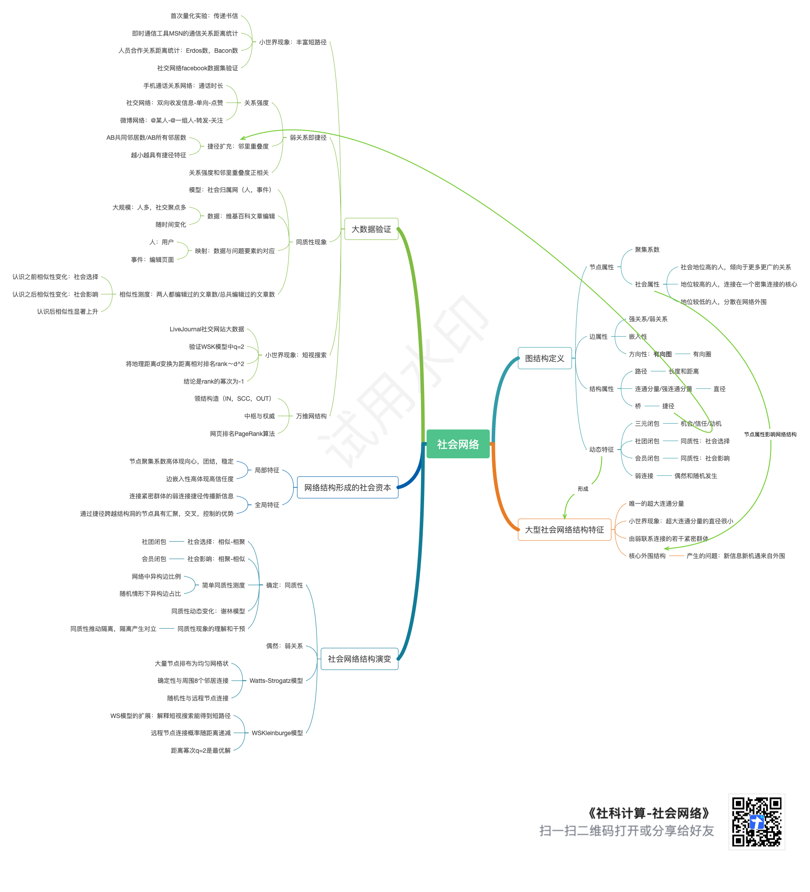

# 《社科计算》课程介绍

???+ 课程要求

    陈斌 gischen@pku.edu.cn
    
    课堂讲授 2 节、慕课 1 节
    
    Computational Social Science

计算：组合性（各种指令任意组合）、通用性（累加任意数量、具有可推广的适用性）

## 人类社会中的各种“网络”

社会网络：个体之间的社交联系

信息网络：信息源，接收者和传播方式技术系统：从计算机硬件到高铁运输网

经济系统：生产-销售-消费网络

随着历次技术革命对社会生产力的巨大推动，这些“网络”日益复杂。研究各种网络中的事物如何相互关联，并通过复杂的连通性相互影响，有助于理解社会运行模式，从而实施有效的决策。

任何事物的集合，其中某些“**事物对**”之间由“**连接**”(link) 关联起来

粗的：上下级关系；灰色：电子邮件通信

## 科学研究范式

实验范式：以伽利略为代表的科学发展的初级阶段，通过实验破除直觉、成见

理论范式：以数学表述和推演的理论模型，通过精心设计的实验进行验证

仿真范式：利用计算机对实验进行模拟仿真。先提出可能的结论，再收集数据，通过计算仿真进行理论验证。

## 韦弗 Warren Weaver：科学与复杂性（1948）

**简单性问题（Problems of Simplicity）**：两三个变量决定的简单问题，关于个体性质

**无序的复杂性问题（Problems of Disorganized Complexity）**：涉及几乎无线变量的复杂问题，研究群体秩序，进行平均意义的分析（热力学、统计学）

**有序的复杂性问题（Problems of Organized Complexity）**：变量数量千万亿级别，研究群体中个体之间的结构与模式（社会网络、群体博弈）

算力的发展、算法的成熟、大数据的存在为此带来极大的想象力。

## 大数据时代的社会科学研究方法

- 计算机深入应用，信息网络普及
- 万事万物数据化：移动互联网和物联网，随时随地追踪每个人和物
- 存储容量、传输速度和算力极大提升
- 科学研究进入“大数据范式”(James Gray)

无论是自然科学、社会科学或是工程技术领域，都需要具备计算思维

* 从大数据挖掘中获取科学新知、创新创造

* 与人工智能系统协同工作，运用计算机发现和解决问题

## 什么是计算社会科学

社会科学的起源（亚里士多德）：社会系统、社会治理、不同政体（君主、民主、贵族）的比较

现代社会科学（奥古斯特孔德）：自然科学观念看社会系统，引入了数学和统计方法

改进了传统的历史方法和早期的哲学方法

现代人类学、经济学、政治学、心理学及社会学

计算社会科学

以计算为媒介，以不同规模的社会团体为着眼点，对社会宇宙开展跨学科研究

大数据、网络分析、仿真模型

社会科学方法与计算社会科学方法

## 研究复杂系统蕴含的“连通性”

* **行为及其动力学**
    * 结构层面的连通性：个体之间的相连
    * 行为层面的连通性:个体行动影响其他个体行动的后果
    * 一些社会现象如何在复杂连通性中呈现出来（富者愈富、赢者通吃、病毒式传播、小优势放大），并影响个体或者群体的行为策略

* **多学科思想的交织**：从计算机科学，讨论网络结构、信息和互动个体从经济学，引入策略性互动行为模型从社会学，讨论社会群体结构和动力学理论框架

## 本课的主要内容

用计算的语言，讨论社会科学经典问题——抽象、分析、推理、验证

**社会科学经典问题**：三元闭包，强弱关系，结构洞，同质性，结构平衡，关系平衡，布雷斯饽论，匹配市场，清仓价格，拍卖市场，物以稀为贵，信息级联，网络效应，网络级联，富者愈富(不平等)，小世界，预测市场，信息不对称，孔多塞饽论，议程设置，波达计数法，等等

**现代社会两大基本特征**：高度的互联，丰富的互动。分别对应图论、博弈论，对上述话题进行讨论

## 教学方式

- 慕课包含了本课程绝大部分知识内容自主提前学习相关章节
- 课堂用于对慕课内容的讨论和延伸抽象、分析、推理、编程验证、可视化
- 平时通过微信群关注和交流与学习有关的问题都发在群中或慕课论坛上
- **鼓励阅读教材**

## 学习预期收获

- 了解一系列经典**社会科学**问题和成果
- 熟悉从**计算思维**的视角对那些问题进行讨论和分析的方法
- 认识到社会科学原理也可能**启发**计算思维
- 熟悉**图论**和**博弈论**的基本概念(术语)，并能用它们有效交流思想
- 也许因此能够更加热爱生活，更加热爱科学
- 为今后的职业生涯开阔一种视野

## 学习要求与课程评价

提前学好下次课需要的慕课内容

预计投入时间：课堂2小时、慕课1小时、课后~1小时。

**==慕课成绩：30%（作业）【切记及时提交】==**

平时成绩：20%（签到）

期末 **==报告==** ：50%

不用教学网，用头歌平台

---

下周一之前：自学慕课第一周内容

提交慕课作业和测验（DDL Sun 23:59 +阅读教材1、3章）

