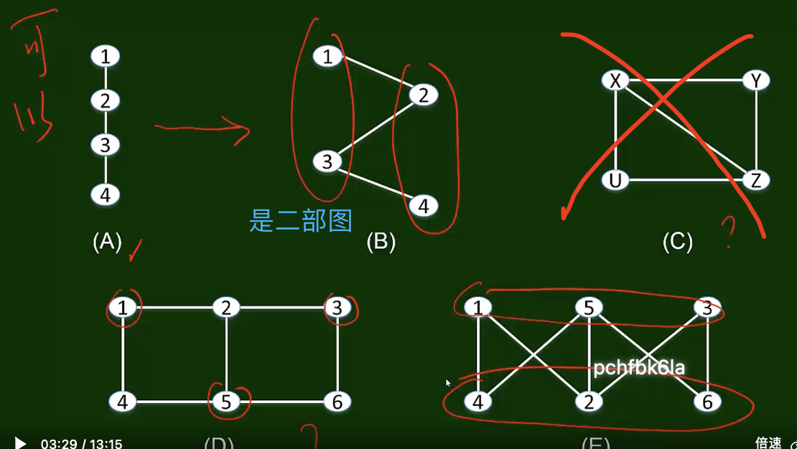

# 网络与图论

网络的普遍性和多样性

## 无处不在的网络

### 从差序格局到社会网络

费孝通(1947.1985:23) :源与众

一块石头丢在水面上所发生的一圈圈推(中国人的社会关系)好像是把会影响所推出去的圈子的中心，被圈子出去的波纹。每个人，都是他社的波纹做推及的，就发生联系。每个人在某一时间某一地点所动用的圈子是不一定相同的。

林南(2004:37):网络

一个特定的网络可以自然地形成，也可以有对一个特定的共同关注的焦点或关注一种资源利益的社会性建构

只要有人群在，就一定有「网络」。

在自然界，网络同样无处不在

C.S.Elton(1927) ，在生态系统中，物种之间的“吃”与“被吃”也是一个网络，食物链是自然生态系统稳定的重要机制

一些自然资源之间的关系，如水的转化关系，也是一个网络

甚至可以说，网络是自然世界生发演变的机制之一

### 形形色色的网络

- 交通运输网，邮政网，电话通信网，计算机网，互联网，万维网
- 社会关系网，产品供销网，金融借贷网
- 智能电网，无线网，传感网，物联网
- 神经网，生物代谢网，食物链(网)
- 攻守同盟网，恐怖主义网络
- 人人网，新浪微博网，QQ.团购网

### 不同类型网络的依存

- 互联网(Internet) 一物理的、技术的
- 万维网(WorldWideWeb)一基于互联网的信息网络
- 人人网一基于万维网的在线社会(社交)网络 (Online Social Network，OSN)
- 社会关系网，与地域相关(尤其在古代)。地域上相邻或相近见面的机会多，建立关系的可能性就大，随着交通工具的发达,社会关系的地域范围扩大

### ICT技术的发展

* 催化了各种网络的发展

    - 规模变大，范围变广

    - 新型网络的涌现如兴趣网

#### ICT技术发展的影响

ICT技术的发展使分析和理解大规模网络的结构与演变成为可能

* 行为 (痕迹)数据 (para data)与网络的运行伴生

* 海量数据 (大数据，big data)分析的能力 (计算设施，算法工具)

以社会网络分析为例，从前的分析能力限制在上百个节点，现在可以分析上亿个节点的网络

今天，人们很难想象一个不在网络中的个体能怎样工作和生活一个没有网络的世界又会是怎样的世界

### 小结

- “网络”并不是今天才出现的现象，自然界原本就有，人类社会自古也有

- 对人类社会而言，凡是有人群的时间与空间，就有网络网络不仅无处不在，而且形形色色

- ICT环境的发展，使人群之间的网络现象及其意义更加凸显

- 计算能力的发展，使得针对网络现象的可计算性越来越强，进而使得对人群的行为及其与网络之间互动的可预测性也越来越有意义

## 网络与图

如何用严格的语言讨论网络的结构？

当我们想到“网络”这个词语——“事物”+“联系”

### 什么是图

图=事物+联系 

节点(vertex, node, point)

边 (连接, 链接,关系, 联系;edge, link, tie)

同构:画法不同，但本质上(结构上)相同，即每个节点的相邻节点情况均相同。

### 要点小结

- 图是网络结构信息的抽象，表达的是网络中各种事物之间的关系。
- 这里所说的“图”不同于日常生活中看到的“图像'，尽管图常常也可以被画出来，呈现出一种图像的形式。
- 同一个图，可能有多种不同的画法。也就是说，同一个图可能呈现出不同的图像形式。

## 路径、连通图、连通分量

路径、最短路径、距离=最短路径长度

### 连通的、不连通的

图中每两个节点都有路径通达，则图是连通的。

不连通的图由多个连通分量组成。 

连通分量的**性质**：

* 节点之间存在路径
* 不包含在其他的连通分量中

## 二部图、图上的广度优先搜索

二部图：**可以**被「分成两个部分」，每个部分内的节点之间两两无边

面对一个比较复杂的图，如何判断它是否二部图？

结论：一个图是二部图的充分必要条件是它没有长度为奇数的圈

### 图上的广度优先搜索

通过广度优先搜索将图变成类似「树」的分层结构，如果存在层内边，就说明存在长度为奇数的圈。

#### 要点小结

- 许多社会现象或状态的结构，都呈现出二部图的形式
- 是否有长度为奇数的圈，是判断一个图是否为二部图的充分必要条件
- 广度优先搜索 (遍历)，是考察一个图是否存在长度为奇数的圈的有效方法(算法)

## 三元闭包——社会网络演化的基本结构性原因 (Anatole Rapoport,1953)

从一个现象说起：考虑社会关系，不仅考虑一个时刻 (“快照”)上的状态，还要研究随时间发生的变化 (内部原因 vs 外部原因)

==**三元闭包 (闭合)：如果两个互不相识的人有了一个共同的朋友，则他们俩将来成为朋友的可能性提高。（拉伯波特）**==

* 机会 (opportunity) ?
* 信任 (trust) ?
* 动机 (incentive) ?

> 林南(2004:37)
>
> 一个特定的网络可以自然地形成，也可以有对一个特定的共同关注的焦点或关注一种资源利益的社会性建构

小结

- 节点之间的关系，会随着时间的变化而发生变化，有些之前没有关系的节点之间，也可能出现边
- 是否出现边，其中的一个机制，是结构性机制，即在三个点之间如果有两条边，则没有边的节点之间极有可能发展出边

## 从三元闭包模型的大数据验证看计算社科的研究范式

### 需要先解决两个问题

第一，将三元闭包原理最初的定性陈述转变成一种可以定量考察的表达；

第二，找到一种合适的社会网络数据

### 三元闭包原理的两种表达

最初的表述：如果两个互不相识的人有了一个共同朋友，则他们俩在未来成为朋友的可能性增加

可以转变成：如果两个互不相识的人的共同朋友数越多，则他们俩在未来成为朋友的可能性越大。

### 用什么数据验证?

电子邮件网络约等于社会网络——一所大学的2万多学生在一年里的通信关系数据，只关心谁和谁何时有过通信，不关心内容

### “可能性”怎么衡量?

**概率「参考系」**：假设网络中有100对节点，某一时刻之前没边，但分别都恰好有5个共同的朋友如果，一个月里，其中有20对节点俩俩之间发生了通信，80对依然没有，就说：两个不相识但有5个共同朋友的人，在一个月里将成为朋友的概率为0.2。

要求：网络规模足够大（两个快照之间得到比较多的数据点，体现趋势）、数据跨度时间足够长（足够多的快照对之间进行比较）

以三元闭包原理的验证为例，我们看到了一种利用大数据分析，定量考察某些社会科学定性认识的方法。其中有两个关键

* 将社会科学原理的定性描述，转化为便于定量分析的表述，形成数据指标(与共同朋友数对应的概率)

* 选择合适的数据，以及从原始数据中提炼出指标数据的方法

## 刻画节点属性

### 聚集系数

==**节点A的聚集系数 = 与A相邻的任意两个朋友之间也是朋友的概率 $=\frac{与A相邻的朋友【对】的个数(组合数)}{总(组合数)}$**==

例如，A的聚集系数：

* 与A相邻的总(可能)的节点对数 $B-C,B-D,B-E,C-D,C-E,D-E=6$
* 与A相邻的节点对数中相互有连接的对数 $C-D=1$
* A的聚集系数 = $\frac{1}{6}$

聚集系数，就是三元闭包中，对里个节点属性的测度，表示“凝聚力”的大小，与其正相关。「凝聚性」=「权威性」，**在一群相邻的节点中考察对其他节点的影响的测度**。

小结

- 在一个网络结构中，某些位置的点是具有特殊意义的
- 刻画一个网络结构中节点的属性，可以采用聚集系数

* 三元闭包、聚集系数都有特定的社会意义

### 结构洞

对节点属性的另一种更有社会意义的刻画——换一个思路，从网络结构来看，相邻节点的关系→重要性（缺失性比较，缺失后网络是否会发生结构变化

==**结构洞：一个节点，移除该节点就会使网络变成多个连通分量的节点**==

结构洞A的意义，当然是指其在结构位置上所具有的意义。

* 了解多个连通分量方面的信息
* 处于捷径的一端，对其“长处”有放大影响
* 对与其相邻的节点甚至具有“权力”
* 冗余 (凝聚力冗余和结构等位冗余) 越小的结构洞，社会资本就越多

> [!note|right]
>
> 社会资本
>
> : 运用关系获益的能力

参考 Burt 的结构洞

小结

* 对网络中某个时点结构中的边的属性，可以用强弱进行测度

* 边的属性可以用嵌入性来测度，嵌入性越强，社会资本越强（与自身能力无关）

* 点的属性除了聚集系数外，还有特殊的社会意义，即结构洞意义，冗余越小的结构洞，社会资本也越多

## 刻画边的属性

对边的属性的刻画、对节点属性的另一种刻画及其社会意义

聚集系数这里仅仅讨论了两个节点之间是否有边，以及随时间推移而发生的节点之间边的变化，但并没有讨论边的属性，如:友好 - 敌对，强 - 弱等

### 强、弱

以3节点关系为例，在A-B，A-C有关系且为**朋友关系**的条件下B-C之间**倾向于建立联系**。

然而显然，A-B，A-C的关系与B-C建立关系的瞬间是不一样的。如何表达这样的不一样呢? Granovetter (1973)提出了刻画边的属性的 ==一种测度：**强 - 弱**。显然，这是一种**简化**的测度，强度是可以为**连续变量**的；但是，二分法有时也足够用了。==

现实案例：被动参与，体现了强弱关系的重要性

Huberman et al. (2009) 三元闭包原理实际上暗含了一个随时间推移的可能：有的人会被动地加入某些网络

Huberman et al.(2009) 对Twitter的研究表明，即使所有朋友的总数超过500，实际联系的总数也在10-20人之间;被动联系人的数量也不超过50人

为了刻画边的重要性，强弱不够了，需要引入其他测度。

### 嵌入性与邻里重叠度

更有社会意义的刻画，体现边的**重要性**。嵌入性 (Embedness)概念：

最初提出：Karl Polanyi (1944)《大转变》，行动嵌入制度

Granovetter (1985) 在与经济学家的论战中，提出了经济行为与社会结构之间的关系问题，拓展了嵌入性概念，指出，经济行为是嵌入在社会结构之中的，是社会行为的一种。后来，这个概念的应用得到了极大的扩展，甚至被引入到了网络分析。网络分析，恰恰是 Granovetter 从他老师 Harrison White(1967) 那里得到的衣钵。由于这个概念在多个研究框架中出现，因此社会科学的学生在运用网络分析工具、社会资本概念的时候，需要特别地谨慎。注意：此处的嵌入性概念不是 Granovetter 意义上的，我们不涉及对宏观网络的刻画，而是对嵌入性的情景定义进行抽象后的嵌入性。

==**抽象后的嵌入性：嵌入性 = 一条边两端共同的邻里数，即<u>邻里重叠度</u>**==

- 看A-B边，有共同的邻里E和F

- 则A-B边的嵌入性为2

- 嵌入性越强的边，相互之间的信任就越强（不等于社会资本哈）

- 嵌入性越强的边，社会资本也越多（谨慎：嵌入性与社会资本属于两个完全不同的分析框架，使用时一定要说明分析框架）

## 弱关系与网络中的捷径

依三元闭包精神，如果一个节点 (A)有两个强关系邻居B和C，则B和C不应该什么关系都没有。

==**强三元闭包原理——如果A和B、C之间的关系分别为强关系，则B和C之间形成边的可能性应该很高。进而，我们说：若A有两个强关系邻居B和C，但B和C之间没有任何关系 (s或w)，则称节点A违背了强三元闭包原理。如果节点A没有违背强三元闭包原理，则称节点A符合强三元闭包原理。**==

**==捷径≈弱关系：若节点A符合强三元闭包，且至少有两个强关系邻居，则与A相连的任何捷径必定意味着是弱关系。==**

在社交网络中，若节点A满足强三元闭包性质，并有至少两个强联系边与之相连，则与其相连的任何捷径均为弱联系。换句话说，在假设满足强三元闭包性质及充分数目的强联系边存在的前提下，社交网络中的捷径必然为弱联系。（社会网络的结构特性与边的联系强度的关联） 就好比一个新的工作机会往往藏匿在与某个不太常联系的熟人关系中。其体现的精神为：两个人的关系强度与是否有共同朋友有关。而统计的推论是：共同朋友越多，关系强度越高。

证明：捷径意味着「四元模型（四边形）」，其中，只要与A相连的关系一条边是S，另一边就不可能是S，因为如果两条都是S，理应会形成第三条关系（对角线）。

**要点小结**：我们证明了，在一定条件下，社交网络中的捷径意味着弱关系。这个结论的意义，在于它将来源于两个不同领域的概念巧妙地联系了起来，展示了学科交叉的魅力
