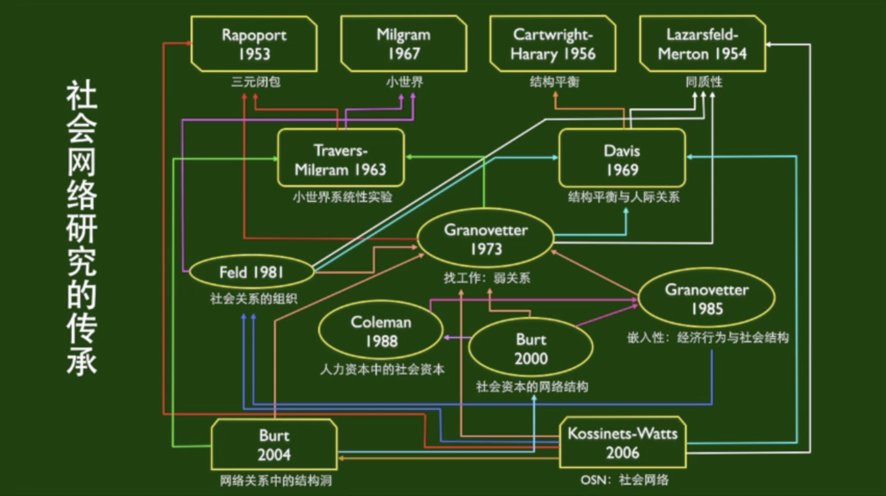
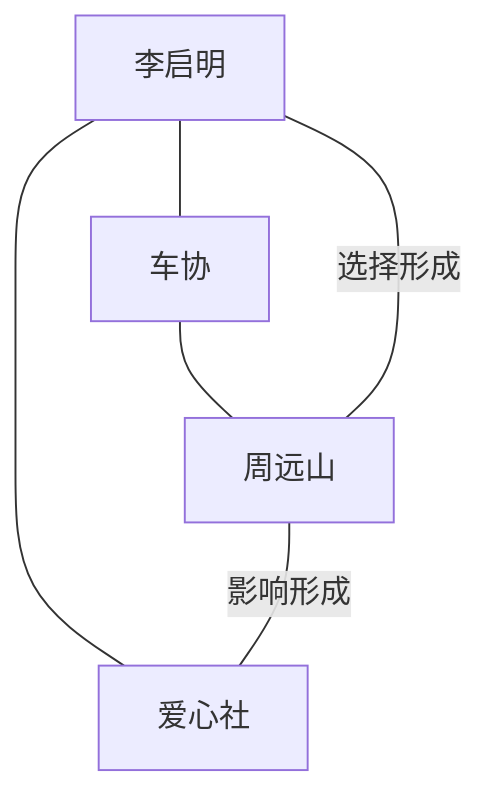
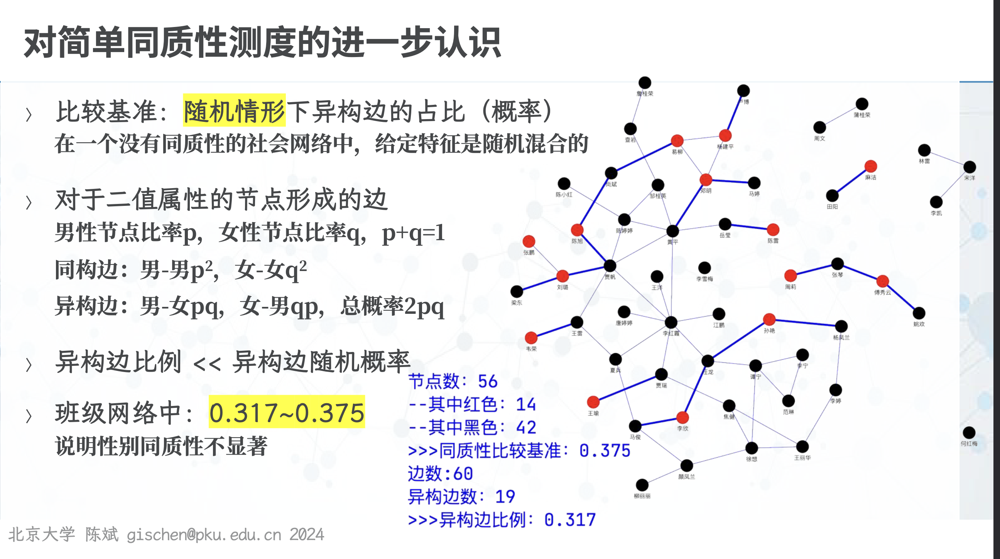
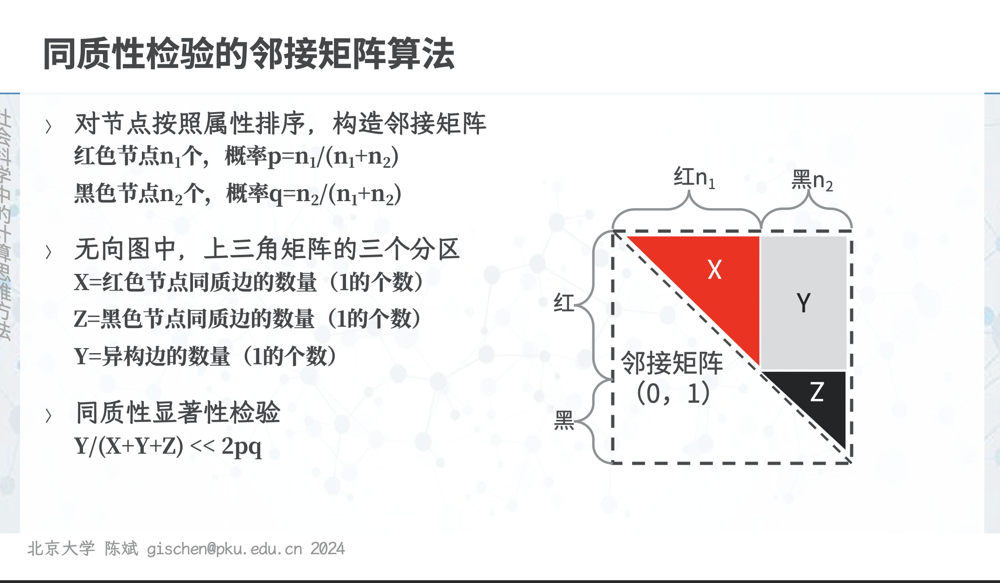
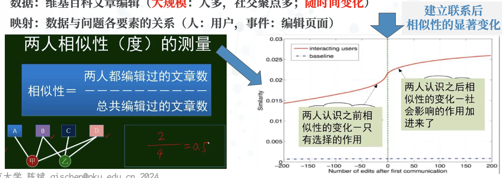
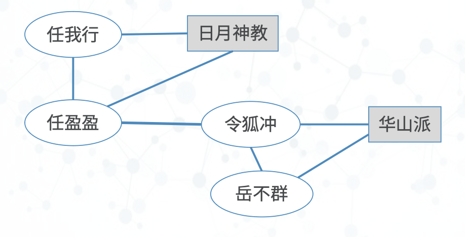

# 社会选择与社会影响

不同节点属性特征的同质性

同质性在时间维度上对网络结构的影响

## 同质性与社交关系

### 同质性的相关概念

同质性来源于人与人之间的「相似性」的观察，如「夫妻相」。

Lazarsfeld and Merton (1954) 在 Berger , et al. 1954. Freedom and Control in Modern Society 的论文集（主要论述「社会控制、群体与个体」和「国家与社会」话题）区分了「选择的机制」——**身份同质性、价值同质性**，这在更高的抽象层面上揭示了同质性的一种机制——社会选择机制。

> [!INFO] 概念
>
> 1. **身份同质性**——相同身份的人会彼此相互联系
> 2. **价值同质性**——相同价值观的人会彼此相互联系

区分：Homophily (同质性) vs Homogeny (同构性)

Miller McPherson, et al(2001)用了 birds of a feather 作为篇名，提出了同质性的三个机制，即**生态过程、关系过程和网络过程**，这涉及到了同质性形成的社会影响机制。

> [!INFO] 概念
>
> 1. **生态过程**:场所的影响，同一个机构、社区，共同参加活动
> 2. **关系过程**:交叉关系的影响，一个人在不同的场所
> 3. **网络过程**:随时间的变化而变化的动态

### 同质性与社会交往的关系

每个人的特质可分为两种：

1. **固有特质**:性别、种族、母语等，自然属性
2. **可变特质**:居住区、专长、偏好等，建构属性

同质性是社会网络结构形成的<u>基本外部原因</u>，如血缘、地缘、业缘、趣缘等。

**社会学的一个基本问题**——是因为“羽毛相似”才交往(社会选择 selection)呢，还是因为“同林”后才变得“羽毛相似”(社会影响 social influence)

> [!NOTE] 小结
>
> * 同质性是一个古老的议题，从柏拉图时代就已经开始讨论
> * 在齐美尔(Simmel) 的基础上，Lazarsfeld and Merton 提出了同质性的两个类型和机制
> * 进一步的研究提出，影响同质性现象的还有外在因素
> * 在社会交往中，同质性与网络之间有着更为复杂的关系

## 物以类聚人以群分——同质性社会网络形成的社会选择动力机制

Lazarsfeld and Merton (1954) 在 Berger , et al. 1954. Freedom and Control in Modern Society 的论文集（主要论述「社会控制、群体与个体」和「国家与社会」话题）区分了「选择的机制」——**身份同质性、价值同质性**，这在更高的抽象层面上揭示了同质性的一种机制—— ==**社会选择机制**== 。

> [!INFO] 概念
>
> 1. **身份同质性**——相同身份的人会彼此相互联系
> 2. **价值同质性**——相同价值观的人会彼此相互联系

区分：Homophily (同质性) vs Homogeny (同构性)

为什么身份与价值观会影响社会网络同质性的动态？

1. 作为能动者的行动者 (Giddens,1984;1991)，个体具有“**加入**”的主动性和自主性

   > 例如，你的朋友带了一位对你而言是陌生人但却是你朋友的朋友的人来见你

2. 同样，还具有**退出**的主动性和自主性

   > 例如，教会的吸收新会员；学生社团吸收新成员

> [!NOTE] 小结
>
> 社会交往中：
>
> 社会网络的建构，无论是加入，还是退出，都可能是一个主动的过程
>
> 尽管被动参与(参见嵌入性)也是一种机制

==形成网络同质性的机制之一，是个体(节点)的主动选择==

## 近朱者赤近墨者黑——同质性社会网络形成的社会影响动力机制

孟母三迁；近朱者赤近墨者黑；（婚姻）先结婚后恋爱

Miller McPherson, et al(2001)用了 birds of a feather 作为篇名，提出了同质性的三个机制，即**生态过程、关系过程和网络过程**，这涉及到了同质性形成的社会影响机制。

强调生态性的重要性——由**<u>场所</u>**带来的影响，实际是同质性形成的另一个重要机制。

> [!INFO] 概念
>
> 1. **生态过程**:场所的影响，同一个机构、社区，共同参加活动
> 2. **关系过程**:交叉关系的影响，一个人在不同的场所
> 3. **网络过程**:随时间的变化而变化的动态

> [!NOTE] 小结
>
> 形成网络同质性的机制之一，是个体之间的相互影响

## 三大闭包与从属网络

### 从属关系与社会关系的相互作用随时间发生的变化

见图。

两个原本不认识的人 (李启明、周远山)，因为车协而认识且有了联系，并可能会成为朋友。这体现了 <u>**==社会选择==** 对同质性的社会网络关系形成的作用。</u>

在李启明和周远山之间成为朋友以后，原本不在爱心社的周远山，也有可能加入了爱心社。这体现了 <u>**==社会影响==** 对同质性的社会网络关系形成的作用。</u>

社会归属网:描述从属关系与社会关系

在现实社会中，选择与影响似乎很难明确区分，实际是交替甚至同时发生的现象，同质性是两种机制共同的后果

---

社会交往中：就受影响而言，有许多的理论，但原理都是社会影响。

* 个体的兴趣与能力（选择），或许不限于既有，可能会被诱发（受影响）（例如体育特长）
* 甚至一些自然的、本性的拓展可以是选择，更多或是受到影响的（例如iPhone一族;三星一族）

### 社会归属网中的三类闭包，检验闭包理论实际效果的思路

闭包就是人与人之间的关系或人与事之间的关系。

人与组织形成的网络是从属网络。==【存疑】==

社会网络与归属网络统称社会归属网络。

| 特征                               |           | 社会归属网中的三类闭包 |                        |
| ---------------------------------- | --------- | ---------------------- | ---------------------- |
| 因人际关系所产生的人与人之间的关系 | 人缘→人缘 | 三元闭包               | 社会网络关系的基本原理 |
| 因事物关系所产生的人与人之间的关系 | 事缘→人缘 | 社团闭包               | 体现社会选择           |
| 因人际关系所产生的人与事之间的关系 | 人缘→事缘 | 会员闭包               | 体现社会影响           |

这些理论上成立的关系在现实社会中是否能得到检验呢？（三元闭包已检验）我们有以下的定义转换思路。

社团闭包

: 由于参与同一件事情，两个原本没联系的人之间，建立了联系。

: **换句话说**：共同参与的事情越多，建立联系的可能性越高。

: > 如【李—周—车协】，共同的的兴趣，建构了两人相识的机会。

会员闭包

: 由于朋友参与某件事情中，原本不在这件事情的另一个一个人也加入了这件事情

: **换句话说**：参与某件事的朋友越多，其被影响而参与的可能性就越高

: > 同样是“闭包'不过，这次是因为人的关系在先，对另一场受到影响之后，有了兴趣，找到了“归属”所的兴趣在后，即社会影响 (social influence)

## 谢林模型（元胞自动机的一种）及其意义

谢林 Schelling(1972, 1978) 认为隔离不是个人刻意选择的后果，而是个体作为群体的一部分所选择的后果，并提出了**隔离的动态模型** (1972) 。正是在这个意义上，个体的**微观动机**与行为产生了**宏观的行为**与后果 (1978.2005)。

这是一种最简单的基于对象的模型，也称为**细胞自动机模型**。

节点为居住者 (单元) ，两类居住者 $(O，X)$ ，约束条件每一个居住者都要与一定数量 $t$ 的同类为**邻**。如果一个居住者发现自己的邻居数小于 $t$，他就有兴趣搬家，以满足邻居数。

以居住隔离为例，谢林模型模拟了同质性的动态变化。

如果同质性是一个自然现象，则促进或阻止不同社会情景下的同质性，将会对社会发展产生重要影响。

## 【计算】社交网络中同质性的测量

如何定量评估一个社交网络中同质性现象的程度?

给定社交网(只考虑两种不同特征:红，白)，已知节点数($n$)，边数($e$)，不同颜色节点的占比为 $p,q=1-p$ ，两端节点颜色相同的边数($s$)。基于它们,如何讨论同质性现象的程度?

==**同质边 (两端节点相同的边) 越多 (在总边数中占比越高)，同质性越明显**==
$$
同质性 = \frac{s}{e}
$$
有没有一个基准？多少就算多？

用“随机（均匀/平均）情况”作为基准:给定不同颜色节点的占比(红 $p$ ，白 $q$)，随机情况下，一个节点是红色的概率就是 $p$，白色的概率就是 $q$，那么任何一条边的两节点颜色相同的概率就是 $p^2+q^2$​，也就是两端节点相同边的占比。

如果大于，那么说同质性现象在这个社交网络中有所表现。

$$
同质性 = \frac{s}{e} > p^2+q^2
$$

等价的两种测量方法：

> [!NOTE] 要点小结
>
> 社交网络中的同质性现象有可能定量表达,这一节介绍了一种最基本的方式，其精神也可以被推广到其他更复杂的情形
>
> 在这一节的讨论中，我们采用了和教材中稍有不同、但是等价的讲法 (参见教材4.1节)

## 【计算】同质性现象数据实证分析案例：利用大数据对「朋友—相似」现象溯源（定量验证）

利⽤“社会归属⽹”⼤数据，进⾏同质性现象原因剖析

问题：同质性现象

模型：社会归属⽹（⼈，事件）

数据：维基百科⽂章编辑（⼤规模：⼈多，社交聚点多；随时间变化）

映射：数据与问题各要素的关系（⼈：⽤⼾，事件：编辑⻚⾯）

## 慕课习题的问题

假设岳不群和令狐冲断绝来往，岳不群不可能和任我⾏、任盈盈、⽇⽉神教发⽣联系。

这个论断是**错误的**。因为任盈盈可能加入华山派（会员闭包），然后就可以与岳不群发生联系（社团闭包）。

