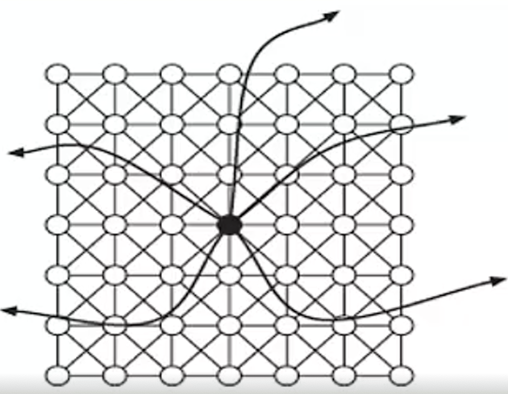
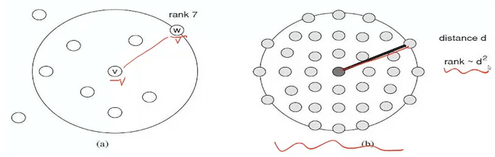

# 小世界现象

## 小世界问题研究 (Stanley Milgram, 1967)

* 现象:俗语“My it's a small world.”

* 问题:两个互不相识的人，如果想认识，中间需要经过几个人

* 意义: a certain mathematical structure in society

* 假设:

    1. 由于每个人都有熟人，熟人之间没有芥蒂，可以交往，故，不曾有连接的两个人之间，如果要建立连接，中间人的数量应该不多

    2. 每个人的确都有熟人，不过，不同类型或阶层熟人之间，不会有交往，故,不曾有连接的两个人之间，不可能建立连接

### 实验设计：送信实验

Stanley Milgram做了一个实验：

几百名“初始者”，要求每人尝试通过转发让一个指定的人收到一封信；

向每个初始者提供了目标收信人的姓名、地址、职业等个人信息；

规定：参与者只能将信件转发给能直呼其名的熟人，并请他继续转发。因此，如果一个参与者不认识目标收信人，则他不能直接将信寄给他；参与者需力争让信件尽早到达目的地。

结果，约三分之一的信件经过平均六次转发到达了目标

### 小世界现象

在Milgram的研究之前，人们感觉到世界很小，却没有证据。MIT的师生试图证明这一点，不过没有结果。来自Harvard的Milgram，用信件传递，得到了一个平均数小世界现象

Milgram的研究证明：

1. **世界是小的 (六度分隔) ：社会网络中包含丰富的短路径**
2. **虽然是短视搜索（每次只能看到邻居，无法进一步预测），但人们还是会“自动寻找”短路径：运用关系时“有意识的转发”能“自动地”找到这些短路径**

> [!QUESTION] 启示
>
> 为什么社会网络具有这样的性质?它们源于社会网络的哪些基本原理?
>
> 能否依据社会网络的某些基本原理，构建出反映这种性质的网络模型?

通过熟人送文件 (书信)在不断地检验小世界现象的存在即使加上了“种族”因素，小世界现象依然存在；在电子邮件时代，通过熟人转发电子邮件，依然有小世界；即使是网页之间的“社交”，也有短路径。这启示我们**小世界现象的普遍性**。

## Watts-Strogatz模型

### 从现象到问题 

- 为什么社会网络具有这样的性质?它们源于社会网络的哪些基本原理?（可以证明，完全随机的网络没有这样的性质）
- 换句话说，能否依据**社会网络的某些基本原理**说明这种性质的必然性?

### 形成社会网络的两种基本力量

**同质性（选择，社会影响），三元闭包**

- 家庭成员，邻里关系，同学，同事
- 对应社会网络中的大量的“三角形”
- 体现某种“亲近”（例如地理范围的）

**弱联系**

- 偶然的原因，认识的“远程”朋友
- 对其所在的圈子并不一定熟悉

一种什么样的形式化网络，既体现这两种力量的作用，也便于我们分析其中是否有小世界现象？

### Watts-Strogatz 模型 (Nature, 1998)

小世界网络指**聚类系数较大**且**平均路径长度较小**的网络 Watts-Strogatz(W-S) 模型。**Watts-Strogatz 模型中存在许多“三角形”（<u>同质性</u>）和少数随机的“远程边”（<u>弱关系</u>）**。

> [!note] W-S 模型的构建 1
>
> 想象大量节点排布成均匀网格状，其中连接近邻具有确定性，连接远程是随机性的。
>
> **注意**：模型中节点间有两个距离的概念:**网格距离**（规规矩矩地在网格上走）和**网络距离**（由节点之间的边确定的最短路径长度）
>
> 

> [!note] W-S 模型的构建 2
>
> (1)从一个有 $N$ 个节点的一维规则圆环开始，每一个点与它的 $r$ 个最近邻居连结。
>
> (2)以概率 $P$ 按顺时针方向对规则圆环中每一条边进行重新连结。重连生成 $k$​ 条边。在重连过程中，不能进行自我连结和重复连结。
>
> 
>
> 
>
> 
>
> 体现了同质连接和弱关系连接的概念（利用 $r$ 和 $k$​​ 控制相关的强度），于是可以看成是现实社会网络的一个合理近似。
>

Watts-Strogatz 模型 (Nature,1998) 体现了**同质连接**和**弱关系连接**的概念，于是可以看成是现实社会网络的一个合理近似。

1. 可以证明：在这样的网络中，任意两节点之间**存在短路径**的概率很高；
2. 然而 Watts-Strogatz 模型不能很好地体现第二个要求——**在该模型上执行短视搜索，往往导致路径太长**（尽管短路径存在）。

基本思路：弱连接的随机性使其形成闭包的概率很小

只要在基础网络结构上存在很少的全局随机性，就可以看到小世界现象

但是这个模型存在的一定的局限性：对于路径的寻找其实是低效的，需要一种既反映任何节点对之间短路径的存在性，也反映这种转发方式达到目的的可能性。

---

对于重要的社会现象，如果可以用一个数学模型来解释，尽管这个模型概括不了现象的所有细节，也是很值得追求的。

Watts-Strogatz 模型，抽象地表达了社会网络成因的基本特征，从理论上说明了小世界现象(一个方面)的必然性。

## 关于小世界的 Watts-Strogatz-Kleinberg 模型（扩展的 Watts-Strogatz 网络模型）

### 短视搜索(分散搜索)的概念

相对于我们已经熟悉的“广度优先搜索”(无目标)，这是一种**有目标**的**基于局部信息**的搜索，具有如下特点

- 每个节点有一个特征，任何两个节点之间的特征可以谈(不同于图论中定义的距离!)差别(距离)
- 每个节点都知道**目标节点**的特征，也知道**自己**和自己**邻居节点**的特征
- 搜索过程可看成是信息传递的过程，节点将信息传给离目标节点距离较近 (**差别较小**) 的**邻居**节点

同质性局部连接相同：每个节点与在 $r$​ 个网格步内的节点都有直接的边。？

> [!note|right] 通过局部，理解全局；通过微观，理解宏观
>
> 一种一般的认识论方法。
>
> 经常，在事物的宏观格局中存在某种性质，但若缺乏宏观视野，仅凭基于微观视野的追求，不一定能发现那种性质。但如果事物的结构存在某种特征，使我们能够证明，基于微观视野的追求，就能揭示宏观性质,则是十分美妙的事情。

### Watts-Strogatz-Kleinberg 模型

在 Watts-Strogatz 模型基础上，对随机远程弱连接加以一定的控制，让两个节点之间存在随机边的概率 $p$ 与它们网格距 $d$ 成反比的某个 $q$ 幂次。
$$
p \propto \frac{1}{d_{v,w}^q}
$$
$q$ 值较小，随机边倾向于较远；$q$ 值较大，随机边倾向于较近；当 $q=2$ 时，分散搜索达到最佳效果

仿真实验：由几亿个节点组成的网络中，考察不同的 $q$ 值在分散搜索中的效果

### WSK 模型中优化参数的大数据验证

这个参数在现实社会网络中怎么体现的呢?

利用在线社会网络进行验证，真实大规模在线社会网络是否体现了这个(W-S-K)网络模型的优化性质？

两人成为朋友的概率与其「空间距离」的平方成反比。如果是，则说明随机形成的社会网络可能具有某种本质的参数！但，在线社会网络的节点间如何谈空间距离?

* 在 WSK 模型中，由于 WSK 节点均匀分布，此时「空间距离」 = 地理距离范围内的人数
* 对社会网络的建立而言，地理距离范围内的人数比「空间距离」具有更实质性的意义

社会网络中结合地理距离的节点相对排名，排名 $r$ 可以看成是节点在地理上**均匀分布**时区域范围概念的一种推广，此时“排名”与“距离”有对应关系
$$
r～d^2
$$

这就使我们能一般性地处理节点在地理上分布不均匀的问题了

要验证的是：在**均匀地理分布**情形，一个节点在任一距离上的朋友数量在同等距离节点总数中的占比随距离平方递减 ($\frac{1}{d^2}$)，

此时等价于要看：一个节点在**任一排名**上的朋友 (即有连接) 数量在**同等排名节点总数**中的占比随排名递减 ($\frac{1}{r}$).

---

这意味着，大量微观社交关系的建立总体上呈现一种最优化特征，或者说大量人群的随机社会活动相当于一台计算机，完成了一种优化计算 (实现了最优参数)-一这可以看成是社会计算的一个实例，也是体现社会系统中微观与宏观关系的实例!

## 核心-外围结构：一种社会网络观

**社会网络观**：社会因素影响下的网络结构，网络结构与社会互动的结果。

核心-外围结构模型（实证研究、现实现象总结）

Borgatti and Everett (1999)观察到：

1. 在社会网络中地位较高的人，被连接在一个密集连接的核心
2. 地位较低的人，都分散在网络的外围核心——边缘结构

不仅是理论上的，现实社会中，同样普遍存在。

> 凝聚性（影响力）≠核心性

### 理论与现实

理论上，处在网络结构中的节点，不同的节点如果有相同的聚集系数，其被连接到的概率应该是一样的

现实中：
1. Milgram (1967)的第一次就已经暗示了，寻找地位较低的人 (神学院学生的妻子)，会更加困难
2. 人们观察到，媒体寻人较之个体寻人有更高的成功率
3. 回想“结构洞”，处于结构洞位置上的人，其被找到的概率，远远大于一般节点上的人

如果处于更高社会地位、且在结构洞位置上呢？

### 社会意义

**网络结构本身**是重要的，尤其是在可计算性上；同样重要的是，网络结构的**社会属性**。

具有相同网络结构，却有着**不同社会属性**的网络，在现实社会中具有着不同的“**可连通性**”(社会含义) ：

* 社会地位高的人，具有更多的“关系资源”，更好的「连通性」
* 社会地位低的人，在「被连通性」上，就不如社会地位高的人。

## 配套习题

### 20.1

在基本的“六度分隔”问题中，有人问是否世界上大多数的人通过社会网络中一条最多有六个边的路径彼此连接，其中连接任何两个人的边基于能够直呼其名的关系。

现在，我们考虑这个问题的一个变化形式。假设我们考虑整个世界的人口，并假设每个人到其 10 个最亲密的朋友分别创建一条有向边（除此之外不再与其他好朋友建立连接）。在这个基于“最亲密朋友”的社会网络，是否可能有一条最多六个边的路径连接世界上的每一对人？请解释

> **答：**
>
> 基于“最亲密朋友”的社会网络中，不可能有一条最多 6 个边的路径连接世界上的每一个人。 因为“最亲密朋友”的联系属于强关系，这一网络里边的边全部是强关系，而小世界现象产 生需要依靠远距离的弱关系存在，因此不存在这样的路径。

### 20.3

假设你正在和一个研究小组研究社会交际网络，特别关注在这类网络中人们之间的距离，探索小世界现象更广泛的影响。

该研究小组目前正在与一个大型移动电话公司协商一项协议，了解他们 “谁给谁打电话”的快照。具体而言，根据严格的保密协议，电话公司答应将提供一个图表，其中每个节点代表一个客户，每条边表示固定的一年间一对彼此通话的人。（每条边附加说明呼叫的次数和时间。每个节点并不提供个人的其他信息。）

最近，电话公司提出他们将只提供那些一年中平均每周至少通话一次的边，而不是所有的边。（也就是说，所有节点都包含，但只有那些通话至少 52 次的边。）电话公司知道这并不是完整的网络，但他们坚持提供更少的数据，他们认为这已经是一个很好的逼近完整的网络。

尽管你的研究小组反对，但电话公司依然不愿意改变立场，除非你的团队能确定具体的研究结果，证明这种减少的数据集很可能产生误导。研究小组负责人要求你准备一个简短的论据回应电话公司，确定一些具体方法说明减少的数据集可能会产生误导性的结论。请简述你的论据。

> **答：**
>
> 人群中存在着小世界现象，即局部同质性连接上散落着少量随机弱关系。当只提供平均每周至少通话一次的边时，有可能导致少量随机弱关系消失（可以假设弱关系的人之间并不经常联系）。这种减少的数据集事实上剔除了几乎所有的“弱关系”的边，这样整个网络只有“三元闭包”这一类较紧密的关系。在研究中，就极大的增加人与人的距离，产生了较大的误差。
> 可以通过对得到的数据集建图，来判断是否失真：当弱关系消失时，由此生成的网络会产生误导，因为此时网络中，仅含局部同质性连接。